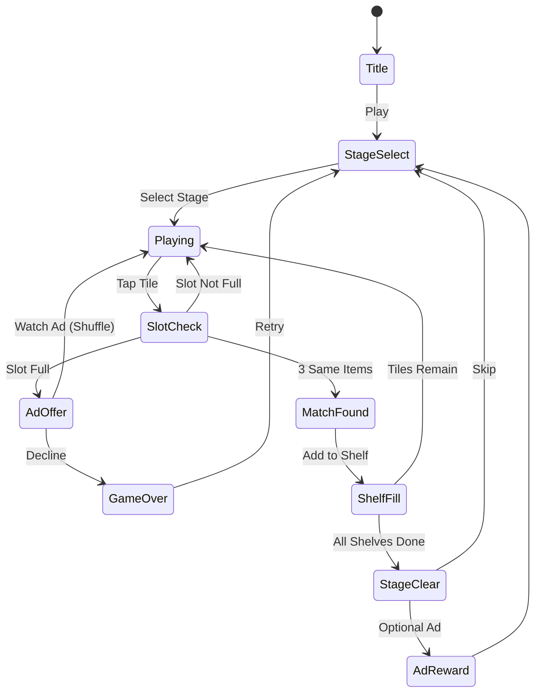

# 정렬 매치 마스터 (Sort Match Master)

> **레퍼런스**: #37 편의전 정리왕: 매치 마스터 (ACTIONFIT, 평점 3.4) + #36 상품 정렬
> **장르**: Sort-Puzzle / Match
> **MVP 목표**: 1~2주

---

## 1. 경쟁 분석: #36 상품 정렬 vs #37 편의점 정리왕

### 핵심 차이점

| 항목 | #36 상품 정렬 | #37 편의점 정리왕 |
|------|-------------|-----------------|
| 코어 메카닉 | 드래그 → 카테고리 정렬 | 3매치 → 제거 클리어 |
| 판단 기준 | 종류별 분류 (유제품/과자 등) | 동일 상품 3개 매치 |
| 실패 조건 | 오분류 누적 / 시간 초과 | 슬롯 가득 참 |
| 공간 표현 | 편의점 진열대 구조 | 추상적 타일 보드 |
| 테마 몰입도 | 높음 (실제 편의점 진열 감각) | 낮음 (편의점 껍데기만) |
| 인지 부하 | 중간 (분류 기준 기억) | 낮음 (같은 것 3개) |
| 재방문 동기 | 분류 속도/정확도 경쟁 | 퍼즐 난이도 도전 |

### 결론
- #36은 **테마 몰입** 강점, #37은 **퍼즐 깊이** 강점
- 두 메카닉은 상호 보완 관계 → 통합 시 시너지 가능

---

## 2. 평점 3.4 원인 분석

앱스토어 저평점 게임의 공통 패턴 및 ACTIONFIT 앱 특성 기반 추정:

### (1) 광고 과다 — 가장 유력한 원인
- 레벨 클리어마다 강제 전면 광고 (인터스티셜)
- 광고 없이 계속하려면 과금 유도
- 보상형 광고(리워드)가 아닌 **강제형 광고** → 부정 리뷰 핵심

### (2) 난이도 스파이크
- 초반 쉬움 → 중반 갑자기 어려워지는 구간 존재
- "클리어 불가능한 레벨" 리뷰 다수 추정
- 슬롯 크기, 타일 수 밸런스 설계 미흡

### (3) 진행 차단 구조 (Energy/Pay Wall)
- 목숨 시스템 → 소진 시 기다리거나 결제
- "계속 하다가 막힘" 패턴 → 이탈 + 저평점

### (4) 편의점 테마 피상적 활용
- 실제 편의점 분위기 미흡 (스프라이트만 편의점 상품)
- 게임 플레이는 일반 타일 매치와 차별 없음 → "낚였다" 감정

### (5) UX 마찰
- 터치 타겟 작음 (모바일 최적화 미흡)
- 실수 취소 불가 → 분노 이탈
- 로딩 시간 길거나 UI 반응 느림

---

## 3. 우리가 피해야 할 실수

| 금지 항목 | 대안 |
|----------|------|
| 레벨 클리어 후 강제 전면 광고 | 보상형 광고만 사용 (선택 시청) |
| 목숨/에너지 시스템 | 무제한 플레이, 광고로 힌트/부활 제공 |
| 페이월로 막히는 레벨 | 광고 시청으로 언제든 계속 가능 |
| 터치 타겟 < 48dp | 모든 상호작용 요소 최소 60dp |
| Undo 없음 | Undo 1회 무료 제공 (추가는 광고) |
| 난이도 점프 | 레벨별 점진적 증가, 플레이테스트 필수 |
| 테마 껍데기만 | 편의점 직원 캐릭터, 실제 진열 인터랙션 |

---

## 4. 개선 방향

### 핵심 차별화 포인트
1. **편의점 테마 완전 몰입**: 진열대 배경, 상품 실루엣, 계산대 사운드
2. **광고 = 자발적 선택**: 막히면 "광고 보고 힌트" — 강제 없음
3. **즉각적 피드백**: 올바른 분류 시 "딩~" + 진열대 채워지는 애니메이션
4. **짧고 달콤한 레벨**: 1~2분 내 클리어 가능 (출퇴근 틈새 플레이)
5. **진행감 시각화**: 진열대 채워지는 % 프로그레스 바

### 핵심 게임플레이 개선
- 슬롯 크기를 레벨별로 조절 (초반 7칸 → 후반 5칸)
- "위기 탈출" 아이템 광고 기반 무료 제공
- 콤보 시스템으로 숙련자 보상

---

## 5. 통합 게임 설계: 정렬 매치 마스터

#36의 **분류/정렬 메카닉** + #37의 **매치 퍼즐 구조**를 결합한 단일 게임.

### 코어 루프

```
상품 타일 등장
    ↓
드래그하여 슬롯에 담기 (최대 7칸)
    ↓
같은 상품 3개 → 자동 매치 제거 + 진열대에 채워짐
    ↓
카테고리별 진열대 완성 → 스테이지 클리어
```

### 이중 보상 구조
- **매치 보상**: 3개 같은 상품 제거 → 포인트 + 애니메이션
- **정렬 보상**: 진열대 한 칸 완성 → 보너스 점수 + 효과음

### 게임 규칙

#### 기본 규칙
- 보드에 편의점 상품 타일이 배치됨 (삼각김밥, 도시락, 음료 등)
- 모든 상품은 **3개씩** 존재
- 슬롯(최대 7칸)에 담아 같은 상품 3개를 모으면 제거
- 제거된 상품은 해당 카테고리 **진열대에 자동 배치**
- 진열대가 모두 채워지면 **스테이지 클리어**
- 슬롯이 가득 차고 매치 불가 시 **게임 오버**

#### 카테고리 시스템 (차별화 포인트)
- 같은 상품 3개 제거 → 해당 카테고리 진열대 1칸 채움
- 진열대 완성 시 보너스 (카테고리별: 음료, 과자, 도시락, 유제품)
- 카테고리 완성 순서에 따른 체인 보너스

---

## 6. 게임 플로우



---

## 7. UI 레이아웃

```
┌──────────────────────────────┐
│  레벨 3    ⭐ 1,240   ⏱ 1:45  │  ← 상단 HUD
├──────────────────────────────┤
│  [음료 ████░░] [과자 ██░░░░]  │  ← 진열대 프로그레스
│  [도시락 ███░░] [유제품 █░░░] │
├──────────────────────────────┤
│                              │
│  ┌──┐ ┌──┐ ┌──┐ ┌──┐       │
│  │🥤│ │🍱│ │🥤│ │🍪│       │
│  └──┘ └──┘ └──┘ └──┘       │
│    ┌──┐ ┌──┐ ┌──┐          │  ← 타일 보드
│    │🥛│ │🍱│ │🥤│          │
│    └──┘ └──┘ └──┘          │
│  ┌──┐ ┌──┐ ┌──┐ ┌──┐       │
│  │🍪│ │🥛│ │🍱│ │🍪│       │
│  └──┘ └──┘ └──┘ └──┘       │
│                              │
├──────────────────────────────┤
│ [  ][  ][🥤][🥤][  ][  ][  ]│  ← 슬롯 (7칸)
├──────────────────────────────┤
│  🔀 셔플(광고) ↩️ 되돌리기   │  ← 도구
└──────────────────────────────┘
```

---

## 8. 스코어링 시스템

| 액션 | 점수 |
|------|------|
| 3매치 제거 | +100 |
| 연속 콤보 | +100 × 콤보수 |
| 카테고리 진열대 완성 | +300 |
| 스테이지 클리어 | +500 |
| 남은 시간 보너스 | 남은초 × 10 |
| 완벽 클리어 (아이템 미사용) | +1,000 |

---

## 9. 난이도 설계

| 레벨 | 상품 종류 | 타일 수 | 레이어 | 슬롯 | 시간(초) | 카테고리 |
|------|---------|---------|--------|------|---------|---------|
| 1~3 | 3 | 9 | 1 | 7 | 120 | 1 |
| 4~6 | 4 | 12 | 1 | 7 | 120 | 2 |
| 7~10 | 6 | 18 | 2 | 7 | 150 | 2 |
| 11~15 | 8 | 24 | 2 | 6 | 150 | 3 |
| 16~20 | 10 | 30 | 3 | 6 | 180 | 4 |
| 21+ | 12 | 36 | 3 | 5 | 180 | 4 |

> 슬롯 크기를 줄이는 것이 레벨업의 핵심 난이도 조절 변수

---

## 10. 아이템 시스템

| 아이템 | 효과 | 획득 방법 |
|--------|------|-----------|
| 셔플 | 보드 타일 랜덤 재배치 | 광고 시청 (무료) |
| 되돌리기 | 마지막 선택 취소 | 레벨당 1회 무료, 추가는 광고 |
| 슬롯 확장 | 슬롯 +2칸 (10초) | 광고 시청 |
| 힌트 | 최적 선택 타일 하이라이트 | 광고 시청 |

---

## 11. 수익화 설계

### 광고 전략 (강제 광고 없음 원칙)

| 광고 유형 | 노출 시점 | 빈도 |
|----------|----------|------|
| 보상형 (리워드) | 아이템 사용, 게임오버 부활 | 플레이어 선택 |
| 삽입형 (인터스티셜) | 스테이지 클리어 후 **5판에 1번** | 최대 1회/5레벨 |
| 배너 | 스테이지 선택 화면 하단 | 상시 (작은 배너) |

**핵심 원칙**: 게임 중 강제 광고 없음. 게임오버 시 "광고 보고 계속할래요?" 선택지만.

### 수익 예측 (보수적 추정)
- DAU 1,000명 기준 → 리워드 광고 CTR 20% → 일 200회 노출
- eCPM $8~12 → 월 ~$1,500~2,500
- 인터스티셜 추가 시 2~3배 수익 가능 (그러나 평점 리스크)

### 권장 전략
1. **런칭 초반**: 리워드 광고 중심, 강제 광고 최소화 → 평점 4.0+ 목표
2. **안정화 후**: 인터스티셜 조심스럽게 추가 (5판당 1회)
3. **절대 금지**: 3판당 광고, 강제 전면광고, 에너지 시스템

---

## 12. 사운드/이펙트

| 상황 | 효과 |
|------|------|
| 타일 선택 | 편의점 바코드 스캔음 |
| 3매치 제거 | 가벼운 "딩동" 알림음 |
| 진열대 완성 | 만족스러운 "착" 소리 + 반짝 이펙트 |
| 콤보 | 상승 톤 연속음 |
| 스테이지 클리어 | 편의점 방송 BGM 스타일 |
| 게임 오버 | 짧은 실패음 (너무 길게 X) |

---

## 13. MVP 범위

### Phase 1 — MVP (1주)
- [ ] 기획서 완성
- [ ] 기본 타일 보드 (단일 레이어)
- [ ] 타일 선택 → 슬롯 이동
- [ ] 3매치 제거 로직
- [ ] 카테고리 진열대 채우기
- [ ] 스테이지 클리어 / 게임오버 판정
- [ ] 레벨 1~10 (상품 종류 3~6개)

### Phase 2 — 완성 (2주차)
- [ ] 다중 레이어 타일
- [ ] 타이머 + 스코어링 시스템
- [ ] 셔플 / 되돌리기 아이템
- [ ] 콤보 시스템
- [ ] 보상형 광고 연동
- [ ] 사운드/이펙트 적용
- [ ] 레벨 11~20

---

## 14. 투자 가치 판단

### 구현 난이도: ★★★☆☆ (중간)
- Found3 (기존 3매치) 코드 **70% 재사용 가능**
- 추가 구현: 카테고리 진열대 시스템, 편의점 에셋
- 예상 공수: 시니어 1인 기준 7~10일 (Phase 1 기준)

### 시장성: ★★★★☆ (높음)
- Sort-puzzle 장르: 글로벌 캐주얼 게임 TOP 10 내 꾸준히 존재
- 편의점 테마: 한국/일본/동남아 친숙도 높음
- 경쟁작 평점 3.4 → 개선 여지 충분, 4.0+ 달성 시 스토어 노출 유리
- CPI 예측: $0.8~1.5 (캐주얼 매치 평균)

### 위험 요소
- 에셋(상품 스프라이트) 제작 필요 → 외주 or 무료 에셋 활용 필수
- Found3와 메카닉 유사 → 포트폴리오 중복 리스크 (단, 테마 차별화)

### 결론: **투자 권장** ✅
Found3 코드베이스 재활용으로 개발 비용을 최소화하면서, 시장 검증된 장르에 진입 가능.
경쟁작(3.4점)의 실패 원인(강제 광고, 난이도 스파이크)을 회피하면 **4.0+ 목표 현실적**.
Phase 1 MVP를 1주 내 출시, 데이터 보고 Phase 2 투자 결정하는 것을 권장.

> **핵심 리스크**: 에셋 품질. 편의점 상품 스프라이트가 허접하면 테마 몰입도 하락.
> 무료 에셋보다 최소한의 외주 투자($100~200) 권장.
