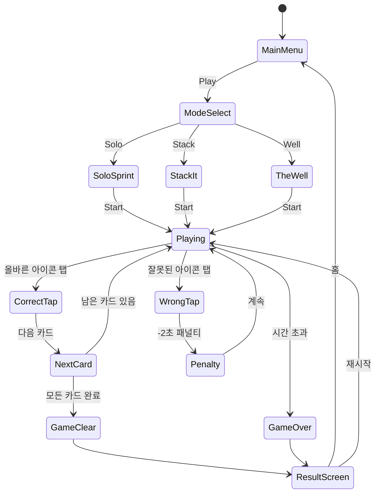

# Find Hidden Objects - Spot It! (#108)

> **Rating 4.9 | Genre: hidden-object | Rank #108**
> 숨겨진 물건 찾기 게임. 장면 속에 숨어있는 오브젝트를 시간 안에 모두 찾는다.

---

## 1. #22/#43 비교 분석: 세 번째 숨은그림찾기 게임인가?

### 찾기 장르 레퍼런스 현황

| # | 장르 | 핵심 메카닉 | 차별점 |
|---|------|-------------|--------|
| #22 | 숨은그림찾기 | 복잡한 배경 속 오브젝트 리스트 탐색 | 정적 장면, 힌트 시스템 |
| #43 | 숨은그림찾기 | 유사. 테마/아트 스타일 차별화 | 챕터식 스토리 구조 |
| #63 | 틀린그림찾기 | 두 이미지의 차이점 N개 찾기 | 집중력, 비교 탐색 |
| #103 | 틀린그림찾기 | 유사. 타이머 강조 | 스피드 + 경쟁 요소 |
| **#108** | **숨은그림찾기+** | **장면 속 오브젝트 탐색 + Spot It 요소** | **아이콘 매칭 + 레이어 탐색** |

### #108의 포지셔닝

**#22/#43이 이미 있는데 왜 #108인가?**

- **Rating 4.9** = 앱스토어 최상위권. 검증된 수요 존재
- #22/#43: "리스트 기반 오브젝트 헌팅" (텍스트 힌트 → 찾기)
- **#108 차별점**: "Spot It" 카드게임 메카닉 결합
  - 두 원형 카드 중 **공통 아이콘 1개** 즉시 찾기
  - 반응속도 + 패턴 인식 = 더 빠른 템포, 더 높은 중독성
  - 숨은그림찾기의 "탐색 재미" + 카드게임의 "순간 집중력" 혼합

**결론**: 같은 장르처럼 보이지만 완전히 다른 게임. 출시 가치 있음.

---

## 2. '찾기' 장르 종합 분석

### 숨은그림찾기 (#22, #43, #108) vs 틀린그림찾기 (#63, #103)

| 항목 | 숨은그림찾기 | 틀린그림찾기 |
|------|-------------|-------------|
| **핵심 재미** | 탐색, 발견의 쾌감 | 집중력, 비교 관찰 |
| **세션 길이** | 3~10분 (장면당) | 1~3분 (빠른 판) |
| **에셋 요구량** | 복잡한 배경 1장 | 유사 이미지 2장 (쌍으로) |
| **에셋 단가** | 높음 (복잡도) | 중간 (단순하되 쌍 생성 필요) |
| **수익화** | 힌트, 장면 언락 | 광고, 스킵 |
| **재플레이** | 낮음 (답 기억) | 중간 (매번 다름) |
| **글로벌 수요** | ★★★★★ | ★★★★☆ |
| **개발 복잡도** | 중간 | 낮음 |

### Spot It (#108) 특이점

| 항목 | Spot It 메카닉 |
|------|---------------|
| **세션 길이** | 30초~2분 (초단기 세션) |
| **에셋 요구량** | 아이콘 55개 × 소형 이미지 (낮음!) |
| **재플레이** | 매우 높음 (카드 조합 무한) |
| **수익화** | 덱 팩, 테마, 광고 |
| **개발 복잡도** | 낮음 (Spot It 알고리즘은 수학적으로 확정) |

---

## 3. '찾기' 장르 확정 전략

### 권고: 두 장르 모두 유지, 역할 분리

```
숨은그림찾기 (#22, #43, #108)  →  세션 길이형, 프리미엄 IAP
틀린그림찾기 (#63, #103)       →  광고형, 하이퍼캐주얼
```

### #108 최우선 출시 근거

1. **Rating 4.9** = 검증된 최상위 수요
2. **Spot It 메카닉** = 에셋 최소 (아이콘 55개), 개발 1주 MVP 가능
3. **짧은 세션** = 광고 노출 빈도 높음 → 수익화 유리
4. **캐주얼 + 패밀리** = 광범위한 타겟

### 장르 포트폴리오 우선순위

```
1순위: #108 (Spot It) - 가장 빠른 개발, 높은 검증, 고수익 잠재
2순위: #22/#43 중 1개 - 정통 숨은그림찾기 (에셋 투자 필요)
3순위: #63/#103 중 1개 - 틀린그림찾기 (광고 수익 모델)
```

---

## 4. 게임 설계: Find Hidden Objects - Spot It!

### 개요

두 원형 카드를 비교하여 공통 아이콘 1개를 즉시 찾아 탭하는 반응속도 게임.
**Dobble/Spot It 카드게임**의 디지털 구현. 솔로 + 멀티 모드.

### 핵심 메카닉: Spot It 알고리즘

```
카드 수: 57장
아이콘 수: 57개
카드당 아이콘 수: 8개
임의의 두 카드 사이 공통 아이콘: 정확히 1개 (수학적 보장)
```

> 이는 프로젝티브 플레인(사영평면) 수학 원리. 알고리즘은 오픈소스로 구현 가능.

### 게임 모드

#### Mode 1: Solo Sprint (기본 모드)
- 덱에서 카드를 한 장씩 뒤집으며, 직전 카드와 현재 카드의 공통 아이콘 찾기
- 제한 시간 60초, 최대한 많은 카드 클리어
- 스코어보드 경쟁

#### Mode 2: Stack It
- 화면 중앙에 스택 카드, 하단에 내 카드
- 공통 아이콘 찾아 탭 → 스택에 내 카드 올리기
- 57장 모두 올리면 클리어

#### Mode 3: The Well (광고 수익 극대화)
- 하나의 중심 카드 vs. 내 덱 전체에서 해당 카드 빠르게 찾기
- 광고 시청으로 시간 추가

### 게임 플로우



### UI 레이아웃

```
┌─────────────────────────┐
│  ⏱ 00:45    🃏 32/57    │  ← HUD (타이머, 진행도)
├─────────────────────────┤
│                         │
│      ┌─────────┐        │
│      │  카드 1  │        │  ← 상단 카드 (비교 대상)
│      │ 🐶🌟⚡🍎 │        │
│      │ 🏠🎵🌈🦋 │        │
│      └─────────┘        │
│                         │
│      ┌─────────┐        │
│      │  카드 2  │        │  ← 하단 카드 (내 카드)
│      │ 🎸🌟🦊🔥 │        │    공통 아이콘: 🌟
│      │ 💎🌙🍕🎮 │        │
│      └─────────┘        │
│                         │
├─────────────────────────┤
│     💡 힌트    📦 팩     │
└─────────────────────────┘
```

### 스코어링 시스템

| Action | Effect |
|--------|--------|
| 올바른 탭 | +100점, 다음 카드 |
| 연속 클리어 (콤보) | ×1.5, ×2.0, ×3.0 배율 |
| 잘못된 탭 | -2초 페널티 |
| 스피드 보너스 | 2초 이내 탭 시 +50점 추가 |
| 모드 클리어 | +500점 |

### 난이도 설계

| Level | 카드당 아이콘 수 | 아이콘 크기 | 회전/변형 | 제한 시간 |
|-------|----------------|-------------|-----------|----------|
| Easy | 4개 | 크게 | 없음 | 90초 |
| Normal | 6개 | 중간 | 약간 | 60초 |
| Hard | 8개 | 작게 | 회전 있음 | 45초 |
| Expert | 8개 | 작게 | 크기변형+회전 | 30초 |

### 아이템/파워업

| Item | Effect | 획득 방법 |
|------|--------|-----------|
| 💡 힌트 | 공통 아이콘 깜빡임 3초 | 광고 시청 or 코인 |
| ⏩ 시간 추가 | +10초 | 광고 시청 |
| 🔍 Zoom | 카드 일시 확대 | 코인 |
| ❄️ 프리즈 | 타이머 3초 정지 | 코인 |

---

## 5. 에셋 전략: AI 이미지 생성 파이프라인

### Spot It 에셋 요구량 (최소)

```
아이콘: 57개 (기본 덱)
크기: 128×128px (벡터 기반 SVG 권장)
스타일: 플랫 + 아웃라인 (가독성 최우선)
테마 팩당 추가: 57개 아이콘
```

### AI 생성 파이프라인

#### Step 1: 아이콘 생성
```
도구: Midjourney / DALL-E / Stable Diffusion
프롬프트 템플릿:
  "flat icon, [object name], white background,
   bold outline, simple shape, game asset style,
   128x128, vector look"

배치 생성: 57개 × 1시간 = 빠른 생산
```

#### Step 2: 후처리
```
도구: Adobe Illustrator / Figma (벡터 트레이싱)
작업: 배경 제거 → SVG 변환 → 크기 통일
시간: 아이콘당 2~3분 → 57개 = 약 3시간
```

#### Step 3: 테마 팩 확장
```
기본 덱: 일반 오브젝트 (동물, 음식, 스포츠)
테마 팩 1: 할로윈 (유령, 호박, 박쥐...)
테마 팩 2: 크리스마스 (산타, 선물, 눈사람...)
테마 팩 3: 바다 (물고기, 산호, 조개...)
테마 팩 4: 우주 (로켓, 별, 행성...)
```

### 에셋 생산 일정

| 작업 | 소요 시간 | 담당 |
|------|-----------|------|
| 기본 덱 57개 아이콘 생성 | 1일 | AI + 디자이너 |
| SVG 변환 및 최적화 | 0.5일 | 디자이너 |
| UI 에셋 (버튼, 배경) | 0.5일 | 디자이너 |
| 테마 팩 1개 추가 | 0.5일 | AI + 디자이너 |
| **총합** | **2~3일** | |

### 에셋 비용 예상

```
AI 구독 (Midjourney): $30/월
디자이너 작업 (외주): $50~100 (일회성)
총 에셋 비용: ~$130 (기본 + 테마 1팩)
```

---

## 6. 수익화 전략

### 수익 모델 구성

```
Primary:   광고 (보상형 광고 > 전면 광고)
Secondary: 테마 팩 IAP ($0.99~$2.99)
Tertiary:  힌트 코인 팩 IAP ($0.99)
```

### 광고 배치 전략

| 위치 | 광고 형식 | 빈도 |
|------|-----------|------|
| 게임 오버 후 | 전면(Interstitial) | 매 3게임 |
| 힌트 사용 시 | 보상형(Rewarded) | 요청 시 |
| 시간 추가 시 | 보상형(Rewarded) | 요청 시 |
| 홈화면 | 배너(Banner) | 항상 |

### IAP 항목

| 상품 | 가격 | 내용 |
|------|------|------|
| 힌트 팩 Small | $0.99 | 힌트 10개 |
| 힌트 팩 Large | $2.99 | 힌트 50개 |
| 테마 팩 (개별) | $0.99~$1.99 | 아이콘 57개 + 배경 |
| 광고 제거 | $2.99 | 영구 광고 제거 |
| All-in Bundle | $7.99 | 모든 테마 + 광고 제거 |

### 수익 예상 (월 DAU 10,000 기준)

```
광고 수익:    DAU 10,000 × ARPDAU $0.02 = $200/일 = $6,000/월
IAP 수익:     CVR 2% × ARPPU $3 = $600/월
총 예상:      ~$6,600/월 (보수적)
목표 DAU:     50,000+ 달성 시 ~$33,000/월
```

---

## 7. MVP 범위

### Phase 1 - MVP (1주)

```
목표: 앱스토어 출시 가능한 최소 버전
```

- [ ] 기획서 작성 (이 문서)
- [ ] Spot It 카드 알고리즘 구현 (57장, 8아이콘)
- [ ] Solo Sprint 모드 구현
- [ ] 기본 덱 에셋 57개 (AI 생성)
- [ ] 게임 오버 / 클리어 판정
- [ ] 스코어 + 하이스코어 저장
- [ ] 보상형 광고 (힌트)
- [ ] 전면 광고 (게임 오버)

### Phase 2 (2주차)

- [ ] Stack It 모드 추가
- [ ] 난이도 선택 (Easy/Normal/Hard)
- [ ] 테마 팩 1개 (IAP)
- [ ] 사운드/이펙트
- [ ] 튜토리얼

### Phase 3 (이후)

- [ ] The Well 모드
- [ ] 멀티플레이어 (로컬 2인)
- [ ] 글로벌 리더보드
- [ ] 추가 테마 팩

---

## 8. 결론: '찾기' 장르 최종 전략

### 포트폴리오 전략

```
                   개발속도 빠름
                        ↑
         #108 Spot It ──┼── 숨은그림찾기 (#22/#43형)
         (1주 MVP)      │   (2주 MVP, 에셋 투자 큼)
                        │
  수익/DAU 낮음 ─────────┼──────────── 수익/DAU 높음
                        │
         틀린그림 (#63)  │   정통 숨은그림찾기
         (광고형)        │   (프리미엄)
                        ↓
                   개발속도 느림
```

### 즉시 실행 권고

**1순위: #108 Spot It 즉시 출시**
- 개발 1주 MVP 가능
- 에셋 비용 최소 (~$130)
- Rating 4.9 검증된 수요
- 짧은 세션 = 광고 수익 극대화

**2순위: #22 또는 #43 (정통 숨은그림찾기)**
- Spot It 출시 후 데이터 보며 에셋 투자 결정
- CPI/ROAS 비교 후 포트폴리오 리밸런싱

**3순위: 틀린그림찾기 (#63/#103) 중 1개**
- 개발 쉽고 광고 수익 모델 명확
- but, #108 대비 차별화 약함

### 에셋 생산 최종 전략

```
Week 1: #108 기본 덱 57개 아이콘 (AI 생성, $30)
Week 2: #108 출시 + 테마팩 1개 병렬 생산 ($50)
Week 3: 데이터 수집 후 다음 게임 에셋 결정
```

> **AI 이미지 생성은 MVG(Minimum Viable Game) 전략의 핵심.**
> 디자이너 없이도 출시 가능. 퀄리티 대신 속도 선택.

---

## 사운드/이펙트

| Event | Sound |
|-------|-------|
| 올바른 탭 | 경쾌한 딩동 효과음 |
| 잘못된 탭 | 짧은 버즈 효과음 |
| 콤보 | 상승 멜로디 |
| 게임 클리어 | 팡파레 |
| 게임 오버 | 낮은 실패음 |
| 배경음 | 캐주얼 루프 BGM |
