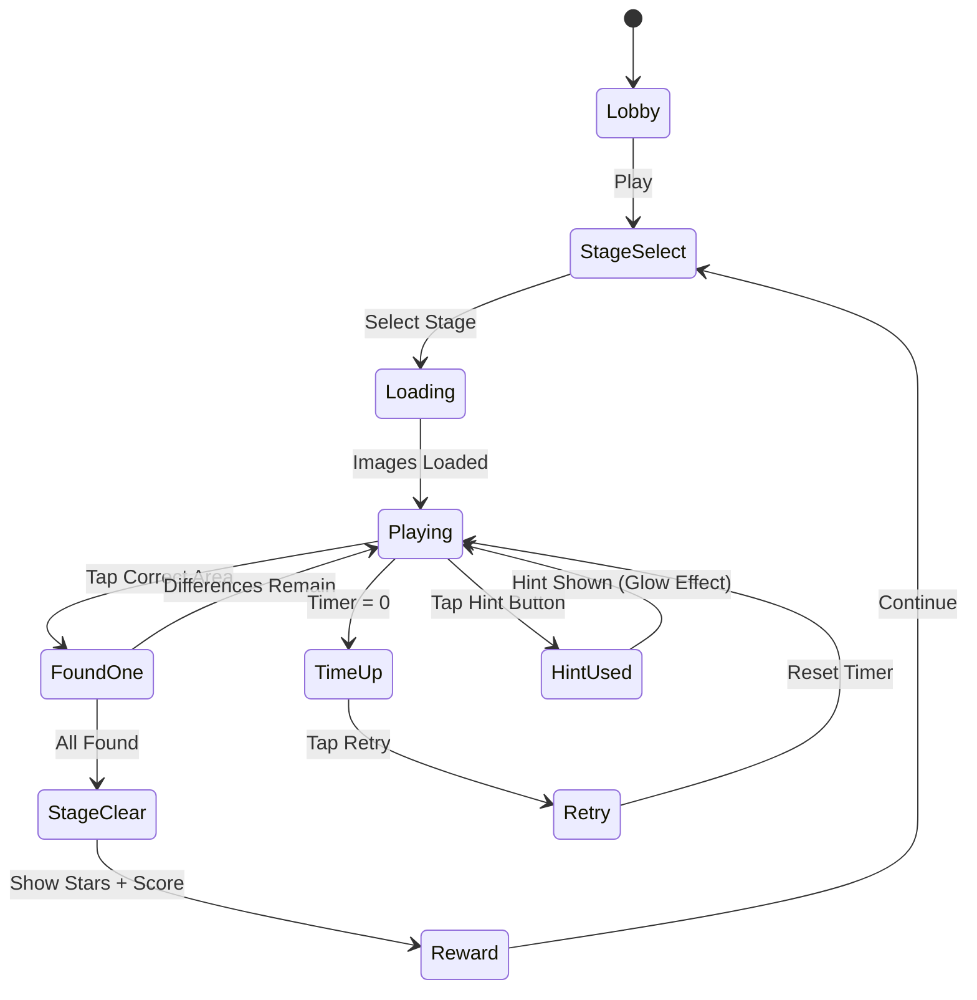

# 차이 여정 (Spot the Difference)

> **레퍼런스**: Guru Puzzle Game — 틀린그림 찾기, 평점 4.9 / 장르: hidden-object / 랭크: #63

## 개요

두 장의 유사한 이미지를 나란히 놓고, 숨겨진 차이점 N개를 모두 찾는 게임.
AI 생성 이미지 쌍으로 콘텐츠를 무한 확장하며, 힌트와 이미지 팩으로 수익화한다.

### 핵심 재미 루프

```
이미지 감상 → 차이 탐색 → 발견의 희열 → 다음 스테이지 도전
```

- **탐색 (Exploration)**: 두 이미지를 꼼꼼히 비교하는 집중력 게임
- **발견 (Discovery)**: 차이점 찾을 때마다 즉각적인 피드백 + 원형 표시
- **완성 (Completion)**: 모든 차이를 찾으면 스테이지 클리어 연출

---

## 게임 규칙

### 기본 규칙

- 화면에 두 이미지가 나란히(좌/우) 또는 위/아래로 배치됨
- 각 스테이지마다 **3~7개**의 차이점이 숨겨져 있음
- 플레이어가 차이점을 탭하면 양쪽 이미지에 **원형 마커**로 표시됨
- 제한 시간 내에 모든 차이점을 찾으면 **스테이지 클리어**
- 오탭(틀린 곳 탭) 시 **-5초 페널티** + 짧은 진동 피드백

### 터치 판정

- 차이 영역 중심으로 **반경 30~50px** (차이 크기에 따라 동적 조정)
- 정답 판정 영역: 두 이미지 모두에 동일한 좌표 기준으로 적용
- 확대(핀치줌) 시 터치 반경도 비례해서 증가

### 핀치줌 탐색

- **최대 3배** 확대 지원
- 확대 중 드래그로 이미지 이동 가능
- 확대된 상태에서 탭하면 원래 좌표로 역산해 판정
- 양쪽 이미지 동기화 스크롤 (좌 이미지 이동 시 우 이미지도 동기화)

---

## 차이 유형

| 유형 | 설명 | 난이도 |
|------|------|--------|
| 색상 변경 | 오브젝트 색이 다름 (빨강→파랑 등) | 쉬움 |
| 오브젝트 추가 | 한쪽 이미지에만 오브젝트 존재 | 보통 |
| 오브젝트 제거 | 한쪽 이미지에서 오브젝트 없음 | 보통 |
| 위치 이동 | 오브젝트 위치가 살짝 다름 | 어려움 |
| 크기 변화 | 오브젝트 크기가 다름 | 어려움 |
| 패턴/텍스처 | 무늬나 패턴이 다름 | 어려움 |
| 세부 모양 | 오브젝트 형태가 미묘하게 다름 | 매우 어려움 |

---

## 게임 플로우



---

## UI 레이아웃

### 메인 게임 화면

```
┌─────────────────────────────────┐
│  ← Back   🔍 차이 여정   ⚙️     │  ← 상단 바
├────────────────┬────────────────┤
│  ⏱ 02:30      │  🔵🔵⚪⚪⚪     │  ← 타이머 | 차이 진행 (5개 중 2개)
├────────────────┴────────────────┤
│                                 │
│  ┌─────────────┐ ┌────────────┐ │
│  │             │ │            │ │
│  │  [이미지 A] │ │ [이미지 B] │ │  ← 두 이미지 (좌/우)
│  │      🔵     │ │     🔵     │ │    정답 표시: 원형 마커
│  │             │ │            │ │
│  └─────────────┘ └────────────┘ │
│     (핀치줌 + 드래그 지원)        │
│                                 │
├─────────────────────────────────┤
│  💡 힌트 (3개)    ✕ 오탭: 2회  │  ← 하단 툴바
└─────────────────────────────────┘
```

### 스테이지 클리어 화면

```
┌─────────────────────────────────┐
│                                 │
│         ⭐ ⭐ ⭐               │  ← 별점 (3성 기준)
│       STAGE CLEAR!              │
│                                 │
│   차이 발견: 5/5    시간: 1:45  │
│   점수: 2,350                   │
│                                 │
│  [다음 스테이지]  [다시하기]     │
│                                 │
└─────────────────────────────────┘
```

---

## 스코어링 시스템

| 액션 | 점수 |
|------|------|
| 차이 발견 | +200 |
| 빠른 발견 보너스 (5초 내) | +100 |
| 연속 발견 콤보 (10초 내 연속) | × 콤보 배율 (최대 ×3) |
| 스테이지 클리어 | +500 |
| 남은 시간 보너스 | 남은초 × 10 |
| 오탭 패널티 | -100 |

### 별점 기준 (3성 시스템)

| 별점 | 조건 |
|------|------|
| ⭐⭐⭐ | 오탭 0~1회 + 시간 50% 이상 남음 |
| ⭐⭐ | 오탭 2~3회 또는 시간 20~50% 남음 |
| ⭐ | 클리어했지만 오탭 4회+ 또는 시간 거의 소진 |

---

## 난이도 설계

### 스테이지 구성

| 난이도 | 스테이지 | 차이 수 | 제한 시간 | 차이 크기 | 이미지 복잡도 |
|--------|----------|---------|-----------|-----------|---------------|
| 입문 | 1~5 | 3개 | 3분 | 크게 | 단순 |
| 초급 | 6~15 | 4개 | 2분 30초 | 중간 | 보통 |
| 중급 | 16~30 | 5개 | 2분 | 중간 | 복잡 |
| 고급 | 31~50 | 6개 | 1분 30초 | 작게 | 매우 복잡 |
| 전문가 | 51+ | 7개 | 1분 | 매우 작게 | 세밀한 |

### 난이도 조절 변수

1. **차이 수**: 3개 → 7개 (단계별 증가)
2. **차이 크기**: 큰 면적 → 픽셀 수준 미세 차이
3. **이미지 복잡도**: 배경 단순 → 복잡한 패턴/텍스처
4. **제한 시간**: 넉넉 → 빡빡
5. **차이 유형 난이도**: 색상 변경(쉬움) → 세부 모양(어려움) 조합

---

## 힌트 시스템

### 무료 힌트

- 게임 시작 시 기본 **3개** 제공
- 매일 로그인 시 +1개 보충 (최대 5개까지)

### 힌트 동작

| 힌트 단계 | 효과 | 비용 |
|-----------|------|------|
| 1단계: 영역 힌트 | 차이가 있는 **사분면 하이라이트** (이미지를 4등분) | 힌트 1개 |
| 2단계: 원형 힌트 | 차이 위치에 **글로우 원** 반경 표시 (반경 60px) | 힌트 1개 |
| 자동 힌트 (광고) | 광고 시청 후 → 2단계 힌트 즉시 | 광고 1회 |

### 힌트 수익화

- 힌트 팩: 10개 힌트 구매 (인앱 결제)
- 힌트는 모든 스테이지 공통 통화로 사용

---

## 이미지 콘텐츠 전략

### MVP 콘텐츠 (20세트)

| 테마 | 이미지 수 | 난이도 |
|------|-----------|--------|
| 도시 풍경 | 4쌍 | 초급~중급 |
| 자연/동물 | 4쌍 | 입문~초급 |
| 실내/인테리어 | 4쌍 | 초급~중급 |
| 판타지/일러스트 | 4쌍 | 중급~고급 |
| 음식/요리 | 4쌍 | 입문~초급 |

### AI 이미지 생성 파이프라인 (Phase 2)

1. **Stable Diffusion / DALL-E** 로 기본 이미지 생성
2. 후처리 스크립트로 차이점 자동 삽입 (색상 변경, 오브젝트 편집)
3. 수동 QA: 차이점이 너무 명확하거나 불공평하지 않은지 검수
4. 메타데이터 JSON으로 차이점 좌표 관리

```json
{
  "id": "city_001",
  "theme": "도시",
  "difficulty": 2,
  "timeLimit": 150,
  "differences": [
    { "x": 120, "y": 340, "radius": 40, "type": "color" },
    { "x": 280, "y": 150, "radius": 30, "type": "added" }
  ]
}
```

### 이미지 팩 수익화

| 팩 이름 | 이미지 수 | 가격 |
|---------|-----------|------|
| 도시 탐험 팩 | 20쌍 | 인앱 결제 |
| 자연 여정 팩 | 20쌍 | 인앱 결제 |
| 판타지 세계 팩 | 20쌍 | 인앱 결제 |
| 시즌 패스 (월정액) | 무제한 신규 콘텐츠 | 구독 |

---

## Guru 4.9 고평점 UX 분석

### 핵심 성공 요인

1. **즉각적인 발견 피드백**
   - 정답 탭 즉시 양쪽 이미지에 동시에 원형 마커 등장
   - 부드러운 팝업 애니메이션 + 효과음 → 도파민 트리거

2. **발견 시 화면 전체 연출**
   - 차이 발견 시 짧은 파티클 이펙트 (✨)
   - 차이 수 카운터가 시각적으로 채워지는 애니메이션

3. **좌절 최소화 설계**
   - 오탭 시 "X" 표시 후 즉시 사라짐 (실패감 최소화)
   - 힌트가 항상 접근 가능해 막힌 느낌 없음
   - 타이머 없는 "자유 모드" 옵션 (캐주얼 유저 배려)

4. **진행감 설계**
   - 스테이지 맵(월드 맵 스타일)으로 성취감 시각화
   - 3성 클리어 목표로 재플레이 동기 부여
   - 일일 챌린지로 매일 복귀 유도

5. **이미지 품질**
   - 아름다운 일러스트 이미지 → 자체로 감상 가치
   - 테마별 패키징으로 컬렉션 욕구 자극

6. **확대 기능의 공정성**
   - 핀치줌으로 작은 차이도 찾을 수 있음 → 불공평함 해소
   - "이건 너무 작아서 못 찾겠다" 불만 차단

---

## 수익화 전략

### 무료 플레이 경험

- 기본 20스테이지 무료
- 힌트 3개/일 무료
- 광고 시청으로 힌트 획득 가능

### 수익화 레이어

| 수익원 | 상품 | 타겟 유저 |
|--------|------|-----------|
| 광고 | 힌트 교환 광고 / 스테이지 클리어 후 보상 광고 | 무과금 |
| 소액 결제 | 힌트 팩 (10/30개) | 라이트 과금 |
| 중액 결제 | 이미지 팩 (테마별) | 미드코어 |
| 구독 | 월정액 패스 (광고 제거 + 무제한 콘텐츠) | 헤비 유저 |

---

## 사운드/이펙트

| 이벤트 | 효과 |
|--------|------|
| 차이 발견 | 밝은 "딩동" 효과음 + 파티클 이펙트 |
| 오탭 | 짧은 "틱" 진동 + 빨간 X 이펙트 |
| 스테이지 클리어 | 축하 멜로디 + 별 등장 애니메이션 |
| 힌트 사용 | 부드러운 글로우 등장 + "whoosh" 효과음 |
| 타이머 경고 (10초) | 빨간 타이머 + 틱톡 효과음 |
| BGM | 잔잔한 집중 BGM (루프), 클리어 시 밝은 변주 |

---

## MVP 범위

### Phase 1 — MVP (1~2주)

- [x] 기획서 작성
- [ ] 이미지 쌍 20세트 제작 (수동, 5개 테마 × 4쌍)
- [ ] 차이점 좌표 메타데이터 JSON 정의
- [ ] 코어 터치 판정 로직 (좌표 기반 원형 히트박스)
- [ ] 정답 발견 마커 UI (양쪽 동기화)
- [ ] 오탭 패널티 (-5초 + 진동)
- [ ] 타이머 + 차이 수 카운터 HUD
- [ ] 핀치줌 + 동기화 스크롤
- [ ] 힌트 시스템 (원형 힌트, 기본 3개)
- [ ] 스테이지 클리어 / 타임오버 화면
- [ ] 5스테이지 (입문 난이도)

### Phase 2 (2주차~)

- [ ] 20스테이지 전체 오픈
- [ ] 스테이지 맵 화면
- [ ] 3성 시스템 + 재플레이
- [ ] 광고 기반 힌트 교환
- [ ] 이미지 팩 인앱 결제
- [ ] 일일 챌린지
- [ ] AI 이미지 파이프라인 구축

### Phase 3 (데이터 기반)

- [ ] 자유 모드 (타이머 없음)
- [ ] 월정액 구독
- [ ] 시즌 콘텐츠
- [ ] 커뮤니티 업로드 (유저 제작 스테이지)

---

## 기술 구현 포인트 (Game Core 팀 참고)

### lib/spot-the-difference 주요 모듈

```
GameScene
├── ImageLoader: 두 이미지 비동기 로드
├── DifferenceManager: 차이점 좌표 + 히트박스 관리
├── TouchHandler: 핀치줌 + 탭 판정
├── ZoomController: 양쪽 이미지 동기화 확대/이동
├── HintSystem: 힌트 단계별 표시
└── TimerSystem: 타이머 + 페널티 관리
```

### 핵심 판정 알고리즘

```
탭 좌표 → 줌 역변환 → 원본 이미지 좌표 →
DifferenceManager.check(x, y) →
  가장 가까운 미발견 차이점의 거리 계산 →
  distance < radius → 정답
  distance >= radius → 오탭
```
