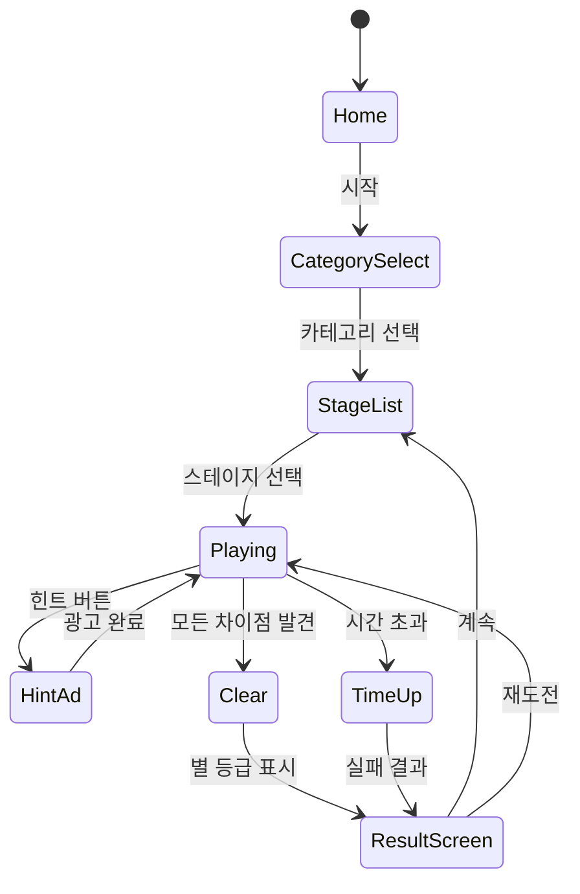

# SpotDiff — 틀린그림찾기 (차이점 찾기 & 발견하기)

> **레퍼런스**: #63 틀린그림찾기 + #103 차이점-찾기&발견하기 (둘 다 Guru Puzzle Game, 4.9★)
> **목표**: 두 레퍼런스의 강점을 합쳐 단일 MVP 앱으로 빠르게 출시

---

## 1. #63 틀린그림찾기 vs #103 차이점 비교 분석

| 항목 | #63 틀린그림찾기 | #103 차이점 찾기&발견하기 |
|------|-----------------|--------------------------|
| 개발사 | Guru Puzzle Game | Guru Puzzle Game |
| 평점 | 4.9★ | 4.9★ |
| 핵심 차별점 | 정밀한 원 표시, 힌트 시스템 | 카테고리 이미지팩, 스토리 레벨 |
| 난이도 표현 | 차이점 개수(3~10개) | 시간 압박 + 차이점 크기 축소 |
| 보상 루프 | 별 3개 시스템, 스테이지 해금 | 코인 획득 → 팩 구매 |
| 콘텐츠 구조 | 단일 스테이지 목록 | 테마 카테고리별 묶음 |
| 주요 광고 위치 | 스테이지 클리어 후 전면 광고 | 힌트 사용 시 보상형 광고 |

**핵심 인사이트**: 두 앱 모두 **Guru의 동일 엔진** 위에서 콘텐츠 구성 방식만 다르다.
→ 우리는 두 구조를 합쳐 **카테고리 스테이지 + 별 3개 + 힌트 광고** 형태로 구현한다.

---

## 2. Guru 4.9★ 비결 — UI/UX 철학

Guru가 동일 장르에서 두 앱 모두 4.9를 받는 이유는 **"감각적 피드백의 완성도"**다.

### 핵심 원칙

1. **즉각적 만족**: 차이점 터치 → 원형 링 펄스 애니메이션(0.3초) + 효과음 → 0.1초 딜레이 없이
2. **실패 피드백이 친절함**: 오터치 시 빨간 X가 0.5초 뜨다 사라짐, 게임오버 없음
3. **진행감 시각화**: 상단 바에 "찾은 개수 / 전체 개수" 원형 아이콘으로 실시간 표시
4. **힌트는 광고로 제공**: 코인 소모 없이 광고 시청으로 힌트 → 사용자 이탈 최소화
5. **클리어 모션**: 스테이지 완료 시 컨페티 + 별 등장 애니메이션(1.5초) → 공유 유도
6. **이미지 품질**: 선명하고 채도 높은 이미지, 모바일 해상도 최적화

### 구현 우선순위 (MVP)

```
Must Have: 원형 링 피드백 / 오터치 X 표시 / 진행 바 / 클리어 컨페티
Should Have: 별 3개 등급 / 공유 버튼
Nice to Have: 배경 음악 / 연속 콤보 이펙트
```

---

## 3. 틀린그림찾기 장르 종합 설계 (#63 + #103 통합)

### 핵심 게임 루프

```
이미지 쌍 표시 → 플레이어 차이점 탐색 → 터치/클릭 → 피드백 → 전체 발견 → 클리어
                                              ↓ (오터치)
                                         X 표시 후 계속
                                              ↓ (힌트)
                                         광고 시청 → 힌트 표시
```

### 게임 규칙

- 좌우(모바일) 또는 상하(태블릿)로 두 이미지 배치
- 차이점 개수: 난이도별 3개 / 5개 / 7개 / 10개
- 시간 제한: 난이도별 180초 / 120초 / 90초 / 60초
- 힌트: 스테이지당 3회 (광고 시청으로 추가 획득)
- 오터치 페널티: 시간 -5초 (게임오버 없음 → 이탈 방지)
- 별 등급: 시간 80% 이상 남으면 ★★★, 50% 이상 ★★, 클리어만 해도 ★

---

## 4. AI 이미지 쌍 자동 생성 파이프라인

### 전략

직접 AI로 완성된 "차이점 이미지 쌍"을 만들기보다, **베이스 이미지 생성 → 프로그래매틱 차이 삽입** 방식이 품질과 속도 면에서 최적이다.

### 파이프라인 구조

```
[Step 1] 베이스 이미지 생성
    → Stable Diffusion / DALL-E 3 / Midjourney로 주제별 이미지 생성
    → 프롬프트 예: "cozy kitchen interior, flat illustration, bright colors, no text"
    → 해상도: 1024×512 (좌우 분할 시 각 512×512)

[Step 2] 차이점 자동 삽입 (scripts/gen-diff.py)
    → 이미지 A = 원본
    → 이미지 B = 이미지 A에서 N곳 변형:
       - 색상 변경: 특정 영역 hue shift (OpenCV)
       - 오브젝트 제거: inpainting (diffusers)
       - 크기 변경: 특정 오브젝트 scale ±20%
       - 추가: 작은 오브젝트 삽입 (스탬프 방식)

[Step 3] 메타데이터 생성
    → diff_coords: [{x, y, radius}] — 터치 정답 영역
    → difficulty: 차이점 크기/개수로 자동 계산
    → JSON으로 저장: assets/levels/{id}.json

[Step 4] QA 필터
    → 자동 검증: 차이점 영역 최소 픽셀 수 충족 여부
    → 수동 검수: 10% 샘플링
```

### 기술 스택

```python
# 필요 라이브러리
pillow          # 이미지 조작
opencv-python   # 색상/영역 처리
diffusers       # Stable Diffusion inpainting
openai          # DALL-E 3 생성 (옵션)

# 생성 단가 (DALL-E 3 기준)
# $0.04/이미지 × 200장 = $8 → 100 스테이지 콘텐츠 확보
```

### 초기 콘텐츠 계획

| 카테고리 | 스테이지 수 | 생성 방식 |
|----------|------------|-----------|
| 자연/풍경 | 20 | SD 생성 |
| 도시/거리 | 20 | SD 생성 |
| 음식/주방 | 15 | DALL-E 3 |
| 동물 | 15 | SD 생성 |
| 판타지/일러스트 | 15 | SD 생성 |
| 계절/이벤트 | 15 | 수동 제작 |
| **합계** | **100** | **MVP** |

---

## 5. 확정 기획 — 틀린그림찾기 단일 앱

### 앱 이름 (안)
- **"찾아봐"** — 직관적, 한국어 타겟
- **"SpotIt!"** — 글로벌 확장 가능
- → **MVP는 "찾아봐"로 한국 우선 출시 후 글로벌 판 별도**

### 화면 구성

```
[스플래시] → [홈/카테고리 선택] → [스테이지 목록] → [게임 플레이] → [클리어/결과]
```

### 게임 플레이 UI

```
┌─────────────────────────────┐
│ ← 뒤로  찾아봐  ⏱ 1:32     │  ← 상단 HUD
│ ●●●●● 5/7 발견              │  ← 진행 표시
├─────────────────────────────┤
│  ┌──────────────────────┐   │
│  │      이미지 A        │   │
│  │   (원본)             │   │
│  └──────────────────────┘   │
│  ┌──────────────────────┐   │  ← 두 이미지 (상하 배치)
│  │      이미지 B        │   │
│  │   (차이 있음)        │   │
│  └──────────────────────┘   │
├─────────────────────────────┤
│   💡 힌트 (광고 시청)       │  ← 하단 액션
└─────────────────────────────┘
```

### 상태 머신



---

## 6. 에셋 파이프라인 — 지속적 콘텐츠 생산

### 주간 생산 목표: 스테이지 10개/주

```
월: 프롬프트 작성 + AI 생성 (30분)
화: diff 자동 삽입 스크립트 실행 (10분)
수: QA 검수 + 메타데이터 확인 (1시간)
목: 앱 번들에 포함 + 배포 (자동화)
```

### 파일 구조

```
assets/
  levels/
    001.json   # {imageA, imageB, diffs: [{x,y,r}], difficulty, category}
    002.json
    ...
  images/
    001_a.webp
    001_b.webp
    ...
```

### 이미지 최적화

- 포맷: WebP (JPEG 대비 30% 용량 절감)
- 해상도: 1080×540px (2배수 제공: 540×270 / 1080×540)
- 초기 번들: 20 스테이지 (앱 크기 ~15MB)
- 이후: OTA 다운로드 (스테이지팩 단위)

### CDN 전략

```
초기 20 스테이지: 앱 번들 내장
21~100 스테이지: CloudFront CDN 스트리밍
신규 콘텐츠: 주간 업데이트 푸시
```

---

## 7. 수익화 전략

### 수익 모델 3-Track

#### Track 1: 광고 (초기 주수입)
| 광고 형태 | 발동 시점 | 예상 CPM |
|----------|----------|----------|
| 보상형 광고 | 힌트 사용 시 | $15~25 |
| 전면 광고 | 스테이지 클리어마다 (3회에 1번) | $5~10 |
| 배너 광고 | 스테이지 목록 하단 | $1~2 |

→ **DAU 1,000 기준 일 광고 수익 예상: $20~50**

#### Track 2: 이미지팩 인앱결제
| 팩 이름 | 가격 | 스테이지 수 |
|---------|------|------------|
| 기본팩 (무료) | $0 | 20 |
| 자연팩 | $1.99 | 30 |
| 도시팩 | $1.99 | 30 |
| 판타지팩 | $2.99 | 40 |
| 풀팩 (전체) | $5.99 | 100+ |

→ **전환율 2% 가정: DAU 1,000 × 2% × $3 평균 = $60/일**

#### Track 3: 힌트 코인 인앱결제
| 상품 | 가격 | 코인 |
|------|------|------|
| 코인 소팩 | $0.99 | 30 |
| 코인 중팩 | $2.99 | 100 |
| 코인 대팩 | $4.99 | 200 |

→ 광고 보기 싫은 사용자 캡처

### 월간 수익 시나리오

| 지표 | 보수적 | 중간 | 낙관적 |
|------|--------|------|--------|
| DAU | 500 | 2,000 | 10,000 |
| 광고 수익/월 | $300 | $1,500 | $10,000 |
| IAP 수익/월 | $200 | $1,000 | $8,000 |
| **합계/월** | **$500** | **$2,500** | **$18,000** |

**손익분기점**: 개발비 $0 (내부 개발) + 서버/CDN $50/월 → DAU 200 이상이면 흑자

---

## 8. 결론 — 확정 기획 + 에셋 생산 전략

### 확정 결정

1. **앱명**: "찾아봐" (한국 우선) → 글로벌은 "SpotIt!" 별도 빌드
2. **구현 범위 (MVP, 1~2주)**:
   - Phaser.io 기반 게임 코어 (`lib/spotdiff`)
   - 좌우/상하 이미지 배치 + 터치 판정
   - 원형 피드백 애니메이션 + 오터치 X
   - 힌트 → 보상형 광고 연동
   - 20 스테이지 초기 콘텐츠
3. **에셋 전략**: AI 자동 생성 파이프라인으로 주 10개 스테이지 지속 생산
4. **수익화 순서**: 광고 먼저(DAU 확보) → 이미지팩 도입 → 코인팩 추가

### 개발 일정 (2주 MVP)

| 일차 | 작업 |
|------|------|
| D1~2 | `lib/spotdiff` 게임 코어 (이미지 렌더링, 터치 판정, 피드백) |
| D3~4 | 스테이지 데이터 구조 + 20개 초기 콘텐츠 생성 |
| D5~6 | `web/spotdiff` React 래퍼 + 스테이지 목록 UI |
| D7~8 | 힌트 시스템 + 광고 SDK 연동 (AdMob) |
| D9~10 | `spotdiff/rn` WebView 래핑 + 스토어 제출 준비 |
| D11~12 | QA + 버그 수정 |
| D13~14 | 스토어 제출 (Google Play 우선, App Store 병행) |

### 핵심 리스크 & 대응

| 리스크 | 대응 |
|--------|------|
| AI 이미지 품질 미달 | 수동 제작 20장을 초기 번들로 보장 |
| 광고 심사 지연 | AdMob 선 신청 (D1부터) |
| 스토어 리젝 | 힌트 광고를 강제 아닌 선택 옵션으로 설계 |
| 경쟁 앱 대비 콘텐츠 부족 | 20개로 출시 후 주간 업데이트로 빠르게 확장 |

### 성공 판단 기준 (출시 2주 후)

- DAU 200 이상 → 개발 계속
- 4.0★ 이상 → 스토어 최적화 집중
- D7 리텐션 20% 이상 → 마케팅 투자 확대

---

## MVP 체크리스트

### Phase 1 (1~2주, MVP)
- [x] 기획서 작성
- [ ] `lib/spotdiff` 게임 코어 구현
  - [ ] 이미지 쌍 로드 및 렌더링
  - [ ] 터치/클릭 좌표 → 정답 영역 판정
  - [ ] 원형 링 피드백 애니메이션
  - [ ] 오터치 X 이펙트 + 시간 패널티
  - [ ] 힌트 발동 (정답 영역 하이라이트)
  - [ ] 타이머 + 클리어/실패 판정
- [ ] AI 이미지 생성 스크립트 (`scripts/gen-diff.py`)
- [ ] 초기 콘텐츠 20 스테이지
- [ ] `web/spotdiff` React 래퍼
- [ ] `spotdiff/rn` WebView 래핑
- [ ] AdMob 보상형 광고 연동

### Phase 2 (출시 후)
- [ ] 카테고리 선택 화면
- [ ] 별 3개 등급 시스템
- [ ] 이미지팩 인앱결제
- [ ] 코인 시스템
- [ ] 공유 기능 (클리어 시)
- [ ] 일일 챌린지 스테이지
