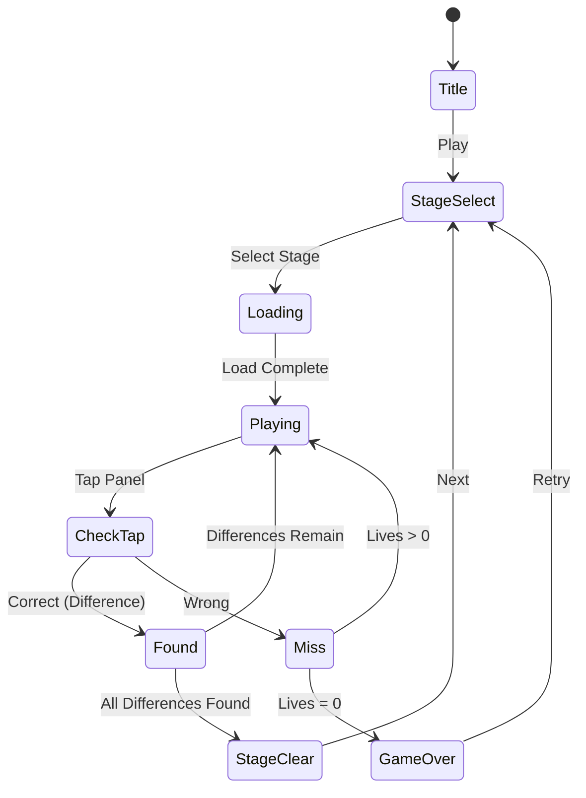

# SpotDiff

> 두 그림의 차이점을 찾아내는 틀린그림찾기 퍼즐 게임

## 개요

두 개의 거의 동일한 장면이 화면에 나란히 표시된다. 플레이어는 두 장면 사이의 차이점을 탭하여 찾아낸다. 모든 차이점을 찾으면 스테이지 클리어. Phaser 도형(원, 사각형, 삼각형, 별)을 랜덤 색상으로 조합해 장면을 프로그래밍 방식으로 생성한다.

## 게임 규칙

### 기본 규칙
- 화면에 두 개의 장면 패널이 표시됨 (세로 모드: 상/하, 가로 모드: 좌/우)
- 두 장면은 거의 동일하지만 **N개의 차이점**이 존재
- 플레이어가 차이점 위치를 탭하면 해당 차이점이 발견됨
- **어느 패널이든** 탭 가능 — 발견 시 **양쪽 패널 모두**에 원형 애니메이션 표시
- 잘못된 위치를 탭하면 **라이프 1개 소모** (총 3개)
- 라이프가 0이 되면 **게임 오버**
- 모든 차이점을 찾으면 **스테이지 클리어**

### 차이점 유형
- **색상 변경**: 도형의 색상이 다름
- **도형 변경**: 원 → 삼각형 등 도형 자체가 다름
- **위치 변경**: 같은 도형이 약간 다른 위치에 배치됨
- **크기 변경**: 같은 도형이 다른 크기로 표시됨
- **요소 추가/삭제**: 한쪽에만 도형이 존재하거나 없음

### 장면 생성 (프로그래밍 방식)
- Phaser 도형(원, 사각형, 삼각형, 별)을 랜덤 색상으로 배치
- 원본 장면 생성 후, N개의 도형에 차이점을 적용하여 변형 장면 생성
- 스테이지가 올라갈수록 도형 수 증가, 차이점이 더 미묘해짐

## 게임 플로우



## UI 레이아웃

```
┌─────────────────────────┐
│ ⏱ 00:45  ⭐ 1200  ❤❤❤ │  ← 상단 HUD
│      🔍 3/5 발견        │  ← 발견 카운터
├─────────────────────────┤
│                         │
│   ● ▲  ■    ★  ●      │
│     ■    ●  ▲          │  ← 장면 A (원본)
│   ★    ▲  ■    ●      │
│                         │
├ ─ ─ ─ ─ ─ ─ ─ ─ ─ ─ ─ ┤  ← 구분선
│                         │
│   ● ▲  ■    ★  ●      │
│     ■    ◆  ▲          │  ← 장면 B (차이점 포함)
│   ★    ▲  ■    ●      │
│         ↑ 차이점!       │
├─────────────────────────┤
│  💡 Hint     Stage 3    │  ← 하단: 힌트 버튼 + 스테이지 정보
└─────────────────────────┘
```

## 스코어링 시스템

| Action | Score |
|--------|-------|
| 차이점 발견 | +100 |
| 연속 발견 (콤보) | +100 × 콤보 수 |
| 스테이지 클리어 | +500 |
| 남은 시간 보너스 | 남은초 × 10 |
| 노미스 클리어 보너스 | +300 |

## 난이도 설계

| Stage | 도형 수 | 차이점 수 | 시간(초) | 차이점 유형 |
|-------|---------|-----------|----------|------------|
| 1 | 8 | 3 | 60 | 색상, 요소 삭제 |
| 2 | 12 | 4 | 60 | 색상, 요소 삭제, 도형 변경 |
| 3 | 16 | 5 | 50 | 색상, 요소 삭제, 도형 변경, 위치 변경 |
| 4 | 20 | 5 | 45 | 모든 유형 + 미묘한 색상 차이 |
| 5 | 25 | 6 | 40 | 모든 유형 + 크기 변경 |

> 스테이지가 올라갈수록 도형이 많아지고, 차이점이 더 미묘해지며, 제한 시간이 짧아짐

## 아이템/도구

| Item | Effect |
|------|--------|
| Hint | 미발견 차이점 하나를 원형 펄스 애니메이션으로 강조 |

## 사운드/이펙트 (TODO)

- 차이점 발견: 딩 효과음 + 원형 확산 이펙트
- 연속 발견 (콤보): 상승 톤 효과음
- 오답 탭: 틀림 사운드 + X 표시 이펙트
- 스테이지 클리어: 축하 이펙트
- 게임 오버: 실패 사운드
- 힌트 사용: 펄스 애니메이션 + 반짝임

## MVP 범위

### Phase 1 (MVP)
- [x] 기획서 작성
- [ ] Phaser 도형 기반 장면 프로그래밍 생성
- [ ] 두 패널(상/하) 장면 렌더링
- [ ] 탭으로 차이점 발견 로직
- [ ] 발견 시 양쪽 패널 원형 애니메이션
- [ ] 오답 시 라이프 차감 (3개)
- [ ] 게임 오버 / 클리어 판정
- [ ] 5 스테이지

### Phase 2
- [ ] 타이머 + 스코어링
- [ ] 콤보 시스템
- [ ] 노미스 보너스
- [ ] Hint 아이템 (펄스 애니메이션)
- [ ] 스테이지 셀렉트 화면
- [ ] 미묘한 차이점 유형 (색상 미세 변경, 크기 변경)
