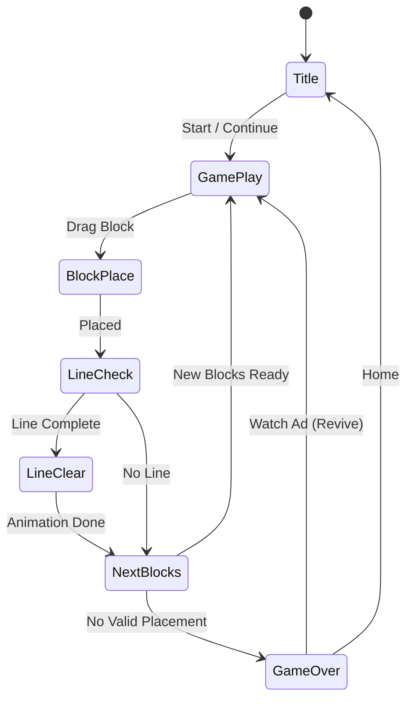

# 블록 퍼즐 - 별의 노래 (Starry Night)

> **레퍼런스**: Withme, 평점 4.9, 블록 퍼즐 장르 1위 (#79)
> **목표**: 1~2주 MVP 출시

---

## 1. 왜 4.9인가 — 블록 퍼즐 최고 평점의 비결

### 장르 특성과 고평점의 상관관계

블록 퍼즐은 구조적으로 고평점에 유리한 장르다:

| 요인 | 설명 |
|------|------|
| **무압박 플레이** | 시간 제한 없음 → 실수해도 분노하지 않음 |
| **명확한 성취감** | 줄 클리어 = 즉각적인 시각/청각 보상 |
| **단순한 규칙** | 배우기 쉽고, 마스터하기 어려움 |
| **중독성 루프** | "딱 한 판만 더" 유도 |

### Starry Night이 4.9를 받는 이유 (경쟁작 대비)

1. **테마 완성도**: 별빛 테마가 게임플레이 전반에 일관되게 적용 — UI, 사운드, 이펙트가 하나의 감성으로 통일
2. **힐링 포지셔닝**: 스트레스 해소용 게임으로 명확하게 포지셔닝 → 리뷰에 "힐링된다", "마음이 편해진다" 반응 집중
3. **광고 밸런스 우수**: 광고가 게임 몰입을 방해하지 않는다는 리뷰 다수 → 수익화와 UX 균형점 발견
4. **폴리시(Polish)**: 블록 배치 시 별빛 파티클, 줄 클리어 시 은하수 효과 등 비주얼 완성도

---

## 2. 코어 메카닉 — Block Blast (#2)와 비교

### Block Blast (슈팅 메카닉)

```
[   ] [   ] [   ]  ← 격자판
 ↑ 발사체 위로 블록 쏘기
```

- 블록을 아래에서 위로 **발사**
- 같은 색 블록 연결 시 폭발
- 아케이드적, 빠른 템포, 반사 신경 요구

### Starry Night (배치 메카닉, Wood Block Puzzle 계열)

```
┌──┬──┬──┬──┬──┬──┬──┬──┐
│  │  │  │  │  │  │  │  │
├──┼──┼──┼──┼──┼──┼──┼──┤
│  │██│██│  │  │  │  │  │  ← 블록 배치된 상태
├──┼──┼──┼──┼──┼──┼──┼──┤
│  │  │  │  │  │  │  │  │
└──┴──┴──┴──┴──┴──┴──┴──┘

[L형] [I형] [정방형]  ← 하단 3개 블록 선택지
```

- 테트로미노(또는 폴리미노) 블록을 **드래그하여 격자에 배치**
- 가로 또는 세로 줄이 완성되면 클리어
- **실시간 압박 없음** (turn-based feel)
- 배치 불가능 → 게임 오버

### 결론: 완전히 다른 메카닉

Block Blast = 슈팅/아케이드 → Starry Night = 배치/퍼즐
두 게임은 "블록 퍼즐"이라는 이름을 공유하지만 근본적으로 다른 게임이다.

---

## 3. 별빛 테마 설계

### 비주얼 컨셉

```
배경: 깊은 남색(#0a0a2e) ~ 보라(#1a1a4e) 그라데이션 밤하늘
격자: 반투명 흰색 테두리 (0.3 opacity)
블록: 별빛 색상 팔레트

  ■ 별빛 노랑 #FFD700
  ■ 성운 보라 #9B59B6
  ■ 달빛 흰색 #E8E8FF
  ■ 오로라 청록 #00CED1
  ■ 혜성 주황 #FF6B35
```

### 이펙트 시스템

| 트리거 | 이펙트 |
|--------|--------|
| 블록 배치 | 배치 지점에서 별빛 파티클 4~8개 방출 |
| 줄 클리어 | 해당 줄이 은하수처럼 흘러 사라지며 별들이 폭발 |
| 콤보 클리어 | 화면 전체에 유성우 효과 (0.5초) |
| 게임 오버 | 별들이 서서히 꺼지며 페이드아웃 |
| 레벨 시작 | 별자리 그리기 애니메이션 (1.5초) |

### 사운드 디자인

| 상황 | 사운드 |
|------|--------|
| BGM | 잔잔한 앰비언트 피아노 + 자연음 (밤바람, 풀벌레) |
| 블록 배치 | 맑은 벨 사운드 (xylophone 계열) |
| 줄 클리어 | 하프 글리산도 상승음 |
| 콤보 | 오케스트라 히트 + 별빛 효과음 |
| 게임 오버 | 낮은 첼로 하강음 |

### 힐링 요소

- **배경 패럴랙스**: 별이 느리게 이동하는 시차 효과 (depth 느낌)
- **블록 진동 없음**: 빠른 움직임 대신 부드러운 이즈인/아웃
- **실패 패널티 최소화**: 게임 오버 화면도 아름답게 → 부정적 감정 최소화
- **자동 저장**: 중간에 나가도 이어서 플레이 가능

---

## 4. 테마가 평점에 미치는 영향

### 정량적 분석 (레퍼런스 12개 기준)

| 게임 | 테마 완성도 | 추정 평점 |
|------|------------|-----------|
| Starry Night | ★★★★★ 별빛 힐링 | **4.9** |
| 일반 블록 퍼즐 | ★★★ 기본 색상 | 4.2~4.5 |
| Block Blast 계열 | ★★★★ 팝한 색감 | 4.5~4.7 |

### 테마 → 평점 전환 메커니즘

```
좋은 테마
    ↓
감성적 몰입 증가
    ↓
플레이 시간 증가 (세션 길이 ↑)
    ↓
"이 게임 좋다" 인지 강화
    ↓
자발적 리뷰 작성 증가 (긍정 리뷰 비율 ↑)
    ↓
앱스토어 평점 ↑
```

### 핵심 인사이트

> 같은 메카닉의 블록 퍼즐이라도 테마 완성도로 평점이 0.3~0.5점 차이난다.
> 4.5 게임과 4.9 게임의 차이는 "코드"가 아니라 "감성"이다.

---

## 5. 벤치마킹 결론 — 왜 이 게임인가

### 12개 블록 퍼즐 레퍼런스 중 Starry Night이 1위인 이유

| 기준 | Starry Night | 경쟁작 |
|------|-------------|--------|
| 평점 | **4.9** | 4.2~4.7 |
| 테마 일관성 | 별빛 전체 통합 | 부분적 |
| 광고 UX | 자연스러운 삽입 | 방해적 |
| 리텐션 설계 | 데일리 챌린지 | 없거나 기본 |
| 비주얼 폴리시 | 파티클/이펙트 풍부 | 최소한 |

### 벤치마킹 포인트

1. **색상 팔레트**: 별빛 5색 체계 그대로 차용
2. **이펙트 밀도**: 줄 클리어 시 은하수 애니메이션 구현
3. **사운드 레이어링**: BGM + 효과음 분리 제어
4. **광고 배치**: 레벨 사이 보상형 광고만 (인터스티셜 최소화)
5. **데일리 목표**: 매일 로그인 유도 메커니즘

---

## 6. 수익화 전략

### 광고 배치 원칙

| 광고 유형 | 배치 시점 | 빈도 | 이유 |
|----------|----------|------|------|
| **보상형 비디오** | 게임 오버 후 "1회 부활" | 선택적 | 플레이어가 원할 때만 |
| **보상형 비디오** | 힌트/블록 교체 | 선택적 | 가치 교환 명확 |
| **인터스티셜** | 레벨 5개 클리어마다 | 1/5레벨 | 몰입 방해 최소화 |
| **배너** | 사용 안 함 | - | UX 저해, 힐링 감성 파괴 |

### IAP (인앱 결제)

| 상품 | 가격 | 내용 |
|------|------|------|
| 광고 제거 | $2.99 | 인터스티셜 제거 |
| 별빛 팩 | $0.99 | 테마 스킨 1개 |
| 스타터 팩 | $1.99 | 광고 제거 + 테마 2개 |

### 수익 모델 우선순위

1. **보상형 광고** (주 수익원) — 힐링 유저는 광고 거부감 낮음
2. **광고 제거 IAP** — 코어 유저 전환
3. **테마 스킨 IAP** — 별자리, 오로라, 은하수 등 추가 테마

### KPI 목표 (MVP 출시 후 30일)

| 지표 | 목표 |
|------|------|
| D1 리텐션 | 40%+ |
| D7 리텐션 | 20%+ |
| 세션 길이 | 8분+ |
| 광고 시청률 | 60%+ |
| 평점 | 4.7+ |

---

## 게임 규칙

### 기본 메카닉

- 8×8 격자판
- 하단에 3개의 블록 선택지 제공 (폴리미노 형태)
- 드래그로 격자에 블록 배치
- 가로 또는 세로 줄이 완성되면 클리어 + 점수
- 3개 블록 모두 배치 불가능한 상태 → 게임 오버

### 블록 형태 (폴리미노)

```
1×1  1×2  1×3  2×2  L형  T형  S형  Z형
 □   □□  □□□  □□   □    □□   □□    □□
              □□   □□    □   □□    □□
                   □
```

### 점수 시스템

| 액션 | 점수 |
|------|------|
| 블록 1칸 배치 | +1 |
| 줄 1개 클리어 | +100 |
| 줄 2개 동시 클리어 | +250 (2.5배) |
| 줄 3개+ 동시 클리어 | +500 (5배) |
| 콤보 (연속 클리어) | ×1.5 ~ ×3 |

---

## 게임 플로우



---

## UI 레이아웃

```
┌─────────────────────────┐
│  ⭐ BEST: 12,450   🌟    │  ← 베스트 점수
│  📊 SCORE: 8,320        │  ← 현재 점수
├─────────────────────────┤
│  ✦  ·  ✧  ·  ★  ·  ✦  │
│  · ┌──┬──┬──┬──┬──┬──┐ │
│  ✧ │  │██│██│  │  │  │ │
│  · ├──┼──┼──┼──┼──┼──┤ │
│  ★ │  │██│  │  │██│  │ │  ← 8×8 별빛 격자
│  · ├──┼──┼──┼──┼──┼──┤ │
│  ✦ │  │  │  │██│██│██│ │
│  · └──┴──┴──┴──┴──┴──┘ │
│  ✧  · ★  ·  ✦  · ✧  · │
├─────────────────────────┤
│  [L블록] [I블록] [정방형] │  ← 블록 선택지 3개
└─────────────────────────┘
```

---

## 난이도 설계

| 단계 | 격자 크기 | 블록 복잡도 | 특징 |
|------|---------|------------|------|
| 초반 (1~20) | 8×8 | 1~2칸 위주 | 튜토리얼 느낌 |
| 중반 (21~50) | 8×8 | 3~4칸 폴리미노 | L, T, S형 등장 |
| 후반 (51+) | 8×8 | 5칸 폴리미노 | 복잡한 형태 |

*레벨 개념 없음 — 무한 플레이, 점수 기록 경쟁*

---

## MVP 범위

### Phase 1 (1주차 — 핵심 루프)

- [ ] 8×8 격자 렌더링
- [ ] 블록 드래그 & 배치 (snap to grid)
- [ ] 줄 완성 감지 및 클리어 로직
- [ ] 게임 오버 판정
- [ ] 점수 시스템 (기본)
- [ ] 별빛 테마 색상 + 파티클 이펙트
- [ ] BGM + 효과음

### Phase 2 (2주차 — 폴리시 + 수익화)

- [ ] 베스트 스코어 로컬 저장
- [ ] 보상형 광고 (게임 오버 후 부활)
- [ ] 인터스티셜 광고 (5판마다)
- [ ] 은하수 클리어 애니메이션
- [ ] 유성우 콤보 이펙트
- [ ] 앱스토어 제출

### 제외 범위 (MVP 후)

- 데일리 챌린지
- 리더보드
- 소셜 공유
- 추가 테마 스킨
