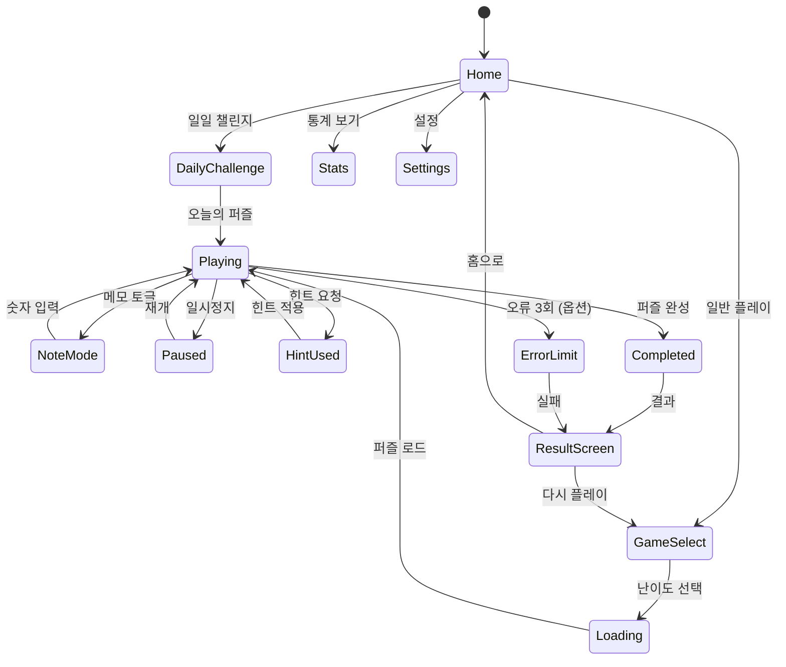

# Sudoku Master (스도쿠 마스터)

> **레퍼런스**: HungryStudio · 평점 4.8 · 장르: 스도쿠 · Rank #13
> **전략 포지션**: 깔끔한 미니멀 디자인 + 완성도 높은 UX로 스도쿠 장르 내 프리미엄 포지셔닝

---

## 개요

9×9 그리드에 1~9 숫자를 채워 넣는 클래식 스도쿠. 깔끔한 미니멀 디자인, 직관적인 숫자 입력, 강력한 메모 기능, 통계/소셜 기능으로 일반 스도쿠 앱과 차별화.

---

## #1 스도쿠 vs 스도쿠 마스터 — 차별점 분석

| 비교 항목 | #1 스도쿠 (일반) | 스도쿠 마스터 (#13) | 우리 전략 |
|-----------|-----------------|-------------------|-----------|
| 디자인 | 기능 위주, 정보 밀도 높음 | 미니멀, 화이트스페이스 강조 | 마스터 스타일 채택 |
| 숫자 입력 | 셀 선택 → 넘패드 | 숫자 먼저 선택 → 셀 채우기 (Fill-First) | 두 방식 모두 설정 지원 |
| 메모 기능 | 기본 메모 | 자동 메모 + 충돌 하이라이트 | 자동 메모 기본 제공 |
| 힌트 | 단순 정답 표시 | 논리적 풀이 단계 안내 | 단계별 힌트 채택 |
| 통계 | 없거나 단순 | 상세 플레이 분석 대시보드 | 통계 대시보드 필수 |
| 소셜 | 없음 | 일일 챌린지 + 글로벌 랭킹 | MVP에 일일 챌린지 포함 |
| 테마 | 단일 | 다크모드 + 컬러 테마 | 다크모드 기본, 테마 3종 |
| 수익화 | 광고 위주 | IAP + 광고 제거 | 광고 제거 IAP 우선 |

### 통합 전략 결론

**단일 스도쿠 앱으로 통합**을 권장:
- 마스터의 디자인 + UX 품질을 베이스로
- #1의 퍼즐 볼륨(대량 퍼즐 DB)을 흡수
- 두 앱의 강점 합산 → 시장에서 가장 완성도 높은 스도쿠 1개 출시
- 두 앱을 따로 운영하면 마케팅 비용 2배, 리뷰 분산 → 비효율

---

## 킬러 피처 (4.8 평점의 이유)

1. **Fill-First 입력 방식**: 숫자 선택 후 여러 셀에 연속 입력 → 속도감 UP
2. **자동 메모 모드**: 규칙 위반 없는 후보 숫자 자동 표시, 셀 입력 시 관련 메모 자동 삭제
3. **충돌 하이라이트**: 같은 행/열/박스 숫자 즉시 빨간색 표시
4. **논리 힌트**: "이 셀에는 X만 들어갈 수 있습니다 (같은 행의 Y 때문에)" 등 해설형 힌트
5. **일일 챌린지**: 전 세계 동일 퍼즐, 랭킹 비교 → 재방문율 핵심
6. **통계 대시보드**: 난이도별 평균 풀이 시간, 승률, 연속 클리어 스트릭

---

## 게임 규칙

### 기본 규칙
- 9×9 그리드 = 9개 3×3 박스
- 각 행, 열, 박스에 1~9가 정확히 한 번씩 등장
- 초기 주어진 숫자(Givens)는 변경 불가
- 빈 셀을 모두 올바르게 채우면 클리어

### 난이도 정의

| 난이도 | 빈 셀 수 | 필요 기법 | 목표 풀이 시간 |
|--------|----------|-----------|---------------|
| Easy | 36~40 | Naked Single | 5~10분 |
| Medium | 46~50 | Hidden Single, Naked Pair | 10~20분 |
| Hard | 52~56 | X-Wing, Swordfish | 20~40분 |
| Expert | 58~62 | 고급 논리 기법 복합 | 40분+ |
| Daily | 다양 | 매일 자동 생성 | 당일 도전 |

---

## 게임 플로우



---

## UI 레이아웃

### 게임 화면

```
┌─────────────────────────────┐
│  ← Back   ★★★☆  ⏸  ⏱12:34 │  ← 상단 HUD (난이도 별, 타이머)
├─────────────────────────────┤
│                             │
│  ┌───┬───┬───╦───┬───┬───╦─┐│
│  │ 5 │   │ 3 ║ 7 │   │   ║ ││
│  ├───┼───┼───╫───┼───┼───╫─┤│
│  │   │ 7 │   ║   │ 2 │   ║ ││  ← 9x9 그리드
│  ├───┼───┼───╫───┼───┼───╫─┤│    (선택 셀: 파란 배경)
│  │   │   │ 1 ║   │   │ 8 ║ ││    (같은 숫자: 연한 파란 배경)
│  ╠═══╪═══╪═══╬═══╪═══╪═══╬═╣│    (충돌: 빨간 배경)
│  │ ...                     ││
│  └─────────────────────────┘│
│                             │
├─────────────────────────────┤
│  [ 1 ][ 2 ][ 3 ][ 4 ][ 5 ] │
│  [ 6 ][ 7 ][ 8 ][ 9 ][ ✏️ ] │  ← 숫자 패드 + 메모 모드 토글
├─────────────────────────────┤
│  🗑 Erase  💡 Hint(3)  ↩ Undo│  ← 액션 바
└─────────────────────────────┘
```

### 숫자 입력 방식

**기본: Fill-First 모드**
1. 숫자 패드에서 숫자 선택 (숫자 버튼 활성화됨)
2. 빈 셀들을 탭하여 연속 입력
3. 다른 숫자 선택 시 전환

**대안: Cell-First 모드** (설정에서 전환 가능)
1. 셀 선택
2. 숫자 패드 탭

**메모 모드 (✏️ 토글)**
- 활성화 시 작은 숫자로 후보 메모 입력
- 자동 메모 옵션: 현재 상태 기반 가능한 숫자 자동 표시
- 숫자 입력 시 같은 행/열/박스의 메모 자동 삭제

---

## 통계 / 분석 시스템

### 수집 데이터
- 난이도별 총 플레이 횟수, 완료 횟수, 승률
- 난이도별 평균 풀이 시간, 최고 기록(Best Time)
- 현재 연속 클리어 스트릭(Streak), 최대 스트릭
- 힌트 사용 횟수 (힌트 없이 클리어 별도 표시)
- 오류 횟수, 일일 챌린지 참여율

### 통계 화면 레이아웃

```
┌─────────────────────────────┐
│        📊 내 통계            │
├─────────────────────────────┤
│  총 완료   연속 스트릭  최고기록│
│    142       🔥 7일     8:23  │
├─────────────────────────────┤
│  [Easy][Medium][Hard][Expert]│
│                             │
│  Easy 승률: ████████ 94%    │
│  평균 시간: 6분 42초         │
│  최고 기록: 3분 18초         │
│  총 플레이: 58회             │
└─────────────────────────────┘
```

---

## 소셜 기능

### 일일 챌린지 (Daily Challenge) — MVP 필수
- 매일 0시 전 세계 동일 퍼즐 1개 제공
- 클리어 시 랭킹 등록 (풀이 시간 기준)
- 오늘의 퍼즐은 공유 가능 ("오늘 일일 챌린지 8:45에 완료!")
- 연속 참여 스트릭 보상 (예: 7일 연속 → 테마 언락)

### 글로벌 랭킹 — Phase 2
- 난이도별 최고 기록 랭킹
- 주간 랭킹 (매주 리셋)
- 국가별 랭킹

### 친구 대결 — Phase 3
- 같은 퍼즐을 동시에 풀고 시간 비교
- 결과 공유 카드 (카카오, 인스타그램 등)

---

## 테마 시스템

### 기본 테마 (무료)
| 테마 | 배경 | 셀 색 | 하이라이트 |
|------|------|-------|-----------|
| Classic Light | 흰색 | 연회색 | 파란색 |
| Classic Dark | #1C1C1E | #2C2C2E | #0A84FF |
| Sepia | 크림색 | 베이지 | 주황색 |

### 프리미엄 테마 (IAP 또는 스트릭 보상)
- Midnight Ocean: 딥블루 계열
- Forest: 그린 계열
- Rose Gold: 핑크/골드 계열

### 적용 요소
- 그리드 배경 / 셀 색상
- 선택/하이라이트 색상
- 숫자 패드 스타일
- 폰트 (기본 / 손글씨 스타일)

---

## 수익화 전략

### IAP 구성

| 상품 | 가격 | 내용 |
|------|------|------|
| 광고 제거 | ₩3,900 (one-time) | 모든 광고 영구 제거 |
| 힌트 팩 (10개) | ₩1,200 | 논리 힌트 10회 |
| 힌트 팩 (50개) | ₩4,500 | 논리 힌트 50회 (25% 할인) |
| 프리미엄 퍼즐 팩 | ₩2,900/팩 | 고급 전문가 퍼즐 100개 |
| 프리미엄 테마 팩 | ₩1,900/테마 | 프리미엄 테마 언락 |
| All-in-One | ₩9,900 | 광고제거 + 힌트100 + 전테마 |

### 광고 배치
- 게임 완료 후 인터스티셜 (클리어 결과 화면 → 홈 이동 전)
- 힌트 소진 시 리워드 광고 (보고 힌트 1개 획득)
- 배너 광고 없음 (UX 저하 방지)

### 수익화 우선순위
1. 광고 제거 IAP (전환율 높음, 마찰 낮음)
2. 힌트 팩 (즉각적 필요성)
3. 프리미엄 퍼즐 팩 (헤비 유저 타겟)

---

## 스코어링 / 보상 시스템

| 이벤트 | 보상 |
|--------|------|
| 퍼즐 완료 (힌트 미사용) | ⭐⭐⭐ |
| 퍼즐 완료 (힌트 1~2회) | ⭐⭐ |
| 퍼즐 완료 (힌트 3회+) | ⭐ |
| 일일 챌린지 완료 | 스트릭 +1 |
| 7일 스트릭 | 프리미엄 테마 1개 무료 |
| 힌트 없이 Expert 완료 | 배지 "Grandmaster" |

---

## 사운드 / 이펙트

- 숫자 입력: 가벼운 탭 효과음
- 충돌 감지: 짧은 에러 진동
- 퍼즐 완료: 차임 + 파티클 이펙트
- 일일 챌린지 완료: 특별 팡파레
- 전체 음소거 설정 기본 지원

---

## MVP 범위

### Phase 1 — MVP (1주 목표)

**게임 코어 (lib)**
- [x] 기획서 작성
- [ ] 스도쿠 퍼즐 생성 알고리즘 (Easy/Medium/Hard)
- [ ] 유효성 검사 (행/열/박스 충돌 체크)
- [ ] 메모 모드 (수동)
- [ ] 힌트 시스템 (정답 셀 1개 공개)
- [ ] 타이머

**웹 빌드 (web)**
- [ ] 9×9 그리드 렌더링
- [ ] Fill-First 숫자 입력
- [ ] 충돌 하이라이트
- [ ] 숫자 패드 UI
- [ ] Classic Light / Dark 테마
- [ ] 완료 결과 화면

**RN 래핑 (rn)**
- [ ] WebView 래핑
- [ ] 광고 (인터스티셜)
- [ ] 광고 제거 IAP

### Phase 2 — 2주차

- [ ] Easy/Medium/Hard/Expert 4단계 난이도
- [ ] 자동 메모 모드
- [ ] 통계 대시보드
- [ ] 일일 챌린지
- [ ] 프리미엄 테마 3종
- [ ] 힌트 팩 IAP
- [ ] 오류 3회 실패 옵션

### Phase 3 — 이후

- [ ] 논리 힌트 (단계별 풀이 안내)
- [ ] 글로벌 랭킹
- [ ] 친구 대결
- [ ] 프리미엄 퍼즐 팩
- [ ] 결과 공유 카드

---

## 기술 구현 노트 (개발팀 참고)

- 퍼즐 생성: 완성된 보드 역추적 생성 → 난이도별 셀 제거 (Dancing Links 또는 backtracking)
- 퍼즐 DB: 로컬 번들 1000개 (앱 용량 최소화), 서버 동기화는 Phase 2
- 일일 챌린지: 날짜 시드 기반 결정론적 생성 (서버 불필요, Phase 1 구현 가능)
- 통계 저장: AsyncStorage (로컬), Phase 2에서 서버 동기화
- 테마: CSS 변수 기반 — 런타임 전환 지원
