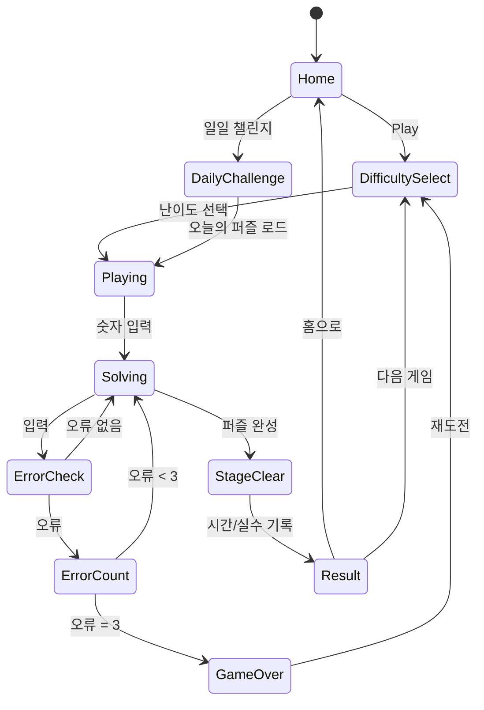

# 스도쿠 마스터 (Sudoku Master)

> 레퍼런스: #65 Malpa Games · 평점 4.8 · 장르: Sudoku

## 1. 레퍼런스 비교 분석

### 스도쿠 앱 레퍼런스 목록

| Ref# | 앱명 | 개발사 | 평점 | 특징 요약 |
|------|------|--------|------|-----------|
| #1 | Sudoku.com | Easybrain | 4.8 | 세계 1위 스도쿠, 일일 챌린지, 광고+IAP 혼합, 6난이도 |
| #13 | Microsoft Sudoku | Microsoft | 4.7 | 특수 모드(X-Sudoku, Color, 불규칙), 다크모드, 광고 없음 |
| #19 | Sudoku - Classic Puzzle | Finger Arts | 4.6 | 클린 UI, 통계 추적, 실수 제한 모드, 오프라인 완전 지원 |
| #21 | Sudoku Master | AI Factory | 4.5 | AI 힌트 시스템, 풀이 경로 해설, 초보자 학습 특화 |
| #49 | Sudoku Kingdom | Grand Cru | 4.6 | 소셜 순위표, 친구 대결, 일일 토너먼트 이벤트 |
| **#65** | **Sudoku Master** | **Malpa Games** | **4.8** | **다양한 레벨의 클래식 스도쿠, 깔끔한 UX** |

### 앱별 상세 비교

#### #1 Sudoku.com (Easybrain)
- **강점**: MAU 5,000만+, 매일 퍼즐 업데이트, 완성도 높은 힌트 시스템
- **약점**: 광고 과다, 유료 기능 페이월 너무 강함, UI 복잡
- **수익 구조**: 광고 + 구독($2.99/월) + 광고 제거($3.99)

#### #13 Microsoft Sudoku
- **강점**: 다양한 게임 모드(일반/X/컬러/불규칙), 광고 없음, 깔끔한 디자인
- **약점**: 난이도 커브 가파름, 초보자 접근성 낮음, 수익화 약함
- **수익 구조**: 기본 무료 (마이크로소프트 생태계 유지)

#### #19 Sudoku - Classic Puzzle
- **강점**: 매우 가벼운 앱(10MB 이하), 통계/기록 추적, 실수 카운터
- **약점**: 비주얼 단조로움, 소셜 기능 없음, 업데이트 드묾
- **수익 구조**: 광고 + 광고 제거 IAP($1.99)

#### #21 Sudoku Master (AI Factory)
- **강점**: AI 기반 힌트 — 다음 수 추천 + 이유 설명, 초보자 학습 최적화
- **약점**: UI 구식, 퍼즐 다양성 부족, 소셜 기능 없음
- **수익 구조**: 광고 + 힌트 IAP(30힌트 $0.99)

#### #49 Sudoku Kingdom
- **강점**: 친구 대결, 글로벌 순위표, 일일 토너먼트, 강한 리텐션
- **약점**: 소셜 기능 의존도 높아 신규 유저 진입 장벽 존재, 서버 비용
- **수익 구조**: 광고 + 소셜 아이템 IAP

---

## 2. Malpa Games (#65) 차별점 분석

Malpa 버전이 4.8점을 유지하는 핵심 요소:

1. **쾌적한 UX 흐름**: 불필요한 팝업 최소화, 게임 진입까지 탭 2회 이내
2. **메모 시스템 완성도**: 자동 메모 제거 (확정 숫자 입력 시 관련 메모 자동 소거)
3. **시각적 피드백**: 같은 숫자 하이라이트, 행/열/박스 자동 강조
4. **오류 표시 옵션**: 실수 즉시 표시(초보) vs 숨김(고수) 선택 가능
5. **무한 Undo**: 실수 없이 탐색 가능 → 스트레스 감소

---

## 3. 6개 스도쿠 앱 기능 비교 매트릭스

| 기능 | #1 | #13 | #19 | #21 | #49 | #65(Malpa) |
|------|----|----|-----|-----|-----|------------|
| 기본 9×9 스도쿠 | ✅ | ✅ | ✅ | ✅ | ✅ | ✅ |
| 난이도 (초/하/중/상/최상) | 6단계 | 5단계 | 4단계 | 4단계 | 4단계 | 5단계 |
| 메모(후보 숫자) | ✅ | ✅ | ✅ | ✅ | ✅ | ✅ 자동소거 |
| 자동 메모 소거 | ❌ | ✅ | ❌ | ✅ | ❌ | ✅ |
| 같은 숫자 하이라이트 | ✅ | ✅ | ✅ | ✅ | ✅ | ✅ |
| 오류 표시 선택 | ✅ | ❌ | ✅ | ✅ | ❌ | ✅ |
| 힌트 시스템 | 유료 | ✅ | 제한 | AI힌트 | 제한 | ✅ |
| AI 힌트 해설 | ❌ | ❌ | ❌ | ✅ | ❌ | ❌ |
| 일일 챌린지 | ✅ | ✅ | ✅ | ❌ | ✅ | ❌ |
| 타이머 | ✅ | ✅ | ✅ | ✅ | ✅ | ✅ |
| 실수 카운터 | ✅ | ❌ | ✅ | ✅ | ✅ | ✅ |
| 무한 Undo | ❌ | ✅ | ✅ | ✅ | ❌ | ✅ |
| 특수 모드 (X/Color) | ❌ | ✅ | ❌ | ❌ | ❌ | ❌ |
| 소셜/순위표 | ✅ | ❌ | ❌ | ❌ | ✅ | ❌ |
| 통계 추적 | ✅ | ✅ | ✅ | ✅ | ✅ | ✅ |
| 다크모드 | ✅ | ✅ | ✅ | ❌ | ✅ | ✅ |
| 광고 없는 버전 | IAP | 기본 | IAP | 기본 | IAP | IAP |
| 오프라인 완전 지원 | ✅ | ✅ | ✅ | ✅ | ❌ | ✅ |

---

## 4. 우리 스도쿠 최종 기획 (확정판)

### 컨셉
> "군더더기 없이 깔끔한 클래식 스도쿠. 초보부터 고수까지 모두 만족하는 완성도."

Malpa(#65) UX 쾌적함 + AI Factory(#21) 힌트 학습 + Easybrain(#1) 일일 챌린지 리텐션을 결합.

### 핵심 차별화 3가지
1. **스마트 메모** — 자동 소거 + 원터치 전체 메모 생성
2. **단계별 힌트** — "이 칸에 들어갈 수 있는 숫자 하이라이트" → "논리적 이유 설명" 2단계
3. **일일 챌린지** — 매일 새 퍼즐 + 완료 스트릭 → 리텐션 엔진

---

## 5. 게임 규칙

### 기본 규칙
- 9×9 그리드, 3×3 박스 9개
- 각 행·열·박스에 1~9 숫자가 정확히 한 번씩
- 초기 제공 숫자(단서)는 난이도에 따라 22~51개
- 오류 3회 누적 시 게임 오버 (설정에서 끄기 가능)

### 입력 방식
- 셀 선택 → 하단 숫자 패드에서 숫자 탭
- 메모 모드 토글 → 같은 방식으로 후보 숫자 입력
- 지우개: 셀 내용 삭제

---

## 6. 게임 플로우



---

## 7. UI 레이아웃

```
┌─────────────────────────────┐
│  ← Back    SUDOKU    ⚙️     │  ← 상단 바
├─────────────────────────────┤
│  ⏱ 00:00   ❌ 0/3   💡 3   │  ← 타이머 / 실수 / 힌트
├─────────────────────────────┤
│  ┌───┬───┬───┳───┬───┬───┳───┬───┬───┐ │
│  │ 5 │   │ 4 ║ 8 │   │   ║   │ 7 │   │ │
│  ├───┼───┼───╫───┼───┼───╫───┼───┼───┤ │
│  │   │ 9 │   ║   │ 3 │   ║ 6 │   │   │ │  ← 9×9 그리드
│  ├───┼───┼───╫───┼───┼───╫───┼───┼───┤ │    (3×3 박스 구분선)
│  │   │   │ 1 ║   │   │ 7 ║   │   │ 4 │ │
│  ┣━━━┿━━━┿━━━╋━━━┿━━━┿━━━╋━━━┿━━━┿━━━┫ │
│  │ ... (6 more rows) ...               │ │
│  └───┴───┴───┸───┴───┴───┸───┴───┴───┘ │
├─────────────────────────────┤
│  [✏️ 메모]   [↩️ Undo]  [🗑️] │  ← 도구 바
├─────────────────────────────┤
│  ┌───┬───┬───┬───┬───┐     │
│  │ 1 │ 2 │ 3 │ 4 │ 5 │     │  ← 숫자 패드
│  ├───┼───┼───┼───┼───┤     │
│  │ 6 │ 7 │ 8 │ 9 │   │     │
│  └───┴───┴───┴───┴───┘     │
└─────────────────────────────┘
```

### 하이라이트 규칙
- **선택된 셀**: 파란 배경
- **같은 행·열·박스**: 연한 파란 배경
- **같은 숫자**: 진한 파란 배경 (전체 보드)
- **오류 셀**: 빨간 배경
- **메모 숫자**: 작은 폰트, 회색

---

## 8. 난이도 설계

| 난이도 | 단서 수 | 빈 칸 수 | 타겟 유저 | 예상 풀이 시간 |
|--------|---------|---------|----------|---------------|
| 입문 (Beginner) | 50~51 | 30~31 | 스도쿠 처음 | 5~10분 |
| 쉬움 (Easy) | 40~49 | 32~41 | 가끔 플레이 | 10~20분 |
| 보통 (Medium) | 32~39 | 42~49 | 주 1~2회 플레이 | 20~35분 |
| 어려움 (Hard) | 27~31 | 50~54 | 매일 플레이 | 35~60분 |
| 전문가 (Expert) | 22~26 | 55~59 | 스도쿠 마니아 | 60분+ |

### 입문 모드 특별 처리
- 기본 힌트 자동 표시 (행/열/박스 후보 자동 계산)
- 오류 발생 시 즉시 빨간 표시
- 오류 카운터 없음 (무제한)

---

## 9. 기술 설계

### 아키텍처

```
lib/sudoku-master/
├── SudokuScene.ts        # Phaser.io 메인 씬
├── SudokuGrid.ts         # 9×9 그리드 렌더링 및 인터랙션
├── SudokuGenerator.ts    # 퍼즐 생성기
├── SudokuSolver.ts       # 퍼즐 풀이 검증기 (유일해 확인)
├── SudokuState.ts        # 게임 상태 관리
├── MemoSystem.ts         # 후보 숫자 메모 관리
├── HintSystem.ts         # 힌트 로직
└── types.ts              # 공통 타입 정의

web/sudoku-master/
├── App.tsx               # Phaser 컨테이너 + React UI
├── NumberPad.tsx         # 숫자 입력 패드
├── Toolbar.tsx           # 메모/Undo/지우개
└── HUD.tsx               # 타이머/실수/힌트 표시
```

### Phaser.io 그리드 구현

```typescript
// SudokuGrid.ts 핵심 구조
interface CellData {
  row: number;
  col: number;
  value: number;       // 0 = 빈 칸
  isGiven: boolean;    // 초기 단서 여부 (수정 불가)
  isError: boolean;
  memos: Set<number>;  // 후보 숫자 메모
}

class SudokuGrid extends Phaser.GameObjects.Container {
  private cells: CellData[][];
  private selectedCell: { row: number; col: number } | null;

  selectCell(row: number, col: number): void;
  inputNumber(num: number): void;
  toggleMemo(num: number): void;
  highlightRelated(row: number, col: number): void; // 행/열/박스 하이라이트
  highlightSameNumber(num: number): void;
}
```

### 메모 시스템

```typescript
class MemoSystem {
  // 숫자 확정 입력 시 관련 메모 자동 소거
  autoEraseMemos(grid: CellData[][], row: number, col: number, value: number): void {
    // 같은 행의 해당 숫자 메모 소거
    // 같은 열의 해당 숫자 메모 소거
    // 같은 3×3 박스의 해당 숫자 메모 소거
  }

  // 원터치 전체 메모 자동 생성
  generateAllMemos(grid: CellData[][]): void {
    // 각 빈 칸에 들어갈 수 있는 숫자 계산 후 메모 설정
  }
}
```

---

## 10. 퍼즐 생성기 알고리즘

### 생성 파이프라인

```
1. 완성 보드 생성 (Backtracking + 랜덤 시드)
   └─ 빈 보드에서 백트래킹으로 유효한 완성 보드 생성
   └─ 숫자 순서를 랜덤 셔플하여 다양성 확보

2. 단서 제거 (난이도별 목표 단서 수까지)
   └─ 대칭 제거 (상하좌우 대칭으로 미적 완성도)
   └─ 제거 후 유일해 검증 (SudokuSolver 실행)
   └─ 유일해 불만족 시 해당 셀 복원 후 다른 셀 시도

3. 난이도 검증
   └─ 입문: Naked Single만으로 풀림
   └─ 쉬움: Hidden Single 기법 필요
   └─ 보통: Naked/Hidden Pair 필요
   └─ 어려움: X-Wing, Swordfish 기법 필요
   └─ 전문가: 추측(분기) 필요
```

### 유일해 검증 (SudokuSolver)

```typescript
class SudokuSolver {
  // DLX(Dancing Links) 알고리즘 기반 정확한 해 검증
  countSolutions(board: number[][]): number; // 0, 1, 2+ 반환

  // 난이도 분류 (풀이 기법 분석)
  classifyDifficulty(board: number[][]): Difficulty;

  // 힌트 생성 (다음에 놓을 수 있는 논리적 근거 반환)
  getHint(board: number[][]): HintResult;
}

interface HintResult {
  row: number;
  col: number;
  value: number;
  technique: string;  // "Naked Single", "Hidden Single", etc.
  explanation: string; // 한국어 설명
}
```

### 일일 챌린지 퍼즐
- 날짜를 시드(seed)로 사용 → 전 세계 유저 동일 퍼즐
- 5개 난이도 × 365일 = 1,825개 사전 생성하여 번들
- 번들 크기: 퍼즐 1개 ≈ 81바이트 → 1,825개 ≈ 150KB (무시할 수준)

---

## 11. 스코어링 / 통계 시스템

### 게임 내 점수
| 요소 | 계산 |
|------|------|
| 기본 클리어 | 1000점 |
| 시간 보너스 | max(0, 3600 - 경과초) × 1 |
| 힌트 패널티 | 힌트 사용 1회당 -100점 |
| 오류 패널티 | 오류 1회당 -200점 |

### 통계 추적 (로컬 저장)
- 난이도별 완료 횟수
- 최고 기록 / 평균 시간
- 연속 완료 스트릭 (일일 챌린지)
- 정확도 (오류 없이 완료 비율)

---

## 12. 수익화 설계

### 광고 모델 (기본)
| 광고 유형 | 노출 시점 | 예상 eCPM |
|-----------|-----------|-----------|
| 배너 광고 | 퍼즐 선택 화면 하단 | $0.3~0.5 |
| 전면 광고 | 게임 클리어 후 (3번에 1회) | $3~8 |
| 보상형 광고 | 힌트 추가 획득 시 | $8~20 |

### IAP 구조
| 상품 | 가격 | 내용 |
|------|------|------|
| 광고 제거 | $2.99 (1회) | 배너/전면 광고 완전 제거 |
| 힌트 팩 소 | $0.99 | 힌트 30개 |
| 힌트 팩 중 | $1.99 | 힌트 80개 |
| 힌트 팩 대 | $3.99 | 힌트 200개 |
| 프리미엄 번들 | $4.99 | 광고 제거 + 힌트 100개 |

### 수익 시뮬레이션 (보수적 추정)
- DAU 10,000 기준
- 광고 수익: ~$80/일 ($2,400/월)
- IAP 전환율 2%: 200명 × $2.50 평균 = $500/월
- **월 예상 수익: ~$3,000** (초기 마케팅 전)

---

## 13. 사운드 / 이펙트

| 이벤트 | 사운드 | 시각 이펙트 |
|--------|--------|-------------|
| 숫자 입력 | 톡 (단타) | 셀 brief 강조 |
| 오류 입력 | 에러 톤 | 셀 빨간 진동 |
| 행/열/박스 완성 | 경쾌한 단음 | 라인 골드 플래시 |
| 퍼즐 클리어 | 축하 팡파레 | 컨페티 이펙트 |
| 힌트 사용 | 워프 사운드 | 힌트 셀 글로우 |
| 게임 오버 | 실패 톤 | 화면 흔들림 |

---

## 14. MVP 범위

### Phase 1 — MVP (1주 개발 목표)
- [x] 기획서 작성
- [ ] 퍼즐 생성기 (`SudokuGenerator` + `SudokuSolver`)
- [ ] 9×9 그리드 렌더링 (Phaser.io)
- [ ] 숫자 입력 + 검증
- [ ] 메모 시스템 (수동 입력)
- [ ] 기본 하이라이트 (선택 셀/행·열·박스/같은 숫자)
- [ ] 5난이도 × 10퍼즐 = 50개 퍼즐 번들
- [ ] 타이머 + 실수 카운터
- [ ] Undo 기능
- [ ] 클리어 / 게임 오버 판정

### Phase 2 (추가 1주)
- [ ] 일일 챌린지 (날짜 시드 기반)
- [ ] 자동 메모 소거 + 원터치 전체 메모
- [ ] 2단계 힌트 시스템
- [ ] 통계 추적 (로컬 스토리지)
- [ ] 보상형 광고 연동 (힌트 광고 시청)
- [ ] 다크모드
- [ ] 배너/전면 광고 연동

### Phase 3 (선택)
- [ ] 소셜 순위표
- [ ] 더 많은 퍼즐 번들 (500개+)
- [ ] 특수 모드 (대각선 스도쿠)
- [ ] 구독 모델

---

## 15. 결론: found3 이후 #2 게임 채택 여부

### 채택 근거 (찬성)

| 항목 | 평가 |
|------|------|
| 시장 수요 | ✅ 최강 — 스도쿠는 전 세계 퍼즐 앱 1위 장르 |
| 구현 난이도 | ✅ 낮음 — 알고리즘 복잡하지만 레퍼런스 풍부 |
| 개발 기간 | ✅ 1~2주 MVP 충분히 가능 |
| 수익 안정성 | ✅ 광고+IAP 혼합으로 DAU 대비 수익 예측 용이 |
| 리텐션 | ✅ 일일 챌린지로 강한 재방문 유도 가능 |
| ASO (앱스토어 최적화) | ✅ "sudoku" 키워드 높은 검색량 |
| found3 파이프라인 재사용 | ✅ Phaser.io + React + RN WebView 동일 구조 |

### 리스크 (반대)

| 항목 | 평가 |
|------|------|
| 경쟁 강도 | ⚠️ Easybrain 등 대형 스튜디오 독점 구간 존재 |
| 차별화 어려움 | ⚠️ 클래식 스도쿠는 모든 기능이 이미 구현됨 |
| CPI 예상 | ⚠️ 퍼즐 장르 CPI $0.8~1.5로 캐주얼 대비 높음 |

### 최종 판단: **✅ #2 게임으로 확정 권고**

> 스도쿠는 검증된 수익 모델, 낮은 구현 난이도, found3과 동일한 기술 파이프라인 재사용이 가능해 파산 위기 상황에서 가장 빠른 수익화 경로다. Malpa Games의 4.8점 앱이 증명하듯, 클래식 스도쿠라도 UX와 완성도로 충분히 경쟁 가능하다.
>
> **추천 순서: found3 → sudoku-master → (데이터 보고 3번째 결정)**
