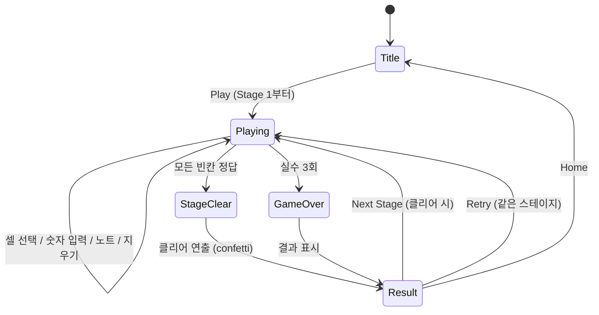

# Sudoku

> 클래식 스도쿠 — 9×9 그리드에 1~9 숫자를 규칙에 맞게 채우는 논리 퍼즐

## 개요

9×9 격자의 빈칸에 숫자를 채워 넣는다. 각 행, 열, 3×3 박스에 1부터 9까지 숫자가 한 번씩만 등장해야 한다. 주어진 단서(given)를 바탕으로 논리적으로 추론하여 모든 빈칸을 채우면 클리어. 실수 3회 시 게임 오버.

## 게임 규칙

### 기본 규칙
- 9×9 격자, 3×3 박스 9개로 구분
- 각 행에 1~9가 한 번��
- 각 열에 1~9가 한 번씩
- 각 3×3 박스에 1~9가 한 번씩
- 초기 단서(given)는 수정 불가
- 모든 퍼즐은 **유일해(unique solution)**가 보장됨

### 숫자 입력
- 빈 셀 탭 → 셀 선택 (하이라이트)
- NumberPad에서 숫자 탭 → 선택된 셀에 배치
- 정답이면 파란색, 오답이면 빨간색 + shake 애니메이션
- 오답 입력 시 실수 카운트 +1

### ��수 제한
- 최대 3회 오답 허용
- 3회 초과 시 게임 오버
- HUD에 빨간 도트(●●●)로 시각화

### 노트 모드 (메모)
- Notes 버튼 토글로 활성화
- 노트 모드에서 숫자 탭 → 셀에 메모로 기록 (pencil marks)
- 셀당 여러 숫자 메모 가능 (3×3 ���태 표시)
- 정답 배치 시 관련 행/열/박스의 노트에서 해당 숫자 자동 제거

### 보조 기능
- **Erase**: 잘못 입력한 셀 지우기 (given 제외)
- **Hint**: 빈 셀 하나를 자동으로 정답 공개 (given으로 잠김)
- **Restart**: 현재 스테이지 처음부터 다시

## 게임 플로우



## UI 레이아웃

```
┌─────────────────────────────┐
│ Stage 3  ●●○  ⏱ 2:35       │  ← HUD (스테이지, 실수 도트, 타이머)
│ Medium                       │     (난이도 라벨)
├─────────────────────────────┤
│ ┌───┬───┬───┬───┬───┬───┐  │
│ │ 5 │   │ 3 │   │ 7 │   │  │
│ ├───┼───┼───┼───┼───┼───┤  │
│ │   │[4]│   │ 1 │   │ 6 │  │  ← 9×9 보드 (Phaser)
│ ├───┼───┼───┼───┼───┼───┤  ��    [4] = 선택된 셀
│ │ 8 │   │   │   │ 2 │   │  │    굵은 선 = 3×3 박스 경계
│ └───┴───┴───┴───┴───┴───┘  │
├─────────────────────────────┤
│ [1][2][3][4][5][6][7][8][9] │  ← NumberPad (숫자 + 잔여 카운트)
│  ✏Erase  📝Notes  💡Hint   │  ← 액션 버튼
└─────────────────────────────┘
```

- HUD: React 컴포넌트 (Stitches)
- 보드: Phaser 캔버스 (ADR-002 준수)
- NumberPad + 액션: React 컴포넌트
- 결과 화면: React ClearScreen (Phaser 오버레이 사용 금지)

### 셀 하이라이트
- 선택 셀: 파란 배경
- 같은 숫자 셀: 연보라 배경
- 같은 행/열/박스 셀: 연파란 배경
- 오답 셀: 빨간 배경

## 스코어링 시스템

| Factor | 계산 |
|--------|------|
| 채운 셀 | 정답 셀 수 × 10 |
| 난이도 보너스 | × 배율 (Easy 1.0, Medium 1.5, Hard 2.0, Expert 3.0) |
| 시간 보너스 | max(0, 1000 − 경과초) |
| 실수 페널티 | − 실수 수 × 100 |

## 난이도 설계

| Level | 빈칸 수 | 전체 대비 | 비고 |
|-------|---------|----------|------|
| Easy | 35 | 43% | 초보자, 논리만으로 풀이 |
| Medium | 45 | 56% | 일반, 중급 테크닉 필요 |
| Hard | 52 | 64% | 상급, 노트 활용 필수 |
| Expert | 58 | 72% | 최상급, 고급 추론 필요 |

> 모든 퍼즐은 unique solution이 보장됨 (생성 시 `countSolutions` 체크)

## 스테이지 시스템

| Stage | 난이도 |
|-------|--------|
| 1~2 | Easy |
| 3~4 | Medium |
| 5 | Hard |
| 6+ | Hard / Expert 교대 |

- 타이틀에서 Play → Stage 1부터 순차 진행
- 클리어 시 Next Stage로 자동 난이도 상승
- 각 스테이지는 새 퍼즐 생성

## 인터랙션 상세

| 입력 | 동작 | 조건 |
|------|------|------|
| 셀 탭 | 셀 선택 (하이라이트) | 아무 ��이나 |
| 선택된 셀 재탭 | 선택 해제 | — |
| NumberPad 숫자 탭 | 숫자 배치 또는 노트 추가 | 셀 선택 + not given |
| Erase 탭 | 셀 내용 삭제 | 셀 선택 + not given |
| Notes 토글 | 노트 모드 on/off | — |
| Hint 탭 | 빈 셀 하나 자동 공개 | 빈 셀 존재 시 |
| Restart 탭 | 스테이지 재시작 | — |

## 햅틱 이벤트

| 시점 | 이벤트명 | 패턴 |
|------|----------|------|
| 셀 선택 | `cell-selected` | Heavy × 1 |
| 숫자 배치 (정답) | `number-placed` | Heavy × 1 |
| 숫자 배치 (오답) | `mistake-made` | Heavy × 3 |
| 스테이지 클리어 | `game-clear` | Heavy × 6 (60ms 간격) |

## MVP 범위

### Phase 1 (MVP) — PR #182
- [x] 기획서 작성
- [ ] 9×9 보드 렌더링 + 셀 선택
- [ ] 퍼즐 생성 (unique solution 보장)
- [ ] NumberPad 숫자 입력
- [ ] 노트 모드 (메모)
- [ ] 실수 카운터 (3회 제한)
- [ ] 힌트 / 지우기
- [ ] HUD (스테이지, 난이도, 실수 도트, 타이머)
- [ ] 결과 화면 (React ClearScreen)
- [ ] 스테이지 진행 시스템
- [ ] 숫자 잔여 카운트 (NumberPad)
- [ ] 햅틱 이벤트 연동
- [ ] RN 카탈로그 등록

### Phase 2 (후속)
- [ ] 난이도 직접 선택 UI (타이틀에서)
- [ ] 이모지(✏️📝💡🔄) → SVG/PNG 아이콘 전환
- [ ] 3D 입체 버튼 스타일링
- [ ] 타이머 표시 비강조화
- [ ] 난이도별 베스트 타임/스코어 기록
- [ ] Undo 기능 (마지막 입력 취소)
