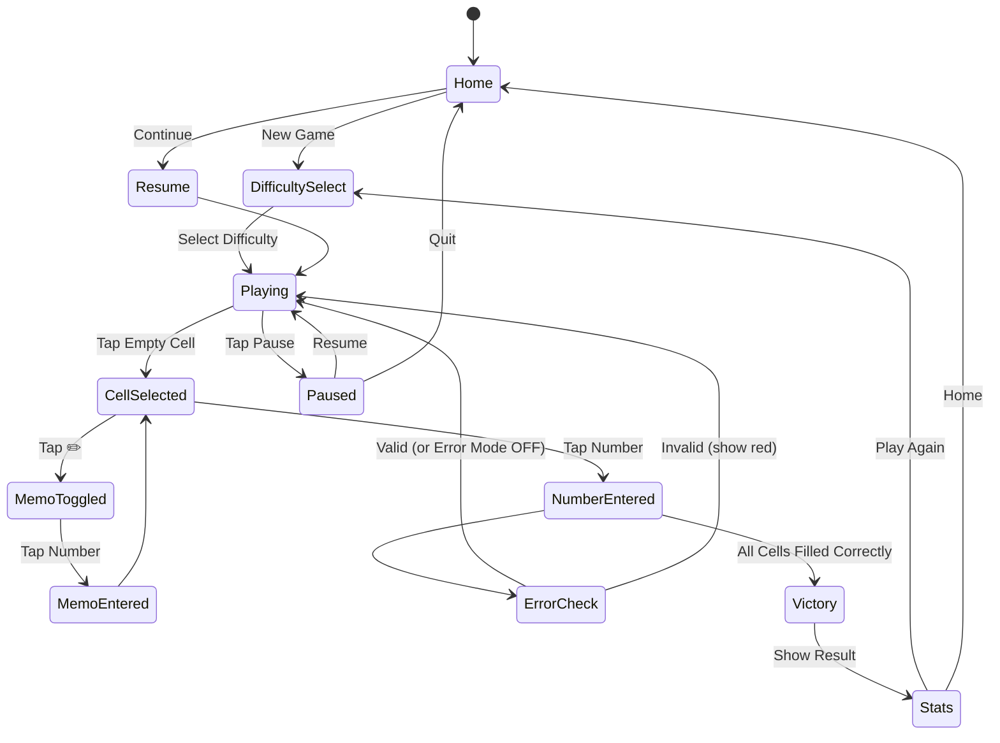

# 스도쿠 (Sudoku)

> 레퍼런스: Oakever Games (#21, 4.8★) + #1/#13/#19 종합 설계

## 개요

9×9 그리드에 1~9 숫자를 채워 모든 행·열·3×3 박스에 중복 없이 완성하는 클래식 로직 퍼즐.
단순한 규칙, 무한한 퍼즐 — 전 세계 검증된 하이퍼캐주얼 퍼즐 장르.

---

## 레퍼런스 분석

### Oakever Games (#21, 4.8★) — 고평점의 비결

| 요소 | 특징 |
|------|------|
| **입력 방식** | 셀 먼저 선택 → 숫자 패드 탭 (단방향 단순 플로우) |
| **하이라이트** | 선택된 행·열·박스 전체 배경색 표시, 같은 숫자 전체 강조 |
| **오류 피드백** | 충돌 숫자 즉시 빨간색 표시 (선택적 설정) |
| **연필 메모** | 작은 후보 숫자 6개까지 셀에 표기, 실제 숫자 입력 시 자동 제거 |
| **자동 제거** | 숫자 확정 시 동일 행·열·박스의 메모에서 해당 숫자 자동 삭제 |
| **접근성** | 큰 숫자 폰트, 고대비 색상, 명확한 박스 구분선 |
| **통계** | 완료 시간, 실수 횟수, 힌트 사용 횟수 기록 |

### 레퍼런스 #1, #13, #19 비교 분석

| 기능 | #1 | #13 | #19 | #21(Oakever) | 우리 채택 |
|------|-----|-----|-----|--------------|-----------|
| 입력 방식 | 셀→숫자 | 숫자→셀 | 셀→숫자 | 셀→숫자 | **셀→숫자** |
| 메모 모드 | 별도 토글 | 롱프레스 | 별도 토글 | 별도 토글 | **별도 토글** |
| 오류 표시 | 선택적 | 즉시 | 없음 | 선택적 | **선택적** |
| 힌트 | 유료 | 3회 무료 | 무제한(광고) | 3회 무료 | **3회 무료 + 광고** |
| 테마 | 2종 | 1종 | 다수 | 라이트/다크 | **라이트/다크** |
| 타이머 | 카운트업 | 카운트업 | 없음 | 카운트업 | **카운트업** |

---

## 게임 규칙

### 기본 규칙
- 9×9 그리드 (81개 셀)
- 9개의 3×3 박스로 구분
- 빈 셀에 1~9 숫자를 채움
- **제약 조건**: 모든 행, 모든 열, 모든 3×3 박스에 1~9가 각 1번씩만 등장
- 초기 배치된 숫자(단서, Clue)는 변경 불가
- 모든 셀을 올바르게 채우면 클리어

### 승리 조건
81개 셀 전부 채워졌고, 행·열·박스 제약을 모두 만족

---

## 퍼즐 생성기 설계

### 알고리즘: Backtracking + Constraint Propagation

```
1. 빈 9×9 그리드에서 시작
2. 백트래킹으로 완전한 해답(Solution) 생성
3. 해답에서 단서(Clue) 개수만큼 셀을 남기고 나머지를 제거
4. 유일해(Unique Solution) 검증: 제거 후 해가 1개인지 확인
   - 해가 여러 개면 마지막 제거를 취소하고 다른 셀 시도
5. 난이도별 목표 단서 수에 도달하면 퍼즐 완성
```

### 난이도 설계

| 난이도 | 단서 수 | 필요 기법 | 목표 사용자 |
|--------|---------|-----------|------------|
| **입문** (Easy) | 46~51개 | Naked Single만 | 처음 해보는 유저 |
| **보통** (Normal) | 36~45개 | Hidden Single 포함 | 일반 캐주얼 |
| **어려움** (Hard) | 27~35개 | Naked Pair, X-Wing | 숙련 유저 |
| **전문가** (Expert) | 22~26개 | 고급 기법 전체 | 코어 팬 |

> MVP에서는 입문/보통/어려움 3단계만 구현

### 퍼즐 캐싱 전략
- 앱 번들에 각 난이도 50개 퍼즐 사전 생성 포함
- 런타임 생성: 백그라운드에서 추가 생성 후 캐시
- 동일 퍼즐 재출제 방지: 완료된 퍼즐 ID 로컬 저장

---

## 입력 UX 설계

### 채택 방식: 셀 선택 → 숫자 패드

```
흐름: 빈 셀 탭 → 셀 하이라이트 → 숫자 패드 표시 → 숫자 탭 → 셀에 입력
```

**채택 이유:**
- 모바일 엄지 타이핑에 자연스러운 단방향 흐름
- 숫자 먼저 방식 대비 인지 부하 낮음 (내가 어디 넣을지 보면서 선택)
- Oakever 4.8★ 등 고평점 앱 대다수 채택

**숫자 패드 레이아웃:**
```
┌───┬───┬───┐
│ 1 │ 2 │ 3 │
├───┼───┼───┤
│ 4 │ 5 │ 6 │
├───┼───┼───┤
│ 7 │ 8 │ 9 │
├───┴───┴───┤
│  ✏️  │  ✕  │  ← 메모 모드 토글 / 삭제
└───────────┘
```

### 입력 상태 정의

| 상태 | 설명 |
|------|------|
| 미선택 | 기본 상태 |
| 셀 선택됨 | 행·열·박스 하이라이트, 숫자 패드 활성 |
| 메모 모드 | ✏️ 토글 ON, 숫자 탭 시 후보 숫자로 기록 |
| 단서 셀 탭 | 하이라이트만 (편집 불가) |

---

## 시각적 피드백 시스템

### 하이라이트 레이어 (우선순위 순)

| 우선순위 | 트리거 | 색상 |
|----------|--------|------|
| 1 (최고) | 선택된 셀 자체 | 진한 파란색 배경 |
| 2 | 선택된 셀과 같은 숫자 | 중간 파란색 배경 |
| 3 | 같은 행·열·박스 | 연한 파란색 배경 |
| 4 | 오류 셀 (충돌) | 빨간색 배경 |
| 0 | 기본 | 흰색/다크 배경 |

### 박스 구분선
- 3×3 박스 경계: **굵은 선 (2px)**
- 개별 셀 경계: 얇은 선 (0.5px)
- 색상: 라이트 모드 #333, 다크 모드 #aaa

### 숫자 스타일

| 종류 | 폰트 크기 | 색상 |
|------|-----------|------|
| 단서 (고정) | 크게 (22px) | 진한 검정 / 흰색 |
| 플레이어 입력 | 크게 (22px) | 파란색 |
| 메모 숫자 | 작게 (8px), 3×3 배치 | 회색 |
| 오류 숫자 | 크게 (22px) | 빨간색 |

### 완료 애니메이션
- 마지막 숫자 입력 → 전체 셀 순차적 플래시 (좌→우, 상→하)
- 완료 모달: 시간, 실수 횟수, 별점(3성 기준) + 공유 버튼

---

## 연필 메모 (Pencil Notes) UX

### 기능 설명
빈 셀에 들어갈 수 있는 후보 숫자를 작게 기록하는 기능.

### 셀 내 메모 배치 (3×3 미니 그리드)
```
┌─────┐
│1  2  3│
│4  5  6│
│7  8  9│
└─────┘
```
- 1번 위치에 `1`, 5번 위치에 `5` 등 고정 위치 표기

### 자동 메모 제거 (핵심 편의 기능)
숫자 확정 시 → 동일 행·열·박스의 모든 셀 메모에서 해당 숫자 자동 제거

예시: Row 3, Col 5에 `7`을 확정하면
- Row 3의 모든 셀 메모에서 `7` 제거
- Col 5의 모든 셀 메모에서 `7` 제거
- 해당 3×3 박스의 모든 셀 메모에서 `7` 제거

### 자동 메모 채우기 (힌트 기능)
- 설정에서 "자동 메모" 활성 시: 현재 빈 셀에 가능한 후보 숫자 전체 자동 기입
- 초보자 학습용 옵션

---

## 게임 플로우



---

## UI 레이아웃

### 메인 게임 화면
```
┌─────────────────────────┐
│  ← 뒤로   스도쿠  ⚙️ 설정│  ← 헤더
├─────────────────────────┤
│  ⏱ 00:00    실수: 0/3   │  ← 타이머 + 실수 카운터
├─────────────────────────┤
│  ┌──┬──┬──╔══╦══╦══╗   │
│  │  │  │  ║  ║  ║  ║   │
│  ├──┼──┼──╫──╫──╫──╢   │
│  │  │  │  ║  ║  ║  ║   │
│  ├──┼──┼──╫──╫──╫──╢   │
│  │  │  │  ║  ║  ║  ║   │
│  ╠══╬══╬══╬══╬══╬══╣   │
│  ║  ║  ║  ║  ║  ║  ║   │  ← 9×9 그리드
│  ╠══╬══╬══╬══╬══╬══╣   │
│  ║  ║  ║  ║  ║  ║  ║   │
│  ╠══╬══╬══╬══╬══╬══╣   │
│  ║  ║  ║  ║  ║  ║  ║   │
│  ╚══╩══╩══╩══╩══╩══╝   │
├─────────────────────────┤
│   ↩️ Undo    ✏️ Note    │  ← 도구
├─────────────────────────┤
│  ┌─┐ ┌─┐ ┌─┐ ┌─┐ ┌─┐  │
│  │1│ │2│ │3│ │4│ │5│  │
│  └─┘ └─┘ └─┘ └─┘ └─┘  │  ← 숫자 패드
│  ┌─┐ ┌─┐ ┌─┐ ┌─┐ ┌─┐  │
│  │6│ │7│ │8│ │9│ │✕│  │
│  └─┘ └─┘ └─┘ └─┘ └─┘  │
└─────────────────────────┘
```

### 완료 횟수별 숫자 패드 비활성화
- 이미 9개 모두 채워진 숫자는 패드에서 흐리게 표시 (비활성)

---

## 스코어링 시스템

| 항목 | 기준 |
|------|------|
| 별점 3개 | 실수 0회, 힌트 0회 |
| 별점 2개 | 실수 1~2회 또는 힌트 1회 |
| 별점 1개 | 완료 |
| 최고 기록 | 난이도별 최단 완료 시간 |

### 실수 카운터
- 설정에서 "오류 강조" OFF 시 실수 카운터도 비활성
- 3회 초과 시 게임 오버 옵션 (설정으로 조절)

---

## 설정 옵션

| 옵션 | 기본값 | 설명 |
|------|--------|------|
| 오류 강조 | ON | 잘못된 숫자 빨간 표시 |
| 같은 숫자 강조 | ON | 동일 숫자 하이라이트 |
| 자동 메모 제거 | ON | 확정 숫자의 후보 자동 삭제 |
| 타이머 표시 | ON | 게임 시간 표시 |
| 테마 | Light | Light / Dark |

---

## 힌트 시스템

| 힌트 종류 | 설명 | 비용 |
|-----------|------|------|
| 셀 공개 | 선택한 셀의 정답 공개 | 광고 시청 1회 |
| 오류 체크 | 현재 입력된 오류 셀 모두 강조 | 광고 시청 1회 |

- 기본 무료 힌트 3회 제공
- 이후 광고 시청으로 추가 획득

---

## 사운드/이펙트

| 이벤트 | 사운드 | 이펙트 |
|--------|--------|--------|
| 셀 선택 | 낮은 탁 | 하이라이트 즉시 |
| 숫자 입력 | 중간 탁 | 숫자 스케일 애니메이션 |
| 오류 | 낮은 버즈 | 빨간 플래시 |
| 메모 입력 | 소프트 탁 | - |
| 완료 | 팡파레 | 셀 순차 플래시 |

---

## MVP 범위

### Phase 1 (MVP — 1주)
- [x] 기획서 작성
- [ ] 9×9 그리드 렌더링 (Phaser or DOM)
- [ ] 퍼즐 로드 (번들된 퍼즐 20개)
- [ ] 셀 선택 + 숫자 패드 입력
- [ ] 오류 강조 (즉시 빨간색)
- [ ] 게임 클리어 판정 + 완료 모달
- [ ] 기본 하이라이트 (같은 행·열·박스)
- [ ] Undo 기능
- [ ] 난이도 3단계 (Easy/Normal/Hard)

### Phase 2 (1주차 이후)
- [ ] 연필 메모 + 자동 제거
- [ ] 타이머 + 실수 카운터
- [ ] 라이트/다크 테마
- [ ] 힌트 시스템 (광고 연동)
- [ ] 통계 화면 (최고 기록, 완료 수)
- [ ] 퍼즐 런타임 생성 캐시

### 제외 (오버엔지니어링)
- 온라인 리더보드
- 멀티플레이
- 커스텀 테마 스토어
