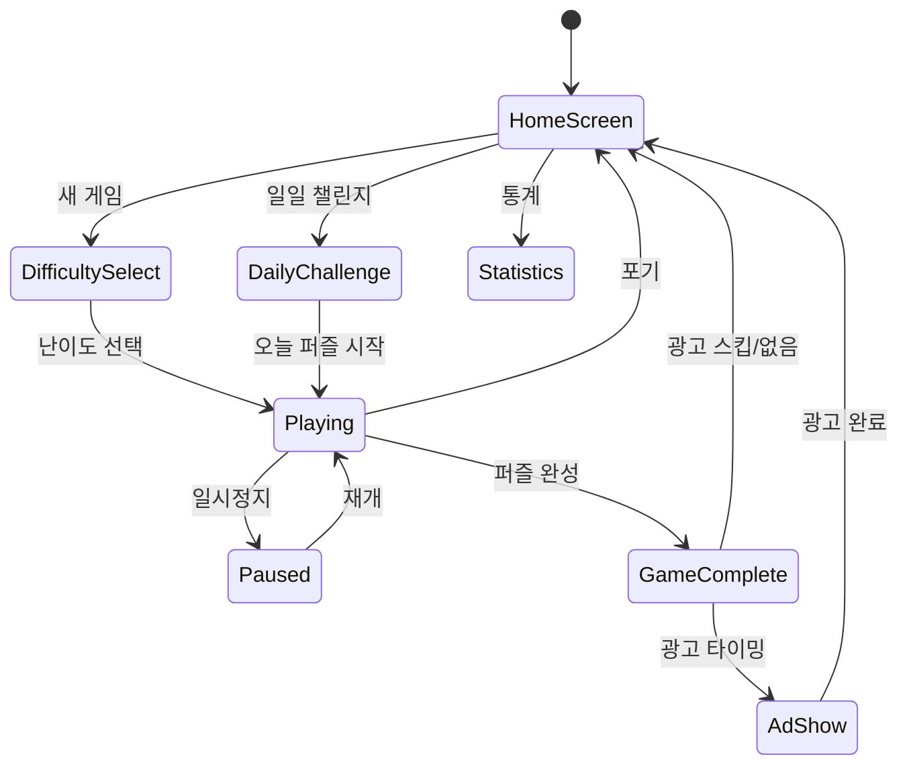

# Sudoku - 두뇌 훈련용 퍼즐 게임

> **레퍼런스**: Easybrain Sudoku (#19), #1, #13 통합 분석 기반
> **목표**: MVP 1주 개발, 즉시 수익화 가능한 스도쿠 앱

## 개요

9×9 그리드에 1~9 숫자를 겹치지 않게 채우는 클래식 로직 퍼즐.
**두뇌 훈련** 포지셔닝으로 전 연령대 공략. 광고 기반 무료 + 힌트/테마 IAP.

---

## 1. Easybrain 대중성 분석 (UX/온보딩)

### 왜 4.7점인가 - 핵심 요인

| 요인 | 내용 |
|------|------|
| **즉시 플레이** | 설치 → 첫 퍼즐까지 3탭 이하. 회원가입 불필요 |
| **Easy 첫 진입** | 첫 게임은 항상 Easy로 강제, 성공 경험 보장 |
| **숫자 자동 하이라이트** | 같은 숫자 자동 강조, 인지 부하 최소화 |
| **에러 즉각 표시** | 실수 시 빨간색 표시 → 좌절감 전환을 학습 경험으로 |
| **진행률 시각화** | 남은 숫자 카운터 → 완성 욕구 자극 |
| **무한 퍼즐** | 매일 새 퍼즐 공급 → 장기 리텐션 |

### 온보딩 플로우

```
앱 실행
  → Easy 퍼즐 자동 시작 (튜토리얼 스킵 가능)
  → 첫 셀 선택 시 힌트 툴팁 표시 (딱 1회)
  → 성공 시 축하 애니메이션 + 다음 퍼즐 유도
  → 3판 후 일일 챌린지 배너 노출
```

### MVP 온보딩 구현 범위

- Easy 퍼즐 자동 시작 ✅
- 선택한 숫자/행/열/박스 하이라이트 ✅
- 에러 표시 (선택사항 ON/OFF) ✅

---

## 2. 난이도 세분화

### 난이도별 빈칸 수 및 요구 기법

| 난이도 | 빈칸 수 | 필요 기법 | 평균 풀이 시간 |
|--------|---------|-----------|---------------|
| **Easy** | 36~46개 | Naked Single (단일 후보) | 5~10분 |
| **Medium** | 46~52개 | Hidden Single, Naked Pair | 10~20분 |
| **Hard** | 52~58개 | Pointing Pair, Box-Line Reduction | 20~40분 |
| **Expert** | 58~64개 | X-Wing, Swordfish, Forcing Chain | 40분+ |

### 기법 설명 (힌트 시스템 연동용)

| 기법 | 설명 |
|------|------|
| **Naked Single** | 한 셀에 들어갈 수 있는 숫자가 1개뿐 |
| **Hidden Single** | 특정 행/열/박스에서 특정 숫자가 들어갈 셀이 1개뿐 |
| **Naked Pair** | 두 셀이 동일한 2개 후보만 가질 때, 같은 그룹의 다른 셀에서 제거 |
| **Pointing Pair** | 박스 내 특정 후보가 한 행/열에만 있으면 해당 행/열의 박스 외부에서 제거 |
| **X-Wing** | 두 행에서 특정 숫자가 동일한 두 열에만 있을 때 크로스 제거 |

### 퍼즐 생성 전략

- 사전 생성 퍼즐 풀 방식 (백엔드 없이 앱 내 번들)
- Easy: 200개, Medium: 150개, Hard: 100개, Expert: 50개
- 총 500개 번들 → 오프라인 완전 지원
- 모두 소진 시 Knuth's Algorithm X 기반 런타임 생성

---

## 3. 도움 기능

### 3-1. 자동 메모 (Auto Notes)

- 게임 시작 시 또는 버튼 탭으로 활성화
- 현재 빈 셀에 들어갈 수 있는 숫자를 3×3 미니 그리드로 자동 표시
- 숫자 입력 시 관련 셀의 메모 자동 업데이트

```
┌───────┐
│1 . 3  │
│4 5 .  │
│7 . 9  │
└───────┘
  (예: 후보 2,6,8)
```

### 3-2. 오류 표시 (Error Highlight)

- **레벨 1 (기본)**: 즉시 오류 표시 (빨간색), Easy 추천
- **레벨 2**: 오류 미표시, 완성 시에만 체크, Hard/Expert 추천
- 설정에서 사용자가 선택 가능

### 3-3. 힌트 (Hint)

- 1회 사용 시 가장 쉽게 풀 수 있는 셀 1개 강조
- 2회 연속 사용 시 해당 셀의 정답 숫자 자동 입력
- 하루 3회 무료, 이후 광고 시청 또는 IAP

### 3-4. 스마트 노트 (Smart Notes)

- 수동 메모 모드: 셀에 여러 숫자 후보를 직접 기입
- 노트 충돌 시 자동 취소선 표시
- 자동/수동 노트 동시 지원

---

## 4. 통계 대시보드

### 트래킹 항목

| 지표 | 설명 |
|------|------|
| **총 게임 수** | 완료한 퍼즐 총 수 |
| **승률** | 완료 / 시작 비율 |
| **연속 완료** | 현재 스트릭 (🔥) |
| **최장 스트릭** | 역대 최고 연속 완료 수 |
| **난이도별 평균 시간** | Easy/Medium/Hard/Expert 각각 |
| **최단 기록** | 난이도별 베스트 타임 |
| **힌트 사용 횟수** | 총 힌트 사용 수 |
| **완벽한 게임** | 힌트 없이 오류 없이 완료한 수 |

### UI 레이아웃

```
┌─────────────────────────┐
│      📊 나의 통계        │
├─────────────────────────┤
│  총 완료   승률   스트릭 │
│   1,234   87%    🔥 14  │
├─────────────────────────┤
│  난이도별 평균 시간      │
│  Easy    │ 07:32        │
│  Medium  │ 18:45        │
│  Hard    │ 35:12        │
│  Expert  │ 01:12:30     │
├─────────────────────────┤
│  이번 주 활동 (7일 캘린더) │
│  [✓][✓][✓][  ][✓][✓][✓] │
└─────────────────────────┘
```

### MVP 최소 구현

- AsyncStorage로 로컬 저장
- 총 게임 수, 승률, 연속 스트릭, 난이도별 평균 시간

---

## 5. 일일 챌린지 (Daily Challenge)

### 구조

- 매일 오전 0시 새 퍼즐 1개 공개 (날짜 기반 시드로 생성)
- 전 세계 동일한 퍼즐 → 소셜 공유 ("오늘 하드 6분 32초에 풀었어!")
- 완료 시 뱃지/스탬프 획득

### 연속 플레이 동기부여

| 조건 | 보상 |
|------|------|
| 3일 연속 | 힌트 3개 무료 |
| 7일 연속 | 테마 1개 무료 잠금해제 |
| 30일 연속 | 광고 제거 3일 쿠폰 |
| 100일 연속 | 레전드 뱃지 + 영구 테마 |

### 달력 뷰

- 월별 달력으로 클리어한 날 표시
- 난이도별 색상 구분 (쉬움=초록, 어려움=빨강)

### MVP 구현

- 날짜 기반 시드 → 동일 퍼즐 생성 (네트워크 불필요)
- 7일 달력 스트릭 표시
- 연속 3일/7일 힌트 보상

---

## 6. 오프라인 구조

### 완전 오프라인 설계 원칙

- 퍼즐 데이터: 앱 번들에 포함 (JSON 500개, ~200KB)
- 진행 상태: AsyncStorage (로컬)
- 통계: AsyncStorage (로컬)
- 일일 챌린지: 날짜 시드 기반 런타임 생성 (서버 불필요)
- 광고: 오프라인 시 광고 없음 → 자동으로 프리미엄 경험 제공

### 데이터 구조

```typescript
// 번들 퍼즐 형식
interface Puzzle {
  id: string;
  difficulty: 'easy' | 'medium' | 'hard' | 'expert';
  given: number[]; // 81개, 0=빈칸
  solution: number[]; // 81개
}

// 진행 상태
interface GameState {
  puzzleId: string;
  board: number[];
  notes: number[][];
  elapsedSeconds: number;
  hintsUsed: number;
  errors: number;
  startedAt: string;
}
```

---

## 7. 수익화 전략

### 수익 모델

| 모델 | 설명 | 예상 기여도 |
|------|------|------------|
| **인터스티셜 광고** | 게임 완료 후 (3판에 1번) | 40% |
| **배너 광고** | 메인 메뉴/통계 화면 | 15% |
| **보상형 광고** | 힌트 추가 획득 시 | 20% |
| **광고 제거 IAP** | ₩4,900/월 또는 ₩24,900/영구 | 15% |
| **힌트 팩 IAP** | 힌트 10개 ₩1,200 / 30개 ₩2,900 | 5% |
| **테마 팩 IAP** | 다크/파스텔/클래식 등 ₩1,200/개 | 5% |

### IAP 목록

| 상품 | 가격 | 내용 |
|------|------|------|
| Hint Pack S | ₩1,200 | 힌트 10개 |
| Hint Pack L | ₩2,900 | 힌트 30개 |
| Dark Theme | ₩1,200 | 다크 모드 테마 |
| Pastel Theme | ₩1,200 | 파스텔 색상 테마 |
| No Ads (Monthly) | ₩4,900 | 월간 광고 제거 |
| No Ads (Lifetime) | ₩24,900 | 영구 광고 제거 |
| Premium Bundle | ₩9,900 | 광고 제거 + 모든 테마 + 힌트 50개 |

### 광고 노출 규칙

- 게임 완료 후: 3판마다 인터스티셜 1회
- 힌트 무료 소진 후: 보상형 광고 (선택)
- 일일 챌린지 완료 후: 없음 (경험 보호)

---

## 8. 3개 레퍼런스 통합 전략

### 레퍼런스 비교

| 기능 | #1 (1위 앱) | #13 (중위권) | #19 Easybrain |
|------|-------------|-------------|---------------|
| 온보딩 | 강제 튜토리얼 | 스킵 가능 | 즉시 플레이 ✅ |
| 난이도 | 4단계 | 3단계 | 4단계 ✅ |
| 자동 메모 | ✅ 있음 | ❌ 없음 | ✅ 있음 |
| 스마트 힌트 | ✅ 단계적 | ❌ 정답만 | ✅ 단계적 |
| 일일 챌린지 | ✅ 있음 | ❌ 없음 | ✅ 있음 |
| 통계 | ✅ 상세 | ⚠️ 기본 | ✅ 상세 |
| 오프라인 | ✅ 완전 | ✅ 완전 | ✅ 완전 |
| 테마 | ✅ 10+ | ⚠️ 3개 | ✅ 8개 |
| UI 청결도 | ⚠️ 광고 많음 | ✅ 깔끔 | ✅ 균형 ✅ |

### 우리 앱 차별화 전략

**채택할 것 (각 레퍼런스 베스트)**

1. **온보딩**: Easybrain의 "즉시 플레이" + 1회 툴팁
2. **힌트 시스템**: #1의 단계적 힌트 (강조→입력 2단계)
3. **일일 챌린지**: Easybrain의 뱃지 + #1의 소셜 공유
4. **UI**: #13의 깔끔한 레이아웃 + Easybrain의 균형잡힌 광고

**버릴 것**
- #1의 강제 튜토리얼 (이탈률 증가)
- #13의 광고 부재 (수익성 없음)
- 과도한 게임화 (레벨업, 배틀패스 등)

**우리만의 포인트**
- 한국어 최적화 UI
- 다크모드 기본 제공 (MZ 세대 대응)
- 오프라인 일일 챌린지 (경쟁사 대부분 서버 필요)

---

## 게임 플로우 (상태 머신)



---

## UI 레이아웃

```
┌─────────────────────────┐
│  ☰  Hard    ⏸  12:34   │  ← 상단 HUD (메뉴/난이도/일시정지/타이머)
├─────────────────────────┤
│  ┌───┬───┬───┳───┬───┬───┳───┬───┬───┐ │
│  │ 5 │ 3 │   ║   │ 7 │   ║   │   │   │ │
│  ├───┼───┼───╫───┼───┼───╫───┼───┼───┤ │
│  │ 6 │   │   ║ 1 │ 9 │ 5 ║   │   │   │ │  ← 9×9 그리드
│  ├───┼───┼───╫───┼───┼───╫───┼───┼───┤ │
│  │   │ 9 │ 8 ║   │   │   ║   │ 6 │   │ │
│  ┣━━━┿━━━┿━━━╋━━━┿━━━┿━━━╋━━━┿━━━┿━━━┫ │
│  ...                        ... │
│  └───┴───┴───┸───┴───┴───┸───┴───┴───┘ │
├─────────────────────────┤
│  남은 숫자: 1✕3 2✕4 ...  │  ← 숫자 카운터
├─────────────────────────┤
│  [1][2][3][4][5][6][7][8][9]  │  ← 숫자 패드
│  [✏️ 메모] [↩ 실행취소] [💡 힌트] │  ← 도구
└─────────────────────────┘
```

---

## 스코어링 시스템

| 조건 | 점수 |
|------|------|
| 퍼즐 완성 | 기본 1,000점 |
| 힌트 없이 완성 | +500점 (Perfect Bonus) |
| 오류 0회 | +300점 |
| 시간 보너스 | 목표시간 대비 남은 시간 × 10 |

---

## MVP 범위 (1주 개발 목표)

### Phase 1 - MVP (Week 1)

- [ ] 9×9 그리드 렌더링 + 숫자 입력
- [ ] 퍼즐 생성 (사전 번들 50개: Easy 20, Medium 15, Hard 10, Expert 5)
- [ ] 정답 검증 + 완성 판정
- [ ] 선택 셀 하이라이트 (행/열/박스/같은숫자)
- [ ] 오류 표시 (빨간색)
- [ ] 타이머
- [ ] 실행취소 (마지막 입력 취소)
- [ ] 수동 메모 모드
- [ ] 기본 통계 (완료 수, 평균 시간)
- [ ] 배너 광고 + 완료 후 인터스티셜

### Phase 2 (Week 2)

- [ ] 자동 메모 (Auto Notes)
- [ ] 단계적 힌트 시스템
- [ ] 일일 챌린지 + 스트릭
- [ ] 통계 대시보드 (상세)
- [ ] 보상형 광고 (힌트)
- [ ] 다크 테마

### Phase 3 (이후)

- [ ] IAP (광고 제거, 테마, 힌트 팩)
- [ ] 추가 테마 팩
- [ ] 퍼즐 런타임 생성 (500개 소진 후)
- [ ] 소셜 공유 기능
