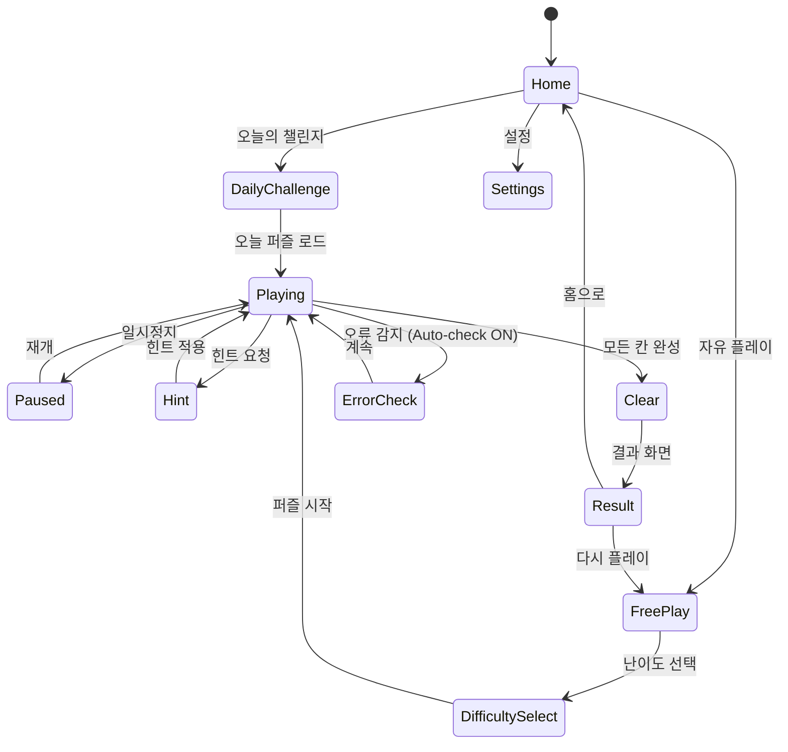

# 스도쿠 (Sudoku)

> **레퍼런스**: #1 / #13 / #19 / #21 / #49(Guru Puzzle Game, 4.9★)
> **장르**: 두뇌 게임 / 숫자 퍼즐
> **목표**: 5개 최상위 스도쿠 앱의 장점만 모은 궁극의 스도쿠 MVP

---

## 1. Guru 스도쿠가 4.9인 이유 — 차별점 분석

### 왜 모든 스도쿠 앱 중 최고 평점인가?

| 요소 | 일반 스도쿠 앱 | Guru Puzzle Game |
|------|---------------|-----------------|
| 입력 UX | 숫자 패드 표준 | **원터치 숫자 선택 → 셀 탭** (역방향 입력 지원) |
| 메모 시스템 | 수동 메모 | **자동 메모 제거** (숫자 확정 시 연관 메모 자동 삭제) |
| 오류 표시 | 없음 또는 엄격 | **선택적 오류 하이라이트** (초보자 모드 on/off) |
| 힌트 품질 | 단순 답 제공 | **논리적 설명 힌트** ("이 셀은 X밖에 올 수 없습니다") |
| 퍼즐 생성 | 고정 DB | **무한 생성** + 유일해 보장 알고리즘 |
| 접근성 | 단일 테마 | **다크모드 + 고대비 + 큰 숫자 모드** |
| 피드백 | 클리어 팝업 | **단계별 칭찬 + 시간/정확도 기록** |

**핵심 결론**: Guru가 4.9인 이유는 **숙련자와 초보자 모두를 배려한 양방향 UX** 때문이다. 어렵지 않고, 그렇다고 너무 쉽지도 않은 진입 장벽 조절이 탁월하다.

---

## 2. 5개 레퍼런스 종합 분석

### #1 — Sudoku.com (Easybrain) — 압도적 1위 설치수
**강점**
- 스트릭(연속 플레이) 시스템 → 일일 습관화
- 무광고 타이머 모드
- 6단계 난이도 (Easy → Expert → Master → Grandmaster)
- 기록 통계 대시보드 (베스트 타임, 정확도, 총 해결 수)

**약점**
- 광고 과다 (무료 버전)
- 힌트가 답을 그냥 줌 (학습 효과 없음)

### #13 — Microsoft Sudoku
**강점**
- **X-Sudoku, Color Sudoku** 등 변형 모드
- 일일 챌린지 + 주간 토너먼트
- Xbox 업적 연동

**약점**
- 무겁고 Microsoft 계정 의존성

### #19 — Sudoku - Number Puzzle (MobilityWare)
**강점**
- **Auto-check 실시간 오류** (잘못 입력하면 즉시 빨간색)
- **메모 자동완성** (채워진 숫자 기준 가능한 메모 자동 입력)
- 매우 깔끔한 UI

**약점**
- 소셜/커뮤니티 기능 전무
- 난이도 점프가 심함

### #21 — Sudoku ∞ (AI 생성)
**강점**
- AI 기반 무한 퍼즐 생성
- **난이도 커스텀** (특정 테크닉만 사용 설정 가능)
- 솔버 내장 (학습용)

**약점**
- UI가 구식, 애니메이션 없음

### #49 — Guru Puzzle Game (4.9★)
**강점** (위 섹션 참고)
- 역방향 입력 지원
- 자동 메모 제거
- 논리적 힌트
- 최고의 UX 완성도

**약점**
- 소셜/커뮤니티 기능 약함
- 변형 모드 없음

---

## 3. 우리 스도쿠 최종 결정 — 궁극의 MVP 설계

### 핵심 철학
> **"가장 스트레스 없는 스도쿠"**
> 막히면 힌트, 틀리면 부드러운 교정. 완주율 극대화 → 리텐션 → 수익화.

### 5개 앱에서 가져올 것

| 기능 | 출처 |
|------|------|
| 스트릭 + 일일 퍼즐 | #1 Sudoku.com |
| 일일 챌린지 토너먼트 | #13 Microsoft Sudoku |
| Auto-check + 메모 자동완성 | #19 MobilityWare |
| 논리적 힌트 시스템 | #49 Guru |
| 역방향 입력 (숫자 선택 → 셀 탭) | #49 Guru |
| 자동 메모 제거 | #49 Guru |
| 다크모드 / 고대비 테마 | #49 Guru |
| 6단계 난이도 | #1 Sudoku.com |

### MVP에서 제외할 것 (1~2주 제약)
- 변형 모드 (X-Sudoku, Color Sudoku) → Phase 2
- Xbox/소셜 랭킹 → Phase 2
- AI 커스텀 난이도 → Phase 2

---

## 4. 게임 개요

9×9 그리드를 1~9 숫자로 채우는 클래식 논리 퍼즐.
각 행, 열, 3×3 박스에 1~9가 한 번씩만 등장해야 한다.

---

## 5. 게임 규칙

### 기본 규칙
- 9×9 그리드 (81칸)
- 각 **행(Row)** 에 1~9 한 번씩
- 각 **열(Column)** 에 1~9 한 번씩
- 각 **3×3 박스** 에 1~9 한 번씩
- 초기에 일부 숫자가 주어짐 (단서 수에 따라 난이도 결정)
- 모든 빈칸을 규칙에 맞게 채우면 클리어

### 입력 방식 (듀얼 모드)
- **셀 우선**: 셀 선택 → 숫자 패드 탭
- **숫자 우선**: 숫자 선택 → 셀 탭 (Guru 방식, 같은 숫자 연속 입력 시 효율적)
- 두 방식 동시 지원, 유저가 자연스럽게 선택

### 메모(Pencil Mark) 시스템
- 메모 모드 토글 버튼으로 전환
- **자동 메모**: 빈칸에 가능한 숫자를 자동 계산해 표시 (옵션)
- **자동 메모 제거**: 숫자 확정 시 같은 행/열/박스의 연관 메모 자동 삭제

### 오류 처리
- **Auto-check 모드** (기본 ON): 규칙 위반 시 해당 셀 빨간색 하이라이트
- **Classic 모드** (옵션 OFF): 오류 표시 없음, 완주 후 체크

### 하이라이트 시스템
- 셀 선택 시: **같은 숫자 전체 하이라이트** (같은 숫자 위치 파악 용이)
- 셀 선택 시: **같은 행/열/박스 연한 배경** (영향 범위 시각화)

---

## 6. 힌트 시스템

### 3단계 힌트 (논리적 설명 방식)
| 단계 | 내용 | 소모 |
|------|------|------|
| Hint 1 | "이 셀에 들어갈 수 있는 숫자를 강조합니다" | 힌트 1개 |
| Hint 2 | "이 셀은 [숫자]밖에 올 수 없습니다. 이유: [행/열/박스] 제약" | 힌트 1개 |
| Hint 3 | 해당 셀 자동 입력 | 힌트 1개 |

힌트는 일정 개수 무료 제공, 이후 광고 시청 또는 구매로 충전.

---

## 7. 게임 플로우



---

## 8. UI 레이아웃

```
┌─────────────────────────┐
│  ◀  Daily Challenge  ⚙  │  ← 상단 바 (뒤로/타이틀/설정)
├─────────────────────────┤
│  ⏱ 04:32   ❌ 0/3      │  ← 타이머 / 오류 횟수
├─────────────────────────┤
│  ┌───┬───┬───╠═══╦═══╗  │
│  │   │ 5 │   ║ 3 ║   ║  │
│  ├───┼───┼───╠───╬───╣  │  ← 9×9 그리드
│  │ 7 │   │ 2 ║   ║ 8 ║  │    (3×3 박스 굵은 선)
│  ├───┼───┼───╠───╬───╣  │
│  │   │ 1 │   ║   ║ 4 ║  │
│  ╠═══╬═══╬═══╬═══╬═══╣  │
│  ...                     │
│  └───────────────────────┘
├─────────────────────────┤
│  [✏] [↩] [💡] [🗑]     │  ← 툴바: 메모/실행취소/힌트/지우기
├─────────────────────────┤
│  ┌─┐ ┌─┐ ┌─┐ ┌─┐ ┌─┐  │
│  │1│ │2│ │3│ │4│ │5│  │  ← 숫자 패드 (1~9)
│  └─┘ └─┘ └─┘ └─┘ └─┘  │    숫자 아래 남은 개수 표시
│  ┌─┐ ┌─┐ ┌─┐ ┌─┐      │
│  │6│ │7│ │8│ │9│      │
│  └─┘ └─┘ └─┘ └─┘      │
└─────────────────────────┘
```

### 숫자 패드 디테일
- 각 숫자 아래 작은 숫자로 **"남은 개수"** 표시 (예: 3 아래 "×2")
- 9개 다 채워진 숫자는 **회색 처리** (더 이상 입력 불필요)

---

## 9. 홈 화면

```
┌─────────────────────────┐
│       🧩 SUDOKU          │
├─────────────────────────┤
│  🔥 7일 연속 플레이!     │  ← 스트릭 배너
├─────────────────────────┤
│  ┌─────────────────────┐ │
│  │  📅 오늘의 챌린지    │ │  ← Daily Challenge 카드
│  │  Medium · 남은 시간  │ │
│  │    [지금 도전하기]   │ │
│  └─────────────────────┘ │
├─────────────────────────┤
│  난이도 선택             │
│  [쉬움] [보통] [어려움] │
│  [전문가] [고수] [마스터]│
├─────────────────────────┤
│  📊 내 기록              │
│  총 완료: 142   베스트: 3:24 │
└─────────────────────────┘
```

---

## 10. 스코어링 / 통계 시스템

| 지표 | 내용 |
|------|------|
| 완료 시간 | 퍼즐 시작~완료까지 경과 시간 |
| 오류 횟수 | Auto-check 위반 횟수 (최대 3회 허용 옵션) |
| 힌트 사용 | 0회면 "No Hints" 배지 |
| 난이도별 베스트 기록 | 각 난이도별 최단 시간 |
| 총 완료 수 | 누적 클리어 퍼즐 수 |
| 연속 플레이 스트릭 | 매일 1개 이상 완료 시 스트릭 유지 |

### 평가 등급 (클리어 화면)
| 등급 | 조건 |
|------|------|
| ⭐⭐⭐ | 오류 0, 힌트 0 |
| ⭐⭐ | 오류 0~1, 힌트 0~1 |
| ⭐ | 나머지 |

---

## 11. 난이도 설계

| 난이도 | 단서 수 | 필요 기법 | 예상 시간 |
|--------|---------|-----------|-----------|
| Easy (쉬움) | 46~50개 | Naked Single만 | 3~5분 |
| Medium (보통) | 36~45개 | Hidden Single | 5~10분 |
| Hard (어려움) | 27~35개 | Naked/Hidden Pair | 10~20분 |
| Expert (전문가) | 22~26개 | X-Wing, Swordfish | 20~40분 |
| Master (고수) | 17~21개 | 고급 기법 | 40분+ |
| Grandmaster (마스터) | ≤17개 | 최고급 기법 | 무제한 |

> **퍼즐 생성**: 백트래킹 알고리즘으로 유일해(Unique Solution) 보장. 무한 생성.

---

## 12. 일일 챌린지 시스템

- 매일 자정(KST) 새 퍼즐 오픈
- 전 세계 동일 퍼즐 (같은 시드)
- 완료 시: 시간/오류/힌트 기록 저장
- Phase 2: 랭킹 시스템 연동

---

## 13. 사운드 / 이펙트

| 이벤트 | 효과 |
|--------|------|
| 숫자 입력 | 부드러운 클릭음 |
| 오류 감지 | 짧은 에러 진동 + 빨간 플래시 |
| 셀 완성 | 미묘한 팡 효과음 |
| 행/열/박스 완성 | 밝은 차임 효과음 |
| 퍼즐 클리어 | 축하 애니메이션 + 클리어 음악 |
| 힌트 사용 | 빛 반짝임 이펙트 |

---

## 14. 비주얼 / 테마

### 기본 테마: 미니멀 화이트
- 배경: 순백 (#FFFFFF)
- 그리드: 연한 회색 선, 박스 경계 진한 선
- 선택 셀: 파란색 (#4A90E2) 배경
- 같은 숫자 하이라이트: 연한 파란색
- 오류 셀: 빨간색 (#E74C3C)

### 다크 테마 (기본 제공)
- 배경: #1A1A2E
- 그리드: #16213E
- 강조색: #0F3460 → #E94560

### Phase 2 추가 테마
- 우드 테마, 오션 테마, 세피아 테마

---

## 15. 수익화 전략

### 스도쿠 특화 수익 모델

| 모델 | 내용 | 예상 기여도 |
|------|------|-------------|
| **광고 (주력)** | 퍼즐 완료 후 인터스티셜 (스킵 가능) | ★★★★★ |
| 힌트 광고 | 힌트 소진 시 광고 시청 = 힌트 3개 충전 | ★★★★ |
| **프리미엄 구독** | 월 $2.99 — 광고 제거 + 무제한 힌트 + 테마 | ★★★★ |
| 힌트 팩 인앱결제 | 힌트 10개 $0.99 / 50개 $2.99 | ★★★ |
| 테마 팩 | 테마 3종 $1.99 | ★★ |

### 광고 전략 (스도쿠 특화)
- **퍼즐 완료 후**: 유저가 성취감을 느낀 직후 → 광고 거부감 최소
- **일시정지 화면**: 자발적 중단 상태 → 광고 자연스럽게 삽입
- **힌트 요청**: 유저가 도움을 원하는 순간 → 보상형 광고로 전환
- **절대 금지**: 플레이 중 팝업, 강제 인터럽트

### 스트릭 프리미엄 전환 퍼널
```
Day 1~3: 무료 체험 (광고 있지만 관대)
Day 4~7: 힌트 소진 → 광고 시청 or 구매 유도
Day 7+: 스트릭 유지 욕구 → 구독 전환
```

---

## 16. 우선순위 판단 — found3 다음 두 번째 게임인가?

### 스도쿠 우선순위 평가

| 기준 | 평가 | 점수 |
|------|------|------|
| 시장 규모 | 스도쿠는 퍼즐 앱 최대 장르. 전 세계 수억 유저 | ★★★★★ |
| 구현 난이도 | 퍼즐 생성 알고리즘 복잡하나 검증된 오픈소스 존재 | ★★★★ |
| 개발 기간 | MVP 1주 가능 (알고리즘 라이브러리 활용 시) | ★★★★ |
| 광고 수익 | 세션 길고, 일일 방문율 높아 광고 효율 최고 수준 | ★★★★★ |
| 경쟁 강도 | 상위 앱들이 강하나, UX 차별화로 틈새 공략 가능 | ★★★ |
| 리텐션 | 일일 챌린지 + 스트릭으로 DAU 유지 최적 구조 | ★★★★★ |

### 결론: **YES — found3 다음 두 번째 게임으로 강력 추천**

**이유**:
1. **광고 수익 최적화**: 세션 시간(평균 15~30분), 일일 재방문율이 캐주얼 게임 중 최고 수준. 광고 CPM 극대화.
2. **빠른 MVP 가능**: 스도쿠 생성 알고리즘은 오픈소스(`@sajad-sadra/sudoku-generator` 등)로 검증됨. 핵심 UI 구현에 집중 가능.
3. **리텐션 구조 내장**: 일일 챌린지 + 스트릭이 자연스럽게 D30 리텐션 만들어냄. 별도 게임경제 설계 불필요.
4. **글로벌 시장**: 언어 장벽 없음. 숫자 게임은 전 세계 동일 규칙.

---

## 17. MVP 범위

### Phase 1 — MVP (1주 목표)
- [ ] 기획서 작성
- [ ] 스도쿠 퍼즐 생성 알고리즘 (유일해 보장)
- [ ] 9×9 그리드 렌더링 + 셀 선택
- [ ] 숫자 입력 (정방향 + 역방향)
- [ ] Auto-check 오류 하이라이트
- [ ] 같은 숫자/행/열/박스 하이라이트
- [ ] 힌트 3개 (기본 제공)
- [ ] 클리어 판정 + 결과 화면
- [ ] 타이머
- [ ] 3단계 난이도 (Easy/Medium/Hard)
- [ ] 다크모드

### Phase 2 (출시 후 데이터 보고 결정)
- [ ] 일일 챌린지
- [ ] 스트릭 시스템
- [ ] 메모 자동완성
- [ ] 전문가/고수/마스터 난이도
- [ ] 통계 대시보드
- [ ] 추가 테마
- [ ] 랭킹/리더보드
- [ ] 광고 인터그레이션
- [ ] 인앱 구매 (힌트 팩, 프리미엄)
