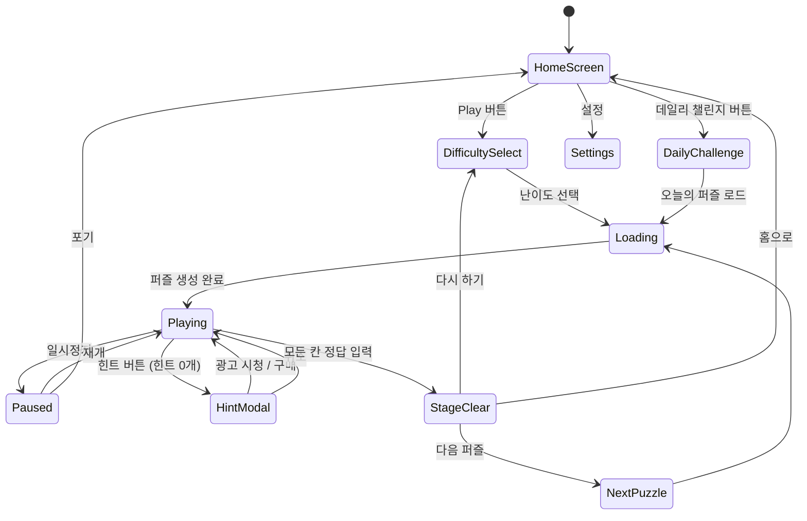

# 스도쿠 (Sudoku)

> 7일간 1위 유지한 클래식 스도쿠 로직 게임.
> 전 세계 가장 검증된 퍼즐 장르 — 빠른 구현, 강력한 리텐션.

## 개요

9×9 그리드에 1~9 숫자를 채워 넣는 클래식 로직 퍼즐. 각 행, 열, 3×3 박스에 1~9가 정확히 한 번씩 들어가야 한다. 난이도별 퍼즐을 제공하고, 힌트/메모 시스템으로 퍼즐 입문자부터 전문가까지 커버한다.

---

## 게임 규칙

### 기본 규칙

- **9×9 그리드** (81칸), 3×3 박스 9개로 구성
- **제약 조건**: 각 행(Row) · 열(Column) · 3×3 박스에 1~9 숫자가 **정확히 한 번**씩 등장
- **고정 숫자(Clue)**: 게임 시작 시 미리 채워진 숫자 — 수정 불가
- **입력 숫자(Answer)**: 플레이어가 채워넣는 숫자 — 수정 가능
- **정답 조건**: 81칸 모두 채워지고 모든 제약 조건 충족

### 숫자 입력 방식

#### 탭(Tap) 방식 (기본)
1. 빈 셀 탭 → 셀 선택(하이라이트)
2. 하단 숫자 패드(1~9 + 지우기)에서 숫자 탭
3. 셀에 숫자 입력

#### 메모(Note) 모드
1. 메모 모드 토글 ON
2. 셀 탭 → 숫자 패드에서 후보 숫자 복수 입력
3. 셀 내 소자(小字)로 후보 표시

### 충돌 하이라이트

- 같은 행/열/박스에 동일 숫자 입력 시 **빨간색** 표시
- 오류 표시 설정 ON/OFF 가능 (Hard 모드 이상에서는 기본 OFF)

---

## 퍼즐 생성 알고리즘

### 생성 파이프라인

```
1. 완성된 9×9 해답 생성 (백트래킹 + 랜덤 시드)
2. 난이도별 빈칸 수만큼 숫자 제거
3. 유일 해(Unique Solution) 검증 (역방향 백트래킹)
4. 풀이 기법 분석 → 실제 난이도 분류
5. 난이도 기준 미달 시 2번으로 돌아가 재시도
```

### 난이도 체계

| 난이도 | 공개 숫자(Clue) | 빈칸 수 | 필요 풀이 기법 | 평균 소요 시간 |
|--------|----------------|---------|---------------|--------------|
| **Easy** | 36~45개 | 36~45개 | Naked Single만 | 3~8분 |
| **Medium** | 27~35개 | 46~54개 | Hidden Single 포함 | 10~20분 |
| **Hard** | 20~26개 | 55~61개 | Naked/Hidden Pair, Pointing | 20~40분 |
| **Expert** | 17~19개 | 62~64개 | X-Wing, Swordfish 등 고급 기법 | 40분+ |

### 풀이 기법 정의 (난이도 분류 기준)

| 기법 | 설명 |
|------|------|
| Naked Single | 셀에 들어갈 수 있는 숫자가 1개뿐 |
| Hidden Single | 행/열/박스 내 특정 숫자가 들어갈 셀이 1개뿐 |
| Naked Pair | 2개 셀에 동일 후보 2개만 존재 → 같은 행/열/박스에서 제거 |
| Hidden Pair | 2개 숫자가 행/열/박스 내 동일 2개 셀에만 등장 |
| Pointing Pair/Triple | 박스 내 후보가 한 행/열에만 → 해당 행/열 다른 셀에서 제거 |
| X-Wing | 2행×2열 패턴으로 후보 제거 |
| Swordfish | 3행×3열 패턴 (X-Wing 확장) |

> **구현 우선순위**: MVP에서는 Easy/Medium만 구현. Naked Single + Hidden Single 판별로 충분.
> Hard/Expert는 Phase 2 사전 생성 퍼즐 풀(Pool) 방식으로 추가.

---

## 힌트 시스템

### 힌트 종류

| 종류 | 동작 | 소모 |
|------|------|------|
| **자동 메모(Auto-Note)** | 현재 가능한 후보 숫자를 모든 빈 셀에 자동 계산·표시 | 힌트 2개 |
| **셀 힌트** | 선택한 셀의 정답 숫자 1개 공개 | 힌트 1개 |
| **오류 제거** | 현재 입력된 오답 숫자 모두 강조(하이라이트) | 힌트 1개 |

### 힌트 한도 및 충전

| 구분 | 내용 |
|------|------|
| 기본 보유량 | 3개 |
| 최대 보유량 | 9개 |
| 무료 충전 | 광고 시청 1회 → 힌트 2개 |
| 유료 구매 | IAP: 힌트 5개 / 50개 팩 |
| 데일리 보상 | 매일 접속 시 힌트 1개 무료 지급 |

### 오류 하이라이트 (자동)

- 오류 표시 설정 ON 시: 충돌 숫자 실시간 빨간 표시
- 설정 OFF 시: 완료 시에만 오류 체크 (Hard/Expert 기본값)

---

## UI 플로우 (상태 머신)



### 화면별 상세

#### HomeScreen
- 난이도별 "Play" 버튼
- 데일리 챌린지 카드 (오늘 날짜 + 연속 출석일 뱃지)
- 이어하기 버튼 (진행 중 게임 있을 시)
- 힌트 보유량 표시

#### Playing (메인 게임 화면)
```
┌─────────────────────────┐
│ ← | 스도쿠 Hard | ⏱ 12:34│  ← 상단 HUD
│             힌트: 3 🔮   │
├─────────────────────────┤
│  ┌───┬───┬───┐ ┌───┬───┬───┐ ┌───┬───┬───┐  │
│  │ 5 │   │ 4 │ │   │ 8 │   │ │   │   │   │  │
│  ├───┼───┼───┤ ├───┼───┼───┤ ├───┼───┼───┤  │
│  │   │ 3 │   │ │ 6 │   │   │ │   │ 9 │   │  │  ← 9×9 그리드
│  ├───┼───┼───┤ ├───┼───┼───┤ ├───┼───┼───┤  │
│  │   │   │ 7 │ │   │   │ 2 │ │ 4 │   │   │  │
│  └───┴───┴───┘ └───┴───┴───┘ └───┴───┴───┘  │
│  (× 3 박스 행 = 9행 총합)                    │
├─────────────────────────┤
│  [ 1 ][ 2 ][ 3 ][ 4 ][ 5 ][ 6 ][ 7 ][ 8 ][ 9 ][ ✕ ]  │  ← 숫자 패드
├─────────────────────────┤
│  ✏️ 메모모드  🔮 힌트  ⏸ 일시정지  │  ← 하단 툴바
└─────────────────────────┘
```

#### StageClear
- 완료 애니메이션 (셀 순서대로 빛남)
- 소요 시간, 오류 횟수, 힌트 사용 횟수 표시
- 별점 (3점 만점): 오류 0 = 3점, 1~2 = 2점, 3+ = 1점
- SNS 공유 버튼 (소요 시간 카드)
- 다음 퍼즐 / 홈 버튼

---

## 수익화 포인트

### 핵심 수익 구조

```
힌트 소모
    └→ 힌트 잔량 0
        ├→ [광고 시청] → 힌트 2개 지급 (메인 수익 채널)
        └→ [IAP 구매] → 힌트 팩 구매
```

### 광고 배치

| 위치 | 타입 | 트리거 |
|------|------|--------|
| 힌트 소진 시 | Rewarded Video | 힌트 요청 but 잔량 0 |
| 게임 완료 후 | Interstitial | StageClear 화면 (5판 중 1번) |
| 홈 화면 복귀 | Banner | 상단 또는 하단 (소형) |

### IAP 상품

| 상품 | 가격 | 내용 |
|------|------|------|
| 힌트 5개 팩 | $0.99 | 힌트 5개 |
| 힌트 50개 팩 | $4.99 | 힌트 50개 (10배 가치) |
| 광고 제거 | $2.99 | 인터스티셜/배너 광고 영구 제거 |
| 프리미엄 팩 | $6.99 | 광고 제거 + 힌트 30개 |

### 수익화 설계 원칙

- 힌트 없이도 게임 플레이 가능 (페이월 없음)
- Easy/Medium은 힌트 사용률 낮음 → 신규 유저 이탈 방지
- Hard/Expert에서 힌트 수요 증가 → 수익 극대화

---

## 데일리 챌린지

### 구조

- **매일 오전 0시 KST** 새 퍼즐 공개
- 전 세계 동일 퍼즐 (서버 시드 기반 — 서버 없이 날짜 시드로 클라이언트 생성 가능)
- 난이도: 매일 순환 (Easy→Medium→Hard→Expert→Hard→Medium→Easy→…)
- 1일 1회 플레이 (완료 후 재도전 불가)

### 연속 출석 보상 구조

| 연속 출석일 | 보상 |
|-----------|------|
| 1일 | 힌트 1개 |
| 3일 | 힌트 2개 |
| 7일 | 힌트 3개 + 테마 스킨 해금 |
| 14일 | 힌트 5개 |
| 30일 | 힌트 10개 + 특별 테마 해금 |

> 연속 출석 중단 시 카운터 리셋. 하루 미스 시 "보호권" 1회 사용 가능 (주 1회 무료 지급).

### 데일리 리더보드

- 오늘의 퍼즐 전 세계 완료 시간 랭킹 (익명)
- 내 기록 카드 → SNS 공유 유도

---

## Phaser.io 그리드 렌더링 설계

### 씬 구조

```
GameScene
├── GridRenderer        ← 9×9 그리드 렌더링
│   ├── CellSprite[]    ← 81개 셀 (Phaser.GameObjects.Rectangle)
│   ├── NumberText[]    ← 숫자 텍스트 (Phaser.GameObjects.Text)
│   └── GridLines       ← 격자선 (Graphics — 박스 경계 굵게)
├── NumberPad           ← 하단 숫자 패드 (1~9 + 지우기)
├── Toolbar             ← 메모/힌트/일시정지 버튼
├── HUD                 ← 타이머, 힌트 카운터
└── HighlightManager    ← 선택/오류/같은숫자 하이라이트
```

### 터치 인터랙션

```
pointerdown → 셀 좌표 계산 → selectCell(row, col)
    ↓
HighlightManager.highlight(row, col)
    - 선택 셀: 파란 배경
    - 같은 행/열/박스: 연한 파란 배경
    - 같은 숫자: 진한 파란 배경
    - 충돌 셀: 빨간 배경

숫자 패드 pointerdown → inputNumber(n)
    ↓
메모 모드 OFF: cell.answer = n
메모 모드 ON:  cell.notes.toggle(n)
    ↓
렌더링 업데이트 + 완료 체크
```

### 셀 크기 계산

```
gridSize = min(screenWidth * 0.95, screenHeight * 0.55)
cellSize = gridSize / 9
fontSize = cellSize * 0.55  (정답 숫자)
noteFontSize = cellSize * 0.22  (메모 숫자, 3×3 배치)
```

### 메모 숫자 렌더링

```
각 셀 내부를 3×3으로 분할
메모 숫자 1~9를 해당 위치에 소자로 표시:
┌─────────────┐
│ 1  2  3     │
│ 4  5  6     │
│ 7  8  9     │
└─────────────┘
```

### 성능 고려사항

- 셀 81개 → Phaser `GameObject` 재사용 (오브젝트 풀링 불필요한 규모)
- 하이라이트 변경 시 변경된 셀만 `setFillStyle()` 업데이트
- 텍스트 객체 사전 생성 → 숫자 변경 시 `setText()`만 호출
- `Graphics` 객체로 격자선 1회 그리기 (정적 — 재그리기 없음)

---

## 스코어링 시스템

| 항목 | 점수 |
|------|------|
| 퍼즐 완료 기본 | +1000 |
| 시간 보너스 | 목표시간 대비 잔여 비율 × 500 |
| 오류 없음 보너스 | +300 |
| 힌트 미사용 보너스 | +200 |
| 힌트 1개 사용 | -50점 차감 |

> 스코어는 리더보드 표시용. 핵심 지표는 **소요 시간**.

---

## 사운드/이펙트

| 이벤트 | 사운드 | 시각 효과 |
|--------|--------|-----------|
| 셀 선택 | 부드러운 클릭음 | 셀 파란 하이라이트 |
| 숫자 입력 | 가벼운 팝음 | 숫자 페이드인 |
| 오류 입력 | 낮은 버즈음 | 셀 빨간 플래시 |
| 메모 입력 | 연필 긁는 소리 | 소자 표시 |
| 퍼즐 완료 | 축하 팡파레 | 셀 순서대로 빛나는 웨이브 애니메이션 |
| 힌트 사용 | 마법 소리 | 셀 골드 반짝임 |

---

## MVP 범위 (1주 목표)

### Phase 1 — MVP (Week 1)

- [x] 기획서 작성
- [ ] 퍼즐 생성 (Easy/Medium, 사전 생성 10개씩 하드코딩 OK)
- [ ] 9×9 그리드 렌더링 (Phaser.io)
- [ ] 셀 선택 + 숫자 패드 입력
- [ ] 행/열/박스 유효성 검사
- [ ] 오류 하이라이트 (충돌 표시)
- [ ] 타이머
- [ ] 퍼즐 완료 판정 + 완료 화면
- [ ] 힌트 (셀 공개) — 광고 연동 없이 무제한
- [ ] 메모 모드 (토글)
- [ ] React WebView 래핑 (web/)
- [ ] RN 래핑 (rn/)

### Phase 2 (Week 2~)

- [ ] Hard/Expert 난이도
- [ ] 퍼즐 생성기 (실시간, 사전 생성 풀 교체)
- [ ] 광고 연동 (힌트 소진 → Rewarded Video)
- [ ] IAP 연동
- [ ] 데일리 챌린지
- [ ] 연속 출석 보상
- [ ] 자동 메모 힌트
- [ ] 오류 카운트 + 별점 시스템
- [ ] SNS 공유

### Phase 3 (선택)

- [ ] 전 세계 리더보드
- [ ] 테마 스킨 (다크모드, 컬러 테마)
- [ ] 통계 화면 (난이도별 완료율, 평균 시간)

---

## 기술 구현 노트 (개발팀 전달)

### lib/sudoku 패키지

```typescript
// 핵심 타입
type Board = (number | null)[][]  // 9×9, null = 빈칸
type Difficulty = 'easy' | 'medium' | 'hard' | 'expert'

// 핵심 함수
generatePuzzle(difficulty: Difficulty): { puzzle: Board; solution: Board }
isValidPlacement(board: Board, row: number, col: number, num: number): boolean
isBoardComplete(board: Board, solution: Board): boolean
getHint(board: Board, solution: Board): { row: number; col: number; value: number }
calculateNotes(board: Board): number[][][]  // 자동 메모 계산
```

### Phaser Scene 키 구조

```typescript
class SudokuScene extends Phaser.Scene {
  private board: Board
  private solution: Board
  private selectedCell: { row: number; col: number } | null
  private noteMode: boolean
  private timer: Phaser.Time.TimerEvent

  // 셀 선택 → 하이라이트 업데이트
  // 숫자 입력 → 유효성 검사 → 렌더 업데이트 → 완료 체크
}
```
