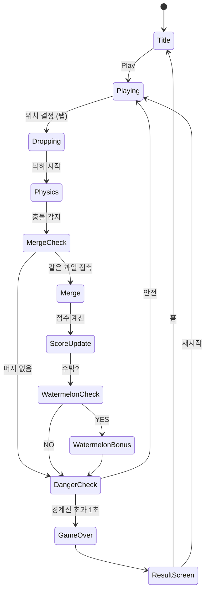

# 수박 만들기 2048

> 과일을 떨어뜨려 합체시키며 수박을 완성하는 물리 기반 머지 퍼즐

## 개요

컨테이너 안으로 과일을 하나씩 떨어뜨린다. 같은 종류의 과일이 충돌하면 합체되어 한 단계 높은 과일로 진화한다. 과일이 컨테이너 상단 경계선을 넘으면 게임 오버. 최종 목표는 가장 큰 과일인 **수박**을 만드는 것.

- **장르**: Merge Puzzle + Physics
- **레퍼런스**: Suika Game (스이카 게임), 2048
- **플랫폼**: iOS / Android (RN WebView)
- **물리 엔진**: Phaser.io + Matter.js

---

## 과일 진화 체인 (10단계)

| 단계 | 이름 | 지름(px) | 머지 점수 | 색상 |
|------|------|----------|-----------|------|
| 1 | 체리 🍒 | 40 | 1 | 빨강 |
| 2 | 딸기 🍓 | 60 | 3 | 진빨강 |
| 3 | 포도 🍇 | 80 | 6 | 보라 |
| 4 | 금귤 🟠 | 100 | 10 | 주황 |
| 5 | 귤 🍊 | 120 | 15 | 주황 |
| 6 | 사과 🍎 | 150 | 21 | 빨강 |
| 7 | 배 🍐 | 180 | 28 | 연두 |
| 8 | 복숭아 🍑 | 210 | 36 | 분홍 |
| 9 | 파인애플 🍍 | 250 | 45 | 노랑 |
| 10 | 수박 🍉 | 300 | 100 | 초록/빨강 |

> **수박 완성 보너스**: 추가 200점 + 특수 이펙트 발생. 수박은 더 이상 머지되지 않고 점수로만 기록됨.

---

## 게임 규칙

### 기본 메카닉

1. 화면 상단에 **다음 투하 과일 미리보기** 표시 (1개)
2. 플레이어가 수평 위치를 선택해 **탭/클릭으로 과일 투하**
3. 투하된 과일은 중력에 따라 낙하, 벽/바닥/다른 과일과 충돌
4. **같은 종류 과일 2개가 접촉**하면 즉시 합체 → 다음 단계 과일 생성
5. 합체 위치: 두 과일의 중간 지점

### 투하 규칙

- 투하 가능 과일: **1~5단계** (체리~귤)만 랜덤 투하
  - 가중치: 체리 35% / 딸기 25% / 포도 20% / 금귤 12% / 귤 8%
- 과일 투하 후 **0.5초 딜레이** 후 다음 과일 등장 (연속 스팸 방지)
- 투하 중인 과일은 좌우로만 이동 가능 (낙하 중 이동 불가)

### 물리 설계 (Matter.js)

- **중력**: 기본값 (y: 1.0)
- **탄성(restitution)**: 0.2 (약간 통통 튀지만 무게감 있음)
- **마찰(friction)**: 0.5
- **밀도(density)**: 크기에 비례 (큰 과일이 작은 과일을 밀어냄)
- **컨테이너**: 좌벽 / 우벽 / 바닥 (static body), 상단 경계선 = 위험선
- 과일 형태: **원형(circle)** 단일 shape

### 게임 오버 조건

- 과일이 **경계선(danger line)** 위로 1초 이상 걸쳐 있으면 게임 오버
- 경계선은 컨테이너 상단에서 아래로 10% 지점에 점선으로 표시
- 경계선 감지: 1초 타이머, 타이머 중 해당 과일이 경계선 아래로 내려오면 타이머 리셋

---

## 게임 플로우



---

## UI 레이아웃

```
┌──────────────────────────┐
│  ⭐ SCORE: 1,240         │  ← 현재 점수
│  🏆 BEST: 3,500          │  ← 최고 점수
├──────────────────────────┤
│         NEXT: 🍒         │  ← 다음 과일 미리보기
│                          │
│   ↓  (투하 위치 가이드)    │  ← 점선 드롭 가이드
│  - - - - - - - - - - - - │  ← DANGER LINE (빨간 점선)
│                          │
│        🍎    🍊           │
│      🍇  🍓    🍒        │
│    🍒   🍎  🍇   🍓      │
│  🍊  🍒    🍒  🍎  🍊   │
│ 🍓🍇🍒🍒🍎🍊🍒🍓🍇🍒  │
└──────────────────────────┘
│ 💣 BOMB  │  📺 AD +BOMB  │  ← 아이템 버튼
└──────────────────────────┘
```

### 화면 비율

- 컨테이너: 화면 너비 90%, 높이 70%
- 투하 가이드: 컨테이너 상단 15% 영역
- 아이템 바: 화면 하단 고정

---

## 스코어링 시스템

### 기본 점수

| 이벤트 | 점수 |
|--------|------|
| 체리 머지 | 1점 |
| 딸기 머지 | 3점 |
| 포도 머지 | 6점 |
| 금귤 머지 | 10점 |
| 귤 머지 | 15점 |
| 사과 머지 | 21점 |
| 배 머지 | 28점 |
| 복숭아 머지 | 36점 |
| 파인애플 머지 | 45점 |
| 수박 머지 | 100점 |
| 수박 완성 보너스 | +200점 |

> 점수 설계 원칙: 높은 단계일수록 기하급수적으로 높은 점수. 연속 머지 체인 유도.

### 콤보 시스템

- **연속 머지(체인)**: 한 번의 투하로 연쇄 머지 발생 시 콤보 배율 적용
  - 2연속: ×1.5
  - 3연속: ×2.0
  - 4연속+: ×2.5
- 콤보 이펙트: 화면에 "COMBO x2!" 텍스트 팝업

---

## 아이템 / 수익화

### 폭탄 아이템 💣

- **효과**: 탭한 위치 주변 반경 100px 내 모든 과일 제거
- **획득 방법**:
  1. 게임 시작 시 1개 기본 지급
  2. 광고 시청으로 1개 추가 획득 (1게임당 최대 3회)
- **UI**: 하단 버튼, 보유 개수 표시
- **전략적 용도**: 쌓인 작은 과일 제거 → 공간 확보

### 광고 리워드 📺

| 리워드 타입 | 조건 | 보상 |
|-------------|------|------|
| 폭탄 획득 | 게임 중 언제든 | 폭탄 1개 |
| 부활 | 게임 오버 직후 1회 | 최상단 과일 3개 제거 후 재개 |
| 점수 2배 | 게임 오버 후 | 최종 점수 ×2 (리더보드 반영) |

### 인앱 결제 (Phase 2 고려)

- 광고 제거 패스: 무제한 폭탄 사용 (월 구독)
- 스킨팩: 과일 디자인 변경 (코스믹, 픽셀, 식품 등)

---

## 컨테이너 / 난이도 설계

MVP에서는 단일 컨테이너 고정. 추후 확장 고려:

| 컨테이너 | 너비 | 설명 |
|----------|------|------|
| 기본 (Normal) | 9단위 | 기본 플레이 |
| 넓음 (Wide) | 12단위 | 초보자용, 공간 여유 |
| 좁음 (Narrow) | 7단위 | 고급자용, 빠른 게임오버 |

---

## 사운드 / 이펙트

| 이벤트 | 사운드 | 비주얼 이펙트 |
|--------|--------|---------------|
| 과일 투하 | 통통 소리 | 투하 위치 가이드 사라짐 |
| 머지 (1~5단계) | 퐁 소리 | 작은 파티클 버스트 |
| 머지 (6~9단계) | 쿵 소리 | 큰 파티클 버스트 + 화면 진동 |
| 수박 완성 | 팡파레 | 화면 전체 축제 이펙트 |
| 폭탄 사용 | 폭발음 | 원형 충격파 이펙트 |
| DANGER LINE 도달 | 경고음 (반복) | 경계선 빨간 점멸 |
| 게임 오버 | 실패 사운드 | 화면 흔들림 |
| 콤보 | 상승 톤 | "COMBO!" 팝업 텍스트 |

---

## 리더보드 / 메타게임

- **로컬 최고 점수** 저장 (AsyncStorage)
- **글로벌 리더보드** (Phase 2): 상위 100명 표시
- **최고 과일 기록**: 이번 게임에서 만든 가장 큰 과일 표시
- **통계**: 총 플레이 수, 총 머지 수, 수박 달성 횟수

---

## MVP 범위

### Phase 1 (1주차 — 출시 목표)

- [x] 기획서 작성
- [ ] Phaser + Matter.js 물리 컨테이너 구현
- [ ] 과일 10종 에셋 (단순 원형 + 색상으로 시작)
- [ ] 과일 투하 메카닉 (위치 선택 → 낙하)
- [ ] 머지 감지 + 진화 로직
- [ ] 게임 오버 판정 (경계선 감지)
- [ ] 기본 스코어링 + 로컬 최고 점수
- [ ] 다음 과일 미리보기

### Phase 2 (2주차 — 수익화)

- [ ] 폭탄 아이템 구현
- [ ] 광고 SDK 연동 (AdMob)
- [ ] 부활 리워드
- [ ] 콤보 시스템
- [ ] 사운드 / 이펙트 폴리싱
- [ ] 컨테이너 사이즈 선택

### Phase 3 (3주차 이후 — 성과 기반)

- [ ] 글로벌 리더보드
- [ ] 스킨팩 인앱 결제
- [ ] 이벤트 모드 (시간 제한, 특수 과일)
- [ ] 광고 제거 구독

---

## 기술 구현 노트 (lib 팀 전달 사항)

- **물리**: `Phaser.Physics.Matter` 사용, 원형 바디 생성
- **머지 감지**: Matter.js `collisionStart` 이벤트 → 같은 타입 필터링
- **컨테이너 크기**: 논리 단위 9 × 12 격자 기준으로 설계, 실제 px은 화면 비율 대응
- **과일 에셋**: 초기엔 `Phaser.GameObjects.Graphics`로 원형 그리기 (에셋 없이 구현 가능)
- **상태 관리**: `gameState = { fruits[], score, nextFruit, isGameOver }`
- **투하 가이드**: 점선 세로 라인 (`Graphics.lineBetween` 점선 스타일)
- **위험선**: y 좌표 고정 static line, 과일 body의 y - radius < dangerLineY 체크
