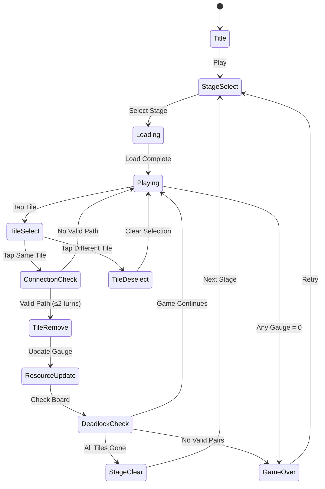

# Survival Tile Connect

> 생존 컨셉의 타일 연결 퍼즐. 같은 타일을 선으로 연결해 자원을 수집하고 살아남아라.

## 개요

격자 보드에 다양한 생존 자원 타일이 배치된다. 플레이어는 같은 그림 타일 2개를
최대 2번 꺾는 경로(선)로 연결해 제거한다. 자원 타일을 제거할 때마다 생존 게이지가
회복되고, 모든 타일을 제거하면 스테이지 클리어다. 생존 게이지가 0이 되거나
유효한 매칭이 없으면 게임 오버.

## 게임 규칙

### 타일 연결 규칙

- 보드에 배치된 **같은 그림 타일 2개**를 선으로 연결해 제거
- 연결선은 수평·수직으로만 이동 (대각선 불가)
- **최대 2번 꺾기** 허용 (직각 방향 전환 ≤ 2회)
- 연결 경로 상에 **다른 타일이 없어야** 함 (빈 칸 통과 가능)
- 보드 바깥 테두리 경로 사용 가능 (벽 돌아가기 허용)
- 연결 성공 → 두 타일 즉시 제거

### 경로 예시

```
꺾기 0회 (직선):    꺾기 1회 (L자):    꺾기 2회 (Z/U자):
[A]────[A]          [A]                [A]──┐
                      │                     │
                    [A]                ┌──[A]
```

### 생존 메카닉

- 각 타일에는 생존 자원 타입이 부여됨
- 매 **3초**마다 생존 게이지 1 감소 (턴 기반 변형도 가능)
- 자원 타일 제거 시 해당 자원 게이지 회복
- **4가지 자원**: 🍖 식량 / 💧 물 / 🔋 에너지 / 🛡 방어구
- 각 게이지가 개별로 존재하며, 하나라도 0이 되면 게임 오버

### 게임 오버 조건

1. 생존 자원 게이지 중 하나가 0에 도달
2. 보드에 유효한 매칭 쌍이 더 이상 없음 (데드락)

### 스테이지 클리어 조건

- 보드의 모든 타일 제거 + 모든 자원 게이지 1 이상 유지

## 게임 플로우



## UI 레이아웃

```
┌─────────────────────────────┐
│  🍖 ████░░  💧 ██████  Day 3 │  ← 자원 게이지 + 날짜
│  🔋 ███░░░  🛡 █████░        │
├─────────────────────────────┤
│                             │
│  ┌──┐ ┌──┐ ┌──┐ ┌──┐ ┌──┐  │
│  │🍖│ │💧│ │🔋│ │🍖│ │🛡│  │
│  └──┘ └──┘ └──┘ └──┘ └──┘  │
│  ┌──┐ ┌──┐ ┌──┐ ┌──┐ ┌──┐  │  ← 타일 보드
│  │🛡│ │🍖│ │💧│ │🔋│ │💧│  │    (선택 시 하이라이트)
│  └──┘ └──┘ └──┘ └──┘ └──┘  │
│  ┌──┐ ┌──┐ ┌──┐ ┌──┐ ┌──┐  │
│  │💧│ │🛡│ │🍖│ │🛡│ │🔋│  │
│  └──┘ └──┘ └──┘ └──┘ └──┘  │
│                             │
├─────────────────────────────┤
│   🔀 Hint    ⚡ Reshuffle   │  ← 아이템
└─────────────────────────────┘
```

## 스코어링 시스템

| Action | Score |
|--------|-------|
| 타일 연결 제거 | +50 |
| 연속 콤보 (n연속) | +50 × n |
| 자원 게이지 풀 회복 | +200 (보너스) |
| 스테이지 클리어 | +1000 |
| 남은 게이지 합산 보너스 | 총 게이지 × 10 |

## 난이도 설계

| Day | 그리드 | 타일 종류 | 자원 감소 속도 | 특수 타일 |
|-----|--------|-----------|---------------|-----------|
| 1 | 6×6 | 4종 | 5초당 1 | 없음 |
| 2 | 6×6 | 4종 | 4초당 1 | 없음 |
| 3 | 8×6 | 5종 | 4초당 1 | 잠긴 타일 |
| 4 | 8×6 | 5종 | 3초당 1 | 잠긴 타일 |
| 5 | 8×8 | 6종 | 3초당 1 | 독 타일 |
| 6+ | 8×8+ | 6종+ | 2초당 1 | 복합 |

> 타일 수 = 항상 짝수 (2개씩 쌍으로 구성)

### 특수 타일

| 타입 | 설명 |
|------|------|
| 🔒 잠긴 타일 | 인접한 일반 타일을 먼저 제거해야 해제 |
| ☠ 독 타일 | 제거 시 자원 게이지 -2 패널티 |
| ⭐ 황금 타일 | 제거 시 모든 자원 게이지 +3 보너스 |

## 아이템/도구

| Item | Effect | 제한 |
|------|--------|------|
| 💡 Hint | 유효한 매칭 쌍 1개 하이라이트 표시 | 스테이지당 3회 |
| 🔀 Reshuffle | 보드 타일 위치 재배치 (매칭 보장) | 스테이지당 1회 |
| 🔓 Unlock | 잠긴 타일 1개 강제 해제 | 스테이지당 1회 |

## 사운드/이펙트

- 타일 선택: 클릭 효과음
- 연결 성공: 연결선 그어지는 애니메이션 + 제거 이펙트
- 콤보: 상승 톤 효과음
- 자원 게이지 위험 (20% 이하): 경고음 + 깜빡임
- 스테이지 클리어: 생존 성공 연출
- 게임 오버: 생존 실패 연출 (화면 어두워짐)

## MVP 범위

### Phase 1 (MVP — 1주 목표)

- [ ] 기획서 작성
- [ ] 기본 타일 보드 (6×6, 4종 타일)
- [ ] 연결 경로 탐색 로직 (BFS, 꺾기 ≤2)
- [ ] 타일 제거 + 애니메이션
- [ ] 단일 생존 게이지 (단순화: 4개 → 1개 통합)
- [ ] 게임 오버 / 클리어 판정
- [ ] 3 스테이지

### Phase 2

- [ ] 4종 자원 게이지 분리
- [ ] 특수 타일 (잠긴 타일)
- [ ] Hint / Reshuffle 아이템
- [ ] 타이머 + 스코어링 + 콤보
- [ ] 스테이지 셀렉트 화면
- [ ] 생존 날짜 UI ("Day N")

## 기술 구현 포인트 (lib 팀 참고)

### 경로 탐색 알고리즘

```
BFS로 두 타일 간 유효 경로 탐색:
- 꺾기 횟수를 상태로 관리 (0, 1, 2)
- 꺾기 2회 초과 경로 가지치기
- 보드 바깥(-1 인덱스) 통과 허용
- 타일 있는 칸은 통과 불가 (출발/도착 제외)
```

### 데드락 감지

```
매 타일 제거 후 전체 보드 스캔:
- 남은 모든 타일 쌍에 대해 유효 경로 존재 여부 확인
- 하나도 없으면 → Reshuffle 유도 or 게임 오버
```
