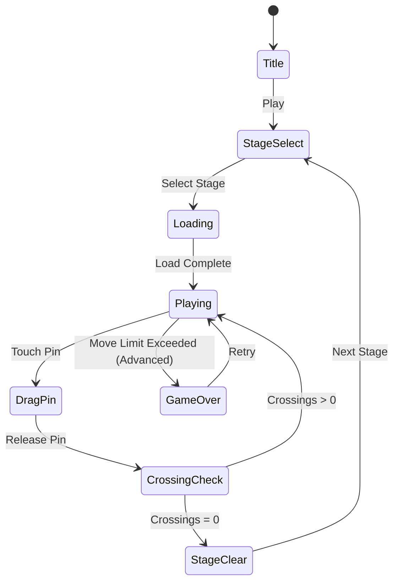

# Tangled Rope: Twisted Puzzle

> 꼬인 밧줄을 드래그하여 교차점 없이 풀어내는 퍼즐 게임.
> 레퍼런스 #53 (NORDKAPP GAMES LIMITED, Rating 4.6)

---

## 장르 통합 전략: 로프/실 시리즈

| # | 게임 | 메카닉 | 공통점 |
|---|------|--------|--------|
| #17 | (실 장르 A) | 실 감기/풀기 | 선형 오브젝트 조작 |
| #32 | (실 장르 B) | 실 경로 추적 | 교차 판정 |
| #53 | Tangled Rope | 밧줄 교차점 제거 | 드래그 UX |
| #78 | (실 장르 C) | 선 정리 | 플래너 그래프 |

**전략**: `lib/rope-core`를 공유 라이브러리로 설계하여 #17/#32/#53/#78 모두 재사용.
공통 모듈: 선분 교차 판정 엔진, 드래그 입력 처리, 선분 렌더링(Phaser Graphics).

---

## 개요

보드 위에 여러 개의 **핀(pin)**과 **밧줄(rope)**이 배치되어 있다.
밧줄이 서로 교차하면 **매듭(knot)**이 생긴다.
플레이어는 핀을 드래그하여 위치를 이동시키고, 모든 교차점을 제거하면 스테이지 클리어.

**핵심 재미**: "꼬인 것을 푸는" 물리적 쾌감 + 공간 추론

---

## 게임 규칙

### 기본 규칙
- 화면에 N개의 **핀**과 핀을 연결하는 **밧줄**이 존재
- 두 밧줄이 교차하면 교차점에 시각적 표시 (빨간 점 또는 하이라이트)
- 플레이어는 핀을 드래그하여 이동
- **교차점(crossing)이 0개**가 되면 스테이지 클리어
- 밧줄 자체는 고정(연결 관계 불변), 핀 위치만 이동 가능

### 교차점 판정 (수학적 정의)

두 선분 AB, CD의 교차 여부는 **CCW(Counter-Clockwise) 알고리즘**으로 판정:

```
CCW(P, Q, R) = (R.y - P.y)(Q.x - P.x) > (Q.y - P.y)(R.x - P.x)

AB ∩ CD = true
  ↔ CCW(A,C,D) ≠ CCW(B,C,D)
  AND CCW(A,B,C) ≠ CCW(A,B,D)
```

- 같은 핀을 공유하는 선분은 교차로 판정하지 않음 (공유 끝점 제외)
- 매 드래그 이동마다 전체 선분 쌍 교차 판정 재계산
- 선분 수 N에 대해 O(N²) → 최대 선분 50개 이내 유지

### 이동 제한 모드 (Advanced)
- 핀 이동 횟수 제한 옵션 (레벨 후반)
- 이동 횟수 소진 전 클리어 → 별 3개 / 소진 시 별 1개

---

## 게임 플로우



---

## UI 레이아웃

```
┌─────────────────────────┐
│  #3  ✦✦✦  ↩ Undo  ❓  │  ← HUD: 스테이지, 별, 되돌리기, 힌트
├─────────────────────────┤
│                         │
│   ●━━━━━━━━━●           │
│    \       /            │
│     \     /   ●         │
│      \   /   /|         │  ← 게임 보드
│       \ /   / |         │    (핀 = ●, 밧줄 = 선)
│   ●    X   /  |         │    (교차점 = X 빨간 표시)
│       / \ /   |         │
│      /   ●    |         │
│   ●━━━━━━━━━━━●         │
│                         │
├─────────────────────────┤
│  🔵 Crossings: 3        │  ← 현재 교차점 수 표시
└─────────────────────────┘
```

### 핀 드래그 UX
- 핀 터치 반경: 실제 크기보다 1.5x 크게 (모바일 터치 정확도 보상)
- 드래그 중: 핀 확대 + 연결된 밧줄 실시간 업데이트
- 교차점 실시간 하이라이트 (드래그 중에도 즉각 피드백)
- 핀 이동 범위: 화면 내 전체 (경계 클램프)

---

## 스코어링 시스템

| Action | Score |
|--------|-------|
| 교차점 1개 제거 | +50 |
| 스테이지 클리어 | +500 |
| 이동 수 보너스 | (최소이동 - 실제이동) × 20 |
| 힌트 미사용 클리어 | +200 |

### 별 3개 기준
| 조건 | 별 |
|------|-----|
| 클리어 (힌트 사용 무관) | ★☆☆ |
| 이동 수 ≤ 권장의 150% | ★★☆ |
| 이동 수 ≤ 권장 이동 수 | ★★★ |

---

## 난이도 설계

| Level | 핀 수 | 밧줄 수 | 최초 교차점 | 권장 이동 | 이동 제한 |
|-------|-------|---------|------------|----------|----------|
| 1~5 | 4~5 | 4~6 | 1~3 | 3~5 | 없음 |
| 6~15 | 6~7 | 7~10 | 4~7 | 5~8 | 없음 |
| 16~30 | 7~8 | 10~14 | 7~12 | 7~12 | 없음 |
| 31~50 | 8~10 | 13~18 | 10~18 | 10~15 | 이동 수 × 1.5 |
| 51+ | 10 | 16~22 | 15~25 | 12~18 | 이동 수 × 1.3 |

**레벨 생성 전략**:
- 먼저 풀린 상태(교차 없음)의 그래프 생성
- 핀 위치를 랜덤 교란하여 교차 생성
- 교란 후 교차점 수 확인 → 목표 범위 아니면 재교란

---

## 시각 만족감 (핵심 차별화)

### 클리어 연출
1. 마지막 교차점 해소 시 → 모든 밧줄 **초록색 순차 발광** (0.3s)
2. 핀들이 부드럽게 최종 위치로 **스프링 정착** 애니메이션
3. 밧줄 **파티클 버스트** (실이 풀리는 느낌의 빛 입자)
4. 화면 전체 **흰색 플래시** → 스테이지 클리어 UI

### 드래그 중 피드백
- 교차점 생성 시: 빨간 점 + 경미한 진동 (haptic)
- 교차점 감소 시: 파란 점 감소 + 경쾌한 "틱" 효과음
- 핀 주변 **연결 밧줄 하이라이트** (어느 선이 교차 중인지 명시)

### 밧줄 물리 표현
- 직선이 아닌 **베지어 곡선** 또는 약한 새그(sag) 효과
- 드래그 시 밧줄 **탄성 늘어짐** 표현 (단순 Lerp)
- 교차점: 위 밧줄은 불투명, 아래 밧줄은 약간 투명

---

## 수익화

### 힌트 시스템
- **힌트 1**: 다음 이동할 핀 위치 화살표 표시 (3초)
- **힌트 2**: 정답 경로 전체 미리보기 (1초 재생)
- 힌트 = 광고 시청(무료) or 보석 소모(유료)
- 스테이지당 무료 힌트 1회 제공

### 되돌리기 (Undo)
- 무제한 Undo (기본 제공) → 진입 장벽 낮춤
- 단, 별 3개 조건: Undo 0회 클리어

### 기타
- 레벨 팩 DLC (스테이지 51~100)
- 광고 제거 인앱결제
- 시즌 테마 스킨 (핀/밧줄 시각 스타일)

---

## 사운드/이펙트

| 이벤트 | 효과음 | 이펙트 |
|--------|--------|--------|
| 핀 터치 | 부드러운 "픽" | 핀 확대 |
| 교차점 증가 | 낮은 "뚝" | 빨간 점 펄스 |
| 교차점 감소 | 경쾌한 "틱" | 파란 점 소멸 |
| 스테이지 클리어 | 상승 멜로디 | 파티클 + 플래시 |
| 힌트 | 마법 효과음 | 화살표 글로우 |

---

## 기술 구현 포인트 (Phaser.io)

### 핵심 컴포넌트
```
lib/tangled-rope/
├── src/
│   geometry/
│   │   ├── intersect.ts     # 선분 교차 판정 (CCW)
│   │   └── planar.ts        # 전체 그래프 교차점 수 계산
│   ├── graph/
│   │   ├── RopeGraph.ts     # 핀-밧줄 그래프 자료구조
│   │   └── LevelGen.ts      # 레벨 생성 (역방향: 풀린 상태 교란)
│   └── scenes/
│       ├── GameScene.ts     # 메인 게임 (드래그 + 교차 판정)
│       └── ClearScene.ts    # 클리어 연출
```

### 드래그 구현 (Phaser)
```typescript
// 핀을 Phaser.GameObjects.Arc로 생성
// setInteractive({ draggable: true }) 설정
// 'drag' 이벤트: 핀 위치 업데이트 + 교차 재계산
// Graphics.clear() + 선분 전체 재드로우 (매 프레임)
```

### 성능 고려
- 선분 수 최대 50개 → 교차 판정 최대 1225쌍 (O(N²)/2)
- 모바일에서 60fps 유지 가능 범위
- 드래그 이벤트: throttle 불필요 (Phaser pointer move = 매 프레임)

---

## 로프/실 장르 공유 아키텍처

```
lib/rope-core/         ← 공유 라이브러리
├── intersect.ts       # CCW 선분 교차 판정
├── drag.ts            # Phaser 드래그 헬퍼
└── render.ts          # 선분/곡선 렌더링 유틸

lib/tangled-rope/      # #53 (핀 이동 퍼즐)
lib/string-artist/     # #17 (실 감기)
lib/rope-match/        # #32 (실 경로)
lib/wire-sort/         # #78 (선 정리)
```

---

## MVP 범위

### Phase 1 (MVP, 1주)
- [ ] 기획서 작성 ← **현재**
- [ ] `lib/tangled-rope` 게임 코어 (핀 드래그 + 교차 판정)
- [ ] 레벨 데이터 10개 (수동 제작)
- [ ] 클리어 판정 + 기본 클리어 연출
- [ ] `web/tangled-rope` React 래핑
- [ ] `tangled-rope/rn` WebView 앱

### Phase 2 (폴리시, 1주)
- [ ] 레벨 자동 생성기
- [ ] 힌트 시스템
- [ ] 파티클 클리어 연출
- [ ] 별 3개 + 스코어링
- [ ] BGM/효과음

### Phase 3 (수익화)
- [ ] 광고 SDK 연동
- [ ] 인앱결제 (레벨팩)
- [ ] rope-core 분리 → 타 장르 게임 재사용
