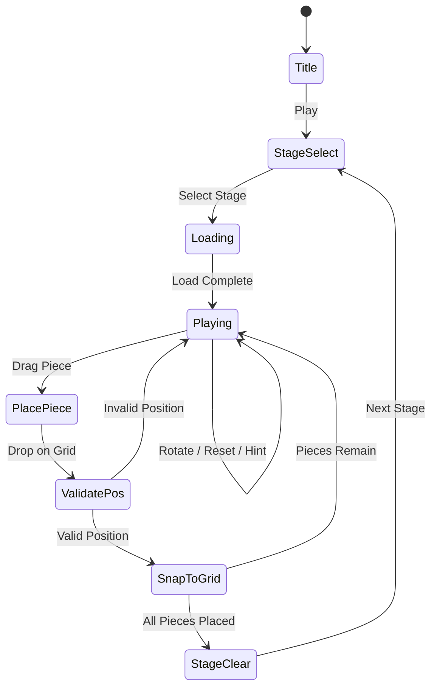

# Block! Triangle Puzzle Tangram

> 삼각형 조각을 드래그하여 목표 실루엣을 빈틈없이 채우는 탱그램 퍼즐 게임

## 개요

삼각형 그리드 위에 목표 실루엣이 표시된다. 플레이어는 하단 트레이에서 삼각형 조각(폴리아몬드)을 드래그하여 그리드 위에 배치한다. 조각은 60° 단위로 회전 가능하며, 모든 조각을 실루엣 안에 빈틈없이, 겹침 없이 배치하면 스테이지 클리어.

## 게임 규칙

### 기본 규칙
- 보드는 **삼각형 그리드**로 구성됨 (정삼각형 △▽ 교차 테셀레이션)
- 각 스테이지마다 **목표 실루엣**(채워야 할 영역)이 그리드 위에 표시됨
- 플레이어에게 정해진 **퍼즐 조각 세트**가 주어짐
- 조각을 트레이에서 드래그하여 그리드에 **드롭**하면 스냅됨
- 조각은 배치 전 **60° 단위 회전** 가능
- 모든 조각을 실루엣 안에 빈틈·겹침 없이 배치하면 **스테이지 클리어**

### 삼각형 그리드 시스템
- 정삼각형이 위(△)·아래(▽) 교대로 배치된 테셀레이션 구조
- 보드 크기는 레벨별 상이 (6×4 ~ 12×10 삼각형 셀)
- 목표 실루엣은 셀의 부분 집합으로 하이라이트/윤곽선 표시

### 퍼즐 조각 (폴리아몬드)
- **모노아몬드 (1△)**: 삼각형 1개
- **다이아몬드 (2△)**: 삼각형 2개 (변 공유)
- **트리아몬드 (3△)**: 삼각형 3개
- **테트리아몬드 (4△)**: 삼각형 4개 (여러 형태 가능)
- **펜티아몬드 (5△)**: 삼각형 5개 (고난이도용)
- 각 조각은 고유 색상으로 구분됨

### 조각 배치 규칙
- 조각은 실루엣 영역 안에만 배치 가능
- 이미 배치된 조각과 겹칠 수 없음
- 유효하지 않은 위치에 드롭 시 조각이 트레이로 복귀
- 배치된 조각을 탭하면 트레이로 회수 가능

## 게임 플로우



## UI 레이아웃

```
┌─────────────────────────────┐
│  Stage 12   ⏱ 01:30   ⭐ 850 │  ← 상단 HUD
├─────────────────────────────┤
│                             │
│       △▽△▽△▽△▽            │
│      ▽█▽█△█△▽△            │
│       △█△█▽█▽△             │  ← 삼각형 그리드 보드
│      ▽█▽█△█△▽             │    (█ = 목표 실루엣)
│       △▽△▽△▽△             │
│                             │
├─────────────────────────────┤
│  ◀ [🔺][🔷][🔶][🔻][🔺] ▶ │  ← 조각 트레이 (스크롤)
├─────────────────────────────┤
│  🔄 Rotate  💡 Hint  ↩️ Reset │  ← 도구 버튼
└─────────────────────────────┘
```

## 스코어링 시스템

| Action | Score |
|--------|-------|
| 조각 1개 배치 | +50 |
| 스테이지 클리어 | +500 |
| 힌트 없이 클리어 (No-Hint 보너스) | +300 |
| 남은 시간 보너스 | 남은초 × 10 |
| 연속 No-Hint 클리어 (콤보) | +300 × 콤보 수 |

## 난이도 설계

| Level | Board Size | Piece Count | Max Piece Size | Silhouette | Time |
|-------|-----------|-------------|----------------|------------|------|
| 1-10 | 6×4 | 3-4 | 3△ (triamond) | Simple (convex) | None |
| 11-20 | 8×6 | 4-5 | 4△ (tetriamond) | Medium | None |
| 21-30 | 8×6 | 5-6 | 4△ (tetriamond) | Complex (concave) | 120s |
| 31-50 | 10×8 | 6-8 | 5△ (pentiamond) | Complex | 90s |
| 51+ | 12×10 | 8-10 | 5△ (pentiamond) | Very complex | 60s |

> 모든 퍼즐은 풀이 보장됨 — 주어진 조각이 정확히 실루엣을 채움

## 아이템/도구

| Item | Effect |
|------|--------|
| Rotate | 선택된 조각을 60° 회전 (기본 무료 조작) |
| Hint | 하나의 조각이 어디에 놓여야 하는지 표시 (제한 무료, 이후 구매/광고) |
| Reset | 보드 위의 모든 조각을 트레이로 되돌림 |

## 사운드/이펙트 (TODO)

- 조각 선택: 집기 효과음
- 조각 배치 성공: 딸깍 스냅 사운드
- 조각 배치 실패 (겹침/영역 밖): 부정 효과음
- 조각 회전: 짧은 회전 효과음
- 스테이지 클리어: 축하 이펙트 + 사운드
- 힌트 사용: 반짝임 이펙트

## MVP 범위

### Phase 1 (MVP)
- [x] 기획서 작성
- [ ] 삼각형 그리드 렌더링
- [ ] 조각 드래그 앤 드롭
- [ ] 조각 스냅 (그리드에 맞추기)
- [ ] 조각 회전 (60° 단위)
- [ ] 클리어 판정 (실루엣 완성 체크)
- [ ] 10 스테이지

### Phase 2
- [ ] 힌트 시스템
- [ ] 타이머 + 스코어링
- [ ] 스테이지 셀렉트 화면
- [ ] 추가 스테이지 (50+)
- [ ] 퍼즐 팩 (수익화)
