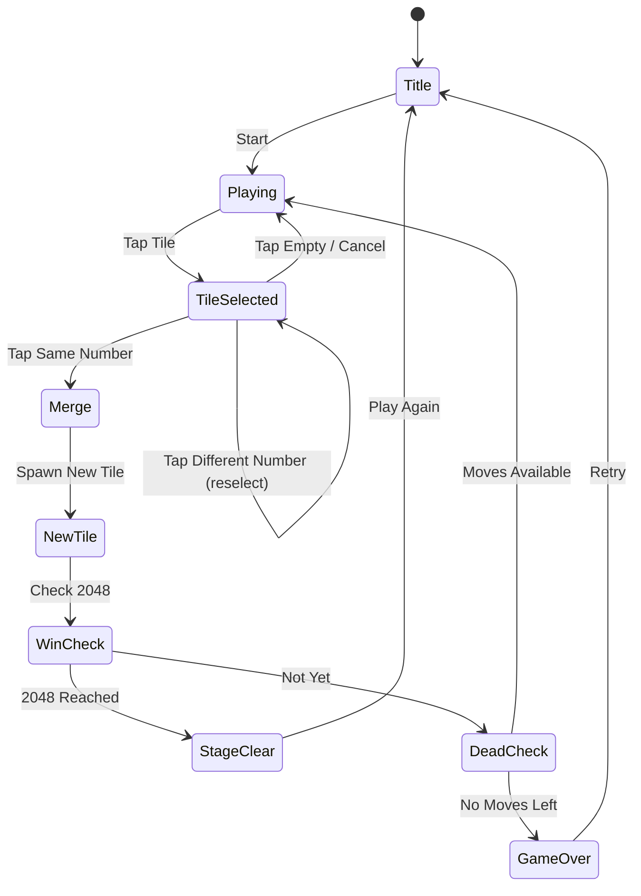

# 탭탭2048 (TapTap 2048)

> 2048에 탭 인터랙션을 더한 머지 퍼즐게임. 스와이프 없이 타일을 탭해서 합치는 방식.

## 개요

그리드 위에 숫자 타일이 놓여 있다. 플레이어는 같은 숫자 타일 2개를 탭하여 합체시킨다.
합체된 타일은 두 배 숫자가 된다 (2+2=4, 4+4=8 ... 1024+1024=2048).
2048 타일을 만들면 스테이지 클리어.

## 게임 규칙

### 기본 규칙
- **4×4 그리드** 기반 (클래식 2048과 동일한 보드 크기)
- 같은 숫자 타일 2개를 탭하면 합체 → 두 배 숫자 생성
- 합체 후 새 타일(2 또는 4)이 빈 칸에 랜덤 생성
- 빈 칸이 없고 합체 가능한 타일도 없으면 **게임 오버**
- 2048 타일 도달 시 **스테이지 클리어**

### 탭 메카닉 (클래식과 차이점)
- **클래식 2048**: 방향 스와이프 → 해당 방향으로 전체 보드 이동 + 인접 합체
- **탭탭2048**: 특정 타일 2개를 직접 탭 → 그 타일만 선택적으로 합체
  - 1번째 탭: 타일 선택 (하이라이트)
  - 2번째 탭: 같은 숫자면 합체, 다른 숫자면 선택 변경
  - 합체된 타일은 **첫 번째 탭 위치**에 생성 (두 번째 타일이 사라짐)

### 이동 제약 (핵심 밸런스 포인트)
- 탭 방식이면 "아무 타일이나 합치면 너무 쉽다"는 문제 발생
- **이동 거리 제한** 옵션: 인접(상하좌우 + 대각선) 타일만 합체 가능
- **또는** 합체 시 두 타일 사이 경로가 직선이어야 함

## 게임 플로우



## UI 레이아웃

```
┌─────────────────────────┐
│  🏆 Best: 2048  ⭐ Score │  ← 상단 HUD
│  🎯 Target: 2048         │
├─────────────────────────┤
│                         │
│  ┌────┬────┬────┬────┐  │
│  │  2 │  4 │  2 │    │  │
│  ├────┼────┼────┼────┤  │
│  │  8 │ 16 │  4 │  2 │  │  ← 4×4 그리드
│  ├────┼────┼────┼────┤  │    (선택된 타일 하이라이트)
│  │  4 │  2 │  8 │  4 │  │
│  ├────┼────┼────┼────┤  │
│  │  2 │ 32 │ 16 │  8 │  │
│  └────┴────┴────┴────┘  │
│                         │
├─────────────────────────┤
│  [↩️ Undo] [💣 Bomb]   │  ← 아이템
│  [🔀 Shuffle] [➕ +Tile] │
└─────────────────────────┘
```

## 스코어링 시스템

| Action | Score |
|--------|-------|
| 타일 합체 | 합체된 숫자 × 2 |
| 연속 합체 (콤보) | 점수 × 1.5 (최대 ×3) |
| 2048 달성 | +10,000 |
| 2048 초과 달성 | 초과 타일당 +5,000 추가 |

> 예: 1024+1024 합체 → +2048점, 즉시 콤보 후 512+512 → +1536점

## 난이도 설계

| Level | 그리드 | 초기 타일 | 최대 숫자 목표 | 아이템 허용 |
|-------|--------|-----------|----------------|-------------|
| Easy | 4×4 | 2, 4 전용 | 512 | 제한 없음 |
| Normal | 4×4 | 2, 4, 8 | 1024 | 제한 없음 |
| Hard | 5×5 | 2~16 | 2048 | 유료만 |
| Expert | 5×5 | 2~32 | 4096 | 없음 |

## 아이템 시스템

| 아이템 | 효과 | 획득 방법 |
|--------|------|-----------|
| Undo | 마지막 탭 취소 | 광고 1회 또는 코인 30 |
| Bomb | 타일 1개 제거 | 광고 1회 또는 코인 50 |
| +2 Tile | 원하는 위치에 타일 추가 | 코인 100 |
| Shuffle | 현재 타일 위치 랜덤 재배치 | 광고 1회 또는 코인 40 |

## 수익화 전략

### 광고 (주 수익원)
- **게임오버 화면**: 리워드 광고 → Undo 1회 제공
- **스테이지 클리어**: 인터스티셜 (3게임당 1회)
- **아이템 사용**: 리워드 광고 → 무료 아이템

### 인앱 결제 (부 수익원)
- **광고 제거**: $2.99 (원타임)
- **코인 팩**: $0.99 / $2.99 / $4.99
- **프리미엄 테마**: $0.99 (타일 스킨)

### 핵심 수익화 포인트
- 게임오버 직전 "Undo로 살아남기" → 강력한 리워드 광고 트리거
- 높은 타일(1024)에서 실수했을 때 Undo 욕구가 극대화됨

## 사운드/이펙트

- 타일 선택: 경쾌한 클릭음
- 합체 성공: 팝 + 숫자 크기에 따라 음높이 상승
- 2048 달성: 폭죽 이펙트 + 축하음
- 게임 오버: 낮은 톤 + 보드 흔들림
- 콤보: 연속 음계 상승 (도레미...)

---

## 분석: 탭탭2048의 3.7 낮은 평점 원인

### 문제 1: 전략성 부재
- 클래식 2048은 스와이프 → 전체 보드 이동으로 **계획적 플레이** 가능
- 탭 방식은 "어느 타일이든 원하는 대로 합치기"가 가능해 **난이도가 너무 낮음**
- 도전감 없음 → 지루함 → 이탈

### 문제 2: 이동 제약이 없을 경우 깊이 부족
- 제약 없이 아무 타일이나 탭하면 → 항상 이길 수 있음
- 실패할 일이 없으니 긴장감 0
- 게임으로서의 재미 요소(실패와 재도전) 사라짐

### 문제 3: 클래식 대비 신선함 부족
- "탭으로 바꿨다"는 변화가 너무 피상적
- 스와이프의 "전략적 방향 선택"을 없애면 오히려 깊이가 줄어듦
- 별도의 킬링 피처 없음

### 문제 4: UX 문제
- 탭 → 탭 2단계 인터랙션이 스와이프보다 느리고 번거로움
- 작은 모바일 화면에서 타일 두 개 정확히 탭 → 오터치 발생
- 피드백(하이라이트, 애니메이션) 부족 시 "뭘 하고 있는지 모름" 느낌

---

## #23 수박 만들기 vs #62 탭탭2048 비교

| 항목 | 수박 만들기 (#23) | 탭탭2048 (#62) |
|------|------------------|----------------|
| **메카닉** | 물리 기반 드롭 + 합체 | 탭으로 선택 합체 |
| **그리드** | 없음 (자유 물리) | 4×4 고정 그리드 |
| **긴장감** | 쌓이는 공 → 넘치면 오버 | 빈칸 없으면 오버 |
| **시각적 재미** | 동글동글 과일, 물리 효과 탁월 | 숫자만 → 심심함 |
| **직관성** | 매우 높음 (떨어뜨리기) | 중간 (탭 2번) |
| **전략성** | 드롭 위치 계획 | 낮음 (제약 없을 시) |
| **신선함** | 높음 (물리 × 2048 융합) | 낮음 (2048 - 스와이프) |
| **평점** | 더 높을 것으로 예상 | 3.7 (낮음) |
| **개발 복잡도** | 높음 (물리 엔진) | 낮음 |

**결론: 수박 만들기(#23)가 훨씬 우월한 변형**
- 물리 엔진의 예측 불가능성이 재미를 만든다
- 탭탭2048은 클래식 2048에서 오히려 재미 요소를 뺀 구조

---

## 우리가 만든다면: 최적 2048 변형 설계

### 추천 방향: "탭 + 제약 + 비주얼"

1. **이동 거리 제한**: 인접 타일만 합체 가능 → 전략성 복원
2. **시각적 개선**: 숫자 대신 캐릭터/아이콘 (고양이, 음식 등)
3. **콤보 시스템**: 연속 합체 시 보너스 → 리듬감
4. **장애물 추가**: 일부 칸 잠금 → 레벨 디자인 가능

### 대안: 탭탭2048 포기, 수박게임 집중
- 개발 리소스가 부족하다면 #23을 완성도 있게 만드는 것이 더 효과적
- 2048 장르는 시장이 포화 상태, 수박게임 물리 방식이 차별화 우위

---

## MVP 범위

### Phase 1 (MVP - 1주)
- [ ] 기획서 작성
- [ ] 4×4 그리드 렌더링
- [ ] 타일 탭 선택 + 합체 로직 (인접 타일만)
- [ ] 새 타일 생성
- [ ] 게임오버 / 2048 클리어 판정
- [ ] 기본 스코어

### Phase 2 (폴리쉬 - 1주)
- [ ] 콤보 시스템
- [ ] Undo / Bomb 아이템
- [ ] 리워드 광고 연동
- [ ] 애니메이션 (합체, 클리어)
- [ ] 사운드

---

## 최종 결론: #23 vs #62 선택

**#23 수박 만들기를 먼저 완성하라.**

| 기준 | 수박 (#23) | 탭탭2048 (#62) |
|------|-----------|----------------|
| 시장 검증 | ✅ 글로벌 바이럴 | ⚠️ 낮은 평점 선례 |
| 개발 난이도 | 중~고 | 낮음 |
| 차별화 | 높음 | 낮음 |
| 수익 기대치 | 높음 | 중간 |
| 리텐션 | 높음 (물리 예측불가) | 낮음 (금방 질림) |

탭탭2048은 **1주 내 MVP로 포트폴리오에 추가**하되,
마케팅 비용은 수박게임에 집중하는 전략을 권장한다.
