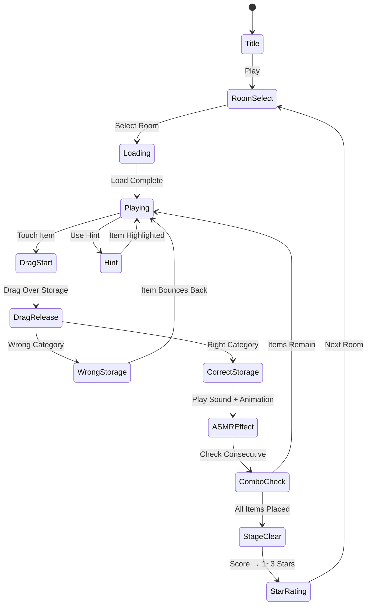

# Tidy Master: 완벽하게 정리하다

> 어질러진 방을 완벽하게 정리하는 힐링 정렬 퍼즐

## 개요

화면에 펼쳐진 어질러진 방. 옷은 바닥에 널려 있고, 책은 아무데나 쌓여 있고, 장난감은 여기저기 흩어져 있다.
플레이어는 각 물건을 드래그해 지정된 수납 공간에 넣는다. 물건이 제자리를 찾을 때마다 들려오는 ASMR 효과음과 방이 깔끔해지는 시각적 변화가 핵심 만족감을 제공한다.
모든 물건을 정리하면 방이 완벽하게 정돈된 상태로 변하며 스테이지 클리어.

### 포지셔닝

| 게임 | 테마 | 핵심 감정 | 타겟 |
|------|------|-----------|------|
| Tidy Master | 방 정리 | 힐링 / ASMR 만족감 | 20~35세 여성, 정리 강박 유저 |
| Magic Sort (#4) | 추상 정렬 | 퍼즐 성취감 | 퍼즐 게이머 |

**차별점**: Tidy Master는 "정리하는 행위 자체의 만족"을 파는 게임. Magic Sort가 두뇌 게임이라면, Tidy Master는 힐링 게임.

---

## 게임 규칙

### 기본 규칙

- 방(스테이지)에 **물건들이 무작위로 흩어져** 있음
- 물건은 **카테고리별로 분류** (옷, 책, 주방용품, 장난감 등)
- 각 카테고리에는 **지정된 수납 공간** 존재 (옷장, 책장, 주방 서랍, 장난감 박스)
- 플레이어는 물건을 **드래그**해 올바른 수납 공간에 넣음
- 틀린 수납 공간에 드랍하면 **튕겨나오는 애니메이션** (부드러운 피드백)
- 모든 물건이 제자리를 찾으면 **스테이지 클리어**

### 수납 규칙 상세

- **같은 카테고리** 물건만 해당 수납 공간에 넣을 수 있음
- 수납 공간은 **용량 제한** 없음 (MVP 단순화)
- 수납 공간에 물건이 들어갈 때마다 **정리 진행도 UI** 업데이트
- **같은 카테고리 연속 정리** 시 콤보 보너스 (ASMR 효과음 업그레이드)

### ASMR 만족 시스템

물건 종류별 수납 사운드 차별화:

| 물건 | 수납 사운드 |
|------|-------------|
| 옷 | 부드럽게 접히는 소리 |
| 책 | 책장에 꽂히는 소리 |
| 주방용품 | 서랍 닫히는 소리 |
| 장난감 | 박스에 쏙 들어가는 소리 |
| 신발 | 신발장에 정렬되는 소리 |

연속 정리 시 배경음악 점점 밝아지는 효과 (방이 정리될수록 음악이 맑아짐)

---

## 게임 플로우



---

## UI 레이아웃

```
┌─────────────────────────┐
│  ⏱ 01:45   🧹 12/20    │  ← 상단 HUD (시간, 정리 진행도)
│  ⭐⭐⭐ ────────────── │  ← 별점 기준 진행 바
├─────────────────────────┤
│                         │
│  [책장]      [옷장]     │  ← 수납 공간 (상단 고정)
│  📚📚__     👗__       │
│                         │
│  ~ ~ ~ ~ ~ ~ ~ ~ ~ ~   │
│  👟  📖  👔  🧸  🍳  │  ← 어질러진 물건들 (랜덤 위치)
│     👗  📚     👟     │
│  🍳     🧸  📖       │
│                         │
│  [주방 서랍]  [장난감통] │  ← 수납 공간 (하단 고정)
│  🍳__        🧸__     │
│                         │
├─────────────────────────┤
│  💡 Hint(3)  🔄 Reset  │  ← 도구 바
└─────────────────────────┘
```

### 수납 공간 시각 피드백

- **평상시**: 수납 공간 테두리 표시
- **드래그 중 (올바른 카테고리 호버)**: 초록 빛 강조 + 살짝 확대
- **드래그 중 (잘못된 카테고리 호버)**: 붉은 빛 표시
- **수납 완료**: 물건이 쏙 들어가는 애니메이션 + 파티클

---

## 스코어링 시스템

| Action | Score |
|--------|-------|
| 물건 올바른 위치에 수납 | +50 |
| 같은 카테고리 연속 수납 (콤보) | +50 × 콤보 수 |
| 스테이지 클리어 | +300 |
| 남은 시간 보너스 | 남은초 × 5 |
| 힌트 미사용 클리어 | +200 |

### 별점 기준 (3성 시스템)

| 별점 | 조건 |
|------|------|
| ⭐ | 스테이지 클리어 |
| ⭐⭐ | 기준 시간 내 클리어 |
| ⭐⭐⭐ | 기준 시간 내 + 힌트 미사용 |

---

## 난이도 설계

### 스테이지 구성

| Stage | 방 테마 | 물건 수 | 카테고리 수 | 제한시간 |
|-------|---------|---------|-------------|----------|
| 1~5 | 원룸 (침실) | 8~12 | 2 | 120초 |
| 6~10 | 아파트 거실 | 12~16 | 3 | 120초 |
| 11~15 | 아이 방 | 16~20 | 3 | 150초 |
| 16~20 | 부엌 | 18~24 | 4 | 150초 |
| 21~25 | 옷 방 | 20~28 | 4 | 180초 |
| 26~30 | 대형 거실 | 24~32 | 5 | 180초 |

### 난이도 조절 요소

1. **물건 수**: 스테이지 진행에 따라 증가
2. **카테고리 수**: 많을수록 판단 복잡도 증가
3. **시각적 혼잡도**: 방 배경이 복잡해져 물건 식별 어려움
4. **비슷한 생김새 물건**: 예) 얇은 책 vs 노트 (헷갈리는 카테고리)
5. **제한 시간**: 후반부로 갈수록 빡빡해짐

---

## 방 테마 (콘텐츠 맵)

| 테마 | 카테고리 조합 | 특징 |
|------|--------------|------|
| 침실 | 옷 + 책 | 입문 / 가장 친숙 |
| 아이 방 | 장난감 + 책 + 옷 | 귀여운 이모지 |
| 주방 | 식기 + 식재료 + 주방도구 | 카테고리 세분화 |
| 사무실 | 문서 + 사무용품 + 전자기기 | 직장인 공감 |
| 옷방 | 상의/하의/신발/액세서리 분류 | 패션 유저 타겟 |
| 욕실 | 세면도구 + 약 + 수건 | ASMR 최강 |

---

## 아이템/도구

| 도구 | 효과 | 획득 방법 |
|------|------|-----------|
| 힌트 (💡) | 올바른 수납 공간 강조 표시 3초 | 스테이지 클리어 보상 / 광고 시청 |
| 카테고리 레이블 (🏷) | 모든 물건에 카테고리 표시 10초 | 광고 시청 |
| 시간 추가 (⏰) | +30초 | 별 3개 축적 / 광고 |

---

## 수익화 전략

### 핵심 수익원

1. **광고 수익 (주 수익원)**
   - 스테이지 클리어 후 보상형 광고 (힌트/시간 획득)
   - 게임 오버 후 시간 연장 광고
   - 하루 3번 제한으로 광고 피로도 최소화

2. **프리미엄 방 테마 (인앱 결제)**

   | 상품 | 가격 | 내용 |
   |------|------|------|
   | 기본 팩 | 무료 | 침실, 아이방 (1~20 스테이지) |
   | 럭셔리 홈 팩 | ₩2,900 | 고급 인테리어 방 테마 20스테이지 |
   | 미니멀 팩 | ₩1,900 | 모던 인테리어 방 테마 15스테이지 |
   | ASMR 사운드 팩 | ₩1,900 | 프리미엄 효과음 (고품질) |
   | All-In-One | ₩5,900 | 광고 제거 + 모든 팩 |

3. **배너 광고 (패시브)**
   - 방 선택 화면 하단 배너

### CPI 예상 및 투자 기준

- 목표 CPI: ₩500~1,000 (힐링/캐주얼 장르 평균)
- D1 리텐션 목표: 40%+
- D7 리텐션 목표: 20%+
- 손익분기: D30 ROAS 100%

---

## Magic Sort (#4) 와의 비교 및 공존 전략

| 항목 | Magic Sort | Tidy Master |
|------|------------|-------------|
| 핵심 재미 | 논리적 정렬 쾌감 | ASMR 정리 힐링 |
| 플레이 방식 | 탭/스왑 | 드래그 앤 드랍 |
| 시각 스타일 | 추상/컬러풀 | 현실적 방 인테리어 |
| 세션 길이 | 2~5분 | 1~3분 |
| 타겟 유저 | 퍼즐 애호가 | 힐링/ASMR 선호자 |
| 광고 효율 | 중간 | 높음 (ASMR 영상 광소재 활용 가능) |

**두 게임 동시 운영 시**: 앱 내 크로스 프로모션으로 상호 유입 극대화

---

## 사운드/이펙트

### 배경음악

- 스테이지 시작: 잔잔한 로파이 BGM
- 물건 정리 진행에 따라 BGM 점점 풍부해짐 (레이어 추가 방식)
- 클리어 시: 밝고 상쾌한 팡파레

### 효과음 (ASMR 핵심)

- 물건 터치 시: 가벼운 클릭 소리
- 드래그 중: 살짝 스치는 소리
- 올바른 수납: 카테고리별 ASMR 사운드 (위 표 참조)
- 틀린 수납: 부드러운 "통통" 튀기는 소리 (공격적이지 않게)
- 콤보: 팅~ 팅~ 상승하는 음계
- 클리어: 산뜻한 칭찬 소리 + 파티클

---

## MVP 범위

### Phase 1 (MVP — 1주 목표)

- [ ] 기획서 작성 ✅
- [ ] 기본 방 1개 (침실 테마)
- [ ] 드래그 앤 드랍 물건 이동
- [ ] 카테고리 판별 로직 (옷 / 책 2종)
- [ ] 올바른 수납 / 틀린 수납 피드백
- [ ] 스테이지 클리어 판정
- [ ] 기본 효과음 3종 (수납, 오류, 클리어)
- [ ] 5개 스테이지

### Phase 2 (출시 후 1주)

- [ ] 힌트 시스템 + 광고 연동
- [ ] 3성 별점 시스템
- [ ] 방 테마 2개 추가 (주방, 아이방)
- [ ] 콤보 시스템
- [ ] 인앱 결제 팩 1종

### Phase 3 (데이터 보고 결정)

- [ ] ASMR 사운드 고도화
- [ ] 추가 방 테마
- [ ] 소셜 기능 (방 꾸미기 공유)
- [ ] 시즌 이벤트 (크리스마스 방 등)

---

## 기술 구현 참고사항

> (개발팀 전달용)

- **드래그 앤 드랍**: Phaser.io `setInteractive()` + `on('drag')` 이벤트
- **물건-수납 공간 매핑**: `categoryId` 기반 객체 설계
- **ASMR 사운드**: Phaser `Sound` 매니저, 카테고리별 오디오 스프라이트
- **방 배경**: 단일 이미지 + 물건 스프라이트 오버레이
- **진행도 저장**: AsyncStorage (RN) / localStorage (Web)
- found3의 공통 인프라 최대 재활용 (씬 전환, HUD, 스테이지 시스템)
