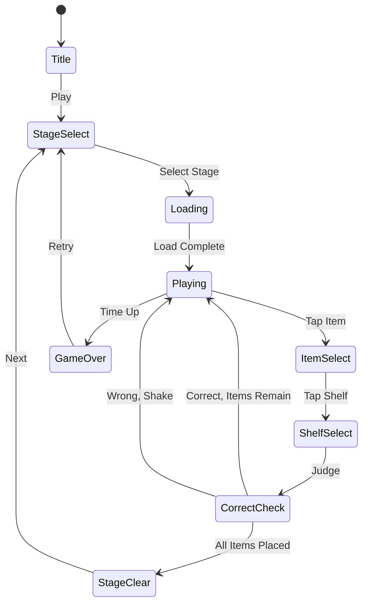

# Tidy Master

> 흩어진 물건들을 올바른 선반/상자에 정리하는 분류 퍼즐 게임

## 개요

방 바닥에 다양한 카테고리의 물건이 흩어져 있다. 플레이어는 물건을 탭하여 선택한 뒤 올바른 선반/상자에 배치한다. 모든 물건을 올바르게 정리하면 스테이지 클리어.

## 게임 규칙

### 기본 규칙
- 바닥(그리드)에 여러 카테고리의 아이템이 흩어져 있음
- 각 카테고리는 전용 선반/상자가 지정되어 있음
- 카테고리당 아이템은 항상 **3개씩** 존재
- 플레이어가 아이템을 탭하면 **하이라이트** 됨
- 하이라이트 상태에서 올바른 선반을 탭하면 아이템이 **날아가서 배치**됨
- 잘못된 선반을 탭하면 **흔들림 애니메이션** + 콤보 리셋
- 제한 시간 내에 모든 아이템을 정리하면 **스테이지 클리어**
- 시간이 초과되면 **게임 오버**

### 카테고리 시스템
- 총 12개 카테고리, 각각 고유한 색상과 이모지로 구분됨
- 스테이지별로 사용되는 카테고리 수가 증가
- 선반은 카테고리 이모지와 색상으로 라벨링됨

### 카테고리 목록

| Emoji | Category | Color |
|-------|----------|-------|
| 📚 | Books | blue |
| 👕 | Clothes | pink |
| 🍎 | Food | green |
| 🧸 | Toys | yellow |
| 🎵 | Music | purple |
| 🏀 | Sports | orange |
| 💊 | Medicine | red |
| 🔧 | Tools | gray |
| 🌸 | Plants | lime |
| 🎨 | Art | cyan |
| ✏️ | Stationery | indigo |
| 🧹 | Cleaning | rose |

## 게임 플로우



## UI 레이아웃

```
┌─────────────────────────┐
│  ⏱ Timer    ⭐ Score    │  ← 상단 HUD
├─────────────────────────┤
│                         │
│  ┌──┐ ┌──┐ ┌──┐ ┌──┐  │
│  │📚│ │👕│ │🍎│ │📚│  │
│  └──┘ └──┘ └──┘ └──┘  │
│  ┌──┐ ┌──┐ ┌──┐ ┌──┐  │  ← 바닥 (아이템 그리드)
│  │🧸│ │🍎│ │👕│ │🧸│  │
│  └──┘ └──┘ └──┘ └──┘  │
│  ┌──┐ ┌──┐ ┌──┐ ┌──┐  │
│  │👕│ │🧸│ │🍎│ │📚│  │
│  └──┘ └──┘ └──┘ └──┘  │
│                         │
├─────────────────────────┤
│ [📚][👕][🍎][🧸]       │  ← 선반/상자 (카테고리별)
├─────────────────────────┤
│  💡 Hint    ↩️ Undo    │  ← 아이템/도구
└─────────────────────────┘
```

## 스코어링 시스템

| Action | Score |
|--------|-------|
| 올바른 배치 | +100 |
| 연속 정답 (콤보) | +100 × 콤보 수 |
| 잘못된 배치 | 콤보 리셋 |
| 스테이지 클리어 | +500 |
| 남은 시간 보너스 | 남은초 × 10 |

## 난이도 설계

| Stage | 카테고리 수 | 아이템 수 | 시간(초) |
|-------|------------|----------|----------|
| 1 | 3 | 9 | 60 |
| 2 | 4 | 12 | 90 |
| 3 | 5 | 15 | 90 |
| 4 | 6 | 18 | 120 |
| 5 | 7 | 21 | 120 |
| 6+ | min(7 + (stage-5), 12) | 카테고리 × 3 | 120 |

> 아이템 수 = 카테고리 수 × 3 (항상 3의 배수)

## 아이템/도구

| Item | Effect |
|------|--------|
| Hint | 정답 선반을 하이라이트로 표시 |
| Undo | 마지막 배치한 아이템을 바닥으로 복귀 |
| +Time | 시간 30초 추가 |

## 사운드/이펙트 (TODO)

- 아이템 선택: 톡 효과음
- 올바른 배치: 착 이펙트 + 사운드
- 잘못된 배치: 흔들림 + 실패 사운드
- 콤보: 상승 톤 효과음
- 스테이지 클리어: 축하 이펙트
- 게임 오버 (시간 초과): 실패 사운드

## MVP 범위

### Phase 1 (MVP)
- [x] 기획서 작성
- [ ] 기본 아이템 바닥 배치 (그리드)
- [ ] 아이템 선택 → 선반 배치 인터랙션
- [ ] 올바른/잘못된 배치 판정 로직
- [ ] 게임 오버 (시간 초과) / 클리어 판정
- [ ] 5 스테이지
- [ ] 스코어/콤보 시스템

### Phase 2
- [ ] Hint / Undo / +Time 아이템
- [ ] 스테이지 셀렉트 화면
- [ ] 프리미엄 룸 테마
- [ ] 사운드/이펙트
- [ ] 스테이지 6+ 무한 모드
