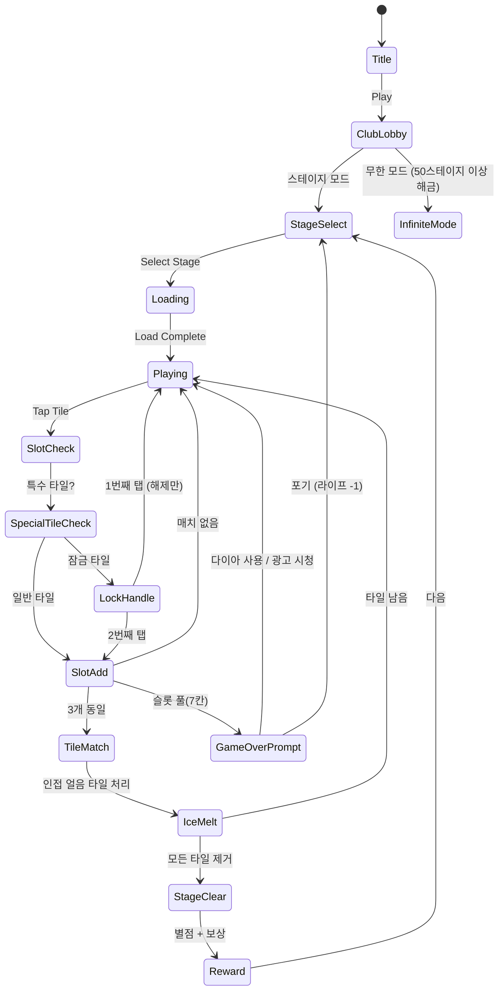

# 타일 클럽 (Tile Club)

> 트리플 타일 매치 스타일의 게임. 겹쳐진 타일 더미에서 같은 그림 3개를 모아 제거하는 전략 퍼즐.

## 개요

보드 위에 여러 레이어로 겹쳐진 타일 더미가 있다. 플레이어는 접근 가능한 타일을 탭하여 하단 슬롯에 모으고, 같은 그림 3개가 모이면 자동으로 제거된다. 모든 타일을 제거하면 스테이지 클리어.

found3와의 핵심 차이: found3는 **평면 보드**에서 선택하는 방식이라면, 타일 클럽은 **겹쳐진 3D 더미** 구조로 레이어 전략이 핵심이다.

---

## found3 vs 타일 클럽 비교 (차별화 분석)

| 항목 | found3 | 타일 클럽 |
|------|--------|-----------|
| 보드 구조 | 평면 격자 + 레이어 겹침 | 피라미드형 3D 레이어 더미 |
| 슬롯 크기 | 7칸 | 7칸 (동일) |
| 특수 타일 | 없음 | 잠금/얼음/시간 타일 |
| 파워업 | Shuffle, Undo | Shuffle, 자석, 폭탄 |
| 소셜 | 없음 | 클럽 시스템 + 팀 이벤트 |
| 모드 | 스테이지 | 스테이지 + 무한 모드 |
| 수익화 | 없음 | 라이프 + 파워업 IAP |
| 전략 깊이 | 중 | 고 (레이어 순서 최적화) |

**핵심 차별화 포인트:**
1. **레이어 전략**: 어떤 타일을 먼저 제거하느냐가 아래 레이어를 여는 핵심 전략
2. **특수 타일 조합**: 잠금/얼음/시간 타일이 퍼즐 복잡성을 배가
3. **클럽 소셜**: 혼자가 아닌 팀으로 플레이하는 리텐션 엔진

---

## 게임 규칙

### 기본 규칙
- 보드에 피라미드형으로 겹쳐진 타일 더미가 배치됨
- 모든 그림은 정확히 **3개씩** 존재
- 위 레이어에 덮인 타일은 선택 불가 (부분적으로라도 덮이면 잠김)
- 선택한 타일은 하단 **슬롯(최대 7칸)**에 임시 보관
- 슬롯 내 같은 그림 3개가 모이면 자동으로 제거됨
- 슬롯이 가득 차고 3매치 불가 시 **게임 오버**
- 모든 타일 제거 시 **스테이지 클리어**

### 타일 접근성 규칙
```
레이어 3 (최상단):  [A][B][C]          ← 항상 선택 가능
레이어 2 (중간):  [D][E][F][G]         ← A,B 제거 시 D 해방; B,C 제거 시 G 해방
레이어 1 (하단):  [H][I][J][K][L]      ← 위 레이어 타일이 걸치지 않으면 선택 가능
```
- 타일 위에 다른 타일이 **하나라도** 걸쳐 있으면 선택 불가
- 타일 좌상단/우상단 모두 비어있으면 선택 가능

---

## 타일 배치 알고리즘

### 피라미드형 레이어 구조

```
난이도 Easy (레이어 3):
     [1][2][3]
   [4][5][6][7]
 [8][9][10][11][12]

난이도 Medium (레이어 4):
       [1][2]
     [3][4][5]
   [6][7][8][9]
 [10][11][12][13][14]

난이도 Hard (레이어 5+):
         [1]
       [2][3]
     [4][5][6]
   [7][8][9][10]
 [11][12][13][14][15]
```

### 배치 알고리즘 설계

```
1. 총 타일 수 결정 (3의 배수)
2. 그림 종류 = 총 타일 수 / 3
3. 타일 더미 = 각 그림 × 3개 섞기
4. 레이어별로 배치 (하단 → 상단 순)
5. 솔버 검증:
   - 반드시 클리어 가능한 경로가 1개 이상 존재하는지 확인
   - 불가능하면 재배치 (최대 100회 시도)
6. 특수 타일 삽입 (난이도에 따라 비율 조정)
```

### 난이도별 레이어 설계

| 난이도 | 레이어 수 | 그림 종류 | 타일 수 | 특수 타일 비율 | 시간(초) |
|--------|-----------|-----------|---------|----------------|----------|
| Easy (1~10) | 3 | 6~8 | 18~24 | 0% | 180 |
| Normal (11~30) | 4 | 8~12 | 24~36 | 10% | 150 |
| Hard (31~60) | 5 | 12~16 | 36~48 | 20% | 120 |
| Expert (61~100) | 6 | 16~20 | 48~60 | 30% | 90 |
| Master (101+) | 7+ | 20+ | 60+ | 40% | 60 |

---

## 특수 타일

### 1. 잠금 타일 (Lock Tile) 🔒
- **모양**: 자물쇠 아이콘 오버레이
- **동작**: 첫 번째 탭 → 자물쇠 해제 (슬롯에 안 들어감), 두 번째 탭 → 슬롯으로 이동
- **전략적 역할**: 플레이어가 실수로 원하지 않는 타일을 집는 것 방지 → 신중한 선택 강요
- **해제 방법**: 자석 파워업 사용 시 한 번에 해제 가능

### 2. 얼음 타일 (Ice Tile) 🧊
- **모양**: 타일이 얼음에 감싸진 형태
- **동작**: 선택 불가. 인접한 같은 그림 타일이 매치되어 제거될 때 얼음이 1단계 녹음
- **단계**: 얼음 2겹 → 1겹 → 해제 (2번 인접 매치 필요)
- **전략적 역할**: 억지로 인접 타일을 매치해서 얼음을 녹여야 하는 퍼즐 요소
- **해제 방법**: 폭탄 파워업으로 즉시 제거 가능

### 3. 시간 타일 (Time Tile) ⏰
- **모양**: 시계 아이콘 오버레이, 카운트다운 숫자 표시
- **동작**: 스테이지 시작 시 10초 카운트다운 시작. 0이 되기 전에 선택하지 않으면 주변 2칸에 얼음 적용
- **전략적 역할**: 긴급성 부여. 다른 타일을 집는 중에도 시간 타일 모니터링 필요
- **리셋**: 해당 타일 선택 시 카운트다운 리셋 (새 시간 타일로 교체되지 않음)

### 특수 타일 조합 전략 예시
```
상황: 슬롯 5/7칸 사용 중, 잠금 타일 + 얼음 타일 동시 존재
→ 자석 사용하여 잠금 해제 + 매칭 시도
→ 또는 폭탄으로 얼음 제거 후 경로 확보
```

---

## 파워업 시스템

### 1. 셔플 (Shuffle) 🔀
- **효과**: 현재 보드의 타일 위치를 랜덤 재배치 (레이어 구조는 유지)
- **슬롯 타일은 유지**: 슬롯에 있는 타일은 영향 없음
- **사용 타이밍**: 더 이상 좋은 수가 없을 때 / 막힌 상황 타개
- **쿨타임**: 없음 (소모성 아이템)
- **획득**: IAP 또는 스테이지 클리어 보상

### 2. 자석 (Magnet) 🧲
- **효과**: 보드에서 선택한 타일과 같은 그림의 타일을 모두 슬롯으로 끌어당김
- **최대 2개**: 슬롯 여유 공간에 맞게 최대 2개 추가 (3매치를 위해)
- **잠금 타일 해제**: 잠금 타일도 강제 해제하여 끌어당김
- **접근 불가 타일 제외**: 아직 덮여있는 타일은 끌어당길 수 없음
- **사용 타이밍**: 특정 그림이 1~2개 이미 슬롯에 있을 때 3매치 완성
- **획득**: IAP 또는 광고 시청

### 3. 폭탄 (Bomb) 💣
- **효과**: 선택한 타일 1개를 즉시 제거 (슬롯에 넣지 않고 보드에서 바로 삭제)
- **얼음 파괴**: 얼음 타일도 즉시 제거
- **잠금 해제 후 삭제**: 잠금 타일에 사용하면 잠금 해제 + 제거
- **레이어 해방**: 위 타일 제거로 아래 레이어 타일 해방 가능
- **사용 타이밍**: 슬롯이 꽉 찼을 때 긴급 탈출 / 얼음 타일 해제
- **획득**: IAP 전용 (가장 강력한 파워업)

### 파워업 밸런스

| 파워업 | 강도 | IAP 가격 | 광고 획득 | 스테이지 보상 |
|--------|------|----------|-----------|--------------|
| 셔플 | 낮음 | 500원 (5개) | O | O (클리어 시) |
| 자석 | 중간 | 1,200원 (3개) | O | X |
| 폭탄 | 높음 | 2,500원 (3개) | X | X |

---

## 소셜 요소

### 클럽 시스템 (Club System) 🏆

**클럽이란?**
- 최대 30명이 함께하는 소셜 그룹
- 클럽 레벨이 올라갈수록 보상 배율 증가
- 주간 클럽 점수 = 멤버 개인 점수 합산

**클럽 운영**
```
클럽 생성: 다이아 50개 소모
클럽 가입: 자유 가입 or 리더 승인
클럽 레벨: 1~10 (주간 점수 누적으로 성장)
클럽 혜택: 레벨당 일일 파워업 지급량 +1
```

**클럽 채팅**: 간단한 이모지 반응 시스템 (텍스트 채팅 X - MVP 단순화)

### 팀 이벤트 (Team Event) 🎯

**주간 보스 이벤트**
- 매주 월요일 리셋
- 클럽 전체가 보스 HP를 공동으로 줄임
- 개인 스테이지 클리어 → 보스 HP 감소
- 보스 처치 시 클럽 전원에게 보상 지급

```
보스 HP: 클럽 멤버 수 × 1,000
개인 기여: 스테이지 클리어 당 -100 HP
보상 티어:
  - 25% 달성: 셔플 2개
  - 50% 달성: 자석 1개 + 코인 500
  - 75% 달성: 폭탄 1개 + 코인 1,000
  - 100% 달성: 다이아 10개 + 특별 아바타 프레임
```

**클럽 레이스**
- 클럽 vs 클럽 주간 점수 경쟁
- 비슷한 레벨의 클럽끼리 매칭
- 상위 클럽에게 다음 주 보너스 코인

### 리더보드 (Leaderboard) 📊

**종류**
1. **글로벌 랭킹**: 전체 유저 최고 스테이지 기준
2. **클럽 랭킹**: 클럽 주간 점수 기준
3. **친구 랭킹**: 카카오/Apple 로그인 친구 중 순위

**리셋 주기**
- 글로벌: 월간 리셋 (뱃지 부여 후)
- 클럽: 주간 리셋
- 친구: 항상 현재 상태

---

## 스테이지 vs 무한 모드 리텐션 분석

### 스테이지 모드 (추천 메인 모드)

**장점:**
- 명확한 진행 지표 → "다음 스테이지" 욕구 자극
- 난이도 곡선 설계 가능 → 적절한 좌절감 → IAP 유도
- 소셜 공유 포인트 ("나 100스테이지 클리어!")
- 퍼즐 설계로 "계획된 막힘" 가능

**단점:**
- 콘텐츠 소진 속도 빠름 (초기 100스테이지 만들어야 함)
- 어려운 스테이지에서 이탈율 급증

**리텐션 패턴:** 스테이지 게임은 D1 80%, D7 40%, D30 15%가 가능 (잘 만들 경우)

### 무한 모드 (보조 모드)

**장점:**
- 콘텐츠 소진 걱정 없음
- 하이스코어 경쟁으로 소셜 리텐션
- 캐주얼 유저 진입 장벽 낮음

**단점:**
- "목표 없음" → 동기부여 약함
- IAP 유도 포인트 설계 어려움
- 리더보드 의존 → 소셜 없으면 의미 없음

### 결론: 하이브리드 구조 추천

```
메인: 스테이지 모드 (1~∞)
  ↓ 스테이지 50 도달 시 해금
보조: 무한 모드
  - 주간 토너먼트 형식
  - 클럽 점수 2배 적용
  - 리더보드 주간 리셋
```

**근거**: Tile Master, 타일 클럽 원조 게임들은 모두 스테이지 메인 구조.
무한 모드는 코어 유저 리텐션용 세컨드 훅으로 활용.

---

## 수익화 전략

### 핵심 수익 모델: Energy + IAP

#### 라이프 시스템 (에너지 게이트)
```
최대 라이프: 5개
라이프 회복: 30분당 1개
전부 소진: 광고 시청(1개 즉시) 또는 다이아 결제로 회복
```

**게임 오버 흐름:**
```
게임 오버 → "계속하기?" 팝업
  → 다이아 10개: 슬롯 1칸 비우기 (긴급 구제)
  → 광고 시청: 셔플 1회 지급
  → 포기: 라이프 1개 소모
```

#### IAP 상품 구성

| 상품명 | 가격 | 내용 | 타겟 |
|--------|------|------|------|
| 스타터팩 | ₩1,900 | 다이아 100 + 셔플×5 + 자석×3 | 신규 유저 (1회) |
| 파워팩 | ₩3,900 | 다이아 300 + 파워업 세트 | 미드코어 |
| 라이프 무제한 | ₩3,900/주 | 7일 라이프 무제한 | 헤비 유저 |
| 라이프 무제한 | ₩9,900/월 | 30일 라이프 무제한 | 구독형 핵심 |
| 다이아 소팩 | ₩1,200 | 다이아 80개 | 충동 구매 |
| 다이아 중팩 | ₩5,900 | 다이아 500개 | 밸류팩 |
| 다이아 대팩 | ₩11,900 | 다이아 1,200개 | 고래 |

#### 광고 수익 (하이브리드)
- 라이프 1개 충전: 광고 30초
- 파워업 힌트: 광고 시청 후 셔플 1회
- 보상형 광고 한도: 하루 5회 (IAP 가치 보호)

#### 수익화 퍼널
```
신규 유저 → 무료 플레이 (스테이지 1~15)
    ↓ 첫 막힘 (스테이지 15~20)
스타터팩 노출 (₩1,900)
    ↓ 구매 or 광고
계속 플레이 → 라이프 소진 → 라이프 무제한 구독 유도
    ↓
클럽 가입 → 팀 이벤트 참여 → 소셜 리텐션 → 장기 과금
```

---

## found3 개선 제안 (타일 클럽 → found3 역이식)

### 1. 잠금 타일 추가
- **현재 found3**: 모든 타일이 탭하면 즉시 슬롯으로 이동
- **개선**: 잠금 타일 도입으로 실수 방지 메카닉 추가
- **기대효과**: 전략적 깊이 증가, 고난이도 스테이지 설계 가능
- **구현 난이도**: 낮음 (기존 타일 클래스에 `locked: boolean` 필드 + 탭 카운트 추가)

### 2. 자석 파워업 추가
- **현재 found3**: Shuffle과 Undo만 있음
- **개선**: 자석 파워업으로 "3매치 완성" 감각적 쾌감 추가
- **기대효과**: IAP 판매 포인트 1개 추가, 막힌 상황 탈출 옵션 다양화
- **구현 난이도**: 중간 (같은 그림 타일 탐색 로직 + 슬롯 이동 애니메이션)

### 3. 주간 챌린지 모드
- **현재 found3**: 단순 스테이지 클리어 구조
- **개선**: 매주 특별 규칙 스테이지 추가 (예: "셔플 없이 클리어", "30초 안에 클리어")
- **기대효과**: D7, D30 리텐션 향상, 소셜 공유 포인트 생성
- **구현 난이도**: 낮음 (스테이지 메타데이터에 challenge 규칙 필드 추가)

---

## 게임 플로우



## UI 레이아웃

```
┌─────────────────────────────┐
│ 🏆클럽명  ❤️❤️❤️  ⭐점수  ⏱  │  ← 상단 HUD
├─────────────────────────────┤
│                             │
│         [3층]               │
│       [🌸][🌺][🌸]          │
│      [🍎][🔒][🍎][🌺]       │  ← 타일 더미 (3D 겹침)
│    [🧊][🍎][🌺][🌸][🍎]    │    🔒=잠금 🧊=얼음
│  [⏰][🌺][🍎][🌸][🌺][🌸]  │    ⏰=시간타일
│                             │
├─────────────────────────────┤
│ [🌸][🌺][  ][  ][  ][  ][  ] │  ← 슬롯 (7칸)
├─────────────────────────────┤
│  🔀 셔플  🧲 자석  💣 폭탄  │  ← 파워업
└─────────────────────────────┘
```

---

## 스코어링 시스템

| Action | Score |
|--------|-------|
| 타일 3매치 제거 | +100 |
| 연속 매치 (콤보) | +100 × 콤보 수 |
| 특수 타일 제거 | +200 (잠금/얼음/시간) |
| 스테이지 클리어 | +500 |
| 남은 시간 보너스 | 남은초 × 10 |
| 파워업 미사용 클리어 | +300 보너스 |

**별점 기준:**
- ⭐: 클리어
- ⭐⭐: 파워업 1개 이하 사용
- ⭐⭐⭐: 파워업 미사용 + 시간 50% 이상 남음

---

## 사운드/이펙트

- 타일 선택: 경쾌한 클릭음
- 잠금 타일 1차 탭: 자물쇠 클릭음
- 잠금 타일 2차 탭: 해방 효과음
- 얼음 해제: 얼음 깨지는 효과음
- 시간 타일 카운트다운: 10초~3초 무음, 2초~0초 경보음
- 3매치 제거: 팡 이펙트 + 상승 효과음
- 콤보: 점점 피치 높아지는 효과음
- 자석 발동: 자석 당기는 효과음 + 타일 날아오는 애니메이션
- 폭탄 발동: 폭발 이펙트 + 사운드
- 스테이지 클리어: 축하 이펙트 + 별 애니메이션
- 게임 오버: 실망 효과음

---

## MVP 범위

### Phase 1 (Week 1) - 핵심 게임플레이
- [ ] 기획서 작성 ← 완료
- [ ] 피라미드형 타일 더미 보드 (3레이어)
- [ ] 타일 접근성 판정 로직 (위 타일 겹침 체크)
- [ ] 타일 선택 → 슬롯 이동
- [ ] 3매치 자동 제거 로직
- [ ] 게임 오버 / 클리어 판정
- [ ] 셔플 파워업
- [ ] 10 스테이지

### Phase 2 (Week 2) - 특수 타일 + 소셜
- [ ] 잠금 타일
- [ ] 얼음 타일
- [ ] 시간 타일
- [ ] 자석 파워업
- [ ] 폭탄 파워업
- [ ] 라이프 시스템
- [ ] 클럽 시스템 (기본)
- [ ] 리더보드

### Phase 3 (Post-MVP)
- [ ] 무한 모드
- [ ] 팀 이벤트 / 보스
- [ ] IAP 결제 연동
- [ ] 광고 SDK 연동
- [ ] 클럽 레이스
