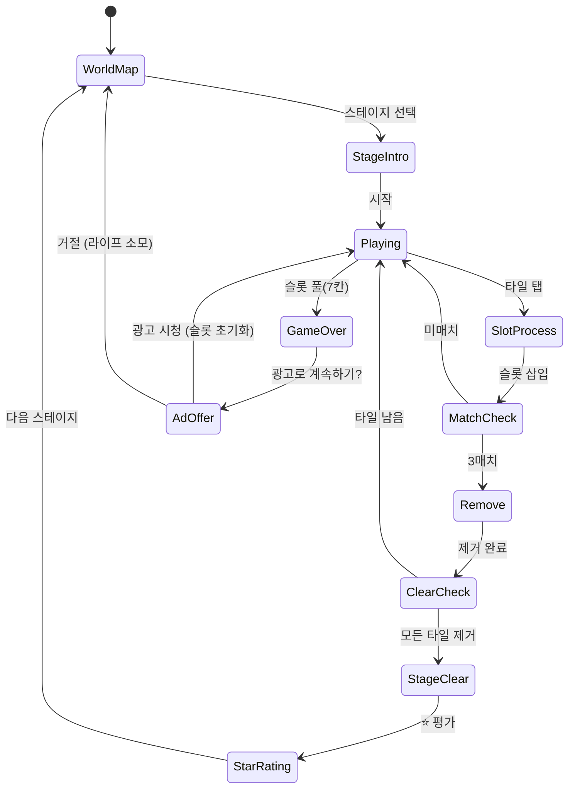

# Tile Explorer — 트리플 매치

> **레퍼런스 분석 기획서** | Rank #6 | 개발사: Oakever Games | 평점: 4.8
>
> 이 문서는 Tile Explorer를 경쟁작으로 분석하고, found3 개선에 활용하기 위한 기획서입니다.

---

## 개요

보드 위에 여러 레이어로 겹쳐진 타일 더미에서 같은 종류의 타일 3개를 슬롯에 모아 제거하는 퍼즐 게임.
found3와 동일한 코어 메카닉(3매치 슬롯 시스템)을 기반으로 하되,
**탐험(Explorer)** 테마와 레이어 구조, 특수 타일 시스템으로 차별화.

---

## found3 대비 차별화 포인트

### 핵심 차이점 비교

| 요소 | found3 (우리 게임) | Tile Explorer (경쟁작) |
|------|------------------|----------------------|
| 보드 형태 | 격자형 평면 배치 | 자유형 피라미드/더미 구조 |
| 레이어 | 최대 3레이어 (단순 겹침) | 최대 5~6레이어 (복잡한 입체 구조) |
| 타일 가림 | 바로 위 타일만 체크 | 대각선 포함 다방향 가림 판정 |
| 특수 타일 | 없음 (MVP) | 잠금, 얼음, 체인, 와일드카드 |
| 아이템 | Shuffle, Undo | Shuffle, Undo, 즉시 제거, 힌트 |
| 수익화 | 미정 | 라이프 + 광고 리워드 아이템 |
| 테마 | 그림 찾기 퍼즐 | 유적 탐험 / 보물 발굴 |
| 레벨 볼륨 | 5스테이지 (MVP) | 수백 스테이지 (월드맵) |

### Tile Explorer의 핵심 강점

1. **입체적 레이어 구조**: 타일이 불규칙하게 쌓여 "탐험하는" 느낌을 만듦
2. **풍부한 특수 타일**: 전략적 선택지를 늘려 깊이감 부여
3. **명확한 수익화**: 라이프 시스템 + 광고 리워드로 DAU 기반 매출 확보
4. **탐험 내러티브**: 스테이지마다 새로운 유적을 발굴하는 스토리 구조

---

## 게임 규칙

### 기본 규칙
- 보드에 타일이 피라미드/더미 형태로 쌓여 있음
- 모든 타일 종류는 정확히 **3의 배수**로 존재
- 위에 덮이지 않은(활성화된) 타일만 선택 가능
- 선택한 타일은 하단 **슬롯(7칸)**에 보관
- 슬롯에 같은 종류 3개가 모이면 자동 제거
- 슬롯 7칸이 가득 차고 매치 불가 → **게임 오버**
- 보드의 모든 타일 제거 → **스테이지 클리어**

### 슬롯 시스템 (7칸)

```
[ ][ ][ ][ ][ ][ ][ ]
 1  2  3  4  5  6  7

삽입 규칙:
- 같은 종류 타일이 이미 슬롯에 있으면, 해당 타일 옆에 삽입
- 없으면 오른쪽 빈 칸에 추가
- 3개 모이면 0.3초 후 자동 제거 (애니메이션 포함)

예시:
[🌸][🌸][  ] → 🌸 선택 → [🌸][🌸][🌸] → 자동 제거
[🍎][🌺][  ] → 🌸 선택 → [🍎][🌺][🌸] (빈 칸 삽입)
```

---

## 타일 레이어 시스템

### 레이어 구조

```
레이어 5 (최상단)    ●
레이어 4           ● ●
레이어 3          ● ● ●
레이어 2         ● ● ● ●
레이어 1 (기반)  ● ● ● ● ●
```

### 가림 판정 규칙

타일 A가 **활성화(선택 가능)** 되려면:
- A 위에 놓인 모든 타일이 제거되어야 함
- 판정 방식: 타일 A의 중심 좌표에서 위쪽으로 겹치는 타일이 없어야 함

```
가림 판정 (타일 크기 단위):
        [상단 타일]
    ↙         ↘
[좌하 타일] [우하 타일]

하단 타일은 2개의 상단 타일에 의해 가려질 수 있음
→ 두 타일 중 하나라도 남아있으면 선택 불가
```

### 레이어별 시각 효과

| 레이어 | 밝기 | 그림자 | 테두리 | 설명 |
|--------|------|--------|--------|------|
| 최상단 | 100% | 강한 드롭섀도 | 밝은 테두리 | 즉시 선택 가능 |
| 중간 | 85% | 중간 섀도 | 기본 테두리 | 부분적으로 가려짐 |
| 하단 | 70% | 약한 섀도 | 어두운 테두리 | 많이 가려짐 |
| 잠금 상태 | 60% | 없음 | 회색 테두리 | 선택 불가 표시 |

---

## 특수 타일

### 잠금 타일 (Locked Tile)

```
┌──────┐
│  🔒  │
│ [🌸] │
└──────┘
```

- 외형: 자물쇠 아이콘이 오버레이된 타일
- 특성: 인접한 같은 타일 3개가 슬롯에서 제거될 때 잠금 해제
- 활용: 특정 타일을 보호하거나 순서 강제
- 레벨 도입: Level 8 이후

### 얼음 타일 (Frozen Tile)

```
┌──────┐
│❄️❄️❄️│
│ [🍎] │
└──────┘
```

- 외형: 반투명 얼음 레이어가 덮인 타일
- 특성: 선택 시 슬롯으로 이동하지 않고 얼음만 1단계 감소
- 얼음 단계: 2단계 (2번 탭해야 슬롯으로 이동)
- 레벨 도입: Level 12 이후

### 체인 타일 (Chained Tile)

```
┌──────┐
│⛓️    │
│ [🌺] │
└──────┘
```

- 외형: 체인으로 묶인 타일 (2개 또는 3개 연결)
- 특성: 체인으로 연결된 타일은 같이 선택되거나 같이 잠김
- 체인된 타일 중 하나가 선택 가능해야 모두 선택 가능
- 레벨 도입: Level 20 이후

### 와일드카드 타일 (Wildcard)

```
┌──────┐
│  ⭐  │
│  ANY │
└──────┘
```

- 외형: 별/무지개 패턴의 특수 타일
- 특성: 슬롯에 넣으면 같은 종류 2개 + 와일드카드 = 3매치 성립
- 희귀도: 스테이지당 1~2개만 배치
- 레벨 도입: Level 6 이후

---

## 아이템 시스템

### 기본 아이템 3종

| 아이템 | 아이콘 | 효과 | 기본 보유 | 획득 방법 |
|--------|--------|------|-----------|-----------|
| Shuffle | 🔀 | 보드 위 활성 타일 위치 랜덤 재배치 | 2개 | 광고/구매 |
| Undo | ↩️ | 슬롯 마지막 타일 → 보드 복귀 | 2개 | 광고/구매 |
| 즉시 제거 | 💥 | 슬롯에서 같은 종류 타일 1~2개 선택해 제거 | 1개 | 광고/구매 |

### 아이템 사용 UI

```
┌─────────────────────────────────┐
│  🔀 ×2    ↩️ ×2    💥 ×1       │
│  [셔플]  [되돌리기] [제거]       │
└─────────────────────────────────┘
```

### 힌트 시스템

- 10초 이상 미입력 시 활성화 가능한 타일 중 매치 가능한 조합 하이라이트
- 힌트 사용 시 스코어 -50 페널티 (선택적 도입)

---

## 게임 플로우



---

## UI 레이아웃

```
┌─────────────────────────────────┐
│ ❤️❤️❤️  Lv.15  ⭐ 12,340       │ ← HUD (라이프 + 레벨 + 스코어)
├─────────────────────────────────┤
│           [진행 바]              │ ← 타일 제거 진행도
├─────────────────────────────────┤
│                                 │
│         ┌──┐                    │
│      ┌──┐🌸┌──┐                │
│   ┌──┐🍎┌──┐🌺┌──┐            │ ← 타일 보드
│ ┌──┐🌸┌──┐🍎┌──┐🌸┌──┐       │   (피라미드 구조)
│ └──┘🌺└──┘🌺└──┘🍎└──┘       │
│                                 │
├─────────────────────────────────┤
│ [🌸][🌺][  ][  ][  ][  ][  ]  │ ← 슬롯 (7칸)
├─────────────────────────────────┤
│   🔀 ×2   ↩️ ×2   💥 ×1       │ ← 아이템
└─────────────────────────────────┘
```

---

## 스코어링 시스템

| 액션 | 점수 |
|------|------|
| 타일 3매치 제거 | +100 |
| 연속 콤보 (n연속) | +100 × n |
| 와일드카드 매치 | +200 |
| 특수 타일 해제 | +150 |
| 스테이지 클리어 | +500 |
| 잔여 슬롯 여유 보너스 | 빈 슬롯 수 × 50 |

### ⭐ 스타 평가 (스테이지 클리어 시)

| 별 | 조건 |
|----|------|
| ⭐⭐⭐ | 아이템 미사용 + 콤보 5+ |
| ⭐⭐ | 아이템 1개 이하 사용 |
| ⭐ | 클리어만 |

---

## 난이도 설계

| 구간 | 레벨 | 특수 타일 | 레이어 수 | 타일 종류 | 특징 |
|------|------|-----------|-----------|-----------|------|
| 튜토리얼 | 1~5 | 없음 | 1~2 | 4~6 | 기본 메카닉 학습 |
| 초급 | 6~15 | 와일드카드 | 2~3 | 6~8 | 첫 특수 타일 도입 |
| 중급 | 16~30 | 잠금, 얼음 | 3~4 | 8~10 | 전략적 선택 필요 |
| 고급 | 31~50 | 체인 추가 | 4~5 | 10~12 | 복합 특수 타일 |
| 전문가 | 51+ | 모든 타일 | 5~6 | 12~15 | 타임어택 옵션 |

---

## 수익화 모델

### 라이프 시스템

```
최대 라이프: ❤️❤️❤️❤️❤️ (5개)
회복 속도: 30분당 1개
즉시 충전: 광고 시청 또는 💎 구매
```

- 게임 오버 시 라이프 1개 소모
- 라이프 0개 → 30분 대기 or 광고 시청 or 결제

### 광고 리워드 (핵심 수익원)

| 트리거 | 광고 타입 | 리워드 |
|--------|-----------|--------|
| 게임 오버 후 계속하기 | 보상형 | 슬롯 3칸 비우기 (1회) |
| 아이템 부족 시 | 보상형 | 아이템 1개 획득 |
| 스테이지 시작 전 | 보상형 | 아이템 2배 충전 |
| 앱 재시작 | 전면 광고 | - |

### 인앱 결제

| 상품 | 가격 | 내용 |
|------|------|------|
| 라이프 팩 | $0.99 | 라이프 5개 즉시 충전 |
| 아이템 번들 | $1.99 | 각 아이템 5개 |
| 광고 제거 | $2.99 | 광고 없는 게임 |
| 스타터 팩 | $4.99 | 라이프 + 아이템 + 광고제거 |

---

## found3 개선 우선순위 제안

> Tile Explorer를 경쟁작으로 분석한 결과, found3에 추가해야 할 기능 우선순위.
> **즉시 구현 가능하고 매출에 직결되는 순서**로 정렬.

### 🔴 P0 — 즉시 구현 (매출 직결)

#### 1. 광고 리워드 - "계속하기" 슬롯 초기화
- **효과**: 게임 오버 시 광고 보상으로 슬롯 3칸 비우기
- **난이도**: 낮음 (광고 SDK 연동 + 슬롯 제거 로직)
- **매출 기여**: 핵심 수익 루프 / CPI 대비 ARPU 향상

#### 2. 라이프 시스템
- **효과**: DAU 리텐션 + 라이프 소진 시 광고/결제 유도
- **난이도**: 낮음 (로컬 스토리지 타이머)
- **구조**: 최대 5라이프, 30분당 1충전, 광고로 즉시 충전

#### 3. 아이템 - 즉시 제거 추가
- **효과**: 슬롯에서 1~2개 타일 선택 제거
- **난이도**: 낮음 (슬롯 삭제 로직 추가)
- **현재 found3**: Shuffle + Undo만 있음

### 🟡 P1 — 1~2주 내 구현 (리텐션 향상)

#### 4. 스타 평가 시스템 (⭐⭐⭐)
- **효과**: 스테이지 재도전 동기 부여 + 광고 노출 기회 증가
- **난이도**: 낮음 (클리어 조건 판정 + UI)

#### 5. 와일드카드 특수 타일
- **효과**: 전략적 깊이 추가, 어려운 상황 탈출구 제공
- **난이도**: 중간 (타일 매칭 로직 수정)
- **밸런스**: 스테이지당 1~2개 제한

#### 6. 월드맵 / 스테이지 선택 UI
- **효과**: 진행감 + 재방문 동기
- **현재**: 5스테이지 직렬 → 확장 여지 필요

### 🟢 P2 — 데이터 확인 후 (게임성 강화)

#### 7. 잠금/얼음 특수 타일
- **데이터 조건**: DAU 500+ 이상, 리텐션 D1 40%+ 확인 후
- **효과**: 중후반 난이도 곡선 개선

#### 8. 콤보 연출 강화
- **효과**: 감각적 만족감 → 세션 타임 증가

#### 9. 체인 타일
- **데이터 조건**: 유저 레벨 분포 확인 후

---

## MVP 범위 (Tile Explorer 자체 구현 시)

> **결론**: found3와 완전히 겹치는 장르이므로, 별도 구현보다 found3 강화 집중 권장.
> 만약 출시한다면 found3와 충분한 차별화 후.

### 차별화 필수 조건
1. 피라미드 레이어 구조 (found3는 격자형) → 다른 비주얼
2. 특수 타일 최소 2종 (잠금 + 와일드카드) → 다른 전략
3. 탐험 테마 아트 (유적/보물) → 다른 감성

### Phase 1 (MVP, 2주)
- [ ] 피라미드 보드 구조 구현
- [ ] 기본 타일 레이어 + 가림 판정
- [ ] 슬롯 시스템 (7칸)
- [ ] 와일드카드 타일
- [ ] 10 스테이지

### Phase 2 (1주 추가)
- [ ] 잠금/얼음 특수 타일
- [ ] 광고 리워드 연동
- [ ] 라이프 시스템
- [ ] 스타 평가

---

## 사운드/이펙트

| 이벤트 | 사운드 | 이펙트 |
|--------|--------|--------|
| 타일 탭 | 돌 두드리는 소리 | 선택 하이라이트 |
| 잠금 타일 탭 시도 | 잠금 클릭음 | 흔들림 효과 |
| 얼음 타일 1단계 제거 | 얼음 깨지는 소리 | 크랙 이펙트 |
| 3매치 제거 | 보석 획득음 | 파티클 폭발 |
| 와일드카드 사용 | 마법 소리 | 무지개 이펙트 |
| 콤보 | 상승 톤 (3단계) | 콤보 카운터 팝업 |
| 게임 오버 | 돌 무너지는 소리 | 화면 흔들림 |
| 스테이지 클리어 | 트럼펫 팡파레 | 별 획득 애니메이션 |
