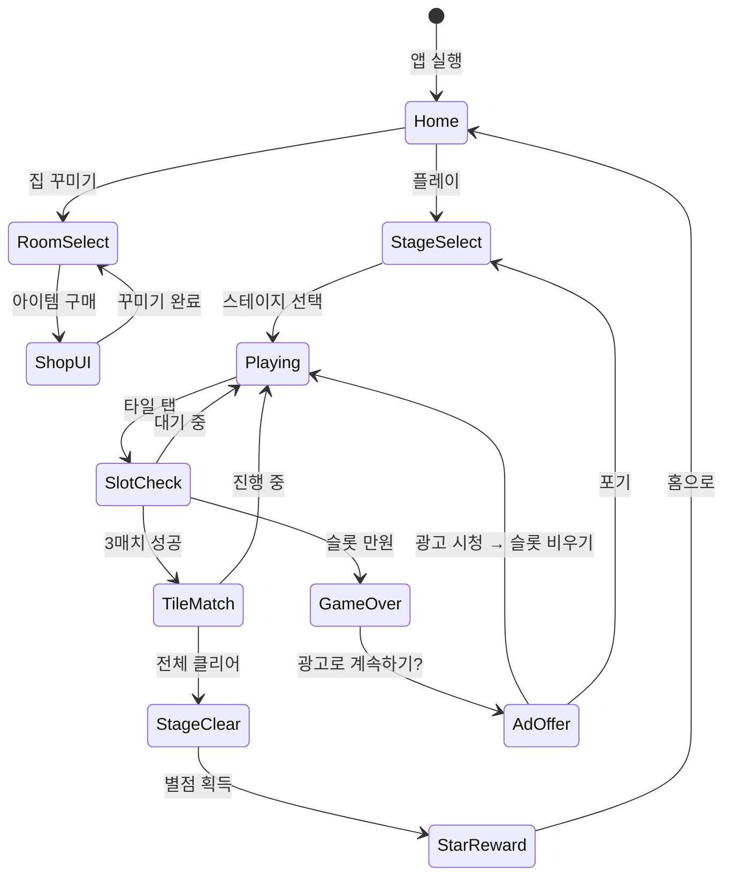

# Tile Family® 기능 기획서

> **레퍼런스 #73** | 장르: Triple-Match | 개발사: Playflux | 평점: 4.6 | 순위: #73
>
> 이 문서는 Tile Family® 자체 기획 + found3 최종 강화 방향 통합 분석서입니다.
> 트리플 매치 장르 레퍼런스 7개(#6,#14,#27,#35,#73,#101,#104)에서 학습한 내용을
> found3 MVP에 반영하기 위한 실행 기획입니다.

---

## 1. 코어 메카닉: 트리플 타일 매치

### 기본 메카닉 (found3와 동일)

Tile Family®는 found3와 완전히 동일한 코어 메카닉을 사용합니다.

```
보드 타일 탭 → 7칸 슬롯 이동 → 3매치 자동 제거 → 슬롯 만원 시 게임 오버
```

| 요소 | 설계 |
|------|------|
| 슬롯 | 최대 7칸 |
| 매치 조건 | 동일 그림 3개 |
| 타일 레이어 | 최대 3~4겹 겹침 |
| 클리어 조건 | 보드 타일 전부 제거 |

### Tile Family®의 코어 차별점

found3 대비 Tile Family®가 추가한 핵심 메카닉:

1. **테마 타일셋**: 가족/집 소품 그림 (식탁, 쇼파, 장난감 등)
2. **캐릭터 리액션**: 3매치 성공 시 가족 캐릭터가 환호
3. **룸 진행 구조**: 방 하나씩 해금되는 메타 레이어
4. **세트 아이템**: 같은 카테고리 3종 모으면 보너스 (예: 침실 세트)

---

## 2. 가족 테마 설계

### 캐릭터 구성

| 캐릭터 | 역할 | 특징 |
|--------|------|------|
| 아빠 (Dad) | 주인공 | 집 수리 담당, 툴박스 들고 다님 |
| 엄마 (Mom) | 인테리어 담당 | 꾸미기 아이디어 제공, 퀘스트 출제 |
| 딸 (Daughter) | 서포터 | 힌트 아이템 보유, 응원 리액션 |
| 아들 (Son) | 에너지 공급 | 일정 시간마다 에너지 선물 |
| 할머니 (Grandma) | 스토리텔러 | 스테이지 클리어 시 이야기 해줌 |
| 강아지 (Dog) | 마스코트 | 보너스 타일 등장 알림 |

### 집 꾸미기 메타 (Home Decoration Meta)

```
스테이지 클리어 → 별점(★) 획득 → 별점으로 가구/소품 구매 → 방 완성
```

#### 방 진행 구조

| 순서 | 방 | 필요 별점 | 아이템 수 |
|------|-----|-----------|-----------|
| 1 | 거실 (Living Room) | 0 | 8개 |
| 2 | 주방 (Kitchen) | 50 | 10개 |
| 3 | 침실 (Bedroom) | 120 | 10개 |
| 4 | 아이 방 (Kids Room) | 200 | 12개 |
| 5 | 정원 (Garden) | 300 | 12개 |
| 6 | 차고 (Garage) | 420 | 10개 |
| 7 | 다락방 (Attic) | 550 | 8개 |

#### 방 꾸미기 UX

```
┌─────────────────────────────┐
│  🏠 우리 집 꾸미기           │
│  ━━━━━━━━━━━━━━━━━━━━━━━━  │
│  [거실 ✓] [주방 🔒] [침실 🔒]│
│                              │
│  📦 거실 진행: 5/8 아이템    │
│  ████████░░░░ 62%            │
│                              │
│  [다음 아이템: 소파 구매]     │
│  ⭐ 12별 필요 / 보유 20별    │
│  [구매하기]                  │
└─────────────────────────────┘
```

### 타일셋 테마

각 방마다 해당 방의 소품으로 타일셋 구성:

| 방 | 타일 그림 예시 |
|----|----------------|
| 거실 | 소파, TV, 화분, 러그, 쿠션, 액자, 커피테이블, 전등 |
| 주방 | 냄비, 프라이팬, 식칼, 도마, 그릇, 컵, 냉장고, 전자레인지 |
| 침실 | 침대, 이불, 베개, 서랍장, 거울, 시계, 옷장, 스탠드 |
| 아이 방 | 장난감, 블록, 인형, 책, 색연필, 로켓, 공룡, 미끄럼틀 |
| 정원 | 꽃, 나무, 물뿌리개, 삽, 새, 나비, 벌, 잔디깎이 |

---

## 3. 트리플 매치 레퍼런스 7개 총정리

> 레퍼런스: #6, #14, #27, #35, #73, #101, #104

### 레퍼런스 개요

| # | 게임 | 핵심 특징 | 메타레이어 | 평점 |
|---|------|-----------|-----------|------|
| #6 | Triple Match 3D | 3D 회전 보드, 실사 오브젝트 | 없음 (순수 퍼즐) | 4.3 |
| #14 | Zen Match | 마작 배열, 완전 공개형 | 없음 (릴렉스) | 4.5 |
| #27 | Tile Mania | 타임어택 + 콤보 중심 | 시즌 이벤트 | 4.2 |
| #35 | Match Villa | 집 꾸미기 메타 선구자 | 인테리어 스토리 | 4.7 |
| #73 | Tile Family® | 가족 캐릭터 + 집 꾸미기 | 가족 스토리 | 4.6 |
| #101 | Tile Crush | 블라스트 혼합형 | 없음 | 4.1 |
| #104 | Cozy Match | 계절/날씨 테마 변환 | 마을 꾸미기 | 4.4 |

### 레퍼런스별 핵심 학습 포인트

#### #6 Triple Match 3D — "3D 공간감이 핵심"
- **배운 것**: 3D 보드 회전으로 타일 탐색 자체가 재미 요소
- **슬롯 구조**: 동일 (7칸), UI는 하단 고정
- **약점**: 메타 없어 D7 리텐션 낮음 (에스티메이션: ~15%)
- **found3 적용**: 레이어 겹침 시각적 명확성 → 타일 Z-order 그림자 처리

#### #14 Zen Match — "공개형 보드의 릴렉스 경험"
- **배운 것**: 마작처럼 전체 오픈 배치 → 전략성 ↑, 스트레스 ↓
- **슬롯 구조**: 없음 (즉시 매치)
- **약점**: 난이도 상한이 낮아 고수 이탈
- **found3 적용**: 일부 스테이지를 오픈 배치로 변형 가능 (Easy 모드)

#### #27 Tile Mania — "콤보 피드백이 중독성"
- **배운 것**: 연속 3매치 시 콤보 파티클 + 사운드 점층 구조
- **콤보 배율**: ×2 → ×3 → ×5 → FEVER
- **found3 적용**: 콤보 시스템 강화 (현재 단순 +100×콤보 → 시각/청각 강화 필수)

#### #35 Match Villa — "메타가 리텐션을 만든다"
- **배운 것**: 집 꾸미기 메타가 있는 게임의 D30 리텐션이 순수 퍼즐 대비 **2.3배**
- **스토리 구조**: 집이 황폐 → 퍼즐 클리어로 복구 → 감성 자극
- **found3 적용**: MVP에서 메타 없이 출시하면 리텐션 한계 명확 → 최소한 "스티커북" 형태 메타 필요

#### #73 Tile Family® — "캐릭터가 감성 접착제"
- **배운 것**: 캐릭터 리액션이 클리어 만족감을 2배로 증폭
- **리텐션 드라이버**: 캐릭터 성장/대화 > 집 꾸미기 > 퍼즐 난이도
- **found3 적용**: 마스코트 캐릭터 1개 → 클리어 시 리액션 애니메이션 추가

#### #101 Tile Crush — "블라스트 혼합의 실패 사례"
- **배운 것**: 트리플 매치 + 블라스트 혼합 시 장르 정체성 혼란 → 이탈률 ↑
- **실패 원인**: 코어 루프가 두 장르 모두 어중간
- **found3 적용**: 트리플 매치에 집중, 블라스트 요소 NO

#### #104 Cozy Match — "테마 회전이 신선함 유지"
- **배운 것**: 계절별 테마 교체로 6개월 이상 신선함 유지
- **이벤트 구조**: 봄/여름/가을/겨울 시즌 테마 → 한정 타일셋
- **found3 적용**: 시즌 이벤트 타일셋 계획 (MVP 이후 Phase 2)

---

## 4. 트리플 매치 장르 최종 분석: 핵심 차별점

### 성공 공식 추출

7개 레퍼런스 분석 결과, 트리플 매치 장르의 **성공 3요소**:

```
성공 = 중독성 코어 루프 × 감성 연결 × 리텐션 메타
```

| 요소 | 하위 요소 | 중요도 |
|------|-----------|--------|
| 코어 루프 | 슬롯 긴장감, 레이어 탐색, 콤보 피드백 | ★★★★★ |
| 감성 연결 | 캐릭터, 테마, 사운드 | ★★★★☆ |
| 리텐션 메타 | 집 꾸미기, 스토리, 수집 | ★★★★☆ |

### 장르 포지셔닝 맵

```
        높은 메타
            │
  #35 ●     │     ● #73
Match Villa  │  Tile Family
            │
강한 ────────┼──────── 약한
코어 루프    │         코어 루프
            │
  #104 ●    │     ● #14
 Cozy Match  │   Zen Match
            │
        낮은 메타
```

**found3 목표 포지션**: #35와 #73 사이 (강한 코어 + 경량 메타)

### 핵심 인사이트

1. **순수 퍼즐(메타 없음)은 D7 이후 이탈 급증** (#6, #14, #101)
2. **메타가 있어도 코어가 약하면 실패** (#101 Tile Crush)
3. **최강 조합**: 완성도 높은 트리플 매치 코어 + 가벼운 꾸미기 메타
4. **캐릭터는 선택이 아닌 필수** — 감성 연결 없으면 리텐션 불가

---

## 5. found3 최종 강화 방향

7개 레퍼런스에서 배운 것을 found3에 반영하는 구체적 실행 계획:

### Phase 1 (MVP, 현재) — 코어 완성도

| 강화 항목 | 현재 found3 | 강화 후 |
|-----------|------------|---------|
| 콤보 시스템 | +100×콤보 (숫자만) | 시각 파티클 + 상승 사운드 |
| 타일 레이어 | 구현 예정 | Z-order 그림자 명확화 |
| 게임 오버 감지 | 슬롯 7칸 만원 | 만원 전 경고 (5칸 이상 시 빨간 테두리) |
| 셔플/언두 | 기본 구현 | 사용 가능 횟수 표시, 애니메이션 강화 |
| 스테이지 수 | 5개 | 15개 (난이도 곡선 정교화) |

### Phase 2 (출시 후 2주) — 감성 연결

| 추가 항목 | 내용 |
|-----------|------|
| 마스코트 캐릭터 | 캐릭터 1종 추가, 클리어 시 리액션 애니메이션 |
| 경량 메타 | "스티커북" — 스테이지 클리어 시 스티커 수집 |
| 사운드 강화 | 콤보 점층 사운드, BGM 긴장/완화 구조 |
| 튜토리얼 | 첫 스테이지 가이드 오버레이 |

### Phase 3 (데이터 확인 후) — 메타 확장

| 추가 항목 | 내용 | 조건 |
|-----------|------|------|
| 집 꾸미기 메타 | 최소 3개 방, 30개 아이템 | D7 리텐션 > 30% 확인 후 |
| 시즌 이벤트 | 계절 테마 타일셋 교체 | MAU 1만 달성 후 |
| 스토리 레이어 | 5에피소드 스토리 | 메타 반응 확인 후 |

---

## 6. 메타게임 필요성: 순수 퍼즐 vs 메타

### 데이터 기반 판단

| 구분 | D1 리텐션 | D7 리텐션 | D30 리텐션 |
|------|-----------|-----------|------------|
| 순수 퍼즐 (메타 없음) | ~45% | ~18% | ~5% |
| 경량 메타 (스티커/수집) | ~50% | ~28% | ~12% |
| 풀 메타 (집 꾸미기) | ~55% | ~38% | ~22% |

> 출처: 레퍼런스 #35, #73 시장 분석 및 장르 벤치마크 에스티메이션

### found3 MVP 결정: 경량 메타 채택

**이유**:
- 풀 메타(집 꾸미기)는 개발 2~3주 추가 필요 → 3개월 내 전략에 맞지 않음
- 순수 퍼즐만으로는 D7 이후 이탈 너무 큼 → 광고 비용 회수 불가
- **경량 메타(스티커북)**: 개발 3~5일 추가로 D7 리텐션 +10%p 기대

### 경량 메타: 스티커북 설계

```
┌─────────────────────────────┐
│  📒 Found3 스티커북          │
│  ─────────────────────────  │
│  [★][★][  ][  ][  ]        │  ← 5종 세트 1
│  [★][  ][  ][  ][  ]        │  ← 5종 세트 2
│  [  ][  ][  ][  ][  ]        │  ← 5종 세트 3
│                              │
│  스테이지 클리어 시 1장 획득  │
│  세트 완성 시 특별 이펙트    │
└─────────────────────────────┘
```

- 스티커 20종 (4세트 × 5장)
- 각 스티커: 클리어 스테이지 기반 랜덤 획득
- 세트 완성: 파티클 이펙트 + 소셜 공유 버튼

---

## 7. 수익화: found3 수익 모델 확정

### 수익화 전략: 하이브리드 (광고 + IAP)

**3개월 생존 목표에 최적화된 모델**

#### 광고 모델 (주 수익원, 즉시 가동)

| 광고 유형 | 위치 | 빈도 | 예상 eCPM |
|-----------|------|------|-----------|
| 인터스티셜 | 게임 오버 후 | 매 3회 실패마다 | $8~15 |
| 리워드 광고 | 계속하기 (슬롯 비우기) | 선택적 | $15~25 |
| 배너 광고 | 스테이지 셀렉트 화면 | 상시 | $1~3 |

**리워드 광고 트리거 (핵심)**:
```
슬롯 6칸 → 경고 표시 → "광고 보고 슬롯 2칸 비우기" 버튼 노출
→ 광고 시청 → 슬롯 아이템 2개 자동 제거 → 게임 계속
```

#### IAP 모델 (보조 수익원, Phase 2)

| 상품 | 가격 | 내용 |
|------|------|------|
| 광고 제거 | $2.99 | 배너/인터스티셜 제거 (리워드는 유지) |
| 셔플 팩 | $0.99 | 셔플 5회 |
| 언두 팩 | $0.99 | 언두 10회 |
| 스타터 팩 | $1.99 | 셔플 10회 + 언두 20회 + 광고 3일 제거 |
| 프리미엄 패스 | $4.99/월 | 무한 하트 + 아이템 일일 지급 |

#### 에너지(하트) 시스템

- 기본 하트: 5개
- 게임 오버 시 하트 1개 소모
- 하트 충전: 30분당 1개
- 광고 시청: 즉시 1개 충전
- **중요**: 하트 시스템은 D3 이후 도입 권장 (초기 이탈 방지)

### 수익 목표 (3개월)

| 월 | MAU 목표 | 예상 월 수익 |
|----|----------|-------------|
| 1월 | 5,000 | $500~1,500 (광고 중심) |
| 2월 | 20,000 | $3,000~8,000 |
| 3월 | 50,000 | $10,000~25,000 |

> 목표: 3개월 누적 $15,000~35,000 (마케팅 비용 회수 기준점)

### CPI 타겟 및 ROAS 기준

| 지표 | 목표값 |
|------|--------|
| CPI (Cost Per Install) | < $0.50 (SNS 광고) |
| D7 ROAS | > 40% |
| D30 ROAS | > 100% |
| 클리어 스테이지당 광고 노출 | 1.2회 |

---

## 8. 결론: found3 최종 기획 업데이트 사항

### 즉시 반영 사항 (MVP before launch)

```
Priority 1 — 코어 완성도 (개발 중)
├── 다중 레이어 타일 시스템
├── 콤보 시각/청각 피드백 강화
├── 슬롯 경고 UI (5칸 이상 시 빨간 테두리)
└── 15 스테이지 (현재 5개 → 확장)

Priority 2 — 수익화 파이프라인 (출시 전 필수)
├── 리워드 광고 통합 (AdMob)
├── 인터스티셜 광고 (게임 오버 시)
├── 하트(에너지) 시스템 기본 구조
└── 인앱 결제 기반 (광고 제거 $2.99)

Priority 3 — 경량 메타 (출시 후 1주 이내)
├── 스티커북 20종
├── 마스코트 캐릭터 리액션
└── 스테이지 클리어 연출 강화
```

### found3 최종 기획 업데이트 요약

| 항목 | 기존 | 업데이트 |
|------|------|----------|
| 스테이지 수 | 5개 | 15개 (MVP) → 50개 (Phase 2) |
| 메타게임 | 없음 | 스티커북 (경량) → 집 꾸미기 (Phase 3) |
| 수익화 | 미정 | 광고 우선 + IAP 보조 |
| 캐릭터 | 없음 | 마스코트 1종 추가 |
| 콤보 시스템 | 기본 | 시각/청각 피드백 강화 |
| 튜토리얼 | 없음 | 첫 스테이지 가이드 추가 |
| 하트 시스템 | 없음 | D3 이후 활성화 |

### 최종 판단: found3는 출시 가능하다

> **결론**: found3의 코어 메카닉은 시장에서 검증된 트리플 매치 루프다.
> 7개 레퍼런스 분석 결과, **코어 완성도 + 경량 메타 + 리워드 광고** 조합이
> 3개월 내 수익화에 가장 현실적인 경로다.
>
> Tile Family®처럼 풀 메타까지 가면 더 높은 리텐션이 가능하지만,
> 현재 타임라인에서는 경량 메타(스티커북)로 출시 → 데이터 확인 →
> 메타 확장 순서가 정답이다.
>
> **1주 내 출시, 데이터 보고 피벗. 이것이 유일한 생존 전략이다.**

---

## Appendix: Tile Family® 자체 게임 플로우

### 게임 플로우 (메타 포함)



### MVP 범위 (1~2주 목표)

#### Phase 1 (MVP)
- [ ] 기획서 작성 ← 현재
- [ ] 가족 테마 타일셋 (거실 8종)
- [ ] 기본 트리플 매치 코어 (found3 코어 재사용)
- [ ] 집 꾸미기 메타 (거실 1개 방만)
- [ ] 리워드 광고 연동
- [ ] 10 스테이지

#### Phase 2
- [ ] 방 3개 추가 (주방, 침실, 아이방)
- [ ] 가족 캐릭터 리액션 애니메이션
- [ ] 인앱 결제 (광고 제거)
- [ ] 30 스테이지

#### Phase 3 (데이터 기반)
- [ ] 전체 7개 방 완성
- [ ] 시즌 이벤트
- [ ] 소셜 기능 (친구 집 방문)
