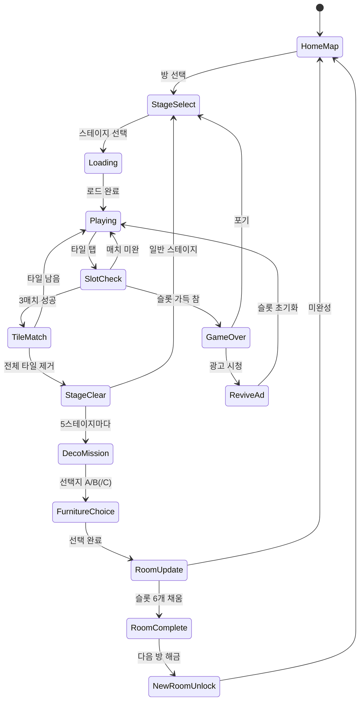

# Tile Home - 매치 퍼즐

> 트리플 타일 매치로 집을 꾸미는 캐주얼 퍼즐 게임.
> 스테이지를 클리어할 때마다 가구/인테리어를 선택해 나만의 집을 완성한다.

---

## 개요

**장르**: Triple Match + Home Decoration Meta
**레퍼런스 순위**: #35 (Tile Home, Panda Daily Puzzles, 평점 4.7)
**코어 루프**: 타일 매치 → 별 획득 → 가구 선택 → 방 완성 → 다음 방 해금
**타겟**: 25–40세 여성, 캐주얼 게이머
**MVP 목표**: 1~2주 개발, 방 3개 + 스테이지 15개로 출시

---

## 1. 코어 메카닉

**found3와 동일한 트리플 타일 매치**를 기반으로 한다. 재사용 극대화.

### 기본 규칙 (found3 동일)
- 보드에 여러 종류의 그림 타일이 배치됨
- 모든 그림은 정확히 **3개씩** 존재
- 같은 그림 타일 3개 선택 시 자동 제거
- 선택한 타일은 하단 **슬롯(최대 7칸)**에 임시 보관
- 슬롯이 가득 차면 (7칸 모두 차고 3매치 불가) **게임 오버**
- 모든 타일 제거 시 **스테이지 클리어**

### found3와의 차이점
| 요소 | found3 | Tile Home |
|------|--------|-----------|
| 타일 테마 | 범용 아이콘 | **가구/집 관련 아이콘** (소파, 침대, 화분 등) |
| 클리어 보상 | 점수 | **별 1~3개 + 꾸미기 재화(코인)** |
| 진행 동기 | 다음 스테이지 | **방 꾸미기 완성** |
| 메타 레이어 | 없음 | **홈 데코레이션** |

### 클리어 조건별 별 획득
| 조건 | 별 |
|------|---|
| 스테이지 클리어 | ★ 1개 (기본) |
| 아이템 미사용 클리어 | ★ 2개 |
| 60초 이내 + 아이템 미사용 | ★ 3개 |

---

## 2. 메타게임 - 집 꾸미기

스테이지 클리어 보상으로 **코인**을 획득하고, 코인을 소비해 방의 가구/인테리어를 선택한다.

### 메타 루프

```
스테이지 클리어
    ↓
코인 획득 (별 수 × 10코인)
    ↓
[꾸미기 미션] 발동
    ↓
가구 선택 (A / B / C 중 1)
    ↓
방 인테리어 진행도 +1
    ↓
방 완성 → 다음 방 해금
    ↓
집 전체 완성 → 엔딩 (새 집 확장 or 시즌 리셋)
```

### 꾸미기 미션 시스템
- 스테이지 5개마다 꾸미기 미션 1개 발동
- 미션 = "이 방의 [위치]에 뭘 놓을까요?" 질문
- 3개의 선택지 중 1개 선택 → 해당 가구가 방에 배치됨
- 선택은 영구적 (나중에 변경 불가 — 단, 프리미엄으로 변경권 판매)

---

## 3. 꾸미기 시스템 상세

### 방 구성 (MVP: 3개 방)

| 방 | 해금 조건 | 꾸미기 슬롯 수 | 스테이지 범위 |
|----|-----------|---------------|--------------|
| 거실 (Living Room) | 시작 | 6개 | 1–15 |
| 침실 (Bedroom) | 거실 완성 | 6개 | 16–30 |
| 주방 (Kitchen) | 침실 완성 | 6개 | 31–45 |

### 거실 꾸미기 슬롯 예시

| 순서 | 위치 | 선택지 A | 선택지 B | 선택지 C |
|------|------|---------|---------|---------|
| 1 | 바닥 | 원목 마루 | 베이지 카펫 | 대리석 타일 |
| 2 | 소파 | 패브릭 3인 소파 | 가죽 L자 소파 | 북유럽 2인 소파 |
| 3 | 커피 테이블 | 원형 라탄 | 유리 사각 | 미니멀 원목 |
| 4 | 조명 | 샹들리에 | 플로어 램프 | 레일 조명 |
| 5 | 식물 | 몬스테라 화분 | 다육이 세트 | 드라이 플라워 |
| 6 | 벽 데코 | 갤러리 월 | 미러 | 시계 + 선반 |

### 방 완성 시 보상
- 완성 컷씬 (애니메이션): 완성된 방 전경 3초 스크롤
- 보너스 코인 50개
- SNS 공유 유도 ("내 거실 공개하기" 버튼)

---

## 4. 진행감 설계

### 집 전체 구조 (House Map)
```
┌─────────────────────────────┐
│        🏠 My Home           │
│  ┌─────────┬─────────┐      │
│  │  거실   │  침실   │      │
│  │ (진행중)│ (잠금)  │      │
│  ├─────────┼─────────┤      │
│  │  주방   │ (미래)  │      │
│  │ (잠금)  │         │      │
│  └─────────┴─────────┘      │
└─────────────────────────────┘
```

- 홈 맵에서 각 방의 진행도 시각화 (반투명 → 점점 채워짐)
- 완성된 방은 풀컬러, 잠긴 방은 실루엣
- 집 외관도 변화 (지붕색, 정원 등) — Phase 2

### 진행도 표시
- 각 방 꾸미기 슬롯: `[■■■□□□] 3/6 완성`
- 전체 집 완성도: 상단 HUD에 집 아이콘 + % 표시

---

## 5. found3 + 메타게임 결합 분석

### 의사결정: found3에 메타를 붙여야 하는가?

**결론: Phase 2에서 조건부 추가 권장**

| 관점 | found3 단독 | found3 + 메타 |
|------|-------------|---------------|
| 개발 속도 | ✅ 빠름 | ❌ 추가 3~5일 |
| 리텐션 | ❌ 낮음 (순수 퍼즐 한계) | ✅ 높음 |
| 데이터 수집 | 클리어율, 이탈 스테이지 | 꾸미기 선택 성향, 지불 의향 |
| 수익화 depth | ❌ 얕음 | ✅ 깊음 |
| 출시 속도 | ✅ 즉시 | ❌ +1주 |

**Phase 1 권장**: found3 MVP 먼저 출시 → 리텐션 데이터 수집
**Phase 2 권장**: found3 데이터 기반으로 메타 추가 여부 결정

- D1 리텐션 < 20%: 메타 추가 필수
- D1 리텐션 > 35%: 코어만으로도 충분, 메타는 선택

---

## 6. 에셋 요구량

### MVP 에셋 목록

#### 타일 아이콘 (가구/홈 테마)
- 총 20종 × 1 이미지 = **20개 아이콘**
- 예: 소파, 침대, 식탁, 화분, 조명, 시계, TV, 냉장고, 컵, 책, 옷장, 거울 등
- 스타일: 플랫 아이콘, 단색 배경, 64×64px

#### 가구/인테리어 선택지
- 방 3개 × 슬롯 6개 × 선택지 3개 = **54개 가구 이미지**
- 크기: 각 가구 단독 컷 (투명 배경), 약 200×200px
- 방 배경: 3개 방 × 6단계 진행도 = **18개 방 배경 이미지**

#### UI 에셋
- 집 외관 (홈 맵): 1개
- 방 진행도 프레임: 6단계 × 3방 = 18개
- 아이콘 (UI용): 약 20개

#### 총 에셋 부담 평가
| 카테고리 | 수량 | 난이도 |
|----------|------|--------|
| 타일 아이콘 | 20개 | ✅ 낮음 (플랫 아이콘, 무료 소스 활용 가능) |
| 가구 이미지 | 54개 | ⚠️ 중간 (AI 생성 또는 에셋 팩 활용 권장) |
| 방 배경 | 18개 | ⚠️ 중간 (점진적 변화 → 레이어 합성으로 최소화) |
| UI 에셋 | 20개 | ✅ 낮음 |

**에셋 비용 절감 전략**:
1. 타일 아이콘: Flaticon, Noun Project 라이선스 구매 (월 $15)
2. 가구 이미지: Midjourney / DALL-E 3 생성 후 후처리
3. 방 배경: 기본 배경 1장 + 레이어 합성 방식으로 진행도 표현 → **18개 → 3개**로 절감

---

## 7. 수익화

### 무료 경험
- 모든 스테이지 플레이 가능
- 각 꾸미기 슬롯에서 선택지 A/B 2개 제공
- 광고 시청으로 하루 아이템 3회 제공

### 프리미엄 수익화 모델

#### (1) 선택지 C 해금 — 인앱 구매
- 슬롯당 선택지 C (프리미엄 가구)는 기본 잠금
- 해금 방법: 코인 30개 소비 or 광고 시청 (15초) or 직접 구매 ($0.99/개)
- 프리미엄 가구는 시각적으로 더 고급스럽게 디자인

#### (2) 무제한 하트 패스 — 구독
- 월 $4.99: 광고 제거 + 하루 아이템 무제한 + 선택지 C 전체 해금
- 핵심 지표: 구독 전환율 목표 2%

#### (3) 코인 패키지
- $0.99 = 50코인
- $2.99 = 200코인
- $9.99 = 800코인 (Best Value)

#### (4) 선택 변경권
- 이미 선택한 가구를 다른 선택지로 변경: 50코인 or $0.99
- "내 취향이 바뀌었어요" 시나리오 대응

#### (5) 광고 (IAA)
- 스테이지 실패 후 부활: 광고 시청 → 슬롯 초기화
- 스테이지 클리어 후 보너스 코인: 광고 시청 → +5코인

### 수익 목표
| 지표 | 목표 |
|------|------|
| D7 리텐션 | 25% 이상 |
| ARPU (30일) | $0.30 이상 |
| 구독 전환율 | 1.5~3% |
| 광고 fill rate | 95% |

---

## 8. found3 Phase 2 메타게임 전략 제안

### Phase 2에 found3 메타 추가 시 권장 방향

**방향 A: "오피스 꾸미기"** ← 권장
- 타일 아이콘: 사무용품 (컴퓨터, 노트, 커피, 서류 등)
- 메타: 스타트업 오피스를 꾸며나가는 스토리
- 차별화: Tile Home(집)과 테마 분리 → 포트폴리오 다양화
- 에셋 재활용: 타일 엔진 100% 재사용, UI 90% 재사용

**방향 B: "정원 꾸미기"**
- 외부 공간, 계절 변화 요소 추가 가능
- 타 게임과 차별화 낮음

**방향 C: Tile Home 확장 (새 집)**
- 기존 유저 리텐션에 좋음
- 신규 유저 획득에는 불리

### 결론
- Tile Home 먼저 출시 + 데이터 수집
- found3 D7 리텐션 < 25%이면 메타 추가 (방향 A 권장)
- found3와 Tile Home CPI 비교 후 CPI 낮은 쪽에 마케팅 집중

---

## 게임 플로우



---

## UI 레이아웃

### 게임 플레이 화면
```
┌─────────────────────────────┐
│ 🏠 거실 진행 ■■■□□□  ⭐3  │  ← 방 진행 + 현재 별
├─────────────────────────────┤
│                             │
│   ┌──┐ ┌──┐ ┌──┐           │
│   │🛋│ │💡│ │🛋│           │
│   └──┘ └──┘ └──┘           │
│ ┌──┐ ┌──┐ ┌──┐ ┌──┐        │  ← 타일 보드
│ │🪴│ │💡│ │🪴│ │🛋│        │
│ └──┘ └──┘ └──┘ └──┘        │
│   ┌──┐ ┌──┐ ┌──┐           │
│   │🪴│ │💡│ │🪴│           │
│   └──┘ └──┘ └──┘           │
│                             │
├─────────────────────────────┤
│ [ ][ ][ ][ ][ ][ ][ ]      │  ← 슬롯 7칸
├─────────────────────────────┤
│  🔀 셔플    ↩ 되돌리기     │
└─────────────────────────────┘
```

### 꾸미기 선택 화면
```
┌─────────────────────────────┐
│     거실의 소파를 선택하세요  │
├─────────────────────────────┤
│  ┌───────┐  ┌───────┐  🔒  │
│  │ [A]   │  │ [B]   │ [C]  │
│  │패브릭  │  │ 가죽  │프리미엄│
│  │3인    │  │ L자   │      │
│  │소파   │  │ 소파  │      │
│  └───────┘  └───────┘      │
│  [무료]    [무료]   [광고/코인]│
└─────────────────────────────┘
```

---

## 스코어링 시스템

| Action | 코인 |
|--------|------|
| 스테이지 클리어 | 별 수 × 10 |
| 아이템 미사용 보너스 | +5 |
| 60초 이내 클리어 | +5 |
| 방 완성 보너스 | +50 |

---

## 난이도 설계

| 스테이지 | 그림 종류 | 타일 수 | 레이어 | 시간(초) | 방 |
|----------|-----------|---------|--------|----------|----|
| 1–3 | 4 | 12 | 1 | 120 | 거실 |
| 4–6 | 6 | 18 | 1 | 120 | 거실 |
| 7–10 | 8 | 24 | 2 | 150 | 거실 |
| 11–15 | 10 | 30 | 2 | 150 | 거실 |
| 16–20 | 10 | 30 | 2 | 150 | 침실 |
| 21–30 | 12 | 36 | 3 | 180 | 침실 |
| 31–45 | 14 | 42 | 3 | 180 | 주방 |

---

## 사운드/이펙트

- 타일 선택: 부드러운 "탁" 효과음 (인테리어 감성)
- 3매치 제거: 반짝이는 이펙트 + 효과음
- 꾸미기 선택: 가구 배치 "쏙" 사운드 + 파티클
- 방 완성: 3초 컷씬 + 밝은 축하 BGM
- 게임 오버: 부드러운 실패음 (공격적이지 않게)
- 배경 BGM: 아늑한 재즈/어쿠스틱

---

## MVP 범위

### Phase 1 (1~2주 — 출시 목표)
- [ ] 기획서 작성 ✅
- [ ] 타일 보드 (found3 코어 재사용)
- [ ] 홈 메타 시스템 (방 1개 — 거실)
- [ ] 꾸미기 미션 UI (선택지 A/B)
- [ ] 스테이지 15개
- [ ] 코인 시스템 기초
- [ ] 광고 붙이기 (AdMob)

### Phase 2 (출시 후 데이터 기반)
- [ ] 방 2–3개 추가 (침실, 주방)
- [ ] 선택지 C (프리미엄) + 구독 모델
- [ ] 방 완성 컷씬 애니메이션
- [ ] 집 외관 변화
- [ ] 친구 집 방문 (소셜)
- [ ] 시즌/테마 이벤트

---

## 기술 구현 노트 (개발팀 참고)

- **코어 엔진**: `lib/found3` 그대로 재사용 → `lib/tile-home`으로 fork + 타일 테마만 변경
- **메타 상태**: Redux 또는 Zustand로 방 진행도, 선택 내역 관리 (로컬 영구 저장)
- **에셋 로딩**: 방별 lazy loading으로 초기 번들 크기 최소화
- **광고**: 실패 부활 + 보너스 코인 2개 포인트에만 광고 삽입 (과도한 광고 지양)
