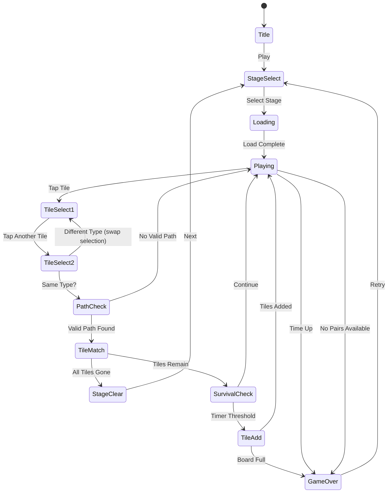

# Tile Connect (타일 커넥트)

> 같은 그림의 타일 쌍을 찾아 선으로 연결해 모든 타일을 지우는 서바이벌 퍼즐 게임

## 개요

보드 위에 다양한 그림 타일이 격자로 배치되어 있다. 플레이어는 같은 그림 타일 **2개(쌍)**를 찾아 선으로 연결하면 해당 타일이 제거된다. 연결 경로는 **최대 2번 꺾을 수 있다** (직선, 1번 꺾기, 2번 꺾기). 모든 타일을 제거하면 스테이지 클리어.

### 레퍼런스 분석 — 6가지 질문

#### 1. 코어 메카닉: 타일 연결 + 생존 테마
- **마작 커넥트 (Shanghai / Mahjong Connect)** 장르
- 같은 타일 쌍을 선으로 이어 제거하는 클래식 메카닉
- 생존 테마: 시간 제한 + 너무 느리면 타일 추가 → 긴장감

#### 2. 0점 평점 분석
- 앱스토어 0.0 평점 = **신규 출시 or 리뷰 없는 앱**
- 기존 강자가 없는 틈새 = **진입 기회**
- 장르 자체는 시장 검증 완료 (마작 커넥트류 수억 다운로드)

#### 3. 타일 연결 규칙
- 같은 그림 타일 2개를 선으로 연결
- 연결 경로: **최대 2번 꺾기** (0회 직선, 1회 ㄱ자, 2회 ㄷ자)
- 경로에 다른 타일이 있으면 연결 불가
- 보드 바깥 경유 가능 (테두리 밖으로 돌아가는 경로)

#### 4. 생존 메타
- 타일 클리어 → 시간 보너스 획득
- 일정 시간 미클리어 → 새 타일 추가 (압박)
- 보드가 꽉 차면 게임 오버 → 서바이벌 긴장감

#### 5. Found3 vs 타일 커넥트 — 포트폴리오 다각화

| | Found3 | Tile Connect |
|---|--------|-------------|
| 매칭 | 3개 트리플 매치 | 2개 쌍 매칭 |
| 선택 방식 | 탭 3번 → 슬롯 | 탭 2번 → 선 연결 |
| 핵심 스킬 | 탐색 + 메모리 | 경로 탐색 + 패턴 인식 |
| 난이도 원천 | 레이어 겹침 | 경로 장애물 |
| 세션 타임 | 중간 | 길다 (중독성 높음) |

**결론: 충분히 다른 게임**. Found3와 타겟 유저가 겹치지만 플레이 경험이 완전히 다르다. 두 게임 모두 보유하면 "매치 퍼즐" 카테고리에서 포트폴리오 다각화 가능.

#### 6. 결론: 구현한다 ✅

- ✅ **시장 검증 완료** — 마작 커넥트류는 캐주얼 퍼즐 최상위 장르
- ✅ **경쟁자 약함** — 0.0 평점 레퍼런스 = 틈새 기회
- ✅ **차별화** — Found3(트리플)과 다른 쌍 매칭, 경로 탐색 메카닉
- ✅ **구현 단순** — 1주 MVP, 기존 픽셀 음식 타일 에셋 재사용
- ✅ **높은 리텐션** — 쌍 찾기 + 경로 퍼즐 = 세션 시간 길고 중독성 높음
- ✅ **인프라 재사용** — lib/web/rn 파이프라인 그대로 적용

> **구현 우선순위: Phase 1 수준.** 기존 에셋 재사용 가능하고, 로직 단순하며, 시장성 검증된 장르.

## 게임 규칙

### 기본 규칙
- 보드에 여러 종류의 그림 타일이 격자형으로 배치됨
- 모든 그림은 정확히 **2개씩(쌍)** 존재
- 플레이어가 같은 그림 타일 2개를 탭하면 연결 경로를 탐색
- 유효한 경로가 있으면 **선이 그려지며 타일 제거**
- 유효한 경로가 없으면 연결 실패 (선택 해제)
- 모든 타일을 제거하면 **스테이지 클리어**
- 시간 초과 또는 매칭 가능한 쌍이 없으면 **게임 오버**

### 연결 경로 규칙
- 두 타일 사이의 경로는 **직선 세그먼트**로 구성
- 경로는 **최대 2번 꺾을 수 있다** (최대 3개 직선 세그먼트)
- 경로 위에 다른 타일이 있으면 연결 불가
- **보드 바깥 경유 가능** — 타일이 테두리에 있으면 바깥을 돌아가는 경로도 유효

```
// 0번 꺾기 (직선)
[A] ──────── [A]

// 1번 꺾기 (ㄱ자)
[A] ─────┐
         │
         [A]

// 2번 꺾기 (ㄷ자)
[A] ─────┐
         │
    ┌────┘
    [A]

// 보드 바깥 경유
        ┌──── (바깥) ────┐
        │                │
       [A]              [A]
```

### 서바이벌 메카닉
- 각 스테이지에 **제한 시간** 존재
- ~~타일 매칭 성공 시 시간 보너스 (+3초)~~ → Phase 2
- ~~일정 시간 간격으로 새 타일이 빈 칸에 추가~~ → Phase 2
- 보드가 가득 차서 매칭 불가 → **게임 오버**

### 매칭 불가 감지
- 매 턴마다 매칭 가능한 쌍이 있는지 검사
- 매칭 가능 쌍이 없으면 **자동 셔플** 또는 **게임 오버**

## 게임 플로우



## UI 레이아웃

```
┌─────────────────────────────┐
│  ⏱ 01:30    ⭐ 2,400        │  ← 상단 HUD (타이머 + 스코어)
├─────────────────────────────┤
│                             │
│  ┌──┐┌──┐┌──┐┌──┐┌──┐┌──┐ │
│  │🍎││🍕││🌽││🍔││🍩││🍎│ │
│  └──┘└──┘└──┘└──┘└──┘└──┘ │
│  ┌──┐┌──┐┌──┐┌──┐┌──┐┌──┐ │
│  │🍩││🌽││🍔││🍕││🌽││🍕│ │  ← 타일 보드 (격자)
│  └──┘└──┘└──┘└──┘└──┘└──┘ │
│  ┌──┐┌──┐┌──┐┌──┐┌──┐┌──┐ │
│  │🍔││🍎││🍩││🍎││🍔││🌽│ │
│  └──┘└──┘└──┘└──┘└──┘└──┘ │
│  ┌──┐┌──┐┌──┐┌──┐┌──┐┌──┐ │
│  │🍕││🍩││🍕││🌽││🍎││🍩│ │
│  └──┘└──┘└──┘└──┘└──┘└──┘ │
│                             │
│    ─ ─ 연결 선 애니메이션 ─ ─   │
│                             │
├─────────────────────────────┤
│  Stage 3      Pairs: 12/24 │  ← 스테이지 정보
├─────────────────────────────┤
│  💡 Hint    🔀 Shuffle      │  ← 아이템/도구
└─────────────────────────────┘
```

### 연결 선 시각화
- 두 타일 연결 시 **경로를 따라 선이 그려짐**
- 선 색상: 밝은 하이라이트 (0.3초 표시 후 사라짐)
- 선택된 타일: 테두리 하이라이트

## 스코어링 시스템

| Action | Score |
|--------|-------|
| 타일 쌍 제거 | +100 |
| 콤보 보너스 (3초 내 연속 매치) | +50 × (콤보 수 - 1) |
| ~~직선 연결 (0번 꺾기)~~ | ~~+50 보너스~~ → Phase 2 |
| ~~스테이지 클리어~~ | ~~+500~~ → Phase 2 |
| ~~남은 시간 보너스~~ | ~~남은초 × 10~~ → Phase 2 |

### 콤보 시스템
- 3초 이내 연속 매칭 시 콤보 카운트 증가
- 콤보 배수로 점수 증가
- 3초 이상 멈추면 콤보 리셋

## 난이도 설계

| Stage | 그림 종류 | 타일 수 | 보드 크기 | 시간(초) |
|-------|-----------|---------|-----------|----------|
| 1 | 4 | 24 | 4×6 | 120 |
| 2 | 6 | 32 | 4×8 | 120 |
| 3 | 8 | 48 | 6×8 | 150 |
| 4 | 10 | 60 | 6×10 | 150 |
| 5 | 12 | 80 | 8×10 | 180 |

> 타일 수 = rows × cols (각 타입별 짝수 개, 모든 타일이 쌍을 이룸)
>
> ~~타일 추가: Stage 3부터 서바이벌 요소 시작~~ → Phase 2

### 보드 생성 알고리즘
1. 그림 종류별 2개씩 쌍을 생성
2. 랜덤 셔플 후 격자에 배치
3. **매칭 가능한 쌍이 최소 1개 이상 존재하는지 검증**
4. 불가능하면 재셔플

## 아이템/도구

| Item | Effect | 제한 |
|------|--------|------|
| Hint | 매칭 가능한 쌍 1개를 하이라이트 | 스테이지당 3회 |
| Shuffle | 남은 타일 위치 랜덤 재배치 (쌍 유지) | 스테이지당 2회 |

## 엔드리스 모드

- 스테이지 구분 없이 무한 플레이
- 타일 전부 제거 → 새 보드 자동 생성 (난이도 점진 상승)
- 시간 제한 없음, 대신 타일 추가 속도 점점 빨라짐
- 게임 오버 조건: 보드 가득 참 or 매칭 가능 쌍 없음
- 하이스코어 기록

## MVP 범위

### Phase 1 (MVP) — 1주

- [x] 기획서 작성
- [x] 기본 타일 격자 보드 (4×6 ~ 8×10)
- [x] 타일 쌍 매칭 + 경로 탐색 알고리즘 (0/1/2 bend)
- [x] 보드 바깥 경유 경로
- [x] 연결 선 시각화
- [x] 게임 오버 / 클리어 판정
- [x] 5 스테이지
- [x] 기존 픽셀 음식 타일 에셋 재사용
- [x] 타이머 + 기본 스코어링 + 콤보
- [x] Hint / Shuffle UI
- [x] 자동 셔플 (매칭 불가 시)

### Phase 2

- [ ] 서바이벌 메카닉 (타일 추가, 시간 보너스)
- [ ] 직선 연결 보너스 (+50)
- [ ] 스테이지 클리어 보너스 (+500) + 남은 시간 보너스
- [ ] Hint / Shuffle 사용 횟수 제한
- [ ] 엔드리스 모드
- [ ] 스테이지 셀렉트 화면
