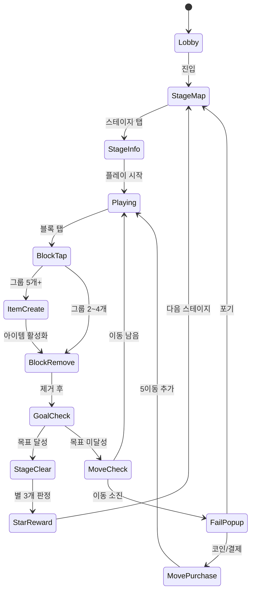

# Toon Blast

> **레퍼런스**: Peak Games의 Toon Blast (2017) — 탭 크러시 장르 1위
> **장르**: 탭-투-크러시 블록 퍼즐
> **MVP 목표**: 1~2주 이내 출시 가능한 핵심 루프

---

## 개요

같은 색 인접 블록 그룹을 탭 하나로 터뜨려 제거하는 퍼즐 게임.
스와이프 없이 탭만으로 플레이 가능하여 진입장벽이 극도로 낮음.
큰 그룹 제거 시 강력한 특수 아이템이 생성되는 피드백 루프가 핵심 재미.

---

## 코어 메카닉

### 기본 규칙

- N×M 그리드 위에 여러 색상의 블록 배치 (기본 6×9)
- 같은 색 **인접(상하좌우) 블록 2개 이상** 그룹을 탭하면 전체 제거
- 블록 제거 후 위 블록이 중력으로 낙하
- 이동 횟수(Move) 내에 스테이지 목표 달성 시 클리어
- 이동 소진 시 게임 오버 (부스터/코인으로 추가 이동 구매 가능)

### 그룹 크기와 피드백

| 그룹 크기 | 결과 | 이펙트 |
|-----------|------|--------|
| 2~4개 | 단순 제거 | 기본 팝 이펙트 |
| 5~6개 | **로켓** 생성 | 행/열 전체 제거 |
| 7~8개 | **폭탄** 생성 | 주변 3×3 범위 제거 |
| 9+개 | **디스코볼** 생성 | 보드 내 특정 색 전체 제거 |

> **설계 원칙**: 큰 그룹을 만들면 강력한 아이템이 나온다는 규칙이 명확하므로
> 플레이어가 자연스럽게 "더 큰 그룹 만들기" 전략을 추구하게 됨.

---

## 특수 블록 (아이템) 시스템

### 생성형 아이템 (In-Game 생성)

#### 로켓 (Rocket)
- **생성 조건**: 5~6개 그룹 제거
- **효과**: 탭 시 행 또는 열 전체 제거
- **방향**: 생성 시 랜덤 (가로/세로), 탭 후 방향 확인 가능
- **연쇄**: 경로에 다른 아이템 있으면 연쇄 발동

#### 폭탄 (Bomb)
- **생성 조건**: 7~8개 그룹 제거
- **효과**: 주변 3×3 (9칸) 블록 제거
- **연쇄**: 범위 내 아이템 모두 연쇄 발동

#### 디스코볼 (Disco Ball)
- **생성 조건**: 9개+ 그룹 제거
- **효과**: 보드 내 특정 색 블록 전부 제거
- **대상 색**: 탭 시 인접한 블록 색상 기준

### 아이템 조합 (Combo)

| 조합 | 효과 |
|------|------|
| 로켓 + 로켓 | 행+열 동시 제거 (십자 제거) |
| 로켓 + 폭탄 | 3행 또는 3열 동시 제거 |
| 폭탄 + 폭탄 | 5×5 범위 제거 |
| 디스코볼 + 로켓 | 각 색상 열/행 제거 |
| 디스코볼 + 폭탄 | 각 색상 주변 폭탄 |
| 디스코볼 + 디스코볼 | 전체 보드 클리어 |

> **MVP 우선순위**: 단일 아이템 → 2-콤보 → 3-콤보 순서로 구현

---

## 스테이지 목표 시스템

### 목표 유형

#### 1. 색상 수량 목표 (Color Collect)
- "빨간 블록 30개 제거" 등 색상별 목표 수량 달성
- 가장 기본적인 목표, 초반 스테이지에 집중
- UI: 하단에 색상 아이콘 + 카운터 표시

#### 2. 장애물 제거 목표 (Obstacle Clear)
- 특정 셀에 배치된 장애물을 인접 제거로 클리어
- **박스(Box)**: 1회 인접 제거로 파괴
- **버블(Bubble)**: 내부 블록을 제거해야 파괴
- **얼음(Ice)**: 인접 제거로 균열 → 2회 공격으로 파괴
- **돌(Stone)**: 이동 불가, 인접 공격 3회로 파괴
- **풍선(Balloon)**: 매 턴 위로 이동, 상단 탈출 전 제거

#### 3. 점수 목표 (Score)
- 목표 점수 달성 (별 1~3개 시스템)
- 콤보 시 점수 배율 적용
- MVP에서는 단순화 가능 (목표 점수만, 별 시스템 나중에)

### 스테이지 구성 예시

```
스테이지 1~20:   색상 수량 목표만 (장애물 없음)
스테이지 21~50:  색상 + 박스 장애물
스테이지 51~100: 색상 + 복합 장애물
스테이지 100+:   복합 목표 + 특수 배치
```

---

## Toon Blast vs Block Crush (#9) 비교 분석

### Block Crush (#9) 개요
- **방식**: 탭 크러시 (동일한 탭 메카닉)
- **테마**: 일반적인 블록/젤리 테마
- **결과**: 상위권이나 Toon Blast에 밀림

### Toon Blast가 더 성공한 핵심 이유

#### 1. IP & 캐릭터 파워
- **Toon Blast**: 쿠마, 울프, 버노 등 애니메이션 캐릭터 스토리
  - 캐릭터가 스테이지 클리어/실패에 반응 → 감정 연결
  - 캐릭터별 팬덤 형성 → 소셜 공유 동기 부여
- **Block Crush**: 캐릭터 없음 → 감정적 연결 부재

#### 2. 연출 품질 (주스 레벨)
- Toon Blast의 블록 터짐 애니메이션, 표정 변화, 카툰 사운드가 극강의 만족감
- 같은 메카닉도 연출이 리텐션을 좌우함

#### 3. 팀 소셜 기능
- 팀 토너먼트, 라이프 주고받기로 DAU 증가 및 이탈 방지
- Block Crush는 솔로 플레이 위주

#### 4. 콘텐츠 볼륨
- 10,000스테이지+ 지속 업데이트
- 매주 이벤트/토너먼트로 신규 이유 제공

#### 5. 마케팅 소재 다양성
- 캐릭터 기반 광고 소재 → CPI 최적화 용이
- 좌절-클리어 영상 포맷이 UA 효율 높음

### 우리 구현 시사점
> **캐릭터 없이 시작하되**, 초기부터 캐릭터 슬롯 UI 구조를 잡아놓을 것.
> 연출(주스)에 개발 시간 20% 투자 → 리텐션 직결.

---

## 캐릭터 / IP 시스템

### 마케팅 효과

| 요소 | 효과 |
|------|------|
| 카툰 스타일 비주얼 | 전 연령 어필, 스토어 CTR 향상 |
| 캐릭터 감정 표현 | 플레이어 감정 동기화, 세션 연장 |
| 캐릭터 업그레이드 | 수집 동기, 과금 포인트 |
| SNS 공유 | 캐릭터 기반 밈화 가능성 |

### MVP 캐릭터 전략

**Phase 1 (MVP)**: 단순 마스코트 1개
- 화면 상단 고정 배치
- 클리어 시 기쁨 / 실패 시 안타까움 2개 애니메이션만

**Phase 2**: 캐릭터 3종 추가, 스토리 맵 도입

**Phase 3**: 캐릭터 수집/업그레이드 시스템

---

## 팀 기능 시스템

### 팀 생성 & 가입
- 팀 이름, 설명, 공개/비공개 설정
- 팀 최대 인원: 30명
- 팀 가입 조건: 특정 스테이지 클리어 후 해금

### 라이프 주고받기
- **라이프 시스템**: 최대 5개, 30분마다 1개 충전
- 팀원에게 라이프 요청 가능 (하루 횟수 제한)
- 팀원 라이프 요청 수락 시 양쪽에 소셜 포인트 지급
- **리텐션 효과**: "팀원이 라이프 보냄" 푸시알림으로 재방문 유도

### 팀 토너먼트
- **주기**: 주 1회 (토요일~일요일)
- **방식**: 팀 합산 점수 경쟁
- **보상**: 팀원 전체에 코인/부스터 지급
- **리그 시스템**: 브론즈/실버/골드/다이아 (4단계)
- **UI**: 팀 순위 실시간 업데이트, 개인 기여도 표시

### 팀 채팅 (MVP 이후)
- 기본 이모티콘 반응 (MVP에서는 생략)
- Phase 2에서 채팅 추가

---

## 수익화 모델

### 핵심 경제 구조

```
라이프(Lives) ──→ 과금 압박 포인트 #1 (가장 중요)
이동 추가(Moves) ──→ 과금 압박 포인트 #2
부스터(Booster) ──→ 과금 포인트 #3
코인(Coin) ──→ 범용 화폐
```

### 라이프 시스템

| 항목 | 값 |
|------|-----|
| 최대 라이프 | 5개 |
| 자연 충전 | 30분/1개 |
| 구매 가격 | 코인 900개 / 1라이프 |
| 무한 라이프 | $1.99/1시간, $4.99/1일 |

### 이동 추가 (Move Purchase)

게임 오버 직전 팝업:
- "+5 이동" = 코인 900 또는 현금 $0.99
- 난이도 높은 스테이지에서 전환율 극대화
- **피크 게임즈 인사이트**: 이동 추가가 전체 IAP의 40~50% 차지

### 부스터 시스템

| 부스터 | 효과 | 코인 가격 |
|--------|------|-----------|
| 로켓 | 행 또는 열 제거 | 500 |
| 폭탄 | 3×3 범위 제거 | 700 |
| 디스코볼 | 특정 색 전체 제거 | 900 |
| 망치 | 단일 블록/장애물 제거 | 400 |
| 색상 변환 | 선택 블록 색 변경 | 600 |

### 코인 획득 & 소모

**획득 경로**:
- 스테이지 클리어 보상 (점수 기반 50~200코인)
- 일일 로그인 보너스 (50~300코인)
- 팀 토너먼트 보상
- 광고 시청 리워드 (선택형, 100코인)
- 현금 구매 ($0.99 = 900코인 ~ $99.99 = 180,000코인)

**소모 경로**:
- 부스터 구매
- 라이프 구매
- 이동 추가
- 이벤트 참여 티켓

### 가격 정책

| 패키지 | 코인 | 가격 |
|--------|------|------|
| 소형 | 900 | $0.99 |
| 중형 | 4,500 | $4.99 |
| 대형 | 12,000 | $9.99 |
| 특대 | 55,000 | $39.99 |
| 울트라 | 125,000 | $99.99 |

### 광고 수익 (Rewarded Ads)

- 실패 후 "광고 보고 5이동 추가" 옵션
- 인게임 "무료 부스터 받기" 버튼 (일 3회)
- IAP 미구매 유저 수익화 핵심 채널

---

## 게임 플로우 (상태 머신)



---

## UI 레이아웃

```
┌─────────────────────────────┐
│  [팀] [캐릭터] [이동:25]  [⚙️] │  ← 상단 HUD
│     목표: 🔴×30  🔵×25      │  ← 스테이지 목표
├─────────────────────────────┤
│                             │
│  🟡 🔴 🔵 🟢 🟡 🔴        │
│  🔵 🟢 🟡 🔵 🔴 🟢        │
│  🔴 🟡 🔵 🟢 🟡 🔵        │  ← 게임 그리드 (6×9)
│  🟢 🔴 🟡 🔴 🔵 🟢        │
│  🔵 🟢 🔴 🟡 🟢 🔴        │
│  🟡 🔵 🟢 🔵 🔴 🟡        │
│  🔴 🟡 🔵 🟢 🟡 🔵        │
│  🟢 🔴 🟡 🔴 🔵 🟢        │
│  🔵 🟢 🔴 🟡 🟢 🔴        │
├─────────────────────────────┤
│  [🚀부스터] [💣부스터] [🪩] │  ← 부스터 바
└─────────────────────────────┘
```

### 실패 팝업 UI

```
┌─────────────────────┐
│   😢  아깝다!       │
│   이동이 부족해요   │
│                     │
│  [+5이동 = 900코인] │
│  [광고 보고 +3이동] │
│  [포기하기]         │
└─────────────────────┘
```

---

## 스코어링 시스템

| 항목 | 점수 |
|------|------|
| 블록 1개 제거 | 10점 |
| 그룹 크기 보너스 | 그룹크기 × 5점 |
| 아이템 연쇄 | 연쇄당 × 1.5배 |
| 이동 잔여 보너스 | 잔여이동 × 100점 |
| 장애물 제거 | 50점 |

---

## 난이도 설계

### 곡선 원칙
- **스테이지 1~10**: 쉬움 (이동 충분, 목표 적음) → 게임 학습
- **스테이지 11~30**: 보통 (이동 빡빡, 장애물 도입) → 습관 형성
- **스테이지 31~60**: 어려움 (첫 번째 과금 벽) → 수익화 시작
- **스테이지 61~100**: 매우 어려움 (복합 장애물, 좁은 이동)

### 과금 벽 배치
- 스테이지 35, 65, 95에 의도적 난이도 스파이크
- 직전 스테이지에서 부스터 사용 유도 → 부스터 소진 → 구매 전환

### 그리드 크기 변화

| 스테이지 구간 | 그리드 |
|---------------|--------|
| 1~20 | 6×8 |
| 21~60 | 6×9 |
| 61~100 | 7×9 |
| 101+ | 8×10 또는 특수 형태 |

---

## 사운드 / 이펙트

### 필수 사운드 (MVP)
- 블록 탭: 경쾌한 팝 사운드 (색상별 다른 음)
- 그룹 제거: 크기에 따른 폭발음 (2단계)
- 아이템 생성: 특별한 "ping" 사운드
- 스테이지 클리어: 축하 팡파레
- 실패: 짧은 실망 효과음
- BGM: 밝고 캐주얼한 루프 음악

### 필수 이펙트 (MVP)
- 블록 제거 시 파티클 (색상 매칭)
- 아이템 활성화 시 빛 효과
- 콤보 시 화면 흔들림 (약하게)
- 캐릭터 기쁨/실망 애니메이션 (2프레임 이상)

---

## MVP 범위

### 반드시 구현 (Week 1)
- [x] 기본 탭 크러시 메카닉 (그룹 감지 + 제거)
- [x] 블록 낙하 물리
- [x] 3가지 특수 아이템 (로켓/폭탄/디스코볼)
- [x] 색상 수량 목표 스테이지 시스템
- [x] 이동 횟수 제한 + 게임 오버
- [x] 스테이지 20개
- [x] 기본 코인 시스템
- [x] 이동 추가 구매 팝업

### Week 2 추가
- [ ] 장애물 2종 (박스, 버블)
- [ ] 라이프 시스템
- [ ] 일일 로그인 보너스
- [ ] 리워드 광고 연동
- [ ] 스테이지 50개로 확장

### Phase 2 (데이터 보고 결정)
- [ ] 팀 시스템 (라이프 주고받기)
- [ ] 팀 토너먼트
- [ ] 캐릭터 3종 추가
- [ ] 스테이지 100개+

---

## 탭 크러시 장르 최적 설계 결론

### 성공 공식

```
탭 크러시 성공 = 직관적 메카닉 × 강력한 연출 × IP/캐릭터 × 소셜 루프 × 과금 벽 타이밍
```

### 핵심 인사이트 요약

1. **메카닉 단순성이 강점**: 스와이프 불필요, 탭만으로 완결 → 글로벌 접근성
2. **아이템 = 보상 루프**: 큰 그룹 → 강력한 아이템 → 도파민 → 재도전
3. **IP는 선택이 아닌 필수**: 캐릭터 없으면 UA 소재 다양성과 감정 연결 모두 약화
4. **팀 기능이 리텐션 엔진**: D30 리텐션 차이가 팀 기능 유무에서 갈림
5. **과금 벽은 스테이지 설계로**: 광고 의존보다 자연스러운 과금 유도가 LTV 높음
6. **주스(연출)에 투자**: 같은 메카닉도 연출 퀄리티가 D1 리텐션 10%p 이상 차이

### 우리 프로젝트 적용 우선순위

| 우선순위 | 항목 | 이유 |
|----------|------|------|
| 1순위 | 탭 크러시 코어 + 3아이템 | 없으면 게임이 안 됨 |
| 2순위 | 연출 (파티클, 사운드) | 리텐션 직결 |
| 3순위 | 이동 추가 과금 | 초기 수익화 |
| 4순위 | 라이프 시스템 | DAU 유지 |
| 5순위 | 팀 기능 | D30+ 리텐션 |
| 6순위 | 캐릭터 IP | 마케팅 소재 |
