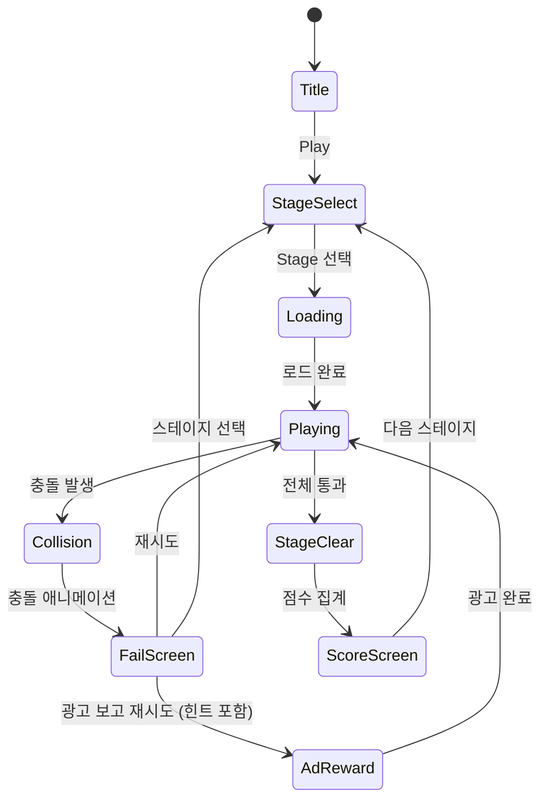

# Traffic Frenzy: Road Jam

> **레퍼런스**: #77 | 개발사: Little Whale Game Limited | 평점: **4.9** | 장르: traffic

## 1. 4.9 최고 평점 분석 — 왜 교통 퍼즐 중 1위인가?

### 핵심 성공 요인

| 요인 | 설명 |
|------|------|
| **즉각적 피드백** | 탭 → 차량이 즉시 움직임. 지연 없이 결과 확인 |
| **명확한 인과관계** | "내가 이 차를 먼저 보내서 막혔다"가 눈에 보임 |
| **단계별 쾌감** | 차 1대씩 해소될 때마다 도로가 뚫리는 시각적 만족 |
| **짧은 세션** | 한 판 30초~2분. 이동 중 플레이 최적 |
| **낮은 진입장벽** | 탭 하나로 조작. 설명 없어도 직관적 이해 |
| **높은 재시도율** | 실패 원인이 명확 → "한 번만 더" 심리 |

### 슬라이딩 퍼즐 대비 차별점

교통 장르에서 슬라이딩(#12 계열)은 **정답을 역산**해야 하는 인지 부하가 높다.
Road Jam은 **순서 실험** 방식 — 틀려도 "아, 저 차가 먼저였구나" 즉시 납득. 좌절감이 낮다.

---

## 2. 코어 메카닉

### 기본 개념

교차로에 여러 방향에서 차량이 정차해 있다. 플레이어가 차량을 **탭하는 순서**에 따라 차량이 출발한다.
경로가 겹치는 차량이 동시에 움직이면 **충돌 → 실패**.
모든 차량을 충돌 없이 출발시키면 **클리어**.

### 게임 흐름

```
[교차로 화면]
  │
  ▼
플레이어가 차량 탭 → 차량 출발 (자동 경로 이동)
  │
  ├─ 경로 충돌 없음 → 계속 진행
  │
  └─ 경로 충돌 발생 → 충돌 애니메이션 → 실패 (재시도)
  │
  ▼
모든 차량 출발 완료 → 스테이지 클리어
```

### 핵심 규칙

1. **차량은 정해진 경로만 이동** (직진 or 우회전 or 좌회전)
2. **탭 순서가 곧 출발 순서** — 동시에 여러 대 탭 불가
3. **경로 예약 시스템**: 차량이 점유 예정인 격자 칸을 미리 표시 (반투명 화살표)
4. **안전 통과 판정**: 선행 차량이 교차점을 지나면 후속 차량 출발 가능
5. **힌트 표시**: 차량 위에 위험 표시(⚠️) — 지금 출발하면 충돌 예상

### 충돌 판정 로직

```
차량 A의 경로: (0,2) → (1,2) → (2,2) → (3,2)
차량 B의 경로: (2,0) → (2,1) → (2,2) → (2,3)

교차점: (2,2)
→ A가 먼저 출발 후 (2,2) 통과 완료 = B 출발 가능
→ A와 B 동시 (2,2) 점유 = 충돌
```

---

## 3. 유사 게임 비교 — #12 / #70 / #77

| 구분 | #12 (슬라이딩형) | #70 (경로 설계형) | **#77 (순서 결정형)** |
|------|-----------------|-------------------|----------------------|
| **메카닉** | 차량을 상하/좌우로 밀어 출구 확보 | 도로/레일을 연결해 차량 경로 설계 | 차량 탭 순서로 교통 흐름 결정 |
| **대표 게임** | Rush Hour, Unblock Me | Train Valley, Road Builder | Traffic Escape!, Road Jam |
| **인지 부하** | 높음 (역산 필요) | 중간 (경로 직관적) | 낮음 (순서 실험) |
| **플레이 시간** | 2~10분 | 3~15분 | 30초~2분 |
| **실패 납득도** | 낮음 (왜 틀렸는지 모름) | 중간 | 높음 (즉시 시각화) |
| **모바일 적합성** | 중간 | 낮음 | **매우 높음** |
| **재시도율** | 중간 | 낮음 | **매우 높음** |
| **구현 난이도** | 중간 | 높음 | **낮음~중간** |
| **수익화 용이성** | 중간 | 낮음 | **높음** |
| **평점 잠재력** | 4.2~4.5 | 3.8~4.3 | **4.7~4.9** |

### 결론: #77 순서 결정형이 압도적 우위

- 모바일 세션 패턴(짧게 자주)에 완벽하게 맞음
- 광고 수익화 자연스러움 (실패 후 광고 → 재시도)
- 레벨 제작이 가장 쉬움 (경로 조합만 설계하면 됨)

---

## 4. 교통 퍼즐 장르 최종 결론 — 9개 중 무엇을 만드나?

### 9개 교통 퍼즐 유형 정리

| # | 유형 | 메카닉 요약 | 추천도 |
|---|------|------------|--------|
| A | 슬라이딩 격자 (Rush Hour) | 차를 밀어 출구 확보 | ⭐⭐⭐ |
| B | **순서 결정 교차로** | 탭 순서로 교통 흐름 결정 | ⭐⭐⭐⭐⭐ ← **선택** |
| C | 신호등 타이밍 | 신호 ON/OFF 타이밍 조절 | ⭐⭐⭐ |
| D | 경로 설계 | 도로 연결해 차량 경로 만들기 | ⭐⭐ |
| E | 주차 탈출 | 주차장에서 차 순서대로 빼기 | ⭐⭐⭐⭐ |
| F | 교통량 분산 | 차선 변경으로 혼잡 해소 | ⭐⭐ |
| G | 실시간 교통 제어 | 실시간으로 신호 제어 (아케이드) | ⭐⭐ |
| H | 3D 주차 슬라이딩 | 3D 환경 Rush Hour | ⭐⭐⭐ |
| I | 물류 최적화 | 배송 경로 퍼즐 | ⭐ |

**최종 선택: B (순서 결정 교차로)** = Traffic Frenzy: Road Jam

이유:
- 4.9 평점 레퍼런스 직접 클론 → 검증된 시장성
- 구현 복잡도 가장 낮음 (1~2주 MVP 가능)
- 광고 수익화 구조가 자연스럽게 내장됨
- 레벨 콘텐츠 확장이 쉬움 (신규 교차로 패턴 추가만 하면 됨)

---

## 5. 게임 플로우 (상태 머신)



---

## 6. UI 레이아웃

```
┌─────────────────────────────┐
│  Stage 12    ⭐⭐⭐   ↩ Undo  │  ← HUD (스테이지, 별점 기준, 되돌리기)
├─────────────────────────────┤
│                             │
│     ┌───┬───┬───┬───┐       │
│     │   │ ↑ │   │   │       │
│     │   │🚙 │   │   │       │
│     ├───┼───┼───┼───┤       │
│  ← 🚗│   │ ✕ │   │🚕→│       │  ← 교차로 그리드
│     ├───┼───┼───┼───┤       │     차량 + 충돌 예상 표시
│     │   │   │🚌 │   │       │
│     │   │   │ ↓ │   │       │
│     └───┴───┴───┴───┘       │
│                             │
│  [순서] 탭한 차량: 🚗 → 🚙    │  ← 현재 탭 순서 표시
│                             │
├─────────────────────────────┤
│   💡 힌트    🔁 재시작        │  ← 하단 액션
└─────────────────────────────┘
```

### 차량별 시각적 구분

- 차량 색상: 빨강/파랑/노랑/초록/보라 (5색)
- 이동 방향 화살표: 차량 위에 반투명 표시
- 충돌 예상 구간: 빨간 ✕ 표시 (위험 예고)
- 안전 구간: 초록 화살표 (통과 가능)

---

## 7. 스코어링 시스템

| 조건 | 별점 |
|------|------|
| 클리어 (기본) | ⭐ |
| 힌트 미사용 | ⭐⭐ |
| Undo 0회 + 힌트 미사용 | ⭐⭐⭐ |

| 액션 | 점수 |
|------|------|
| 차량 1대 통과 | +50 |
| 충돌 없이 연속 통과 | +50 × 연속 수 |
| 스테이지 클리어 | +200 |
| ⭐⭐⭐ 클리어 | +500 보너스 |
| 힌트 사용 | -100 |

---

## 8. 난이도 설계

| 레벨 | 차량 수 | 교차로 수 | 충돌 경우의 수 | 설명 |
|------|---------|----------|--------------|------|
| 1~10 | 2~3 | 1 | 1~2가지 | 튜토리얼: 한 교차로, 순서 1개만 결정 |
| 11~30 | 3~4 | 1~2 | 2~4가지 | 기본: 두 방향 충돌 회피 |
| 31~60 | 4~5 | 2~3 | 4~8가지 | 중급: 연쇄 판단 필요 |
| 61~100 | 5~7 | 3~4 | 8~16가지 | 고급: 다단계 교차로 |
| 100+ | 6~8 | 4~5 | 16~32가지 | 전문가: 복잡한 연쇄 |

### 튜토리얼 레벨 예시 (Level 1)

```
     ↑
     🚙
─────┼─────
🚗 → │
─────┘
```

차량 2대, 교차점 1개. 🚙을 먼저 탭하거나 🚗을 먼저 탭하거나.
정답: 둘 중 하나 먼저 → 자연스럽게 원리 파악.

---

## 9. 시각 연출 — 차량 이동 애니메이션, 정리되는 쾌감

### 애니메이션 목록

| 상황 | 연출 |
|------|------|
| 차량 탭 | 살짝 눌리는 효과 (scale 0.9 → 1.0, 100ms) |
| 차량 출발 | 가속 후 등속 이동 (ease-in) |
| 교차점 통과 | 속도 유지, 효과음 |
| 마지막 차량 통과 | 화면 밝아짐 + 체크마크 팡 이펙트 |
| 충돌 | 충돌 파티클 + 화면 쉐이크 (0.3초) |
| 스테이지 클리어 | 별 3개 떨어지는 연출 + 소리 |
| 도로 정리 후 | 빈 교차로 + 초록불 점등 애니메이션 |

### 쾌감 포인트

1. **마지막 차량이 빠져나갈 때** 도로가 텅 비는 장면 → 핵심 쾌감
2. **연속 통과** 시 효과음 피치 상승 (콤보감)
3. **⭐⭐⭐ 달성** 시 별 낙하 + 반짝임 파티클

---

## 10. 수익화

### 광고 (주 수익원)

| 광고 유형 | 트리거 | 기대 효과 |
|----------|--------|----------|
| **Rewarded Ad** | 실패 후 "광고 보고 힌트 받기" | 재시도율 ↑, 이탈 방지 |
| **Interstitial Ad** | 스테이지 클리어 5회마다 | 자연스러운 노출 |
| **Banner Ad** | 스테이지 선택 화면 하단 | 패시브 수익 |

### IAP (인앱결제)

| 상품 | 가격 | 내용 |
|------|------|------|
| 힌트 팩 | $0.99 | 힌트 10개 |
| 광고 제거 | $2.99 | 영구 광고 제거 |
| 프리미엄 팩 | $4.99 | 광고 제거 + 힌트 30개 |

### 힌트 시스템

- 힌트 1회: 다음으로 탭해야 할 차량 강조 표시 (1초 깜빡임)
- 힌트 2회: 전체 정답 순서 미리보기 (3초)
- 힌트는 광고 시청 또는 IAP로 획득
- 초보자는 첫 3회 무료 힌트 제공 (온보딩 전환율 ↑)

### Undo 시스템

- 마지막 탭 행동 취소
- 1판에 3회 무료
- 추가 Undo: 광고 시청 or 유료

---

## 11. 구현 난이도 분석

### 핵심 알고리즘

#### 경로 충돌 감지

```
난이도: ★★☆☆☆ (낮음)
```

각 차량의 경로는 **격자 셀 배열**로 표현.
충돌 = 두 차량이 **같은 셀을 같은 타임스텝에 점유**하는지 검사.

```typescript
type Path = { x: number; y: number; t: number }[]; // 위치 + 시간

function checkCollision(pathA: Path, pathB: Path): boolean {
  return pathA.some(a => pathB.some(b => a.x === b.x && a.y === b.y && a.t === b.t));
}
```

차량 속도가 고정이면 t는 경로 인덱스와 같아서 더 단순해짐.

#### 레벨 데이터 구조

```typescript
interface Vehicle {
  id: string;
  color: string;
  startPos: { x: number; y: number };
  direction: 'up' | 'down' | 'left' | 'right';
  path: { x: number; y: number }[]; // 이동 경로 (격자 좌표)
}

interface Level {
  id: number;
  gridSize: { w: number; h: number };
  vehicles: Vehicle[];
  solution: string[]; // 정답 차량 탭 순서 (id 배열)
}
```

#### 레벨 검증 (자동화 가능)

- 정답 순서로 실행했을 때 충돌 없음 확인
- 다른 모든 순서에서 충돌 발생 확인 (차량 수 적을수록 경우의 수 적음)
- 차량 5대 이하: 5! = 120가지 → 브루트포스 검증 가능

### 기술 스택 적합성

| 항목 | 평가 |
|------|------|
| Phaser.io 격자 렌더링 | ✅ 쉬움 |
| 차량 이동 트윈 | ✅ Phaser Tween 기본 기능 |
| 충돌 감지 | ✅ 단순 배열 비교 |
| 레벨 에디터 | ✅ JSON으로 레벨 정의 |
| 멀티 교차로 | ⚠️ 중간 (경로 복잡도 증가) |

### 전체 구현 난이도: **★★★☆☆ (중하)**

- MVP (20 레벨, 단일 교차로): **1주 완성 가능**
- 풀 버전 (100 레벨, 멀티 교차로): **2~3주**

---

## 12. 결론 — 확정 기획 + 구현 우선순위

### 최종 결정

> **Traffic Frenzy: Road Jam을 만든다.**
> 순서 결정형 교차로 퍼즐. 교통 장르 9개 중 시장성·구현 난이도·수익화 모두 1위.

### MVP 범위 (1주 목표)

- [ ] 기획서 작성 (`prd/traffic-frenzy.md`) ← **지금 이 문서**
- [ ] 5×5 격자 교차로 렌더링
- [ ] 차량 2~4대, 탭 → 이동 → 충돌 판정
- [ ] 기본 레벨 20개
- [ ] 실패/클리어 화면
- [ ] Rewarded Ad 연동 (힌트)
- [ ] RN WebView 래핑

### Phase 2 (2주차)

- [ ] 멀티 교차로 레벨 추가
- [ ] Undo 시스템
- [ ] ⭐⭐⭐ 별점 시스템
- [ ] 스테이지 선택 화면
- [ ] 콤보 연출 강화
- [ ] IAP 연동

### 구현 팀 위임 순서

1. **PRD** ✅ (이 문서)
2. **lib/traffic-frenzy** → Game Core 팀 (Phaser 씬, 충돌 로직, 레벨 데이터)
3. **web/traffic-frenzy** → Web Frontend 팀 (React 래퍼, 광고 SDK)
4. **traffic-frenzy/rn** → RN App 팀 (WebView 래핑, 앱스토어 배포)

---

## MVP 범위 체크리스트

### Phase 1 (MVP — 1주)
- [x] 기획서 작성
- [ ] 격자 교차로 렌더링 (5×5)
- [ ] 차량 탭 → 이동 → 충돌 판정 로직
- [ ] 기본 레벨 20개 (JSON)
- [ ] 실패/클리어 화면
- [ ] 힌트 시스템 (광고 연동)
- [ ] RN WebView 래핑

### Phase 2
- [ ] 멀티 교차로 레벨
- [ ] Undo 시스템
- [ ] 별점(⭐⭐⭐) 시스템
- [ ] 스테이지 선택 UI
- [ ] IAP 연동
- [ ] 100+ 레벨
