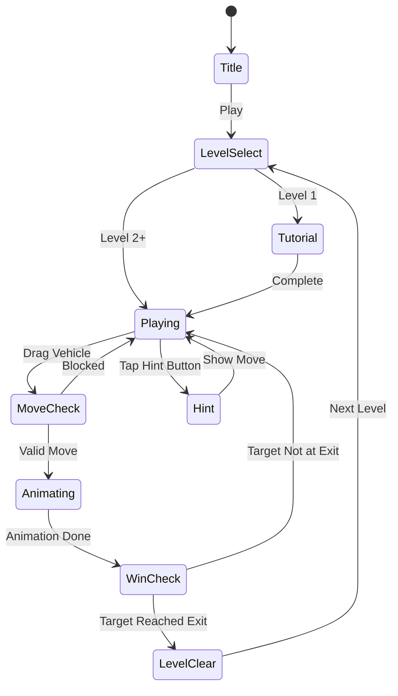

# Traffic Puzzle (교통 퍼즐) — 통합 기획서

> **레퍼런스**: Bus Jam #84 (4.8★) / Bus Craze #87 (4.3★) 외 교통 퍼즐 10종 분석
> **장르**: Traffic Escape Puzzle
> **MVP 목표**: 1~2주 출시

---

## 1. Bus Jam (4.8★) vs Bus Craze (4.3★) 비교 분석

### 핵심 차이: 퍼즐 vs 리액션

| 항목 | Bus Jam 4.8★ | Bus Craze 4.3★ |
|------|-------------|----------------|
| **장르 성격** | 턴 기반 슬라이딩 퍼즐 | 실시간 교통 관리 |
| **컨트롤** | 탭 1회 → 버스 자동 이동 | 지속적 멀티탭/스와이프 |
| **스트레스** | 낮음 (내 페이스) | 높음 (실시간 타이머) |
| **실패 원인** | 논리 오류 (납득 가능) | 반사 신경 부족 (억울함) |
| **재도전 의지** | 높음 (풀고 싶다) | 낮음 (지친다) |
| **타겟** | 퍼즐 애호가, 캐주얼 | 리액션 게이머 |
| **DAU 유지** | 높음 | 낮음 |

### Bus Jam이 0.5점 높은 이유

1. **명확한 목표**: 색상이 같은 버스 → 같은 색 출구로. 규칙 설명 불필요
2. **원터치 만족감**: 탭 한 번으로 버스가 미끄러져 나가는 피드백이 쾌감
3. **"아 이거였구나" 모멘트**: 막혔다가 순서 찾으면 연쇄 탈출 → 도파민
4. **실패가 납득됨**: "내가 논리를 틀렸다" → 재도전 의지 상승
5. **명상적 플레이**: 시간 압박 없음, 생각하면서 풀 수 있음

---

## 2. Bus Craze 실패 원인 분석

### 구조적 문제

**① 장르 혼종**
- "교통 퍼즐"이라고 하지만 실제로는 리액션/타이밍 게임
- 퍼즐 기대로 들어온 유저가 리액션 요구에 이탈
- *부정 리뷰 패턴*: "퍼즐인 줄 알았는데 너무 빠르다"

**② 멀티태스킹 피로**
- 동시에 여러 교차로 관리 → 인지 부하 급증
- 실패 시 "내 실수"가 아닌 "게임이 불공평"으로 귀인
- *부정 리뷰 패턴*: "동시에 3개 교차로 관리가 말이 되냐"

**③ 광고 침습**
- 실패 후 30초 광고 → 재도전 의지 꺾임
- 보상형 광고 위치 부적절 (필사적인 순간에 강제 광고)
- *부정 리뷰 패턴*: "광고가 게임보다 많다"

**④ 튜토리얼 부재**
- 첫 레벨부터 복잡한 교차로 상황
- 진입 장벽이 높아 설치 후 1분 이내 이탈률 높음

**⑤ 레벨 스파이크**
- 초반 쉽다가 갑자기 어려워지는 구간 존재
- 부드러운 난이도 커브 없음 → 벽 앞에서 이탈

### 우리가 반드시 피해야 할 실수

- ❌ 실시간 멀티태스킹 요소 (퍼즐 유저 이탈)
- ❌ 실패 후 강제 광고 (리텐션 킬러)
- ❌ 튜토리얼 없는 첫 레벨
- ❌ 급격한 난이도 스파이크
- ❌ 억울한 실패 (내 실수가 아닌 것 같은 느낌)

---

## 3. 교통 퍼즐 10종 레퍼런스 종합 분석

| # | 게임명 | 평점 | 핵심 메카닉 | 장점 | 단점 |
|---|--------|------|------------|------|------|
| 84 | Bus Jam | 4.8★ | 컬러 버스 슬라이드 → 출구 탈출 | 직관적, 만족감 | 단조로울 수 있음 |
| 87 | Bus Craze | 4.3★ | 교차로 실시간 신호 관리 | 독특함 | 스트레스, 광고 |
| - | Parking Jam 3D | 4.6★ | 주차장 차량 슬라이드 탈출 | 3D 비주얼 | 광고 과다 |
| - | Car Parking Jam | 4.5★ | 2D 주차장 탈출 | 레벨 다양성 | 반복감 |
| - | Traffic Jam 3D | 4.4★ | 3D 도로 차량 언블록 | 비주얼 임팩트 | 조작 불편 |
| - | Traffic Run! | 4.4★ | 교차로 타이밍 통과 | 중독성 | 단순 반복 |
| - | Unblock Car | 4.3★ | 클래식 슬라이딩 블록 | 퍼즐 완성도 | 구식 비주얼 |
| - | Road Turn | 4.2★ | 도로 타일 회전 배치 | 독창적 | 난이도 불균형 |
| - | Traffic Rush | 4.2★ | 교차로 흐름 관리 | 간단한 조작 | 단조로움 |
| - | Merge Car | 4.0★ | 차량 합치기 (merge) | 다른 재미 | 장르 혼재 |

### 종합 인사이트

**성공 패턴 (4.4+ 게임 공통점)**
1. **단일 조작**: 탭 or 스와이프 한 가지만 사용
2. **즉각 피드백**: 조작 → 결과가 0.3초 이내
3. **점진적 복잡도**: 레벨이 오를수록 변수 하나씩 추가
4. **명확한 목표**: 화면만 봐도 "뭘 해야 하는지" 보임
5. **쾌감 모션**: 차/버스가 빠져나갈 때 스피드감

**실패 패턴 (4.2 이하 공통점)**
1. 실시간 반응 요구
2. 동시 멀티태스킹
3. 광고 배치 실패
4. 튜토리얼 부재
5. 난이도 스파이크

---

## 4. 최종 기획 결론: Traffic Escape

### 전략적 결정

> **Bus Jam 메카닉 기반 + 교통 퍼즐 요소 통합 → 단일 앱 출시**
>
> Bus Jam(4.8★)이 증명한 슬라이딩 퍼즐 재미를 베이스로,
> 버스 외 트럭/택시/구급차 등 다양한 차량으로 콘텐츠를 확장한다.
> 실시간 요소 없음. 순수 퍼즐.

### 게임 이름

**Traffic Escape** (교통 탈출)

---

## 5. 게임 규칙

### 기본 규칙
- N×N 격자 보드에 다양한 차량이 가로/세로 방향으로 배치됨
- 각 차량은 자신의 방향(가로/세로)으로만 슬라이드 가능
- 목표 차량(빨간 차)을 출구까지 이동시키면 클리어
- 다른 차량들이 경로를 막고 있어 이들을 먼저 이동시켜야 함

### 차량 종류 (시각적 다양성)
| 차량 | 크기 | 특징 |
|------|------|------|
| 승용차 | 2칸 | 기본 유닛 |
| 버스 | 3칸 | 더 많은 공간 차지 |
| 트럭 | 3칸 | 가로 방향 전용 |
| 구급차 | 2칸 | VIP (우선 탈출 목표) |

### 조작
- **탭 & 드래그**: 차량 탭 후 드래그 방향으로 슬라이드
- **스냅**: 격자 단위로 스냅 (오조작 방지)
- **이동 불가 표시**: 막혀있으면 진동 피드백 + 빨간 하이라이트

---

## 6. 게임 플로우



---

## 7. UI 레이아웃

```
┌─────────────────────────┐
│  ← Back   Lv.42  💡 Hint│  ← 상단 HUD (단순)
├─────────────────────────┤
│                         │
│  ┌──┬──┬──┬──┬──┬──┐   │
│  │  │🚌│🚌│🚌│  │  │   │
│  ├──┼──┼──┼──┼──┼──┤   │
│  │🚗│🚗│  │  │  │  │   │  ← 6×6 격자 보드
│  ├──┼──┼──┼──┼──┼──┤   │    (빨간 차 = 목표)
│  │  │  │  │🚕│🚕│  │→→→│  ← 출구
│  ├──┼──┼──┼──┼──┼──┤   │
│  │  │🚑│🚑│  │  │  │   │
│  ├──┼──┼──┼──┼──┼──┤   │
│  │🚛│🚛│🚛│  │  │  │   │
│  └──┴──┴──┴──┴──┴──┘   │
│                         │
├─────────────────────────┤
│  Moves: 12    ↩️ Undo   │  ← 하단 (이동 수, 실행 취소)
└─────────────────────────┘
```

**디자인 원칙**
- 차량 색상: 차종별 고정 색 (빨강=목표, 파랑=버스, 노랑=택시)
- 출구: 항상 오른쪽 또는 위쪽 (직관적)
- 배경: 탑다운 도로 뷰 (아스팔트 텍스처)

---

## 8. 스코어링 / 진행 시스템

### 별점 시스템 (이동 수 기반)
| 이동 수 | 별점 |
|---------|------|
| 최적 이동수 | ⭐⭐⭐ |
| 최적 + 3 이하 | ⭐⭐ |
| 그 이상 | ⭐ |

> 시간제한 없음 → 스트레스 없음 → 리텐션 향상

### 진행 시스템
- 레벨 팩: 초급(1-30) / 중급(31-80) / 고급(81-150) / 전문가(151+)
- 각 팩 70% 클리어 시 다음 팩 언락
- 별 수집 → 힌트 아이템 획득 (광고 대안)

---

## 9. 난이도 설계

| 구간 | 보드 | 차량 수 | 특징 |
|------|------|---------|------|
| 레벨 1-5 | 5×5 | 4-6대 | 튜토리얼, 1-2수 이동 |
| 레벨 6-20 | 6×6 | 6-8대 | 기본 퍼즐, 버스 등장 |
| 레벨 21-50 | 6×6 | 8-10대 | 연쇄 이동 필요 |
| 레벨 51-100 | 6×6 | 10-12대 | 트럭 등장, 복잡한 잠금 |
| 레벨 101+ | 8×8 | 12-15대 | 전문가 퍼즐 |

**난이도 커브 원칙**
- 새 요소 도입 시 쉬운 버전 3레벨 먼저
- 스파이크 금지: 이전 레벨 대비 이동수 최대 +5
- 막힘 방지: 레벨당 힌트 1개 무료 제공

---

## 10. 수익화 전략

### 광고 (비침습적)
| 광고 유형 | 시점 | 빈도 |
|-----------|------|------|
| 전면 광고 | 5레벨 클리어마다 | 1회 |
| 보상형 광고 | 힌트 추가 요청 시 | 선택적 |
| 배너 | 레벨 선택 화면 | 항상 (하단) |

> ❌ 절대 금지: 실패 직후 강제 광고

### 인앱 결제
| 상품 | 가격 | 내용 |
|------|------|------|
| 광고 제거 | $2.99 | 영구 |
| 힌트 팩 | $0.99 | 힌트 20개 |
| 레벨 팩 | $1.99 | 추가 50레벨 |

---

## 11. 차별화 포인트 (경쟁 우위)

1. **다양한 차량 타입**: 버스만 아닌 버스/트럭/구급차/택시 혼합
2. **스토리 컨텍스트**: "구급차가 긴급 출동해야 한다!" → 감성 연결
3. **데일리 퍼즐**: 매일 새 퍼즐 1개 → 습관 형성
4. **깔끔한 비주얼**: 탑다운 도시 뷰, 미니멀 UI
5. **오프라인 완전 지원**: 광고 없이도 플레이 가능 (광고는 보너스)

---

## 12. MVP 범위

### Phase 1 — 1주 목표 (핵심 재미 루프)
- [x] 기획서 작성
- [ ] 6×6 격자 보드 렌더링
- [ ] 차량 슬라이드 조작 (탭+드래그)
- [ ] 충돌 감지 + 이동 가능 판정
- [ ] 클리어 조건 (목표 차량 → 출구)
- [ ] 레벨 데이터 10개 (하드코딩)
- [ ] 기본 사운드/이펙트

### Phase 2 — 2주 목표 (완성도)
- [ ] 별점 시스템 (최적 이동수 기반)
- [ ] 레벨 선택 화면 (30레벨)
- [ ] Undo 기능
- [ ] 힌트 시스템
- [ ] 보상형 광고 연동
- [ ] 튜토리얼 (레벨 1-3)

### Phase 3 — 출시 후
- [ ] 레벨 150개로 확장
- [ ] 데일리 퍼즐
- [ ] 다양한 차량 타입
- [ ] 8×8 보드 전문가 팩

---

## 13. 기술 스택 매핑

| 레이어 | 기술 | 핵심 구현 |
|--------|------|-----------|
| lib/traffic-puzzle | Phaser.io | 격자 보드, 차량 씬, 슬라이드 물리 |
| web/traffic-puzzle | React + Stitches | 레벨 선택 UI, 클리어 팝업 |
| traffic-puzzle/rn | RN WebView | WebView 래핑, 광고 SDK 연동 |

---

## 요약: 왜 이 방향인가

```
Bus Jam (4.8★) 공식 = 단일 조작 + 즉각 피드백 + 논리적 실패
Bus Craze (4.3★) 실수 = 실시간 압박 + 멀티태스킹 + 광고 침습

우리의 답 = Bus Jam 공식 × 콘텐츠 확장(차량 다양화) × 비침습적 수익화
```

**3개월 생존 전략 관점에서**: 교통 퍼즐은 검증된 장르, Bus Jam이 4.8로 증명했다.
우리는 같은 재미를 더 많은 콘텐츠와 나은 수익화로 출시한다.
