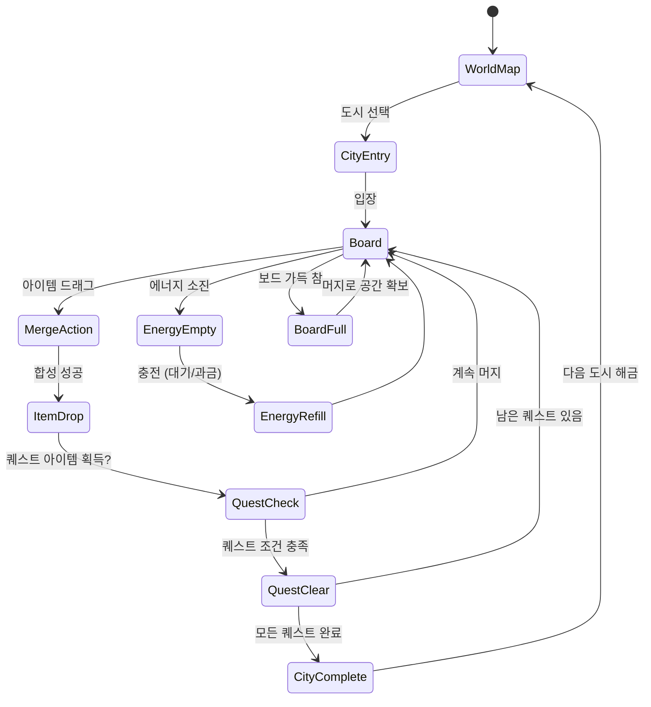

# Travel Town - 결합 어드벤처

> 머지(Merge) + 세계 여행 테마. 아이템을 합성해 여행 도구를 만들고, 세계 도시를 탐험한다.

## 개요

보드 위의 아이템을 합성(머지)해 더 높은 등급의 여행 아이템을 만든다.
완성된 아이템으로 여행 퀘스트를 클리어하고 다음 도시로 이동한다.
도시마다 고유한 랜드마크와 아이템 체인이 있으며, 보드 공간 관리가 핵심 전략이다.

### 핵심 재미 루프

```
아이템 획득 → 머지 → 퀘스트 아이템 완성 → 퀘스트 클리어 → 새 도시 해금
      ↑                                                              |
      └──────────────── 새 아이템 드롭 ◄───────────────────────────┘
```

---

## 게임 규칙

### 코어 머지 메카닉

- 보드 위 **같은 아이템 2개를 드래그해 합치면** 다음 등급 아이템으로 진화
- 아이템은 **레벨 1 → 최대 레벨(도시마다 상이)** 까지 진화 체인 존재
- 최상위 아이템은 **랜드마크 조각** 또는 **퀘스트 완성 아이템**
- 머지 후 **낮은 등급 아이템이 랜덤 드롭**되어 보드에 추가됨 (보드 채움 루프)

#### 아이템 진화 체인 예시 (파리 도시)

```
조약돌 (Lv1)
  → 작은 지도 (Lv2)
    → 여행 가방 (Lv3)
      → 카메라 (Lv4)
        → 에펠탑 조각 (Lv5, 퀘스트 아이템)
          → 에펠탑 미니어처 (Lv6, 랜드마크)
```

#### 머지 규칙 세부

| 규칙 | 내용 |
|------|------|
| 합성 조건 | 같은 종류, 같은 레벨 2개 |
| 합성 방식 | 드래그 & 드롭 (한 칸에 겹치기) |
| 결과물 | 다음 레벨 아이템 1개 |
| 부산물 | 없음 (단순 합성) |
| 최상위 아이템 | 더 이상 합성 불가, 퀘스트에 사용 |

---

### 보드 관리

- 보드 크기: **기본 4×7 = 28칸** (잠금 해제로 최대 5×8 = 40칸)
- 보드가 **가득 차면 새 아이템 드롭 불가 → 실질적 게임 오버 상태**
- 전략: 낮은 레벨 아이템을 빠르게 머지해 공간 확보

#### 보드 상태 관리 전략 요소

| 상황 | 전략 |
|------|------|
| 공간 부족 | 같은 레벨 아이템 우선 머지 |
| 퀘스트 재료 부족 | 낮은 레벨 아이템 다수 보유 → 체인 머지 |
| 최상위 아이템 과다 | 퀘스트 소비 또는 임시 보관함 사용 |

#### 잠긴 칸 (Locked Cell)

- 보드 일부 칸은 처음에 잠김
- 특정 퀘스트 완료 또는 잠금해제 아이템 소비로 개방
- 수익화 연계: 보석으로 즉시 해제 가능

---

## 여행 메타 (월드 맵)

### 도시 구조

세계 도시를 순서대로 방문. 각 도시는 **3~5개의 퀘스트** 로 구성.
모든 퀘스트 클리어 시 도시 완료 → 다음 도시 해금.

```
[서울] → [도쿄] → [방콕] → [두바이] → [파리] → [런던] → [뉴욕] → ...
  ✓        ✓       현재       🔒         🔒        🔒       🔒
```

### 도시별 테마 아이템 체인

각 도시는 **고유 아이템 체인 세트** 보유. 도시 이동 시 체인 교체.

| 도시 | 테마 | 최상위 랜드마크 |
|------|------|----------------|
| 서울 | K-문화 | 경복궁 |
| 도쿄 | 일본 전통 | 도쿄타워 |
| 방콕 | 열대 & 사원 | 왓 프라깨우 |
| 두바이 | 사막 & 럭셔리 | 부르즈 할리파 |
| 파리 | 예술 & 낭만 | 에펠탑 |
| 런던 | 영국 왕실 | 빅벤 |
| 뉴욕 | 도시 & 자유 | 자유의 여신상 |

> MVP: 서울 + 도쿄 + 방콕 3개 도시. 격주 업데이트로 도시 추가.

### 랜드마크 컬렉션

- 각 도시 완료 시 **랜드마크 미니어처** 획득 → 컬렉션 보관함에 전시
- 컬렉션 완성 보너스: 에너지 +20, 보드 확장권 1개
- 수집 욕구 자극 → 리텐션 동력

---

## 퀘스트 시스템

### 퀘스트 구조

각 도시는 3~5개의 퀘스트로 구성. 순서대로 진행.

```
도시 입장
  → 퀘스트 1 (튜토리얼 수준)
  → 퀘스트 2
  → 퀘스트 3 (핵심 퀘스트 - 랜드마크 아이템 필요)
  → 퀘스트 4 (선택, 보너스 보상)
  → 도시 클리어 → 다음 도시
```

### 퀘스트 예시 (방콕 도시)

| 퀘스트 | 요구 아이템 | 보상 |
|--------|------------|------|
| 길거리 음식 탐방 | 팟타이 (Lv3) × 3 | 에너지 +10, 잠금칸 해제 |
| 사원 참배 | 불상 (Lv4) × 2 | 코인 +500 |
| 왓 프라깨우 방문 | 왓프라깨우 조각 (Lv5) × 1 | 랜드마크 수집, 다음 도시 해금 |
| 보너스: 투어 패키지 | 카메라 (Lv4) + 지도 (Lv2) | 프리미엄 보석 ×3 |

### 퀘스트 진행 방식

1. 화면 우측에 현재 퀘스트 목록 표시
2. 필요 아이템 보유 시 자동 감지 → "제출" 버튼 활성화
3. 아이템 제출 → 퀘스트 완료 애니메이션 → 보상 지급
4. 다음 퀘스트 자동 진행

---

## 게임 플로우



---

## UI 레이아웃

```
┌─────────────────────────────┐
│  🌍 방콕      에너지: ⚡20   │  ← 도시명 + 에너지
│  퀘스트: 2/3 완료  💎 50    │  ← 진행도 + 보석
├──────────────┬──────────────┤
│              │ 📋 퀘스트    │
│              │ □ 팟타이 ×3  │
│   머지 보드  │   (2/3개)    │  ← 우측 퀘스트 패널
│   (4×7 칸)   │              │
│              │ □ 불상 ×2   │
│              │   (0/2개)    │
├──────────────┴──────────────┤
│  🔀 자동머지  📦 보관함  🗺️ 지도 │  ← 하단 액션 버튼
└─────────────────────────────┘
```

### 보드 셀 상태

| 상태 | 표시 |
|------|------|
| 빈 칸 | 회색 점선 테두리 |
| 아이템 있음 | 아이템 아이콘 + 레벨 뱃지 |
| 잠긴 칸 | 자물쇠 아이콘 |
| 퀘스트 아이템 | 골드 하이라이트 |

---

## 스코어링 시스템

Travel Town은 점수 대신 **퀘스트 진행도**와 **컬렉션**이 핵심 지표.

| 지표 | 내용 |
|------|------|
| 퀘스트 완료율 | 도시 내 퀘스트 n/N 완료 |
| 랜드마크 컬렉션 | 수집한 도시 수 / 전체 |
| 최고 머지 레벨 | 달성한 최고 아이템 레벨 |
| 연속 플레이일 | 데일리 스트릭 (리텐션) |

---

## 난이도 설계

### 도시별 난이도 곡선

| 도시 | 아이템 체인 최대 레벨 | 퀘스트 수 | 필요 에너지 |
|------|----------------------|-----------|------------|
| 서울 (1) | 5 | 3 | 60 |
| 도쿄 (2) | 6 | 4 | 80 |
| 방콕 (3) | 6 | 4 | 80 |
| 두바이 (4) | 7 | 5 | 120 |
| 파리 (5) | 7 | 5 | 120 |
| 런던 (6) | 8 | 5 | 150 |
| 뉴욕 (7) | 8 | 6 | 180 |

### 머지 난이도 조절 요소

- **낮은 레벨 아이템 드롭율**: 도시가 깊을수록 Lv1 드롭 감소
- **퀘스트 요구량**: 도시가 깊을수록 고레벨 아이템 다수 요구
- **보드 잠금 칸**: 초반 도시는 잠금 적음, 후반 많음

---

## 수익화 설계

### 에너지 시스템

- 아이템 드롭 시 에너지 1 소비 (머지 자체는 무료)
- 최대 에너지: 50
- 에너지 회복: 5분당 1 자동 회복
- 에너지 구매: 30⚡ = 보석 30개 / 50⚡ = 보석 45개 (번들 할인)
- **에너지 > 광고 시청 (리워드 광고) > 구매** 순으로 UX 제시

### 보드 공간 확장

- 기본 보드: 4×7 (28칸)
- 1단계 확장 (5×7, 35칸): 보석 100개
- 2단계 확장 (5×8, 40칸): 보석 200개
- **공간 부족이 핵심 마찰 → 확장 구매 전환율 높음**

### 프리미엄 여행지

- 특별 도시 (예: 몰디브, 마추픽추): **배틀패스 또는 한정 이벤트**
- 일반 진행으로는 잠금 → 프리미엄 구매 또는 이벤트 참여
- 한정 랜드마크 컬렉션 → 수집 심리 자극

### 광고 배치

| 위치 | 타입 | 보상 |
|------|------|------|
| 에너지 소진 시 | 리워드 광고 | 에너지 +10 |
| 퀘스트 실패 시 | 리워드 광고 | 퀘스트 아이템 1개 지급 |
| 일일 보너스 | 리워드 광고 | 코인 2배 |
| 보드 가득 찼을 때 | 리워드 광고 | 임시 칸 +3 (10분) |

### 수익화 KPI 목표

| 지표 | 목표 |
|------|------|
| Day 1 리텐션 | 40%+ |
| Day 7 리텐션 | 20%+ |
| ARPU (7일) | $0.15+ |
| 광고 노출 수/DAU | 3회+ |
| 인앱 구매 전환율 | 2%+ |

---

## #5/#18/#34 머지 게임과의 비교 분석

> **핵심 인사이트: 테마만 다를 뿐, 머지 코어 로직은 동일하다.**

| 항목 | #5 (가정집 머지) | #18 (농장 머지) | #34 (우주 머지) | Travel Town (#47) |
|------|-----------------|-----------------|-----------------|-------------------|
| 배경 테마 | 집 인테리어 | 농장/자연 | 우주 탐험 | 세계 여행 |
| 아이템 체인 | 가구/소품 | 작물/동물 | 행성/로켓 | 여행 도구/랜드마크 |
| 진행 구조 | 방 꾸미기 | 작물 성장 | 행성 탐험 | 도시 여행 |
| 퀘스트 타입 | 인테리어 주문 | 수확 목표 | 탐사 미션 | 여행 퀘스트 |
| 코어 머지 로직 | **동일** | **동일** | **동일** | **동일** |
| 에너지 시스템 | 동일 | 동일 | 동일 | 동일 |
| 보드 관리 | 동일 | 동일 | 동일 | 동일 |

**→ 머지 게임 4개를 개발했지만, 실제로 다른 것은 아이템 아트와 맵 테마뿐.**

---

## lib/merge-core 공통 엔진 설계 제안

### 배경 & 필요성

현재 머지 게임 #5, #18, #34, #47 모두 동일한 로직을 각자 구현 중.
이는 버그 중복, 유지보수 비용 증가, 신규 머지 게임 개발 속도 저하를 유발.

### 제안: lib/merge-core 패키지

```
lib/
  merge-core/          ← 신규 공통 엔진
    src/
      board/           ← 보드 상태 관리
        BoardManager.ts
        Cell.ts
        BoardConfig.ts
      merge/           ← 머지 로직
        MergeEngine.ts
        EvolutionChain.ts
        MergeResult.ts
      quest/           ← 퀘스트 시스템
        QuestManager.ts
        QuestCondition.ts
      energy/          ← 에너지 시스템
        EnergyManager.ts
      types/
        index.ts
    package.json
```

### 핵심 인터페이스 (설계 예시)

```typescript
// 아이템 진화 체인 정의 (테마별로 주입)
interface EvolutionChain {
  items: ItemDefinition[];  // Lv1 ~ LvMax
  theme: string;            // "travel-town" | "farm" | "space"
}

// 보드 설정 (게임별 커스터마이즈)
interface BoardConfig {
  width: number;            // 기본 4
  height: number;           // 기본 7
  lockedCells: Position[];  // 잠긴 칸 위치
  maxEnergy: number;        // 기본 50
}

// 머지 엔진 (공통 로직)
class MergeEngine {
  merge(cellA: Position, cellB: Position): MergeResult;
  dropItem(level: number): Item;
  isValidMerge(cellA: Position, cellB: Position): boolean;
}
```

### 게임별 구현 예시

```typescript
// lib/travel-town/src/TravelTownGame.ts
import { MergeEngine, QuestManager, EnergyManager } from 'merge-core';
import { TRAVEL_TOWN_CHAINS } from './chains';  // 여행 테마 아이템 체인

const game = new MergeEngine({
  chains: TRAVEL_TOWN_CHAINS,
  boardConfig: { width: 4, height: 7 }
});
```

### 엔진 공통화 효과

| 항목 | 현재 (개별 구현) | 엔진 공통화 후 |
|------|-----------------|---------------|
| 신규 머지 게임 개발 기간 | 1~2주 | **2~3일** |
| 버그 수정 | 게임마다 개별 수정 | **한 번에 전체 수정** |
| 테스트 커버리지 | 게임마다 별도 | **공통 엔진 테스트로 통합** |
| 아트/테마 교체 | 어려움 | **체인 JSON 교체만으로 완성** |

**→ MVP 출시 후 merge-core 리팩터링을 Phase 2 우선순위로 권장**

---

## 머지 장르 전략 결론

### 결론: 엔진 공통화 후 테마 양산 전략 채택 권장

**현 상황 평가:**
- 머지 게임은 시장 검증된 장르 (Top 100 게임 중 20%+가 머지)
- 개발 복잡도 낮음 → 1~2주 MVP 가능
- 아트/테마만 바꾸면 신규 게임처럼 인식됨 (유저 시각)

**3개월 생존 전략 내 머지 포트폴리오:**

```
Month 1: Travel Town MVP 출시 (현 도시 3개)
Month 2: 데이터 확인 후 →
  - CPI 낮으면: 머지 신규 테마 1개 추가 (키친 머지? 판타지 머지?)
  - CPI 높으면: Travel Town 콘텐츠 확장 (도시 추가, 이벤트)
Month 3: 성과 게임에 마케팅 집중투자 → 출구 준비
```

**lib/merge-core 개발 타이밍:**
- Travel Town MVP 출시 직후 (Month 1 후반)
- 병렬 개발 가능 → 이미 동작하는 게임에서 로직 추출
- Month 2 신규 머지 게임부터 엔진 재사용

**리스크:**
- 머지 게임 포화 시장 → **차별화 포인트는 "여행"이라는 보편적 판타지**
- 한국/동남아 유저 타겟 → 아시아 도시 우선 배치로 문화적 친밀감 확보

---

## 사운드/이펙트

| 이벤트 | 사운드/이펙트 |
|--------|--------------|
| 머지 성공 | 반짝임 + 팡! 효과음 |
| 레벨업 아이템 | 상승 톤 + 파티클 |
| 퀘스트 완료 | 팡파레 + 골드 파티클 |
| 도시 이동 | 비행기 이착륙 애니메이션 + 효과음 |
| 랜드마크 획득 | 화려한 이펙트 + 축하 음악 |
| 에너지 소진 | 낮은 톤 알림음 |
| 보드 가득 참 | 경고음 + 화면 흔들림 |

---

## MVP 범위

### Phase 1 (Week 1~2: MVP 출시)

- [x] 기획서 작성
- [ ] lib/travel-town 머지 엔진 (보드, 머지 로직, 아이템 체인)
- [ ] 서울/도쿄/방콕 3개 도시 + 각 3개 퀘스트
- [ ] 에너지 시스템 (자동 회복)
- [ ] 기본 보드 UI (4×7)
- [ ] 월드맵 화면
- [ ] 광고 연동 (리워드 광고)

### Phase 2 (Week 3~4: 데이터 반영)

- [ ] lib/merge-core 공통 엔진 분리
- [ ] 두바이/파리/런던 도시 추가
- [ ] 보드 확장 구매 시스템
- [ ] 랜드마크 컬렉션 보관함 UI
- [ ] 이벤트 시스템 (한정 도시)
- [ ] 인앱 구매 연동

### Phase 3 (Month 2: 성과 기반)

- [ ] 신규 머지 테마 게임 (merge-core 재사용)
- [ ] 프리미엄 도시 배틀패스
- [ ] 소셜 기능 (친구 방문)
- [ ] 뉴욕 이후 도시 지속 추가
