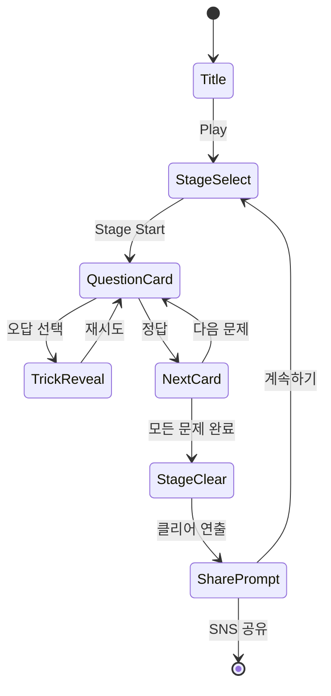

# Tricky Prank: Annoying Quest

> **장르**: Brain-Logic / Trick Puzzle
> **레퍼런스 랭크**: #57 (HIGAME Studio, 평점 4.6)
> **개발 목표**: MVP 1~2주, 바이럴 마케팅으로 낮은 CPI 달성

---

## 개요

상식을 비트는 넌센스 퀴즈 + 페이크 UI + 장난 요소로 구성된 트릭 퍼즐 게임.
플레이어는 "뻔해 보이는" 문제에서 함정에 빠지고, 예상 밖 정답을 발견하며 쾌감과 황당함을 동시에 경험한다.
**"이거 못 풀면 바보"** 프레임으로 SNS 바이럴을 유도, CPI를 자연적으로 낮추는 구조.

---

## 1. 코어 메카닉

### 기본 구조

- **문제(Question)** → **선택지 또는 인터랙션** → **정답/오답 판정** → **트릭 리빌 연출**
- 각 문제는 독립적인 "퍼즐 카드" 단위로 구성
- 1판 = 10~15개 문제로 구성된 스테이지
- 오답 시 즉각적인 유머 리액션 연출 후 재시도 가능

### 트릭 메카닉 유형

| 유형 | 설명 | 예시 |
|------|------|------|
| **페이크 선택지** | 명백해 보이는 정답이 오답 | "다음 중 가장 큰 수는? 1 / 2 / 3" → 정답은 문제 속 숫자 |
| **UI 조작** | 버튼 위치가 바뀌거나 숨겨진 요소 클릭 | "OK 버튼을 누르세요" → 버튼이 도망다님 |
| **리터럴 해석** | 말 그대로 해석해야 하는 문제 | "빨간 것을 건드리지 마세요" → 빨간 글자 '것'을 피해야 함 |
| **시간 역이용** | 타이머 자체가 정답 | "10초 안에 아무것도 하지 마세요" → 가만히 있으면 클리어 |
| **화면 밖 요소** | 스크롤, 기울기, 특정 영역 탭 | "숨겨진 버튼을 찾으세요" |
| **연속 페이크** | 연속으로 함정 배치, 마지막에 진짜 반전 | 오답→오답→오답→정답 구조 |
| **메타 트릭** | 게임 자체를 속임 | "이 문제를 닫으면 클리어" → X 버튼이 정답 |

### 게임 플로우



---

## 2. Brain Puzzle #8/#15와의 차별화

### 장르 내 포지셔닝

| 항목 | #8 Brain Puzzle (추정) | #15 Brain Puzzle (추정) | #57 Tricky Prank |
|------|----------------------|----------------------|-----------------|
| **톤** | 진지한 두뇌 훈련 | 수학/논리 퀴즈 | 유머/황당함/장난 |
| **정답 도달 방식** | 논리적 추론 | 규칙 파악 | 상식 파괴 + 반전 |
| **실패 경험** | 좌절감 → 성취감 | 반복 학습 | 웃음 → 공유 욕구 |
| **바이럴 요소** | 낮음 | 낮음 | **매우 높음** |
| **타깃** | 두뇌 훈련 원하는 성인 | 퀴즈 좋아하는 유저 | 10~30대 전 연령 |
| **콘텐츠 수명** | 스테이지 완료 후 감소 | 스테이지 완료 후 감소 | 신규 문제팩으로 연장 |

### 통합 전략 (하단 섹션 7에서 상세)

세 게임은 **"두뇌 게임 패밀리"** 로 묶어 크로스프로모션 가능.
각각 다른 뇌 자극 포인트를 공략 → 한 유저가 모두 즐길 수 있는 구조.

---

## 3. 장난/유머 요소 설계

### 페이크 UI 패턴

```
┌─────────────────────────────┐
│  문제: 파란 버튼을 누르세요   │
│                             │
│   [빨간 버튼]  [파란 버튼]   │  ← 파란 버튼이 실제로는
│                             │     터치 영역이 엇나가 있음
└─────────────────────────────┘
```

```
┌─────────────────────────────┐
│  문제: 가장 작은 버튼을 눌러 │
│                             │
│  [    매우 큰 버튼    ]      │
│                        [•]  │  ← 숨겨진 초소형 버튼
└─────────────────────────────┘
```

### 예상 외 정답 예시 (문제 DB 샘플)

| 문제 | 함정 | 실제 정답 |
|------|------|---------|
| "1+1을 계산하세요" | 계산기 UI 제공 → 2 입력 | 문제의 '+'를 탭 (리터럴) |
| "다음 중 홀수를 고르세요: 3, 7, 11, 13" | 모두 홀수 | 전부 탭하기 |
| "빨간 원을 피하세요" | 원을 피해 다님 | '빨간 원'이라는 글자 속 '원'을 탭 |
| "OK를 누르세요" | 버튼 탭 | 'OK'라는 텍스트를 직접 탭 |
| "이 문제를 5초간 보고 계세요" | 아무거나 탭 | 아무것도 안 함 |
| "코끼리를 냉장고에 넣는 방법?" | 복잡한 로직 | 문 열고 → 넣고 → 문 닫기 |
| "틀린 글자를 찾으세요: AABBCC" | 글자 패턴 분석 | '틀린 글자'는 없음 → 없다 탭 |

### 오답 리액션 연출 (유머 포인트)

- 화면 흔들림 + 큰 X 이펙트
- 캐릭터(주인공 장난꾸러기)가 비웃는 애니메이션
- 오답 카운트 표시: "이제까지 X명이 여기서 틀렸어요"
- 소리: 빠밤~ / 으이구~ / 또 틀렸네 등 유머 효과음

---

## 4. 바이럴 설계

### "이거 풀 수 있어?" 마케팅 구조

```
게임 내 경험
    ↓
클리어 화면: "상위 X%만 풀었어요!"
    ↓
공유 버튼: "친구한테 도전장 보내기"
    ↓
공유 이미지: 문제 캡처 + "나는 풀었다 / 못 풀겠으면 다운로드"
    ↓
신규 유저 유입 (CPI 0에 가까운 유기적 설치)
```

### SNS 공유 콘텐츠 구조

- **공유 이미지**: 가장 황당한 문제 1개 캡처 + 브랜드 로고
- **공유 텍스트**: `"이 문제 못 풀면 바보 인정? [앱 링크]"`
- **챌린지 포맷**: 스테이지 클리어 시간 공유 → 타임어택 경쟁 유도
- **틀린 횟수 공유**: "나 이 문제에서 X번 틀렸다" → 공감 유발

### 바이럴 계수 목표

| 지표 | 목표 |
|------|------|
| 공유율 (클리어 후) | 15% 이상 |
| 공유 → 설치 전환율 | 8% 이상 |
| K-factor (유기적 바이럴) | 0.15 이상 |

---

## 5. 콘텐츠 생산 구조

### 문제 DB 설계

```typescript
interface TrickQuestion {
  id: string;
  stage: number;           // 속하는 스테이지
  difficulty: 1 | 2 | 3;  // 쉬움/보통/어려움
  type: TrickType;         // 트릭 유형
  question: string;        // 문제 텍스트
  hint?: string;           // 힌트 (유료)
  answerLogic: string;     // 정답 로직 키 (코드 매핑)
  wrongAnswerReaction: string; // 오답 리액션 ID
  shareImageKey: string;   // SNS 공유용 이미지
  tags: string[];          // 분류 태그 (리터럴, UI, 메타 등)
}

type TrickType =
  | 'fake-choice'    // 페이크 선택지
  | 'ui-trick'       // UI 조작
  | 'literal'        // 리터럴 해석
  | 'time-trick'     // 타이머 역이용
  | 'hidden-element' // 숨겨진 요소
  | 'meta-trick';    // 메타 트릭
```

### 문제 업데이트 주기

| 주기 | 내용 | 목적 |
|------|------|------|
| **출시 시** | 60~80문제 (6~8 스테이지) | 기본 콘텐츠 확보 |
| **주 1회** | 3~5문제 무료 추가 | 리텐션 유지 |
| **월 1회** | 테마팩 10~15문제 (유료) | 수익화 |
| **이벤트** | 시즌 한정 문제 (크리스마스 등) | 바이럴 재점화 |

### 문제 제작 난이도별 비율

- 쉬움 (30%): 처음 2~3 스테이지, 바이럴 유입용
- 보통 (50%): 핵심 콘텐츠
- 어려움 (20%): "진짜 못 풀면 바보" 레벨, 공유 유도

---

## 6. 수익화 모델

### 힌트 시스템 (광고 기반)

```
오답 3회 → 힌트 제안 팝업
    ↓
[광고 보고 힌트 받기] → 30초 광고 → 힌트 표시
[힌트 코인 사용]      → 코인 1개 소모 → 힌트 표시
[건너뛰기]            → 팝업 닫기
```

| 상품 | 가격 | 내용 |
|------|------|------|
| 힌트 코인 5개 | $0.99 | 힌트 5회 사용 |
| 힌트 코인 20개 | $2.99 | 힌트 20회 사용 |
| 문제팩: 시즌1 | $1.99 | 신규 15문제 |
| 문제팩: 번들 | $4.99 | 3개 팩 묶음 |
| 광고 제거 | $2.99 | 광고 없이 플레이 |

### 광고 배치 전략

| 위치 | 광고 유형 | 빈도 |
|------|---------|------|
| 스테이지 완료 | 전면 광고 | 매 2스테이지 |
| 오답 3회 | 보상형 광고 | 선택적 |
| 메인 화면 | 배너 | 상시 |
| 게임 오버 | 전면 광고 | 매번 |

### 예상 수익 구조 (Month 1 기준)

| 지표 | 목표 |
|------|------|
| DAU | 10,000 |
| 광고 ARPDAU | $0.05 |
| 인앱 결제 전환율 | 1.5% |
| 월 광고 수익 | $1,500 |
| 월 IAP 수익 | $2,000 |
| **월 합계** | **$3,500** |

---

## 7. Brain/Trick 장르 통합 전략 (#8 + #15 + #57)

### "두뇌 게임 패밀리" 크로스프로모션

```
┌─────────────┐    ┌─────────────┐    ┌─────────────┐
│  #8 Brain   │    │  #15 Brain  │    │  #57 Tricky │
│   Puzzle    │◄──►│   Puzzle    │◄──►│    Prank    │
│  (논리/추론) │    │  (수학/규칙) │    │ (유머/반전) │
└─────────────┘    └─────────────┘    └─────────────┘
         ↑                ↑                  ↑
         └────────────────┴──────────────────┘
                  Brain Games Universe
                  (공통 코인/진행도 연동)
```

### 통합 혜택

- **공통 코인 시스템**: 한 게임에서 획득한 코인을 다른 게임 힌트에 사용
- **크로스 프로모 배너**: 각 게임 메인 화면에 다른 게임 추천
- **통합 리더보드**: "두뇌왕" 칭호 — 세 게임 통합 점수 경쟁
- **번들 출시**: 세 게임 묶음 할인 (ASO 노출 + 수익 극대화)

### 차별화 포인트 유지

각 게임이 완전히 다른 경험을 제공하므로 카니발리제이션 없음:
- #8: "나 진짜 똑똑해" 만족감
- #15: "수학 잘한다" 자부심
- #57: "나 완전 속았다 ㅋㅋㅋ" 공유 욕구

---

## 8. 트릭 퍼즐 CPI 경쟁력 분석

### 바이럴 = 낮은 CPI 구조

일반 캐주얼 게임의 CPI는 $0.8~2.0이지만,
트릭 퍼즐은 **바이럴 콘텐츠로 유기적 설치를 유도**하여 실질 CPI를 대폭 낮춤.

```
유료 광고 CPI: $1.2 (업계 평균)
바이럴 유기적 설치: CPI $0 (공유로 인한 설치)

혼합 CPI = (유료 광고비) / (유료 설치 + 유기적 설치)
        = $1.2 × 유료 설치 / (유료 설치 × 1.15)  ← K-factor 0.15 가정
        = 실질 CPI ≈ $1.04  (13% 절감)
```

### 트릭 퍼즐의 마케팅 우위

| 요소 | 일반 퍼즐 | 트릭 퍼즐 (#57) |
|------|---------|--------------|
| **콘텐츠 마케팅** | 어려움 | 문제 자체가 광고 소재 |
| **UGC 생성** | 낮음 | 클리어 인증, 실패 공유 |
| **입소문 효과** | 낮음 | "이 문제 진짜 웃겨" 확산 |
| **크리에이터 콘텐츠** | 낮음 | 유튜버 리액션 영상 소재 |
| **CPI 절감률** | 0% | 10~20% 절감 |

### 3개월 생존 전략에서의 역할

```
Month 1: Tricky Prank 출시 → 바이럴 점화
          목표: 50,000 설치, CPI $1.0 이하

Month 2: 데이터 수집 → 어떤 문제 유형이 공유 많이 되는지 분석
          공유율 높은 문제 중심으로 광고 크리에이티브 제작
          목표: CAC 회수 기간 30일 이하

Month 3: 성과 기반 예산 집중 or 피벗
          성공 시: 문제팩 출시 + #8/#15 크로스프로모
          실패 시: 다음 게임으로 이동 (코드 파이프라인 재사용)
```

---

## UI 레이아웃

```
┌─────────────────────────────┐
│  😈 Tricky Prank  스테이지1  │  ← 상단 HUD
│  문제 3/10    💡 힌트: 2     │
├─────────────────────────────┤
│                             │
│   ┌─────────────────────┐   │
│   │                     │   │
│   │  문제 텍스트가 여기   │   │  ← 문제 카드
│   │  표시됩니다.         │   │
│   │                     │   │
│   └─────────────────────┘   │
│                             │
│   ┌────────┐  ┌────────┐    │
│   │ 선택지 │  │ 선택지 │    │  ← 인터랙션 영역
│   │   A   │  │   B   │    │    (문제 유형별 다름)
│   └────────┘  └────────┘    │
│                             │
├─────────────────────────────┤
│  ❌ 틀린 횟수: 2             │  ← 오답 피드백
│  💬 "아직도 모르겠어?"        │
└─────────────────────────────┘
```

---

## 스코어링 시스템

| Action | 점수 |
|--------|------|
| 첫 번째 시도 정답 | +300 |
| 두 번째 시도 정답 | +200 |
| 세 번째 이상 정답 | +100 |
| 힌트 없이 스테이지 클리어 | +500 보너스 |
| 빠른 클리어 보너스 | 남은 시간 × 5 |

---

## 난이도 설계

| 스테이지 | 문제 수 | 주요 트릭 유형 | 힌트 제공 |
|---------|---------|-------------|---------|
| 1 (튜토리얼) | 5 | fake-choice | 자동 힌트 |
| 2~3 | 10 | fake-choice, literal | 오답 3회 후 |
| 4~5 | 10 | ui-trick, time-trick | 오답 3회 후 |
| 6~7 | 12 | hidden-element, meta | 오답 5회 후 |
| 8+ | 15 | 혼합 | 오답 5회 후 |

---

## 사운드/이펙트

- 문제 등장: 두근두근 효과음
- 오답: 빠밤! + 캐릭터 비웃음 애니메이션
- 정답: 짠! + 반짝 이펙트
- 연속 오답: "또 틀렸어~" 조롱 대사 (10종 랜덤)
- 스테이지 클리어: 팡파레 + 상위 X% 표시

---

## MVP 범위

### Phase 1 — 출시 MVP (1~2주)

- [ ] 기획서 작성
- [ ] 문제 DB 40문제 제작 (4 스테이지)
- [ ] 기본 문제 카드 렌더링
- [ ] fake-choice, literal, time-trick 3가지 유형 구현
- [ ] 오답 리액션 연출
- [ ] SNS 공유 버튼 (Web Share API)
- [ ] 힌트 시스템 (광고 보상형)
- [ ] 보상형 광고 연동

### Phase 2 — 성과 기반 확장

- [ ] ui-trick, hidden-element, meta-trick 유형 추가
- [ ] 문제 DB 80문제로 확장
- [ ] 코인 시스템 + 인앱 결제
- [ ] 문제팩 DLC 구조
- [ ] 리더보드 (SNS 공유 경쟁)
- [ ] #8/#15 크로스프로모 배너

---

## 기술 스택 참고 (개발팀용)

> 기술 결정은 각 팀(lib/web/rn)에 위임. 아래는 기획 관점 요구사항.

| 요구사항 | 이유 |
|---------|------|
| 문제별 독립 씬/컴포넌트 | 유형별 다른 인터랙션 처리 |
| JSON 기반 문제 DB | 서버 없이 앱 내 번들, 추후 원격 업데이트 가능 |
| Web Share API | SNS 공유 (모바일 네이티브 공유 시트) |
| 보상형 광고 SDK | AdMob 또는 IronSource |
