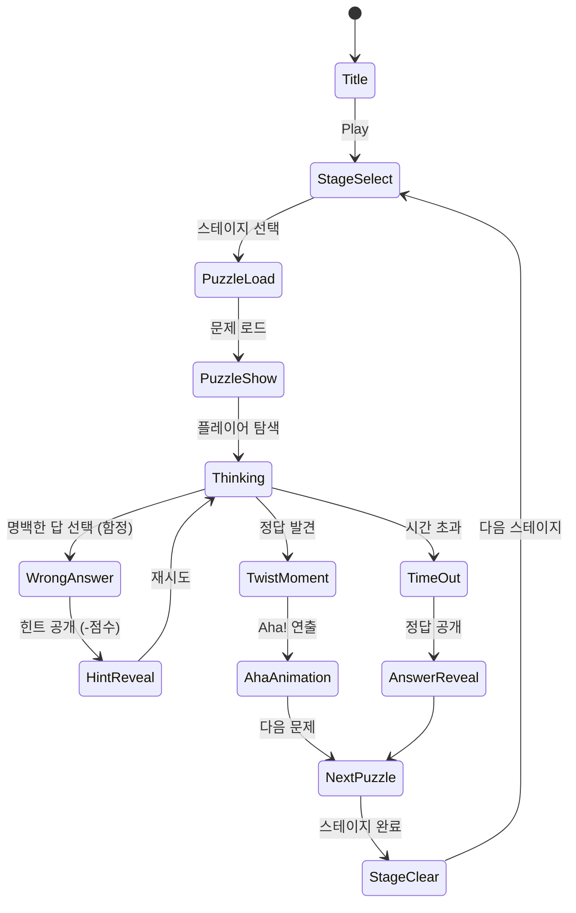

# Tricky Twist Puzzle

> **레퍼런스 #97** | 장르: brain-logic | 평점: 4.8 | 개발사: ABI GAME
>
> 두뇌 퍼즐 시리즈 6번째. 로직 + 트릭 = '비틀기' 퍼즐.
> 겉으로 보이는 답이 아닌, 반전된 시각으로 풀어야 하는 퍼즐 게임.

---

## 1. 두뇌 퍼즐 장르 종합 분석

### 1.1 레퍼런스 6종 비교표

| # | 게임명(추정 유형) | 핵심 메카닉 | 문제 유형 | 차별점 |
|---|-----------------|-----------|----------|--------|
| #8 | 논리 그리드 (로직 시뮬) | 조건 추론, 배치 | 순수 로직 | 단계적 연역 |
| #15 | 패턴 인식 (비주얼) | 시각적 규칙 발견 | 시각/패턴 | 직관적 패턴 매칭 |
| #57 | 워드 트릭 (언어) | 언어유희, 수수께끼 | 텍스트/언어 | 언어 중의성 활용 |
| #72 | 물리 직관 (물리) | 물리법칙 반전 | 물리/공간 | 기대를 뒤엎는 물리 |
| #86 | 공간 추론 (메타) | 숨겨진 규칙 발견 | 공간/메타 | 문제 자체가 속임수 |
| **#97** | **Tricky Twist** | **로직 + 트릭 종합** | **복합형** | **6종 혼합 + 최고 트릭밀도** |

### 1.2 두뇌 퍼즐 장르 확정 정의

```
두뇌 퍼즐 = 논리적 추론 × 반전적 사고
- 정답이 뻔해 보이지만 실제로는 다르다
- 플레이어의 선입견과 편견을 이용한다
- "아!" 하는 순간의 쾌감(Aha Moment)이 핵심
```

**Tricky Twist의 포지션**: 6개 레퍼런스 중 가장 높은 트릭 밀도 + 가장 다양한 문제 유형 혼합.
평점 4.8은 이 장르 최고 수준 → 트릭의 강도와 풀었을 때의 쾌감이 검증됨.

---

## 2. 코어 메카닉: 비틀기(Twist) 시스템

### 2.1 핵심 개념

```
Tricky Twist = "당연한 것을 의심하라"

1. 문제 제시 → 플레이어가 '명백한 답'을 인식
2. 함정 요소 → 명백해 보이는 답이 틀림
3. 비틀기(Twist) → 반전 포인트 발견
4. 정답 도출 → 예상 밖의 방식으로 해결
5. Aha Moment → 깨달음의 쾌감
```

### 2.2 비틀기 유형 5가지

#### Type A — 로직 트릭 (Logic Twist)
- 조건을 문자 그대로 읽으면 답이 나옴
- "1+1+1=?" 처럼 보이지만, 실제 맥락에서는 다른 답
- **예시**: "사과 2개에서 1개를 빼면?" → 화면을 직접 손으로 가리는 행위

#### Type B — 시각 트릭 (Visual Twist)
- 그림/배치가 착시나 숨겨진 요소를 이용
- 처음엔 A로 보이지만, 실제로는 B
- **예시**: 숫자 6을 뒤집으면 9 / 그림에 숨겨진 동물 찾기

#### Type C — 물리 트릭 (Physics Twist)
- 물리 상식을 뒤집는 문제
- "무거운 것이 먼저 떨어진다" 같은 오개념 활용
- **예시**: 같은 높이에서 떨어지는 무게 다른 두 물체 → 동시 도착

#### Type D — 텍스트 트릭 (Text Twist)
- 언어의 중의성, 숨겨진 단어, 철자 트릭
- 문장을 다르게 읽으면 완전히 다른 의미
- **예시**: "어제 내가 본 것" → 문자 그대로 '본(본다)' 과 '본(뼈)' 중의성

#### Type E — 메타 트릭 (Meta Twist)
- 문제 자체를 벗어난 사고 요구
- UI 요소(버튼, 텍스트, 배경)가 정답의 일부
- **예시**: "이 문제를 건너뛰세요" → 실제로 '다음' 버튼을 눌러야 정답

---

## 3. 문제 유형 분류 및 비중

### 3.1 문제 유형별 비중

| 유형 | 비중 | 문제 수 (60문항 기준) | 난이도 기여 |
|------|------|----------------------|------------|
| 로직 트릭 | 30% | 18문항 | ★★★ |
| 트릭 (순수 함정) | 40% | 24문항 | ★★★★ |
| 시각 트릭 | 15% | 9문항 | ★★★ |
| 물리 트릭 | 10% | 6문항 | ★★ |
| 텍스트 트릭 | 5% | 3문항 | ★★ |

> **트릭(순수 함정) 40%** → 장르명 'Tricky'의 핵심. 가장 많은 비중.
> **로직 트릭 30%** → 'Twist'의 핵심. 논리적 사고력 + 반전.

### 3.2 스테이지별 유형 배분

```
초반 (Lv 1~10):  시각 트릭 위주 → 진입 장벽 낮음, 직관적 반전
중반 (Lv 11~30): 로직 트릭 + 순수 함정 → 사고력 요구
후반 (Lv 31~50): 메타 트릭 + 물리 트릭 → 고강도 반전
```

---

## 4. 게임 플로우



---

## 5. UI 레이아웃

### 5.1 메인 게임 화면

```
┌─────────────────────────────┐
│  Lv.12  ⏱ 00:45  ★ 2,400  │  ← HUD (레벨/시간/점수)
├─────────────────────────────┤
│                             │
│  ┌───────────────────────┐  │
│  │                       │  │
│  │   [문제 텍스트/이미지]  │  │  ← 문제 영역 (전체 화면의 50%)
│  │                       │  │    Phaser Canvas
│  └───────────────────────┘  │
│                             │
│  ┌─────┐ ┌─────┐ ┌─────┐  │
│  │  A  │ │  B  │ │  C  │  │  ← 선택지 버튼 (2~4개)
│  └─────┘ └─────┘ └─────┘  │
│                             │
│  [💡 힌트 -50pt] [⏭ 스킵]  │  ← 보조 버튼
└─────────────────────────────┘
```

### 5.2 Aha! 연출 화면

```
┌─────────────────────────────┐
│                             │
│         🎉 Twist! 🎉        │
│                             │
│   "예상하셨나요? 이게 바로   │
│     트릭이었습니다!"         │
│                             │
│   [정답 설명 애니메이션]     │
│                             │
│        +300 점수             │
│     ⚡ 빠른 정답 보너스!     │
│                             │
│         [ 다음 → ]          │
└─────────────────────────────┘
```

### 5.3 스테이지 선택 화면

```
┌─────────────────────────────┐
│  Tricky Twist Puzzle        │
│  ★★★★☆  총 50스테이지     │
├──────┬──────┬──────┬───────┤
│ ✅1  │ ✅2  │ ✅3  │  🔒4  │
│ ✅5  │ ✅6  │  7   │  🔒8  │
│  9   │ 🔒10 │ 🔒11 │ 🔒12  │
└──────┴──────┴──────┴───────┘
```

---

## 6. 스코어링 시스템

| 액션 | 점수 |
|------|------|
| 정답 (힌트 없음) | +300 |
| 정답 (힌트 1회) | +200 |
| 정답 (힌트 2회) | +100 |
| 빠른 정답 (10초 이내) | +100 보너스 |
| 초고속 정답 (5초 이내) | +200 보너스 |
| 연속 정답 콤보 × n | +50 × n |
| 스테이지 클리어 (전문항 힌트 없음) | +500 퍼펙트 보너스 |
| 오답 클릭 | -0 (감점 없음, 힌트 강제 공개만) |

> **오답 페널티 없음** → 부담 없는 탐색 장려. 힌트 사용이 자연스러운 흐름.

---

## 7. 난이도 설계

| 스테이지 구간 | 문제 수 | 제한 시간 | 힌트 허용 | 트릭 강도 |
|-------------|---------|----------|----------|----------|
| Lv 1~10 (입문) | 3문항 | 90초 | 2회 | 낮음 |
| Lv 11~20 (보통) | 4문항 | 80초 | 2회 | 중간 |
| Lv 21~35 (어려움) | 5문항 | 70초 | 1회 | 높음 |
| Lv 36~50 (극한) | 6문항 | 60초 | 1회 | 최고 |

### 7.1 트릭 강도 정의

- **낮음**: 문제를 자세히 읽으면 발견 가능한 트릭
- **중간**: 시각적 착각 또는 언어 중의성 활용
- **높음**: 복수의 트릭 레이어 (첫 번째 반전이 두 번째 함정)
- **최고**: 메타 트릭 포함, 게임 UI 자체가 답

---

## 8. 샘플 문제 (구현 레퍼런스)

### 샘플 1 — 로직 트릭 (Lv 3)
```
Q: 의사가 아버지인 아이가 있습니다.
   그런데 그 의사는 아이의 아버지가 아닙니다.
   어떻게 된 일일까요?

A: 의사는 아이의 어머니
```

### 샘플 2 — 시각 트릭 (Lv 7)
```
Q: 아래 그림에서 가장 긴 선은?

   [실제로 동일 길이인 두 선 — Müller-Lyer 착시]

A: 두 선의 길이는 같습니다 → "같다" 버튼
```

### 샘플 3 — 메타 트릭 (Lv 42)
```
Q: "이 버튼을 누르지 마세요"
   [빨간 버튼]     [파란 버튼]

A: 빨간 버튼 클릭 → 제목 텍스트 자체를 탭해야 정답
   (버튼이 아닌 '누르지 마세요' 텍스트가 인터랙티브)
```

### 샘플 4 — 물리 트릭 (Lv 25)
```
Q: 1kg 철구와 1kg 솜뭉치를 같은 높이에서 떨어뜨리면
   어느 것이 먼저 바닥에 닿을까요?

A: 동시 (공기저항 무시 시 동일)
   → 하지만 실제 조건 제시 여부에 따라 달라짐
```

---

## 9. Phaser.io 구현 구조

### 9.1 씬 모듈 구조

```
tricky-twist-puzzle/
├── scenes/
│   ├── BootScene.ts        # 에셋 프리로드
│   ├── TitleScene.ts       # 타이틀 / 스테이지 선택
│   ├── PuzzleScene.ts      # 메인 퍼즐 컨테이너 씬
│   ├── AhaScene.ts         # 정답 연출 씬
│   └── ResultScene.ts      # 스테이지 결과
├── puzzles/
│   ├── PuzzleBase.ts       # 추상 퍼즐 클래스
│   ├── LogicTwist.ts       # Type A: 로직 트릭
│   ├── VisualTwist.ts      # Type B: 시각 트릭
│   ├── PhysicsTwist.ts     # Type C: 물리 트릭
│   ├── TextTwist.ts        # Type D: 텍스트 트릭
│   └── MetaTwist.ts        # Type E: 메타 트릭
├── data/
│   └── puzzles.json        # 문제 데이터 (60문항)
└── index.ts                # Phaser.Game 진입점
```

### 9.2 PuzzleBase 인터페이스

```typescript
interface IPuzzle {
  id: string;
  type: 'logic' | 'visual' | 'physics' | 'text' | 'meta';
  level: number;
  question: string;
  options: string[];        // 선택지 (2~4개)
  answer: number;           // options 인덱스
  twistExplanation: string; // 반전 설명
  timeLimit: number;        // 초
  hintText: string;
}
```

### 9.3 핵심 씬 흐름

```
PuzzleScene
  ├── loadPuzzle(puzzleData: IPuzzle)
  ├── renderQuestion()        # 문제 텍스트/이미지 렌더
  ├── renderOptions()         # 선택지 버튼 생성
  ├── onOptionSelect(idx)     # 정답 판별
  ├── showHint()              # 힌트 공개
  └── triggerAha()            # 정답 시 AhaScene 전환
```

### 9.4 MetaTwist 특수 처리

```typescript
// MetaTwist는 Phaser 오브젝트 외 DOM 요소도 인터랙티브하게 만들어야 함
class MetaTwistPuzzle extends PuzzleBase {
  setupInteractiveElements() {
    // 질문 텍스트, HUD 버튼, 배경 등에 클릭 이벤트 추가
    // 정답 요소는 puzzles.json의 answerTarget 필드로 지정
  }
}
```

---

## 10. 사운드 / 이펙트

| 이벤트 | 효과음 | 시각 효과 |
|--------|--------|----------|
| 문제 등장 | 팡파르 짧게 | 슬라이드 인 |
| 선택지 탭 | 클릭음 | 버튼 눌림 |
| 오답 | 땡! | 버튼 흔들림 |
| 정답 (일반) | 딩동! | 초록 빛 |
| 정답 (빠름) | 짧은 팡파르 | 파티클 폭발 |
| Aha! 연출 | 웅장한 효과음 | 전체 화면 반짝 |
| 시간 초과 | 경고음 | 화면 적색 |
| 스테이지 클리어 | 축하 음악 | 별 3개 낙하 |

---

## 11. MVP 범위 및 구현 일정

### Phase 1 — MVP (1주)

| 일차 | 작업 | 담당 |
|------|------|------|
| Day 1~2 | lib 기반 구조 + PuzzleBase + 5종 타입 클래스 | Game Core |
| Day 3 | puzzles.json 20문항 작성 (로직/트릭 위주) | PRD |
| Day 3~4 | PuzzleScene + AhaScene 구현 | Game Core |
| Day 5 | TitleScene + ResultScene | Web Frontend |
| Day 6 | 통합 테스트 + 버그 수정 | 전체 |
| Day 7 | web 빌드 + RN WebView 래핑 | Web/RN |

**MVP 출시 조건**:
- 20문항 (로직 트릭 8 + 순수 함정 10 + 시각 트릭 2)
- 5스테이지 (스테이지당 4문항)
- 힌트 시스템
- Aha! 연출

### Phase 2 — 컨텐츠 확장 (2주차)

- 문항 60개로 확장
- 메타 트릭 + 물리 트릭 추가
- 스코어보드 + 공유 기능
- 사운드 / 파티클 이펙트 완성

---

## 12. 결론: 두뇌 퍼즐 확정 기획

### 두뇌 퍼즐 시리즈 최종 포지션

```
#8  논리 그리드   ──┐
#15 패턴 인식    ──┤
#57 워드 트릭    ──┤  → 각 유형을 독립 게임으로 검증
#72 물리 직관    ──┤
#86 공간 메타    ──┘
                    ↓
#97 Tricky Twist ──► 5개 유형 전부 혼합 + 가장 높은 트릭 밀도
                      평점 4.8 = 시장 최고 검증값
```

### 핵심 차별화 요소

1. **혼합형 문제뱅크**: 단일 유형 게임 대비 지루함 없음
2. **Aha Moment 연출**: 반전 설명 + 시각 효과로 강한 만족감
3. **메타 트릭**: 타 게임에 없는 독창적 경험
4. **무패널티 탐색**: 오답이 학습 과정 → 이탈률 낮춤

### 시장성 판단

- 평점 4.8 레퍼런스 → **높은 수요 검증**
- Brain Out 시리즈 누적 5억+ 다운로드 장르
- 1~2주 MVP 구현 가능한 **낮은 구현 난이도**
- 공유 유발 문제 유형 → **바이럴 마케팅 적합**

> **결정**: Tricky Twist Puzzle은 두뇌 퍼즐 장르의 최우선 출시 타이틀.
> found3 이후 두 번째 게임으로 즉시 개발 착수 권장.
