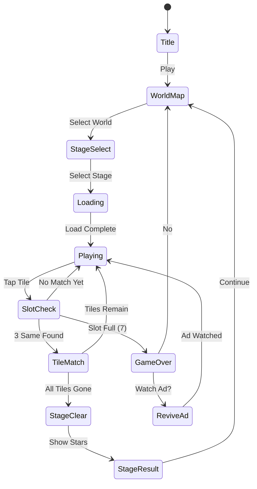

# 타일 매치 - 트리플 퍼즐

> 레퍼런스: PlaySimple Games (평점 4.8, 장르 1위권 triple-match)
> MVP 목표: 1~2주 개발, 핵심 재미 루프 우선 출시

## 개요

보드 위에 여러 종류의 아이콘 타일이 겹겹이 쌓여 있다. 플레이어는 같은 아이콘 3개를 선택해 제거하며 보드를 비운다. found3와의 핵심 차이: **3D 시각 연출 + 자유 선택 방식** (슬롯 없이 보드 위 자유 탭).

---

## 1. found3 동일 장르 분석 — 4.8점의 핵심 UX 차별점

### PlaySimple Games가 4.8을 받은 이유

| 요소 | found3 현황 | 트리플 매치 레퍼런스 방식 |
|------|-------------|--------------------------|
| **선택 피드백** | 슬롯으로 이동 | 타일이 공중에 뜨며 3개 모이면 폭발 이펙트 |
| **레이아웃 다양성** | 고정 그리드 | 원형/피라미드/무작위 쌓기 등 30+ 패턴 |
| **진행 가시성** | 스테이지 번호 | 월드맵 + 별점 3개 + 퍼센트 게이지 |
| **아이콘 퀄리티** | 단순 이모지 | 3D 렌더링 느낌의 고해상도 아이콘 |
| **연출 밀도** | 제거 시 단순 사라짐 | 매치 → 파티클 → 콤보 텍스트 → 화면 흔들림 |
| **난이도 곡선** | 단선형 | 쉬운 스테이지 → 막힘 → 파워업 필요 유도 |

### 핵심 인사이트
1. **즉각 보상감**: 타일 3개가 모이는 순간 파티클 + 사운드가 동시에 터져야 함
2. **레이아웃 신선함**: 스테이지마다 배치가 달라 "다음은 어떤 모양일까?" 기대감 유지
3. **막힘의 설계**: 풀 수 있지만 아이템 없으면 어려운 지점을 20~30스테이지마다 배치

---

## 2. 타일 디자인

### 아이콘 스타일

- **스타일**: 부드러운 그라데이션 + 약한 그림자의 flat-3D 스타일 (Candy Crush류)
- **크기**: 72×72px 기준 (레티나 대응 144×144px 제공)
- **테두리**: 흰색 2px 테두리 + 둥근 모서리(r=12px)

### 테마별 아이콘 세트 (각 테마 12종)

| 테마 | 월드 | 아이콘 예시 |
|------|------|-------------|
| **과일** | 1 (숲) | 🍎 🍊 🍋 🍇 🍓 🍑 🍍 🥝 🍒 🍌 🍉 🥭 |
| **보석** | 2 (광산) | 💎 🔮 💠 🌀 ⭐ 🔶 🔷 ❤️ 💚 💙 🟡 ⬜ |
| **동물** | 3 (정글) | 🐱 🐶 🐰 🦊 🐼 🐨 🐯 🦁 🐸 🐧 🐦 🦋 |
| **음식** | 4 (도시) | 🍕 🍔 🍜 🍣 🧁 🍩 🍪 🧀 🌮 🍦 🍫 🍬 |
| **우주** | 5 (우주) | 🚀 🪐 ⭐ 🌙 ☄️ 👽 🛸 🌌 💫 🌟 🔭 🪨 |

### 색상 팔레트

```
배경: #1A1A2E (다크 네이비)
보드 기본: #16213E
타일 기본 배경: #FFFFFF
선택된 타일 하이라이트: #FFD700 (골드 테두리 4px)
매치 파티클: #FF6B6B, #FFE66D, #4ECDC4
```

### 시각적 구별성 확보 전략

- 색상만으로 구별 불가 → **형태 + 색상 동시** 사용 (색맹 대응)
- 유사 아이콘(예: 고양이/개) → 크기/색상 차이 강조
- 레이어 깊이 표현: 아래 타일은 밝기 70% 처리 + 테두리 점선

---

## 3. 레이아웃 엔진

### 타일 배치 패턴 유형 (MVP: 6종, 이후 확장)

```
패턴 1: 피라미드         패턴 2: 원형 쌓기
    [T]                    [T][T]
   [T][T]               [T][T][T][T]
  [T][T][T]            [T][T][T][T][T]
 [T][T][T][T]            [T][T][T][T]
[T][T][T][T][T]             [T][T]

패턴 3: 체스판             패턴 4: 나선형
[T][ ][T][ ]           [T][T][T][T]
[ ][T][ ][T]           [T]      [T]
[T][ ][T][ ]           [T]  []  [T]
[ ][T][ ][T]           [T][T][T][T]

패턴 5: 크로스             패턴 6: 랜덤 쌓기 (레이어 3~5중)
   [T][T][T]               혼합 겹침
[T][T][T][T][T]
   [T][T][T]
```

### 자동 생성 규칙

```
입력: 타일 종류 수 N, 최대 레이어 수 L
출력: 유효한 타일 배치 (항상 클리어 가능)

검증 조건:
1. 총 타일 수 = N × 3 (3의 배수)
2. 항상 최소 1개의 "접근 가능한" 타일 세트가 존재
3. 막다른 상태(dead-lock)가 초기 배치에 없음
```

### 레이어 규칙

- 위에 덮인 타일: 선택 불가 (반투명 표시)
- 선택 가능 타일: 밝게 표시 + 탭 가능 표시
- 레이어 시각화: z-depth에 따라 약간의 오프셋(2~3px) 적용

---

## 4. 게임 진행감 — 챕터/월드 시스템

### 월드맵 구조

```
[월드 1: 마법의 숲] ──→ [월드 2: 크리스탈 광산] ──→ [월드 3: 정글]
  스테이지 1~20          스테이지 21~40           스테이지 41~60
  아이콘: 과일 테마       아이콘: 보석 테마          아이콘: 동물 테마
```

### 스테이지 진행 UI

```
┌─────────────────────────────┐
│  🌲 마법의 숲 - Stage 15/20  │
│  ⭐⭐⭐ ⭐⭐⭐ ⭐⭐⭐ ...    │  ← 완료 스테이지 별점
│  ●──●──●──●──[●]──○──○    │  ← 진행 경로
└─────────────────────────────┘
```

### 스테이지별 별점 기준

| 별 | 조건 |
|----|------|
| ⭐ | 스테이지 클리어 |
| ⭐⭐ | 클리어 + 남은 이동 횟수 > 5 |
| ⭐⭐⭐ | 클리어 + 아이템 미사용 |

### 진행 보상 시스템

| 이벤트 | 보상 |
|--------|------|
| 스테이지 최초 클리어 | 코인 50 |
| 3스타 달성 | 코인 150 + 랜덤 부스터 1개 |
| 10스테이지 완주 | 라이프 5개 |
| 월드 완료 | 프리미엄 아이콘 팩 언락 |
| 7일 연속 플레이 | 광고 제거 쿠폰 1일 |

### 데일리 미션 (리텐션 핵심)

```
오늘의 미션:
□ 3스타로 3스테이지 클리어    → 코인 100
□ 부스터 2개 사용             → 코인 50
□ 친구 1명 이기기             → 보석 5
```

---

## 5. 소셜 시스템

### 랭킹 구조

```
┌──────────────────────────────────┐
│  🏆 이번 주 랭킹                  │
│  ① 김철수  ━━━━━━━━━━━  12,450   │
│  ② 나       ━━━━━━  8,200   ← 나 │
│  ③ 이영희  ━━━━   6,100          │
│                                  │
│  [친구 랭킹] [전체 랭킹]           │
└──────────────────────────────────┘
```

### 친구 진행도 비교

- 같은 스테이지에서 친구의 "최고 기록" 표시
- 친구가 현재 스테이지에서 막혔으면 "도움 보내기" CTA → 하트 선물
- 월드맵에서 친구 아바타 표시 (현재 위치)

### 소셜 기능 우선순위 (MVP)

| 기능 | MVP | Phase 2 |
|------|-----|---------|
| 주간 점수 랭킹 | ✅ | |
| 친구 진행도 표시 | ✅ | |
| 하트 주고받기 | ✅ | |
| 친구 초대 | ✅ | |
| 실시간 대결 | | ✅ |
| 클랜/길드 | | ✅ |

---

## 6. found3 대비 우선 개선점

### 우선순위 매트릭스

| 개선점 | 효과 | 난이도 | 우선순위 |
|--------|------|--------|---------|
| **파티클/이펙트 강화** | 재미 ↑↑ | 낮음 | **1순위** |
| **다양한 레이아웃 패턴** | 신선함 ↑↑ | 중간 | **2순위** |
| **월드맵 진행 시스템** | 리텐션 ↑↑ | 중간 | **3순위** |
| **파워업 다양화** | 수익 ↑ | 낮음 | **4순위** |
| **3D 아이콘 스타일** | 첫인상 ↑ | 높음 | Phase 2 |
| **소셜 기능** | 바이럴 ↑ | 높음 | Phase 2 |

### 구체적 개선 액션 (MVP 내 구현)

**1순위: 매치 이펙트 강화**
```
현재 found3: 타일 제거 → 조용히 사라짐
개선:
  - 매치 시 파티클 폭발 (Phaser Particles)
  - 콤보 텍스트 팝업 ("COMBO x3!")
  - 화면 약한 쉐이크 (카메라 진동)
  - 배경 색상 순간 변화
```

**2순위: 레이아웃 다양화**
```
현재: 고정 그리드
개선:
  - 6가지 이상 배치 패턴
  - 스테이지마다 다른 실루엣
  - 특수 스테이지: "하트 모양으로 클리어" 등
```

**4순위: 파워업 확장**
```
현재: Shuffle, Undo
추가:
  - 힌트: 매칭 가능한 3개 하이라이트 (3초)
  - 폭탄: 선택 타일 주변 3×3 제거
  - 시간 연장: +30초
  - 슬롯 확장: 슬롯 9칸으로 임시 확장
```

---

## 7. 수익화 — 라이프 + 아이템 + 광고 트리플 모델

### 라이프 시스템

```
기본 라이프: 5개
소진 시: 30분마다 1개 충전
최대 보유: 5개 (무료) / 구독 시 무제한

라이프 획득:
  - 친구에게 받기 (하루 1회)
  - 광고 시청 → +1개 (하루 3회)
  - 1,000원 → +5개
  - 주간 구독 3,900원 → 무제한 + 광고 제거
```

### 인앱 구매 구조

| 상품 | 가격 | 내용 |
|------|------|------|
| 라이프 5개 | ₩1,000 | 즉시 충전 |
| 코인 1,000 | ₩1,900 | 아이템 구매용 |
| 코인 3,000 | ₩4,900 | 20% 보너스 |
| 스타터 팩 | ₩2,900 | 코인 500 + 부스터 각 3개 (첫 구매 한정) |
| 주간 구독 | ₩3,900 | 라이프 무제한 + 광고 제거 + 코인 200/일 |
| 월간 구독 | ₩9,900 | 주간 × 4 + 프리미엄 아이콘 팩 |

### 아이템 가격표

| 아이템 | 코인 | 설명 |
|--------|------|------|
| 힌트 | 30 | 매칭 가능한 3개 3초 하이라이트 |
| Shuffle | 50 | 보드 재배치 |
| Undo | 30 | 마지막 선택 취소 |
| 폭탄 | 80 | 3×3 범위 제거 |
| 슬롯 확장 | 60 | 이번 스테이지 슬롯 9칸 |
| 시간 연장 | 40 | +30초 |

### 광고 수익 모델

| 형태 | 트리거 | 보상 |
|------|--------|------|
| 리워드 광고 | 게임 오버 후 "계속하기" | 라이프 1개 |
| 리워드 광고 | 레벨 시작 전 "부스터 받기" | 랜덤 부스터 1개 |
| 인터스티셜 | 5스테이지마다 (구독 없는 유저) | - |
| 배너 | 메인 메뉴 하단 (구독 없는 유저) | - |

### 수익 시뮬레이션 (월 DAU 10,000 기준)

```
광고 수익: DAU × 0.3 노출 × ₩20 CPM = ₩60,000/월
IAP 전환율 2%: 200명 × 평균 ₩3,000 = ₩600,000/월
구독 전환율 1%: 100명 × ₩3,900 = ₩390,000/월
                                   ≈ ₩1,050,000/월
```

---

## 8. found3에 반영할 인사이트

| 인사이트 | found3 적용 방안 | 우선순위 |
|----------|-----------------|---------|
| **매치 이펙트 강화** | Phaser Particles로 제거 시 파티클 추가 | 즉시 |
| **진행도 표시** | 스테이지 진행 바 + 완료 별점 표시 | 즉시 |
| **데일리 미션** | 간단한 일일 목표 3개 추가 | 이번 주 |
| **라이프 시스템** | found3에도 라이프 시스템 도입 → 리텐션 + 수익 | 이번 주 |
| **리워드 광고** | 게임 오버 시 "광고 보고 계속하기" 버튼 | 이번 주 |
| **다양한 레이아웃** | 현재 그리드 고정 → 스테이지별 다른 패턴 | 다음 주 |
| **파워업 확장** | 힌트, 폭탄 아이템 추가 | 다음 주 |

---

## 게임 규칙

### 기본 규칙
- 보드에 다양한 아이콘 타일이 겹쳐 배치됨
- 모든 아이콘은 정확히 **3개씩** 존재
- 같은 아이콘 타일 3개를 선택하면 제거됨
- 선택한 타일은 하단 **슬롯(최대 7칸)**에 임시 보관됨
- 슬롯이 가득 차면 (3매치 불가) **게임 오버**
- 모든 타일을 제거하면 **스테이지 클리어**

### 슬롯 매칭
- 타일 선택 시 슬롯에 추가됨
- 슬롯 내 같은 아이콘 3개 → 자동 제거 + 이펙트
- 같은 아이콘끼리 인접 정렬 (자동)

### 타일 레이어
- 위에 덮인 타일: 선택 불가, 반투명 표시
- 위 타일 제거 시 아래 타일 활성화

---

## 게임 플로우



---

## UI 레이아웃

```
┌─────────────────────────────┐
│ ❤️❤️❤️❤️❤️  Stage 15  ⚙️ │  ← 라이프 + 스테이지 + 설정
│ ━━━━━━━━━━━━━━━━━━━━━━━━━  │  ← 진행 게이지
├─────────────────────────────┤
│                             │
│   🎯 목표: 타일 36개 제거    │
│                             │
│  ┌──┐     ┌──┐             │
│  │🍎│  ┌──┤🌺├──┐          │
│  └──┘  │🍎│  │🍎│          │  ← 타일 보드
│     └──┤🌺├──┤🌸│          │    (겹침 레이어)
│     │🍋│  │🍋│  └──┐       │
│     └──┘  └──┘  │🌸│       │
│                 └──┘       │
│                             │
├─────────────────────────────┤
│ [  ][  ][  ][  ][  ][  ][  ]│  ← 슬롯 (7칸)
├─────────────────────────────┤
│ 💡힌트  🔀셔플  ↩️ undo  💣 │  ← 파워업 바
└─────────────────────────────┘
```

---

## 스코어링 시스템

| Action | Score |
|--------|-------|
| 타일 3매치 제거 | +100 |
| 연속 콤보 (2회) | +200 |
| 연속 콤보 (3회+) | +100 × 콤보 수 × 1.5 |
| 스테이지 클리어 | +500 |
| 남은 이동 보너스 | 남은 이동 × 20 |
| 아이템 미사용 클리어 | +300 |

---

## 난이도 설계

| 스테이지 | 아이콘 종류 | 타일 수 | 레이어 | 패턴 |
|----------|------------|---------|--------|------|
| 1~5 | 4 | 12 | 1 | 그리드 |
| 6~10 | 6 | 18 | 1 | 피라미드 |
| 11~15 | 8 | 24 | 2 | 원형 |
| 16~20 | 10 | 30 | 2 | 크로스 |
| 21~30 | 10 | 36 | 3 | 나선형 |
| 31~40 | 12 | 36 | 3~4 | 랜덤 복합 |
| 41+ | 12 | 42~60 | 4~5 | 혼합 |

> 20, 40, 60 스테이지: 보스 스테이지 (타임어택 or 아이템 제한)

---

## 사운드/이펙트

| 이벤트 | 효과 |
|--------|------|
| 타일 탭 | 경쾌한 클릭음 |
| 슬롯 삽입 | 짧은 팝 사운드 |
| 3매치 성공 | 파티클 폭발 + 상승 음 |
| 콤보 | 체인 효과음 + "COMBO!" 텍스트 |
| 게임 클리어 | 축하 팡파레 + 별 획득 애니메이션 |
| 게임 오버 | 실패 사운드 + 화면 어두워짐 |
| 파워업 사용 | 마법 효과음 |

---

## MVP 범위

### Phase 1 — MVP (1~2주)
- [x] 기획서 작성
- [ ] 기본 타일 보드 (1~2 레이어, 3가지 패턴)
- [ ] 타일 선택 → 슬롯 이동 → 3매치 제거
- [ ] 게임 오버 / 클리어 판정
- [ ] 파티클 이펙트 (매치 시)
- [ ] 10 스테이지 (과일 테마)
- [ ] 라이프 시스템 기본 (5개, 30분 충전)
- [ ] 리워드 광고 연동 (게임 오버 후 계속하기)

### Phase 2 (출시 후 1주)
- [ ] 월드맵 UI
- [ ] 3~5가지 레이아웃 패턴 추가
- [ ] 파워업 4종 (힌트/셔플/undo/폭탄)
- [ ] 별점 시스템 + 진행 보상
- [ ] 인앱 구매 연동

### Phase 3 (데이터 확인 후)
- [ ] 소셜 기능 (랭킹, 친구)
- [ ] 데일리 미션
- [ ] 구독 모델
- [ ] 추가 테마 (보석, 동물, 음식)
- [ ] 보스 스테이지
