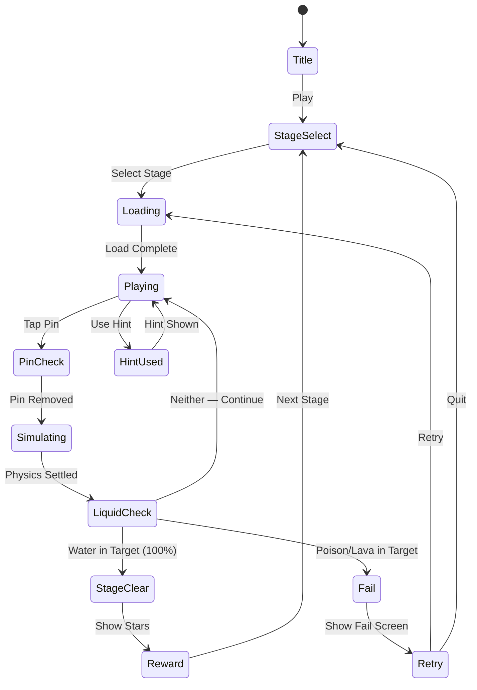

# Water Out Puzzle

> 핀을 뽑아 물길을 열고, 올바른 컨테이너로 물을 흘려보내는 물리 기반 퍼즐 게임

## 개요

파이프와 컨테이너가 얽힌 퍼즐 보드에서, 플레이어가 핀(코르크/마개)을 뽑아 물의 흐름을 제어한다.
중력과 물리 법칙에 따라 물이 흐르며, **어떤 핀을 먼저 뽑느냐**에 따라 성공/실패가 결정된다.
독(보라색), 용암(빨간색) 같은 위험 액체는 피해야 하고, 물(파란색)만 목표 컨테이너에 채워야 클리어.

### 레퍼런스 게임과의 차이

| 게임 | 메카닉 | 핵심 챌린지 |
|------|--------|------------|
| #29 Water Sort | 색깔 물 분류 (정적) | 어디로 붓느냐 순서 |
| #58 Water Match | 색깔 매칭 (정적) | 색상 조합 전략 |
| **#59 Water Out** | 핀 뽑기 → 물리 흐름 (동적) | **어떤 핀을 언제 뽑느냐** |

Water Out은 정적 정렬이 아닌 **실시간 물리 시뮬레이션** 기반. 같은 물 소재지만 완전히 다른 게임.

## 게임 규칙

### 기본 규칙

- 화면에는 **파이프/채널 네트워크**와 그 안에 담긴 액체, 여러 개의 **핀(마개)**이 있다
- 플레이어는 핀을 **탭**하여 뽑는다 → 막혀있던 구간이 열리며 액체가 흘러내려감
- 물(파란색)이 **목표 컨테이너(버킷/탱크)**에 모두 채워지면 **스테이지 클리어**
- 독/용암이 목표 컨테이너에 들어가거나, 물이 목표 외 곳으로 흐르면 **실패**
- 핀을 뽑으면 **되돌릴 수 없다** (되돌리기 아이템 사용 제외)

### 액체 종류

| 액체 | 색상 | 역할 |
|------|------|------|
| 물 | 파란색 💧 | 목표 컨테이너에 채워야 하는 대상 |
| 독 | 보라색 ☠️ | 목표 컨테이너에 들어가면 실패 |
| 용암 | 빨간색/주황색 🔥 | 목표 컨테이너에 들어가면 실패 + 경로 차단 |
| 오일 | 노란색 | 물 위에 뜸 → 혼합 방지 퍼즐 요소 (후반) |

### 핀 메카닉

- 핀은 파이프 분기점, 댐, 밸브 역할을 한다
- 핀 종류:
  - **코르크 핀**: 단순 마개, 뽑으면 아래로 흐름
  - **방향 핀**: 뽑을 때 왼쪽/오른쪽 선택 (분기)
  - **잠금 핀**: 다른 핀을 먼저 뽑아야 해제됨 (후반 레벨)

### 클리어 조건

- 목표 컨테이너에 **물이 X% 이상** 채워지면 클리어 (레벨마다 다름, 기본 100%)
- 독/용암이 **목표 컨테이너에 1방울도** 들어가지 않아야 함

## 게임 플로우



## UI 레이아웃

```
┌─────────────────────────────┐
│  ← Back   Stage 7   ⭐⭐☆  │  ← 상단 HUD (뒤로가기, 스테이지, 별점 기록)
│                  💡 🔄 ↩️   │  ← 아이템 버튼 (힌트/리셋/되돌리기)
├─────────────────────────────┤
│                             │
│   [탱크A: 물]               │
│       │                     │
│      [핀1]                  │  ← 파이프 + 핀 네트워크
│       │  \                  │    (중앙 게임 영역)
│      [핀2] [핀3: 독]        │
│       │                     │
│  ┌────┴────┐                │
│  │🪣 목표   │  [☠️ 독통]    │  ← 목표 컨테이너 (파란색 테두리)
│  └─────────┘                │    위험 컨테이너 (빨간/보라 테두리)
│                             │
└─────────────────────────────┘
```

### 핵심 UI 요소

- **파이프 채널**: 둥근 파이프 또는 열린 수로 형태
- **핀 표시**: 탭 가능한 코르크/플러그 이미지, 살짝 흔들리는 idle 애니메이션
- **액체**: Phaser 파티클 또는 폴리곤 마스크로 흐름 표현
- **목표 컨테이너**: 투명 버킷/탱크, 물이 채워지는 진행 바 표시
- **위험 컨테이너**: X 표시, 빨간 테두리 → 여기로 흘러가면 안 됨

## 물리 시뮬레이션 설계 (Phaser.io)

### 접근 방식

MVP에서는 완전한 유체 시뮬레이션 대신 **경량 물리 표현** 사용:

1. **파티클 시스템 (권장)**: Phaser의 `ParticleEmitter`로 물 파티클 생성
   - 핀 제거 시 파티클 이미터 활성화
   - 중력 + 바운스 파라미터로 자연스러운 흐름 표현
   - 파이프 경계는 Phaser Arcade Physics 또는 Matter.js로 충돌 처리

2. **트윈 기반 흐름 (대안)**: 미리 계산된 경로를 따라 물 스프라이트 이동
   - 물리 복잡도 낮음 → 빠른 구현
   - 정해진 경로 흐름 → 레벨 디자인 통제 쉬움
   - **MVP에는 이 방식 권장**

3. **Matter.js 유체 (고품질)**: 진짜 물리 기반
   - 구현 복잡, 성능 이슈 가능 → Phase 2에서 고려

### MVP 물리 구현 권장

```
핀 탭 → 해당 파이프 세그먼트 "열림" 상태로 전환
→ 미리 정의된 흐름 경로(path)를 따라 물 파티클/스프라이트 이동
→ 분기점에서 액체 종류별 경로 선택
→ 목표/위험 컨테이너 도달 시 판정
```

## 스코어링 / 별점 시스템

| 별점 | 조건 |
|------|------|
| ⭐⭐⭐ | 최소 핀 뽑기 수로 클리어 (퍼펙트) |
| ⭐⭐ | 클리어 성공 (일반) |
| ⭐ | 힌트 사용 후 클리어 |

- 별점은 레벨 잠금 해제 조건으로 활용 가능
- 스코어보드 없음 (솔로 퍼즐 게임)

## 난이도 설계

### 레벨 구조 (MVP: 30 레벨)

| 레벨 구간 | 핀 수 | 액체 종류 | 분기 | 특징 |
|-----------|-------|-----------|------|------|
| 1~5 | 2~3 | 물만 | 없음 | 튜토리얼, 단순 흐름 |
| 6~10 | 3~4 | 물 + 독 | 1개 | 위험 액체 소개 |
| 11~15 | 4~5 | 물 + 독 | 2개 | 순서 중요성 강조 |
| 16~20 | 5~6 | 물 + 독 + 용암 | 2~3개 | 다중 위험 |
| 21~25 | 5~7 | 전체 | 3개+ | 잠금 핀 등장 |
| 26~30 | 6~8 | 전체 | 다중 | 복합 퍼즐, 고난이도 |

### 레벨 템플릿 예시

```
[레벨 3]
물 탱크 (상단)
    │
  [핀A]
    │  ↘
  [수로]  [독 탱크 (차단되어야 함)]
    │
 [목표 버킷] ← 물이 도달하면 클리어

정답: 핀A 뽑기 → 물이 수로 따라 목표 버킷으로
```

## 수익화 설계

### 아이템 (핵심)

| 아이템 | 효과 | 획득 |
|--------|------|------|
| 💡 힌트 | 다음에 뽑아야 할 핀 강조 표시 | 광고 시청 또는 코인 |
| ↩️ 되돌리기 | 마지막 핀 1개 복원 | 광고 시청 또는 코인 |
| 🔄 리셋 | 레벨 처음부터 다시 | 무료 (무제한) |
| 🛡️ 독 방어 | 이번 레벨 독 1회 무효화 | 코인 (프리미엄) |

### 광고 모델

- 레벨 실패 후 "광고 보고 힌트 받기" CTA
- 레벨 클리어 후 인터스티셜 (3~5레벨마다 1회)
- 보상형 광고: 되돌리기 1회 = 광고 1회

### 인앱 구매

- 코인 팩 (힌트/아이템 구매용)
- 광고 제거 (1회성 구매)
- 힌트 구독 (월정액)

## 사운드/이펙트

| 이벤트 | 효과 |
|--------|------|
| 핀 탭 | 코르크 뽑는 "펑" 사운드 |
| 물 흐름 | 졸졸 흐르는 물소리 (루프) |
| 물 도달 | 찰랑찰랑 채워지는 소리 |
| 독 경고 | 불쾌한 버블 사운드 |
| 클리어 | 상쾌한 성공 효과음 + 물 튀는 파티클 |
| 실패 | 독/용암 오염 이펙트 + 실패 사운드 |
| 별점 획득 | 별 빛나는 이펙트 |

## MVP 범위

### Phase 1 (MVP — 1~2주 목표)

- [x] 기획서 작성
- [ ] 레벨 1~10 디자인 (텍스트 기반 좌표/경로 정의)
- [ ] 파이프 네트워크 렌더링 (Phaser Graphics)
- [ ] 핀 탭 인터랙션 (탭 → 경로 활성화)
- [ ] 트윈 기반 물 흐름 애니메이션
- [ ] 목표/위험 컨테이너 판정 로직
- [ ] 클리어 / 실패 판정 + 화면
- [ ] 별점 시스템 (1~3성)
- [ ] 기본 사운드 (흐름, 클리어, 실패)
- [ ] 광고 연동 (힌트 = 광고 시청)
- [ ] 30 레벨 완성

### Phase 2 (출시 후)

- [ ] Matter.js 실제 유체 물리로 업그레이드
- [ ] 방향 핀, 잠금 핀 추가
- [ ] 오일 액체 추가
- [ ] 레벨 에디터 (내부 제작 툴)
- [ ] 리더보드 / 소셜 공유
- [ ] 시즌 레벨팩 (DLC)
