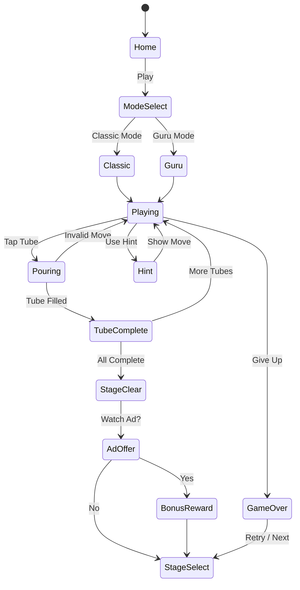

# Water Sort Guru (물 분류 퍼즐)

> **레퍼런스**: Guru Puzzle Game — 물 분류 퍼즐 | Rating 4.8 | Genre: sort-puzzle | Rank #58
>
> 이슈 #58 기반. #29 Water Sort와 통합하여 단일 앱 "Water Sort Universe" 구성.

## 개요

색상별 물이 담긴 튜브들을 보고, 같은 색 물끼리 한 튜브에 모이도록 붓고 이동시키는 퍼즐 게임.
단순하지만 중독성 강한 코어 루프와 **좌절 없는 난이도 설계**가 4.8 고평점의 핵심.

---

## 1. #29 Water Sort와의 비교 분석

| 항목 | #29 Water Sort (기본형) | #58 Guru (고도화형) |
|------|------------------------|---------------------|
| 튜브 수 | 4~8개 | 4~12개 (더 넓은 스케일) |
| 물 레이어 | 4 고정 | 4 기본 → 최대 6 (고난도) |
| 힌트 시스템 | 없음 | **자동 힌트 + 유료 힌트** |
| Undo 횟수 | 1회 (유료) | **무제한 Undo** (핵심 차별점) |
| 빈 튜브 추가 | 없음 | **+1 튜브 아이템** |
| 색상 팔레트 | 기본 8색 | **파스텔/다크/시즌 테마** |
| 완료 이펙트 | 기본 | **색상 채우기 애니메이션** |
| 광고 방식 | 인터스티셜 위주 | **보상형 광고 중심** (UX 핵심) |

### 핵심 차이: Guru의 승부수
Guru는 "막히면 다 풀어줄게" 철학. 막힌 플레이어에게 Undo, 힌트, 빈 튜브를 제공하여
**진행 포기를 방지**한다. 이것이 리텐션과 평점의 비결.

---

## 2. 코어 메카닉

### 기본 규칙
- 튜브에 4개 레이어의 색상 물이 담겨있음
- 같은 색만 같은 색 위에 부을 수 있음
- 빈 튜브에는 어떤 색이든 부을 수 있음
- **위에서부터 연속된 같은 색 덩어리만 이동 가능** (예: 위 2칸이 파랑이면 2칸이 한 번에 이동)
- 한 튜브에 같은 색이 4개(가득) 차면 그 튜브 완료 (자물쇠 표시)
- 모든 튜브가 완료되면 스테이지 클리어

### 이동 규칙 상세
```
튜브 A: [파랑, 파랑, 빨강, 초록]  (위→아래)
튜브 B: [빨강, 파랑, ?, ?]        (위→아래)

A의 위쪽 파랑 2개 → 이동 조건 체크:
  - B의 최상단이 파랑? YES
  - B에 2칸 빈 공간? YES → 이동 가능
  - B에 1칸만 있다? → 1칸만 이동 (부분 이동 허용)
```

### 이동 불가 조건
- 목적 튜브가 가득 참
- 목적 튜브 최상단과 색이 다름
- 이동할 덩어리보다 목적 튜브 여유 공간이 0

---

## 3. 4.8 고평점 비결 — Guru UX 철학

### 핵심 원칙: "막혀도 재미있다"

**① 무제한 Undo**
- 틀린 수를 언제든 되돌릴 수 있음
- 플레이어는 두려움 없이 시도 → 탐색형 플레이 유도
- 좌절감 0에 가까워짐

**② 점진적 힌트 (3단계)**
1. "움직일 수 있는 튜브" 강조 (무료, 30초 후 자동)
2. "최적 이동 한 수" 표시 (광고 시청 or 코인)
3. "자동 풀기 3수" (유료 코인)

**③ 컬러 접근성**
- 색맹 모드: 색상 + 패턴(줄무늬, 점, 체크) 동시 표시
- 이것 하나로 리뷰 수백 개 긍정 반응

**④ 완료 피드백의 쾌감 설계**
- 튜브 완료 시: 물이 가득 차며 반짝이는 애니메이션 (0.5초)
- 스테이지 클리어 시: 모든 튜브에서 물이 넘쳐흐르며 색상 폭발 이펙트
- 소리: 물 따르는 소리 → 완료 시 "띵~" 고음

**⑤ 광고 타이밍**
- 광고는 **클리어 직후에만** (성취감 직후 = 수용성 최고)
- 게임 중 광고 없음 → 몰입 유지
- "다음 스테이지 스킵" 보상형 광고 → 자발적 시청

---

## 4. 난이도 밸런스

### 좌절 없는 곡선 설계 원칙
> "10번 중 8번은 이기는 느낌, 2번은 도전하는 느낌"

### 스테이지 구성

| 구간 | 스테이지 | 색상 수 | 튜브 수 | 빈 튜브 | 특징 |
|------|---------|---------|---------|---------|------|
| 튜토리얼 | 1~5 | 2~3 | 4~5 | 2 | 단계별 안내 |
| 초급 | 6~20 | 4~5 | 6~7 | 2 | 자유 탐색 |
| 중급 | 21~60 | 6~8 | 8~10 | 1 | 순서 중요 |
| 고급 | 61~120 | 9~11 | 11~13 | 1 | 계획적 접근 |
| 전문가 | 121+ | 12 | 14 | 1 | 최소 이동 도전 |

### 밸런스 알고리즘
```
스테이지 생성:
1. 완료 상태(정답)에서 역방향으로 N번 랜덤 이동
2. 생성된 퍼즐의 최소 이동수 계산
3. 최소 이동수 < 난이도_하한 → 재생성
4. 최소 이동수 > 난이도_상한 → 재생성
5. 통과하면 저장

난이도 점프 방지:
- 연속 3스테이지 실패 시 → 다음 스테이지 1단계 쉬운 버전 제공
- "오늘 기분 나쁜 날" 모드: 일부러 쉬운 스테이지 삽입
```

### 심리적 설계
- **5스테이지마다 "쉬운 보상 스테이지"** 배치 (자신감 회복)
- 스테이지 실패 시 "거의 다 됐어요!" 메시지 (2수 차이 이하일 때)
- 스타 평가 (1~3성): 최소 이동수 기준, 부담 없이 1성만 받아도 진행 가능

---

## 5. #29 + #58 통합 기획 — "Water Sort Universe"

### 통합 전략: 단일 앱, 두 가지 경험

```
Water Sort Universe
├── Classic Mode (#29 기반)
│   └── 기본 4칸 튜브, 심플한 UI, 순수 퍼즐
│
└── Guru Mode (#58 기반)
    └── 힌트/Undo/테마, 더 화려한 연출
```

### 공유 인프라 (lib/water-sort/)
```typescript
// 공통 게임 엔진
interface WaterSortEngine {
  tubes: Tube[];
  move(from: number, to: number): MoveResult;
  undo(): void;
  isSolved(): boolean;
  getHint(): HintMove;
}

// 공통 타입
type Color = string;           // 색상 ID
type Tube = Color[];           // [위, 위, 아래, 아래]
type MoveResult = 'ok' | 'invalid' | 'complete';
interface HintMove { from: number; to: number; }
```

### 차별화 포인트
- Classic: 광고 없음, 순수 체험 → 무료 모드
- Guru: 힌트/아이템 → 수익화 모드
- 두 모드 간 공유 통화(코인) → 크로스 플레이 유도

---

## 6. Phaser.io 물 애니메이션 구현

### 접근법: 타일 기반 (복잡한 물리 없이)

실제 액체 시뮬레이션은 모바일 성능에 과부하 → **타일 기반 색상 채우기**로 구현.

### 튜브 렌더링

```typescript
// lib/water-sort/src/scenes/TubeScene.ts

class TubeGraphics extends Phaser.GameObjects.Graphics {
  drawTube(tube: Color[], x: number, y: number) {
    const W = 48, H = 160, layerH = H / 4;

    // 튜브 외곽 (유리 느낌)
    this.lineStyle(2, 0xCCDDEE, 1);
    this.strokeRoundedRect(x, y, W, H, 8);

    // 물 색상 채우기 (아래→위)
    tube.forEach((color, i) => {
      const fillY = y + H - (i + 1) * layerH;
      this.fillStyle(COLOR_MAP[color], 0.85);
      this.fillRect(x + 2, fillY, W - 4, layerH);
    });

    // 유리 광택 오버레이
    this.fillStyle(0xFFFFFF, 0.15);
    this.fillRect(x + 4, y + 4, 8, H - 8);
  }
}
```

### 붓기 애니메이션 (핵심)

```typescript
// 물이 기울어지며 이동하는 효과
pourWater(fromTube: number, toTube: number, amount: number) {
  const fromObj = this.tubeObjects[fromTube];
  const toObj = this.tubeObjects[toTube];

  // 1단계: 기울기 (100ms)
  this.tweens.add({
    targets: fromObj,
    angle: fromTube < toTube ? -30 : 30,
    duration: 100,
    ease: 'Power2'
  });

  // 2단계: 물 이동 트윈 (200ms)
  // - 파티클로 물방울 궤적 표현
  const particles = this.add.particles(0, 0, 'drop', {
    x: fromObj.x, y: fromObj.y,
    quantity: 3,
    lifespan: 300,
    gravityY: 400,
    scale: { start: 0.3, end: 0 },
    tint: COLOR_MAP[this.getTopColor(fromTube)]
  });

  // 3단계: 원위치 + toTube 채우기 (100ms)
  this.time.delayedCall(200, () => {
    this.tweens.add({ targets: fromObj, angle: 0, duration: 100 });
    this.updateTubeDisplay(toTube, amount); // 애니메이션으로 물 레벨 올림
    particles.destroy();
  });
}
```

### 완료 이펙트

```typescript
// 튜브 완료 시 반짝임
celebrateTube(tubeIndex: number) {
  const tube = this.tubeObjects[tubeIndex];

  // 빛나는 효과
  this.tweens.add({
    targets: tube,
    scaleX: 1.1, scaleY: 1.05,
    yoyo: true, duration: 150, repeat: 2
  });

  // 파티클 폭죽
  this.add.particles(tube.x, tube.y, 'star', {
    speed: { min: 50, max: 150 },
    lifespan: 600,
    quantity: 10,
    tint: [0xFFD700, 0xFF6B6B, 0x4ECDC4]
  });
}
```

### 성능 최적화
- 모든 튜브는 `Graphics` 객체 재사용 (매 프레임 `clear()` + 재드로우)
- 애니메이션 중에만 파티클 활성화, 즉시 destroy
- 60fps 목표, 모바일 WebView에서도 안정적 동작

---

## 7. 수익화 — 아이템 + 광고 최적 밸런스

### 수익화 원칙
> 강제 광고는 1성 리뷰를 만든다. **플레이어가 선택하게 하라.**

### 광고 구조

| 광고 유형 | 타이밍 | 빈도 | 기대 수익 |
|----------|--------|------|----------|
| 보상형 (Rewarded) | 힌트 요청 시 / 클리어 후 보너스 선택 시 | 플레이어 자발 | 높음 (eCPM $10~20) |
| 인터스티셜 | 5스테이지 클리어마다 (선택 가능 건너뛰기 $) | 자동 | 중간 |
| 배너 | 스테이지 선택 화면 하단만 | 항상 | 낮음 |

### 아이템 구조

| 아이템 | 효과 | 획득 방법 | 유료 가격 |
|--------|------|-----------|----------|
| 힌트 🔍 | 최적 이동 1수 표시 | 광고 시청 or 3코인 | - |
| +튜브 🧪 | 빈 튜브 1개 추가 | 5코인 | - |
| 자동 풀기 ✨ | 3수 자동 이동 | 8코인 | - |
| 색상 테마 🎨 | 파스텔/다크/시즌 | 50코인 묶음 구매 | $1.99 |
| 광고 제거 🚫 | 강제 광고 제거 | - | $2.99 |
| 코인 팩 💰 | 100/500/2000코인 | - | $0.99/$3.99/$9.99 |

### 코인 밸런스 설계
```
일일 무료 코인 획득:
- 출석 보너스: 10코인
- 스테이지 클리어 (별 3개): 5코인
- 광고 시청: 3코인/회 (최대 5회)
= 최대 약 40코인/일

하루 평균 소비:
- 힌트 2회: 6코인
- +튜브 1회: 5코인
= 약 11코인 소비

→ 무과금 플레이어도 충분히 플레이 가능
→ 빨리 진행하고 싶은 플레이어만 결제
```

### ARPU 목표
- DAU 10,000 기준
- 광고 수익: 10,000 × $0.03 (eCPM × 세션당 광고) = $300/일
- IAP: DAU의 2% 결제, ARPPU $3 = $600/일
- **합산 목표: $900/일 → 월 $27,000**

---

## 8. 최종 기획안 — #29 + #58 통합 "Water Sort Universe"

### 개발 우선순위 (2주 MVP)

**Week 1: 코어 엔진 + Classic Mode**
- `lib/water-sort/` 공통 엔진 구현
- 튜브 렌더링 + 붓기 애니메이션
- 레벨 생성 알고리즘
- 40스테이지 Classic Mode 완성

**Week 2: Guru Mode + 수익화**
- 힌트/Undo/+튜브 아이템 시스템
- 광고 SDK 연동 (보상형 중심)
- 색상 테마 최소 3개 (기본/파스텔/다크)
- 80스테이지 Guru Mode 완성

### 패키지 구조

```
lib/water-sort/          # 공통 게임 엔진
  src/
    engine.ts            # WaterSortEngine 클래스
    levelgen.ts          # 스테이지 생성 알고리즘
    types.ts             # 공통 타입

web/water-sort/          # React + Phaser 통합
  src/
    App.tsx
    modes/
      ClassicMode.tsx    # #29 스타일
      GuruMode.tsx       # #58 스타일
    scenes/
      GameScene.ts       # Phaser 게임 씬
      UIScene.ts         # HUD 오버레이

water-sort/rn/           # React Native 래핑
  src/
    App.tsx              # WebView 브릿지
    AdManager.ts         # 광고 SDK
    StoreManager.ts      # IAP
```

### KPI 목표 (출시 후 4주)

| 지표 | 목표 |
|------|------|
| D1 리텐션 | 40%+ |
| D7 리텐션 | 20%+ |
| 평점 | 4.5+ |
| 세션 길이 | 8분+ |
| 보상형 광고 시청률 | 30%+ |

---

## 게임 플로우



---

## UI 레이아웃

```
┌─────────────────────────┐
│  ← Back   Lv.42  ⭐⭐⭐ │  ← 상단 HUD
│  🔊           💰 35코인 │
├─────────────────────────┤
│                         │
│  ┌──┐ ┌──┐ ┌──┐ ┌──┐  │
│  │🔵│ │🔴│ │🟢│ │  │  │  ← 튜브 행 1
│  │🔵│ │🟡│ │🟢│ │  │  │
│  │🔴│ │🔵│ │🟡│ │  │  │
│  │🟡│ │🟢│ │🔴│ │  │  │
│  └──┘ └──┘ └──┘ └──┘  │
│                         │
│  ┌──┐ ┌──┐ ┌──┐        │
│  │🟡│ │🔴│ │🟢│        │  ← 튜브 행 2
│  │🟢│ │🔵│ │🟡│        │
│  │🔵│ │🟢│ │🔴│        │
│  │🔴│ │🟡│ │🔵│        │
│  └──┘ └──┘ └──┘        │
│                         │
├─────────────────────────┤
│  🔍 힌트  ↩️ Undo  🧪+1 │  ← 아이템바
└─────────────────────────┘
```

---

## 사운드/이펙트

| 이벤트 | 사운드 | 이펙트 |
|--------|--------|--------|
| 튜브 선택 | 유리 탭 소리 | 선택 테두리 강조 |
| 붓기 성공 | 물 따르는 소리 | 기울기 + 물방울 파티클 |
| 붓기 실패 | 짧은 "뚝" | 튜브 흔들림 |
| 튜브 완료 | 맑은 "띵~" | 반짝임 + 스파클 |
| 스테이지 클리어 | 팡파레 | 전체 튜브 넘침 이펙트 |

---

## MVP 범위

### Phase 1 (Week 1 — Classic Mode)
- [ ] `lib/water-sort/` 엔진 (이동 규칙, undo, isSolved)
- [ ] Phaser 튜브 렌더링 + 붓기 애니메이션
- [ ] 레벨 생성 알고리즘 (40스테이지)
- [ ] Classic Mode 완성

### Phase 2 (Week 2 — Guru Mode + 수익화)
- [ ] 힌트/+튜브 아이템 시스템
- [ ] 보상형 광고 SDK 연동
- [ ] 색상 테마 3종
- [ ] Guru Mode 80스테이지
- [ ] RN WebView 래핑
