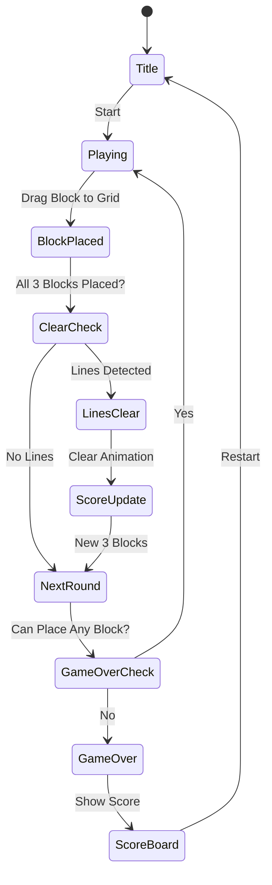

# Woodoku Blast

> **Woodoku = Wood + Sudoku**
> 나무 블록을 9×9 그리드에 배치해 행/열/3×3 박스를 클리어하는 블록 퍼즐.
> Tripledot Studios의 4.9 평점 블록 퍼즐 레퍼런스.

---

## 1. 시장 분석 & 경쟁 비교

### Woodoku vs Block Blast: 핵심 차이

| 항목 | Woodoku Blast | Block Blast (#2) |
|------|--------------|-----------------|
| 그리드 | 9×9 (81칸) | 8×8 (64칸) |
| 클리어 조건 | 행 + 열 + **3×3 박스** | 행 + 열만 |
| 핵심 재미 | 스도쿠적 공간 사고 | 테트리스식 쌓기 |
| 블록 획득 | 3개 동시 제공 (선택 순서 자유) | 3개 순차 제공 |
| 실패 조건 | 블록 3개 모두 배치 불가 | 블록 배치 불가 |
| 평점 | **4.9** | 4.7 |
| 개발사 | Tripledot Studios | Supersonic Studios |
| 핵심 USP | 3×3 박스 클리어 추가 → 콤보 폭발감 | 단순하고 빠른 진행 |

### 왜 Woodoku가 4.9 평점을 받는가

1. **멀티 클리어 시스템**: 하나의 블록 배치로 행+열+박스를 동시 클리어 → 폭발적 콤보 만족감
2. **나무 질감 (Wood Aesthetic)**: 따뜻한 원목 색감, 블록 스냅 시 나무 소리 → 감각적 피드백
3. **무한 모드 + 스트레스 없음**: 시간 제한 없음, 실패해도 즉시 재시작 → 캐주얼 친화
4. **3개 블록 자유 배치**: Block Blast와 달리 3개 중 원하는 것 먼저 배치 → 전략적 선택지
5. **세레토닌 루프**: 배치 → 클리어 → 점수 → 배치 리듬이 명확하고 빠름

### Tripledot Studios 성공 패턴

- **폴리싱 집중**: 게임성보다 UI/UX/피드백 완성도에 투자
- **단순 규칙 + 깊은 전략**: 진입 장벽 낮고 마스터리 높음
- **광고 최적화**: 인터스티셜 타이밍이 게임 흐름을 방해하지 않음
- **테마 IAP**: 게임성 무관한 순수 스킨 판매 (P2W 없음)
- **대표 게임**: Wordgrams, Solitaire, Woodoku — 모두 동일한 원칙

### 결론: Woodoku를 만들어야 하는 이유

- Block Blast(4.7)보다 평점이 높고, 클리어 규칙이 추가되어 **차별화 용이**
- 3×3 박스 클리어 추가로 **콤보 경험이 훨씬 폭발적**
- 나무 테마는 경쟁 블록 퍼즐과 시각적으로 명확히 구분됨
- **IAP 테마 판매** 친화적 (나무 → 대리석 → 크리스탈 등 자연스러운 확장)

---

## 2. 개요

9×9 그리드에 나무 블록 조각을 배치해 **행(Row), 열(Column), 3×3 박스**를 완성하면 클리어된다.
3개의 블록이 동시에 제공되며, 모든 블록을 배치할 수 없을 때 게임이 종료된다.
시간 제한 없는 무한 모드. 점수를 최대화하는 것이 목표.

---

## 3. 게임 규칙

### 그리드 구조

```
┌───┬───┬───╦───┬───┬───╦───┬───┬───┐
│   │   │   ║   │   │   ║   │   │   │
├───┼───┼───╬───┼───┼───╬───┼───┼───┤
│   │   │   ║   │   │   ║   │   │   │
├───┼───┼───╬───┼───┼───╬───┼───┼───┤
│   │   │   ║   │   │   ║   │   │   │
╠═══╪═══╪═══╬═══╪═══╪═══╬═══╪═══╪═══╣
│   │   │   ║   │   │   ║   │   │   │
├───┼───┼───╬───┼───┼───╬───┼───┼───┤
│   │   │   ║   │   │   ║   │   │   │
├───┼───┼───╬───┼───┼───╬───┼───┼───┤
│   │   │   ║   │   │   ║   │   │   │
╠═══╪═══╪═══╬═══╪═══╪═══╬═══╪═══╪═══╣
│   │   │   ║   │   │   ║   │   │   │
├───┼───┼───╬───┼───┼───╬───┼───┼───┤
│   │   │   ║   │   │   ║   │   │   │
├───┼───┼───╬───┼───┼───╬───┼───┼───┤
│   │   │   ║   │   │   ║   │   │   │
└───┴───┴───╩───┴───┴───╩───┴───┴───┘
  9×9 그리드, 9개의 3×3 박스로 구분
```

### 기본 규칙

1. **블록 제공**: 매 턴 3개의 블록이 하단에 제공됨 (동시에 모두 보임)
2. **블록 배치**: 3개 중 원하는 순서로 자유롭게 그리드에 드래그&드롭
3. **클리어 조건**: 행, 열, 또는 3×3 박스가 모두 채워지면 자동으로 클리어 (셀이 사라짐)
4. **동시 클리어**: 한 번의 배치로 여러 행/열/박스를 동시 클리어 가능 → 콤보 보너스
5. **다음 턴**: 3개 블록 모두 배치 완료 시 새 3개 제공
6. **게임 오버**: 새로 제공된 3개 블록 중 **어느 것도** 그리드에 배치할 수 없을 때

### 블록 종류 (Tetromino 변형)

| 블록 | 모양 | 크기 |
|------|------|------|
| 단일 | ■ | 1×1 |
| 도미노 | ■■ | 1×2 |
| 트리오미노-L | ■■■ (꺾임) | L형 |
| 트리오미노-I | ■■■ | 1×3 |
| 테트로미노-L | ■■■■ (L형) | 4칸 |
| 테트로미노-S | ■■ / ■■ (지그재그) | 4칸 |
| 2×2 | ■■/■■ | 2×2 |
| 2×3 | ■■■/■■■ | 6칸 |
| 3×3 | 꽉 찬 박스 | 9칸 |

> MVP: 7~9종 블록으로 시작. 회전 없음 (원작 동일).

---

## 4. 게임 플로우



---

## 5. UI 레이아웃

```
┌────────────────────────────┐
│  🏆 BEST: 12,450           │  ← 최고 점수
│  ⭐ SCORE: 3,280           │  ← 현재 점수
├────────────────────────────┤
│  ┌──────────────────────┐  │
│  │ 9×9 GRID             │  │
│  │                      │  │
│  │  [나무 질감 그리드]   │  │
│  │                      │  │
│  └──────────────────────┘  │  ← 메인 그리드
├────────────────────────────┤
│  ┌──────┐┌──────┐┌──────┐  │
│  │블록1 ││블록2 ││블록3 │  │  ← 제공 블록 3개
│  └──────┘└──────┘└──────┘  │
├────────────────────────────┤
│  [💡 힌트]  [↩️ 되돌리기] │  ← 도구 (IAP/광고)
└────────────────────────────┘
```

### 피드백 시스템

- **배치 가능 표시**: 드래그 중 배치 가능한 위치 하이라이트 (초록)
- **배치 불가 표시**: 배치 불가 시 빨간 하이라이트
- **클리어 애니메이션**: 행/열/박스 클리어 시 빛나는 이펙트 + 나무 부서지는 소리
- **콤보 텍스트**: "COMBO x2!", "PERFECT!" 팝업 텍스트

---

## 6. 스코어링 시스템

| 액션 | 점수 |
|------|------|
| 블록 배치 (셀 1개당) | +1 |
| 행 클리어 1줄 | +18 (9칸×2) |
| 열 클리어 1줄 | +18 |
| 3×3 박스 클리어 | +18 |
| 동시 클리어 (콤보) | 클리어 수 × 18 + 28 보너스 |
| 2콤보 | +64 |
| 3콤보 | +118 |

> 원작 Woodoku 스코어링 근사치. MVP는 단순화 가능.

### 콤보 시각 피드백

- 1클리어: 은은한 빛
- 2콤보: 황금빛 파티클
- 3콤보+: 화면 전체 이펙트 + 특수 사운드

---

## 7. 난이도 설계 (무한 모드)

난이도는 **블록 크기 분포**로 자동 조절:

| 점수 구간 | 소형 블록(1~3칸) | 중형(4~5칸) | 대형(6~9칸) |
|-----------|-----------------|------------|------------|
| 0 ~ 500 | 70% | 30% | 0% |
| 500 ~ 2000 | 50% | 40% | 10% |
| 2000 ~ 5000 | 30% | 50% | 20% |
| 5000+ | 20% | 40% | 40% |

> 점수가 높아질수록 대형 블록 출현 → 자연스러운 난이도 상승

---

## 8. 사운드/이펙트

| 이벤트 | 사운드 | 이펙트 |
|--------|--------|--------|
| 블록 배치 | 나무 클릭음 (딱) | 셀 채워짐 |
| 행/열 클리어 | 나무 부서지는 소리 | 빛 이펙트 + 셀 사라짐 |
| 박스 클리어 | 두꺼운 나무음 | 박스 전체 폭발 이펙트 |
| 콤보 | 상승하는 목관악기 | 파티클 + 콤보 텍스트 |
| 게임 오버 | 묵직한 저음 | 화면 어두워짐 |
| 새 최고점 | 팡파레 | 별 파티클 |

> MVP: 이펙트 최소 구현, 사운드 없어도 출시 가능. Phase 2에서 강화.

---

## 9. 수익화 전략

### 광고 (메인 수익)

| 광고 타입 | 노출 시점 | 빈도 |
|-----------|-----------|------|
| 인터스티셜 | 게임 오버 후 | 매 2~3회 |
| 리워드 광고 | "한 번 더" (게임 오버 시) | 선택형 |
| 리워드 광고 | "힌트 보기" | 선택형 |
| 배너 | 게임 오버 화면 | 상시 |

**핵심**: 게임 중 광고 없음. 오직 게임 오버 후에만 → 이탈률 최소화.

### IAP (부가 수익)

| 상품 | 가격 | 내용 |
|------|------|------|
| 광고 제거 | $2.99 | 영구 광고 제거 |
| 테마 팩 | $0.99~$1.99 | 다크우드, 대리석, 크리스탈, 금속 |
| 힌트 팩 | $0.99 | 힌트 10회 |

**테마 아이디어** (나무 → 프리미엄 소재 확장):
- 🪵 기본 원목 (무료)
- 🌑 다크 월넛
- 🪨 대리석
- 💎 크리스탈
- 🏆 골드

---

## 10. 기술 구현 가이드

### Phaser.io 구현 포인트

```
lib/woodoku/
├── src/
│   ├── scenes/
│   │   ├── GameScene.ts      # 메인 게임 (그리드 + 블록)
│   │   └── GameOverScene.ts  # 게임 오버 화면
│   ├── objects/
│   │   ├── Grid.ts           # 9×9 그리드 상태 관리
│   │   ├── Block.ts          # 블록 모양 + 드래그 로직
│   │   └── BlockQueue.ts     # 3개 블록 제공 큐
│   └── systems/
│       ├── ClearSystem.ts    # 행/열/박스 클리어 감지
│       └── ScoreSystem.ts    # 점수 계산
```

### 핵심 로직: 클리어 감지

```typescript
// ClearSystem 핵심 알고리즘
function checkClears(grid: boolean[][]): ClearResult {
  const clearedRows: number[] = [];
  const clearedCols: number[] = [];
  const clearedBoxes: number[] = [];

  // 행 체크
  for (let r = 0; r < 9; r++) {
    if (grid[r].every(cell => cell)) clearedRows.push(r);
  }

  // 열 체크
  for (let c = 0; c < 9; c++) {
    if (grid.every(row => row[c])) clearedCols.push(c);
  }

  // 3×3 박스 체크 (9개 박스)
  for (let boxR = 0; boxR < 3; boxR++) {
    for (let boxC = 0; boxC < 3; boxC++) {
      const full = [0,1,2].every(dr =>
        [0,1,2].every(dc => grid[boxR*3+dr][boxC*3+dc])
      );
      if (full) clearedBoxes.push(boxR * 3 + boxC);
    }
  }

  return { clearedRows, clearedCols, clearedBoxes };
}
```

---

## 11. MVP 범위

### Phase 1 (MVP — 1주 목표)

- [x] 기획서 작성
- [ ] 9×9 그리드 렌더링 (3×3 구획선 포함)
- [ ] 블록 7종 정의 + 렌더링
- [ ] 드래그&드롭 배치 로직
- [ ] 행/열/3×3 박스 클리어 감지
- [ ] 클리어 애니메이션 (기본)
- [ ] 스코어 시스템
- [ ] 게임 오버 판정
- [ ] 새 블록 3개 제공 로직
- [ ] 최고 점수 저장 (LocalStorage)

### Phase 2 (출시 후 1주 내)

- [ ] 나무 질감 에셋 적용
- [ ] 사운드 이펙트
- [ ] 콤보 파티클 이펙트
- [ ] 광고 통합 (AdMob)
- [ ] 테마 1~2개 추가
- [ ] 힌트 기능

### Phase 3 (데이터 확인 후)

- [ ] 추가 테마 IAP
- [ ] 일일 챌린지 모드
- [ ] 리더보드

---

## 12. 최종 결론

**Woodoku Blast를 만든다.**

- Block Blast보다 평점 높고 (4.9 vs 4.7), 3×3 박스 클리어로 **차별화된 콤보 경험**
- 나무 테마는 광고 영상 소재로 우수 (ASMR적 시각/청각 자극)
- IAP 테마 확장이 자연스럽고 P2W 없어 스토어 평점 유지 용이
- 핵심 로직 (그리드 + 클리어 시스템) 구현 복잡도: **중간** (Block Blast보다 약간 높음)
- **1~2주 MVP 달성 가능**

> 빠르게 만들고, 광고로 CPI 측정, 데이터 보고 투자 결정.
