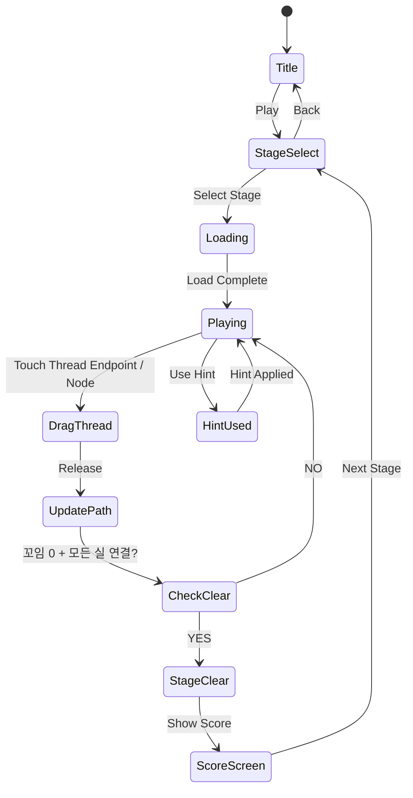

# Wool Puzzle 3D

> **레퍼런스**: #32 Wool Puzzle 3D (XGame Global, 평점 4.7, 장르: rope-knot)
> **MVP 목표**: 1주 개발, 핵심 퍼즐 루프만 구현해서 출시

## 개요

보드 위에 여러 색상의 털실이 핀(peg)들을 감으며 복잡하게 꼬여 있다. 플레이어는 실 끝점을 드래그해 실들을 풀고, 같은 색끼리 분리해 각 색상 실이 자신의 목표 영역에 연결되면 스테이지 클리어.

**핵심 재미 루프**: 꼬인 실을 드래그로 풀어내는 행위 자체의 ASMR적 만족감 + 색상 분류 퍼즐의 논리적 성취감.

### Phaser.io 2D 재해석

원작은 3D 공간에서 실을 감고 푸는 방식이지만, Phaser.io 2D top-down 뷰로 다음과 같이 재해석한다:

- **3D 감기** → **2D 핀 우회 라우팅**: 핀(점)을 중심으로 실 경로가 꼬임
- **3D 회전** → **노드 드래그**: 실의 중간 노드(꼬임 지점)를 드래그해 경로 변경
- **시각적 깊이감** → **실 두께 + 그림자 레이어**: 위에 얹힌 실을 구분

---

## 게임 규칙

### 기본 구성 요소

| 요소 | 설명 |
|------|------|
| **핀(Peg)** | 보드에 고정된 점. 실이 핀 주변을 감싸며 라우팅됨 |
| **실(Thread)** | 색상별로 구분. 시작점~끝점이 핀을 경유하며 꼬인 경로를 가짐 |
| **시작점/끝점** | 각 실의 양 끝. 드래그 가능 |
| **목표 영역** | 각 색상 실의 최종 연결 지점 (보드 가장자리) |

### 핵심 메카닉

#### 1. 실 꼬임 표현 (2D Untangle)
- 실은 **베지어 곡선**으로 그려짐
- 실들이 교차하는 지점 = "꼬임"
- 꼬임이 0개이고 실이 목표 색상 구역에 연결되면 클리어

#### 2. 드래그 인터랙션
- **실 끝점 드래그**: 실의 라우팅 경로 변경
- **중간 노드 드래그**: 실 경로의 중간 꺾임 점 이동
- 드래그 중 실이 핀을 지나치면 핀을 자동으로 감거나 풀음

#### 3. 색상 매칭 이중 메카닉
- **1단계**: 실 꼬임 풀기 (Untangle) → 교차 없이 경로 정리
- **2단계**: 같은 색 실 끝점을 목표 구역에 연결 → 색상 분리 완료
- 두 조건 모두 만족 시 스테이지 클리어

#### 4. 꼬임 판정
- 두 실이 교차하면 교차점에 **붉은 경고 표시** 출현
- 교차 수 = 현재 꼬임도 (HUD에 표시)
- 꼬임 0 + 전체 연결 = 클리어

---

## 게임 플로우



---

## UI 레이아웃

```
┌─────────────────────────────┐
│  🧩 Stage 3    🔀 3   ⏱ 45s │  ← HUD: 스테이지 / 꼬임 수 / 타이머
├─────────────────────────────┤
│                             │
│   🔵────●────╮              │
│              │   🔴──●──╮   │  ← 게임 보드
│   🟡──●──╮  ╰──●─🔴    │   │    (실 = 베지어 곡선)
│          │           🟡─╯   │    (● = 드래그 가능 노드)
│          ╰──●──────●        │    (핀 = 작은 원)
│                             │
├─────────────────────────────┤
│  🟢 ○  🔴 ○  🔵 ○  🟡 ○   │  ← 목표 색상 연결 현황
├─────────────────────────────┤
│     [💡 힌트]  [↩️ 되돌리기]  │  ← 하단 아이템
└─────────────────────────────┘
```

### 화면별 상세

**게임 보드**
- 배경: 부드러운 패브릭/나무 텍스처 (힐링 톤)
- 실: 두께 있는 선, 색상별 파스텔 팔레트, 끝에 작은 실타래 아이콘
- 핀: 작은 원형 못 아이콘
- 교차점: 반투명 붉은 원으로 표시

**색상 연결 현황 바**
- 각 색상별 원 → 실이 연결되면 채워짐
- 전부 채워지면 클리어 애니메이션 트리거

---

## 스코어링 시스템

| Action | Score |
|--------|-------|
| 꼬임 1개 제거 | +50 |
| 실 1개 연결 완료 | +200 |
| 스테이지 클리어 | +500 |
| 힌트 미사용 클리어 보너스 | +300 |
| 남은 시간 보너스 | 남은초 × 5 |
| 콤보 (연속 꼬임 제거) | × 1.5배 |

**별점 시스템 (3성 기준)**
- ⭐: 클리어
- ⭐⭐: 힌트 1개 이하 사용
- ⭐⭐⭐: 힌트 0개 + 시간 내 클리어

---

## 난이도 설계

| Level | 실 색상 수 | 핀 수 | 초기 꼬임 수 | 시간(초) | 특이사항 |
|-------|-----------|-------|-------------|----------|----------|
| 1~5 | 2 | 3~4 | 2~3 | 없음 | 튜토리얼, 시간제한 없음 |
| 6~15 | 3 | 4~5 | 3~5 | 90 | 타이머 도입 |
| 16~25 | 4 | 5~7 | 5~8 | 75 | 실 길이 증가 |
| 26~40 | 5 | 6~8 | 8~12 | 60 | 핀 이동(회전하는 핀) |
| 41+ | 6 | 7~10 | 12~18 | 45 | 장애물 핀 추가 |

### 난이도 요소

| 요소 | 난이도 영향 |
|------|------------|
| 실 색상 수 | 많을수록 복잡 |
| 핀 수 | 많을수록 경로 복잡 |
| 초기 꼬임 수 | 직접적 복잡도 |
| 실 길이 | 길수록 노드 많음 |
| 회전 핀 | 동적 요소 추가 |
| 시간 제한 | 압박감 |

---

## 아이템/파워업

| 아이템 | 효과 | 획득 |
|--------|------|------|
| 💡 힌트 | 다음에 움직여야 할 실 경로 하이라이트 | 광고 시청 / 인앱결제 |
| ↩️ 되돌리기 | 마지막 3번 이동 취소 | 스테이지당 1회 무료 |
| ✂️ 자동풀기 | 교차점 1개 자동 해소 | 인앱결제 |
| 🧲 스냅 | 실이 자동으로 최단경로 스냅 | 인앱결제 |

---

## 사운드 / 이펙트 (ASMR 힐링 컨셉)

### 사운드

| 이벤트 | 사운드 |
|--------|--------|
| 실 드래그 시작 | 부드러운 천 마찰음 (wool drag) |
| 꼬임 해소 | 청량한 "풀림" 효과음 (snap/release) |
| 실 연결 완료 | 따뜻한 "딸깍" + 짧은 멜로디 |
| 스테이지 클리어 | 포근한 완성 효과음 + 배경음 클라이맥스 |
| 힌트 사용 | 부드러운 종소리 |

### 비주얼 이펙트

| 이벤트 | 이펙트 |
|--------|--------|
| 꼬임 해소 | 교차점에서 반짝이는 파티클 |
| 실 연결 완료 | 실을 따라 빛이 흐르는 애니메이션 |
| 스테이지 클리어 | 전체 화면 부드러운 글로우 + 실타래 아이콘 확대 |
| 드래그 중 | 실이 늘어나는 탄성 애니메이션 |

### 배경 테마

- **기본**: 아늑한 북유럽 스타일 패브릭 배경
- **테마팩 1 (유료)**: 봄 꽃밭 테마 + 실 컬러 변경
- **테마팩 2 (유료)**: 가을 낙엽 테마
- **테마팩 3 (유료)**: 크리스마스 테마

---

## 수익화 전략

### 인앱 구매

| 상품 | 가격 | 내용 |
|------|------|------|
| 힌트 팩 (10개) | $0.99 | 힌트 10회 |
| 힌트 팩 (50개) | $3.99 | 힌트 50회 |
| 테마 실 팩 (각) | $1.99 | 테마별 실/배경 스킨 |
| 광고 제거 | $2.99 | 영구 광고 제거 |
| 전체 팩 | $4.99 | 힌트 무제한 + 모든 테마 |

### 광고

- 스테이지 클리어 후 보상형 광고 (힌트 2개 획득)
- 게임 오버 후 전면 광고 (스킵 가능, 5초 후)
- 배너 광고 없음 (힐링 UX 방해)

---

## #17 털실 마스터와 비교 및 MVP 결정

### 비교 분석

| 항목 | #17 털실 마스터 | #32 Wool Puzzle 3D |
|------|----------------|-------------------|
| 핵심 메카닉 | 실 색상 분류/정리 (매칭) | 실 꼬임 풀기 + 색상 라우팅 (퍼즐) |
| 플레이 방식 | 탭/스와이프로 실 분류 | 드래그로 실 경로 변경 |
| 퍼즐 복잡도 | 낮음 (캐주얼) | 중간~높음 (미드코어 퍼즐) |
| 타겟 유저 | 초캐주얼 | 퍼즐 애호가 |
| 세션 길이 | 30초~1분 | 1~3분 |
| 개발 복잡도 | 낮음 | 중간 |

### 공통 코드 재사용 가능성

| 모듈 | 재사용 가능 여부 |
|------|----------------|
| 색상 팔레트 시스템 | ✅ 완전 재사용 |
| 스테이지 선택 UI | ✅ 완전 재사용 |
| 스코어/별점 시스템 | ✅ 완전 재사용 |
| 사운드 매니저 | ✅ 완전 재사용 |
| 실 렌더링 (베지어) | ⚠️ 부분 재사용 (로직은 다름) |
| 퍼즐 로직 | ❌ 완전히 다름 |

### MVP 결정: **별도 게임으로 분리 권장**

**이유**:
1. 핵심 메카닉이 근본적으로 다름 (분류 vs 꼬임풀기)
2. 타겟 유저층이 다름 → 둘 다 출시 시 포트폴리오 다양성 확보
3. 통합 시 어느 게임도 핵심 재미를 제대로 전달 못할 위험
4. 공통 인프라(lib 파이프라인)는 이미 재사용 가능

**단, 개발 우선순위**:
- #17 먼저 (낮은 복잡도, 빠른 출시)
- #32는 #17 출시 후 데이터 보고 판단 (털실 장르 반응 확인)
- #17이 좋은 성과 → #32 즉시 개발
- #17이 저조 → #32 스킵 또는 대폭 간소화

---

## 기술 구현 힌트 (lib 팀 전달용)

> PRD 팀은 기술 결정을 하지 않습니다. 아래는 개발팀 참고용 메모입니다.

- **실 렌더링**: Phaser.io `Graphics` + 베지어 곡선 (`moveTo`, `bezierCurveTo`)
- **교차 감지**: 두 선분 교차 알고리즘 (Computational Geometry)
- **드래그**: Phaser `Pointer` 이벤트 + 노드 히트박스
- **애니메이션**: Phaser Tween으로 실 탄성 표현
- **데이터**: 스테이지는 JSON으로 정의 (핀 좌표, 실 색상, 초기 경로)

---

## MVP 범위

### Phase 1 (MVP - 1주 목표)
- [x] 기획서 작성
- [ ] 2색 실, 4핀, 기본 퍼즐 5스테이지
- [ ] 실 드래그 → 경로 변경 인터랙션
- [ ] 교차 감지 + 꼬임 카운터
- [ ] 색상 연결 판정 + 스테이지 클리어
- [ ] 기본 효과음 3종 (드래그/해소/클리어)
- [ ] 되돌리기 아이템

### Phase 2 (출시 후 데이터 보고 결정)
- [ ] 3~5색 확장 + 스테이지 20~40개
- [ ] 타이머 + 별점 시스템
- [ ] 힌트 시스템 + 광고 연동
- [ ] 테마 스킨 팩
- [ ] ASMR 사운드 풀 세트
- [ ] 회전 핀 등 특수 오브젝트
