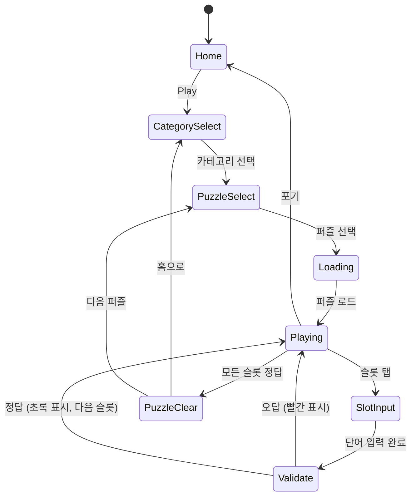

# 워드퍼즐 (Word Puzzle)

> 한국어 크로스워드 퍼즐. 힌트를 보고 가로/세로 단어를 채워넣는 게임.

## 개요

빈 크로스워드 격자판이 주어진다. 각 칸에는 가로/세로 번호가 붙어 있고, 플레이어는 힌트(뜻풀이)를 보고 알맞은 단어를 입력한다. 모든 칸을 올바르게 채우면 퍼즐 클리어.

## 게임 규칙

### 기본 규칙
- 격자판(Grid)에 가로/세로 단어 슬롯이 교차 배치됨
- 각 슬롯에는 번호(1번, 2번...)와 방향(가로/세로)이 표시됨
- 플레이어는 힌트(단어 뜻)를 보고 한글 자모를 입력해 단어를 완성
- 교차 칸에서 두 단어가 공유하는 글자는 일치해야 함
- 모든 칸을 올바르게 채우면 **퍼즐 클리어**
- 오답 입력 시 해당 칸 빨간색 표시, 재입력 가능

### 입력 방식
- 슬롯 선택 → 키보드 팝업(한글 자판)
- 글자 단위 입력 (음절 완성형): "사", "과" 등
- 지우개(삭제) 버튼으로 한 글자씩 삭제
- 슬롯 전체 지우기 가능

### 힌트 시스템
- 기본 힌트: 단어의 뜻풀이 (예: "달콤한 빨간 과일")
- 초성 힌트: 단어의 초성 공개 (예: ㅅ ㄱ)
- 글자 수 힌트: 몇 글자인지 표시 (기본 제공)
- 첫 글자 힌트: 첫 번째 글자 공개 (유료/광고 리워드)

## 게임 플로우



## UI 레이아웃

```
┌─────────────────────────────┐
│  ← 뒤로   워드퍼즐   ⏱ 05:32 │  ← 헤더 (타이머)
├─────────────────────────────┤
│  1→사 2→  3→    │
│     과        │
│  4↓  5↓  ↓    │
│  ┌──┬──┬──┬──┐ │
│  │사│과│  │  │ │  ← 크로스워드 격자
│  ├──┼──┼──┼──┤ │    (선택된 슬롯: 파란 하이라이트)
│  │  │일│  │  │ │    (정답: 초록, 오답: 빨간)
│  ├──┼──┼──┤  │ │
│  │  │  │국│  │ │
│  └──┴──┴──┴──┘ │
├─────────────────────────────┤
│  📋 힌트                    │
│  1→ 달콤한 빨간 과일         │  ← 현재 선택 슬롯 힌트
├─────────────────────────────┤
│  가로          세로          │
│  1. 달콤한 빨간 과일         │  ← 힌트 목록 스크롤
│  4. 한반도 남쪽 나라         │
├─────────────────────────────┤
│  [💡초성] [🔤첫글자] [✏️지우개] │  ← 도구 버튼
│  ┌─한글 키보드────────────┐  │
│  │ ㅂ ㅈ ㄷ ㄱ ㅅ ㅛ ㅕ ㅑ │  │
│  │  ㅁ ㄴ ㅇ ㄹ ㅎ ㅗ ㅓ ㅏ │  │
│  │   ㅋ ㅌ ㅊ ㅍ ㅠ ㅜ ㅡ ㅣ│  │
│  └──────────────────────┘  │
└─────────────────────────────┘
```

## 한국어 특수성

### 한글 자모 입력 UX
- **음절 완성형 입력**: 키보드에서 자/모를 조합해 음절 단위로 입력
  - 예: ㅅ + ㅏ + ㄱ → "삭" (받침 처리)
- 격자 칸 크기: 1칸 = 1음절 (한글 완성형 기준)
- 쌍자음/복모음 지원 (ㄲ, ㄸ, ㅃ, ㅆ, ㅉ, ㅐ, ㅔ 등)

### 초성 퀴즈 모드 (추가 장르)
- 격자 대신 초성만 제공, 완성 단어 맞히기
  - 예: "ㅅ ㄱ" → "사과"
- 시간 제한 내 연속 맞히기로 콤보 스코어
- 카테고리별 초성 퀴즈 (음식, 동물, 영화제목 등)
- MVP Phase 2에서 별도 게임 모드로 분리 가능

### 단어 DB 전략

#### 오픈소스 단어 DB
1. **국립국어원 표준국어대사전 API** (무료): https://opendict.korean.go.kr/
   - 약 50만 단어, 뜻풀이 포함
   - API 키 발급 후 사용 가능
2. **KoNLPy 형태소 사전** (오픈소스): 한국어 NLP 라이브러리 내장 사전
3. **직접 큐레이션**: 2~6글자 일상 단어 3,000~5,000개 직접 선별 (MVP 권장)

#### MVP 단어 DB 구성 (권장)
```
총 1,000단어 (직접 큐레이션)
├── 일반 (600단어): 2~5글자 일상 명사/동사/형용사
├── 사자성어 (200단어): 4글자 고사성어 + 뜻풀이
└── 음식/동물/나라 (200단어): 테마별 쉬운 단어
```

- JSON 형태로 앱 번들에 포함 (서버 불필요, 오프라인 동작)
- 각 단어: `{ word: "사과", hint: "달콤한 빨간 과일", category: "일반", difficulty: 1 }`

## 난이도 설계

| 레벨 | 격자 크기 | 단어 수 | 단어 길이 | 힌트 | 시간 |
|------|-----------|---------|-----------|------|------|
| 쉬움 | 7×7 | 4~6개 | 2~3글자 | 뜻풀이 | 무제한 |
| 보통 | 9×9 | 6~9개 | 3~5글자 | 뜻풀이 | 무제한 |
| 어려움 | 11×11 | 9~12개 | 4~6글자 | 뜻풀이(짧음) | 10분 |
| 전문가 | 13×13 | 12~15개 | 5~7글자 | 한자어/추상개념 | 7분 |

### 난이도 파라미터
- **단어 길이**: 짧을수록 쉬움
- **교차 수**: 교차가 많을수록 어려움 (빈칸 제약 증가)
- **힌트 퀄리티**: 직접적 설명 → 비유적 설명
- **시간 제한**: 쉬움은 무제한, 어려움부터 제한

## 카테고리

| 카테고리 | 설명 | 단어 특징 | 아이콘 |
|----------|------|-----------|--------|
| 일반 | 기본 일상 단어 | 2~5글자 명사/동사 | 📖 |
| 사자성어 | 4글자 고사성어 | 무조건 4글자 | 🏮 |
| 음식 | 음식/요리 관련 | 한식 중심 | 🍜 |
| 동물 | 동물 이름 | 2~4글자 | 🐾 |
| 나라/지명 | 국가/도시/지명 | 고유명사 | 🌏 |
| K-문화 | K팝/드라마/영화 | 트렌디한 단어 | 🎵 |
| 영어 | 기초 영어 단어 | 영→한 힌트 | 🔤 |

> MVP: 일반 + 사자성어 2개 카테고리만 구현

## 일일 퍼즐

### 구조
- 매일 00:00 KST 새로운 퍼즐 1개 자동 공개
- 전 세계(앱 사용자) 동일한 퍼즐 → 소셜 공유 유도
- 날짜 기반 시드(seed)로 퍼즐 생성 → 서버 불필요

### 일일 퍼즐 생성 알고리즘
```
1. 날짜를 seed로 난수 생성기 초기화
2. 단어 DB에서 난이도 "보통" 단어 10~15개 랜덤 선택
3. 크로스워드 배치 알고리즘으로 격자 생성
4. 유효하지 않은 격자면 다음 단어 조합 시도
5. 생성된 퍼즐을 로컬 캐시에 저장
```

### 공유 기능
- 클리어 후 결과 공유: "오늘의 워드퍼즐 클리어! 🎉 풀이시간: 3분 24초"
- 격자 색상 이모지로 표현 (스포일러 없이): ⬜🟩⬜🟩🟩

## 수익화

### 1. 힌트 (핵심 수익)
| 힌트 종류 | 가격 | 설명 |
|-----------|------|------|
| 초성 공개 | 💎1 | 해당 단어의 초성 모두 공개 |
| 첫 글자 공개 | 💎2 | 첫 번째 글자 공개 |
| 단어 정답 공개 | 💎5 | 해당 슬롯 자동 완성 |
| 힌트팩 (5개) | ₩1,200 | 💎5 구매 |
| 힌트팩 (15개) | ₩2,900 | 💎15 구매 |
| 힌트팩 (50개) | ₩7,900 | 💎50 구매 |

### 2. 광고
- 클리어 후 전면광고 (스킵 가능)
- 힌트 1개 무료 획득 = 리워드 광고 시청 (30초)
- 일일 무료 힌트 3개 (광고 제거 시 5개)

### 3. 광고 제거 (구독/인앱)
- **광고 제거**: ₩2,900/월 또는 ₩9,900 영구
- 포함: 광고 제거 + 일일 무료 힌트 5개 + 프리미엄 테마 1개

### 4. 테마 팩
| 테마 | 가격 | 내용 |
|------|------|------|
| 다크모드 테마 | ₩1,200 | 어두운 배경 + 네온 색상 |
| 한지 테마 | ₩1,200 | 전통 한지 질감 배경 |
| 시즌 테마팩 | ₩2,900 | 봄/여름/가을/겨울 4종 |

## 스코어링 시스템

| Action | Score | 조건 |
|--------|-------|------|
| 단어 정답 (첫 시도) | +100 × 글자수 | 힌트 미사용 |
| 단어 정답 (재시도) | +50 × 글자수 | - |
| 힌트 사용 시 감점 | -20 per 힌트 | 최소 0점 |
| 퍼즐 클리어 보너스 | +500 | 모든 슬롯 완료 |
| 시간 보너스 | 남은초 × 5 | 시간 제한 모드만 |
| 노힌트 클리어 | +1000 | 힌트 미사용 완료 |

## 사운드/이펙트

- 글자 입력: 키 타이핑 효과음
- 단어 정답: 맑은 종소리 + 초록색 채움 애니메이션
- 단어 오답: 낮은 버저음 + 빨간색 흔들림 애니메이션
- 퍼즐 클리어: 폭죽 파티클 + 팡파르
- 힌트 사용: 반짝임 이펙트

## MVP 범위

### Phase 1 - MVP (1~2주)
- [ ] 기획서 작성
- [ ] 단어 DB 1,000개 (일반 800 + 사자성어 200) - JSON 파일
- [ ] 크로스워드 격자 생성 알고리즘
- [ ] 한글 키보드 입력 UI
- [ ] 정답 검증 로직
- [ ] 힌트 시스템 (초성 공개, 첫 글자 공개)
- [ ] 30개 수동 제작 퍼즐 (쉬움 10 + 보통 15 + 어려움 5)
- [ ] 스테이지 셀렉트 UI
- [ ] 클리어 화면 + 스코어

### Phase 2
- [ ] 일일 퍼즐 (날짜 기반 시드 생성)
- [ ] 카테고리 확장 (음식, 동물, K-문화)
- [ ] 광고 연동 (리워드 + 전면)
- [ ] 인앱 결제 (힌트팩)
- [ ] 결과 공유 기능
- [ ] 초성 퀴즈 보너스 모드

### Phase 3
- [ ] 사용자 통계 (풀이 기록, 연속 클리어)
- [ ] 리더보드 (일일 퍼즐 클리어 시간)
- [ ] 테마 팩 판매
- [ ] 단어 DB 확장 (5,000단어+)

## 기술 구현 참고사항

> (lib/web/rn 팀 전달용)

- **격자 데이터**: `{ grid: Cell[][], slots: Slot[] }` 형태로 JSON 직렬화
- **크로스워드 생성**: 오픈소스 라이브러리 `crossword-generator` 활용 또는 직접 구현
  - 단어 배치 알고리즘: Backtracking + 교차 최대화
- **한글 키보드**: React Native에서는 네이티브 키보드 사용, Web에서는 커스텀 컴포넌트
- **오프라인 지원**: 단어 DB + 30 퍼즐 모두 앱 번들 포함
- **Phaser.io 활용**: 격자 렌더링 + 입력 처리 + 애니메이션에 Phaser Scene 사용
