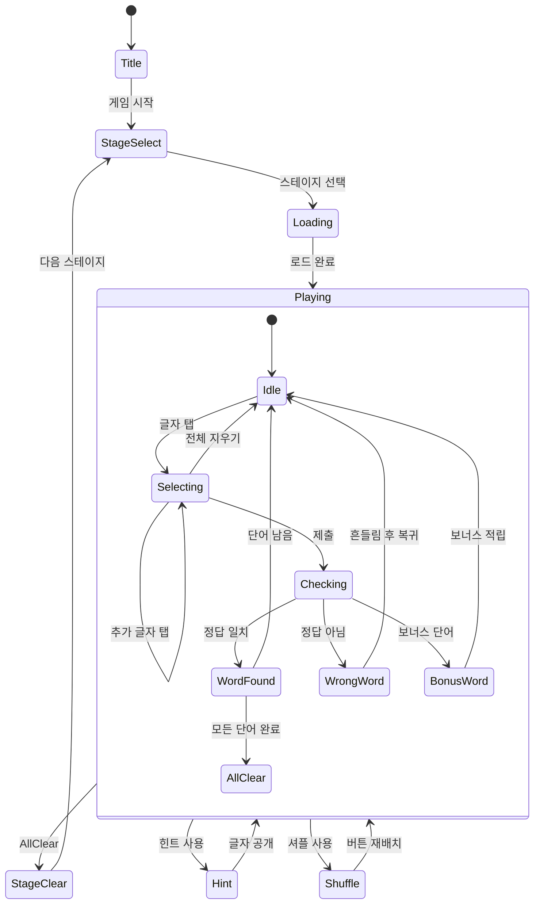

# 워드퍼즐

> 흩어진 한글 글자를 조합해 크로스워드를 완성하는 단어 퍼즐 게임

## 개요

화면 상단에 빈칸으로 이루어진 크로스워드 격자가 표시된다. 하단에는 한글 글자 버튼이 원형으로 배치되어 있다. 플레이어는 글자를 순서대로 탭하여 단어를 만들고, 해당 단어가 크로스워드에 포함된 단어와 일치하면 격자에 채워진다. 모든 단어를 찾으면 스테이지 클리어.

## 게임 규칙

### 기본 규칙
- 크로스워드 격자에 **3~6개의 단어**가 교차 배치됨
- 모든 단어는 **2~4글자** 한글 단어
- 하단 글자 버튼을 탭하여 단어를 입력함
- 입력한 단어가 크로스워드 정답과 일치하면 격자에 **자동 채워짐**
- 모든 단어를 찾으면 **스테이지 클리어**
- 게임 오버 없음 — 시간 제한 내 클리어 시 보너스, 시간 초과해도 계속 플레이 가능

### 글자 선택
- 하단 원형 배치된 글자 버튼을 **순서대로 탭**
- 선택된 글자는 입력 영역에 순서대로 표시됨
- 같은 글자를 다시 탭하면 **선택 해제**
- 마지막 글자부터 역순 해제 가능
- **전체 지우기** 버튼으로 입력 초기화
- 모든 글자를 선택해 단어를 완성하면 **자동 제출**되거나, 제출 버튼 탭

### 크로스워드 매칭
- 입력한 단어가 정답 목록에 있으면 즉시 크로스워드 격자에 채워짐
- 이미 찾은 단어와 교차하는 글자는 **힌트로 미리 표시**됨
- 정답이 아닌 단어 입력 시 **흔들림 애니메이션** + 입력 초기화
- 이미 찾은 단어를 다시 입력하면 해당 단어가 **하이라이트 깜빡임**
- 보너스 단어: 크로스워드에 없지만 주어진 글자로 만들 수 있는 유효 단어 → **보너스 점수**

## 게임 플로우



## UI 레이아웃

```
┌─────────────────────────────┐
│  Stage 12    ⭐ 2,400       │  ← 상단 HUD
│  단어: 2/5   💡×3  🔀×2    │     (스테이지, 점수, 아이템)
├─────────────────────────────┤
│                             │
│        ┌──┬──┬──┐          │
│        │한│  │  │          │
│        └──┼──┼──┘          │
│     ┌──┬──┼──┤             │  ← 크로스워드 격자
│     │  │  │국│             │     (빈칸 + 찾은 글자)
│     └──┴──┼──┤             │
│           │어│             │
│           └──┘             │
│                             │
├─────────────────────────────┤
│                             │
│     ┌─입력 영역──────────┐  │
│     │  한  국  어         │  │  ← 선택한 글자 표시
│     └────────────────────┘  │
│                             │
│         ┌───┐               │
│      ┌───┐한┌───┐          │
│      │어│  ↗  │국│          │  ← 글자 원형 버튼
│      └───┘  ↙  └───┘       │
│         └───┘               │
│          입                 │
│                             │
│    [전체 지우기]  [제출]    │  ← 하단 버튼
└─────────────────────────────┘
```

## 스코어링 시스템

| Action | Score |
|--------|-------|
| 단어 발견 (2글자) | +100 |
| 단어 발견 (3글자) | +150 |
| 단어 발견 (4글자) | +200 |
| 보너스 단어 발견 | +50 |
| 연속 정답 콤보 (2연속) | +50 추가 |
| 연속 정답 콤보 (3연속) | +100 추가 |
| 연속 정답 콤보 (4연속+) | +150 추가 |
| 힌트 미사용 클리어 | +200 |
| 스테이지 클리어 | +500 |
| 시간 보너스 (제한 시간 내 클리어) | 남은초 × 5 |

> 콤보는 오답 없이 연속으로 단어를 맞출 때 적용됨. 오답 입력 시 콤보 리셋.

## 난이도 설계

| 스테이지 | 단어 수 | 글자 수 | 제공 글자 | 제한 시간(초) | 난이도 |
|----------|---------|---------|-----------|---------------|--------|
| 1 | 3 | 2글자 | 4~5개 | 120 | ⭐ |
| 2 | 3 | 2글자 | 4~5개 | 120 | ⭐ |
| 3 | 3 | 2~3글자 | 5~6개 | 120 | ⭐ |
| 4 | 3 | 2~3글자 | 5~6개 | 120 | ⭐ |
| 5 | 3 | 2~3글자 | 5~6개 | 120 | ⭐ |
| 6 | 4 | 2~3글자 | 5~6개 | 150 | ⭐⭐ |
| 7 | 4 | 2~3글자 | 5~6개 | 150 | ⭐⭐ |
| 8 | 4 | 2~4글자 | 6~7개 | 150 | ⭐⭐ |
| 9 | 4 | 2~4글자 | 6~7개 | 150 | ⭐⭐ |
| 10 | 4 | 2~4글자 | 6~7개 | 150 | ⭐⭐ |
| 11 | 4 | 2~4글자 | 6~7개 | 150 | ⭐⭐ |
| 12 | 4 | 2~4글자 | 6~7개 | 180 | ⭐⭐ |
| 13 | 4 | 2~4글자 | 7개 | 180 | ⭐⭐ |
| 14 | 4 | 3~4글자 | 7개 | 180 | ⭐⭐ |
| 15 | 4 | 3~4글자 | 7개 | 180 | ⭐⭐ |
| 16 | 5 | 2~4글자 | 7~8개 | 210 | ⭐⭐⭐ |
| 17 | 5 | 2~4글자 | 7~8개 | 210 | ⭐⭐⭐ |
| 18 | 5 | 2~4글자 | 7~8개 | 210 | ⭐⭐⭐ |
| 19 | 5 | 3~4글자 | 8개 | 210 | ⭐⭐⭐ |
| 20 | 5 | 3~4글자 | 8개 | 210 | ⭐⭐⭐ |
| 21 | 5 | 3~4글자 | 8개 | 240 | ⭐⭐⭐ |
| 22 | 5 | 3~4글자 | 8개 | 240 | ⭐⭐⭐ |
| 23 | 5 | 3~4글자 | 8~9개 | 240 | ⭐⭐⭐ |
| 24 | 5 | 3~4글자 | 8~9개 | 240 | ⭐⭐⭐ |
| 25 | 5 | 3~4글자 | 9개 | 240 | ⭐⭐⭐ |
| 26 | 6 | 3~4글자 | 9~10개 | 300 | ⭐⭐⭐⭐ |
| 27 | 6 | 3~4글자 | 9~10개 | 300 | ⭐⭐⭐⭐ |
| 28 | 6 | 3~4글자 | 10개 | 300 | ⭐⭐⭐⭐ |
| 29 | 6 | 3~4글자 | 10개 | 300 | ⭐⭐⭐⭐ |
| 30 | 6 | 3~4글자 | 10개 | 300 | ⭐⭐⭐⭐ |

> 제공 글자 수 = 크로스워드에 사용되는 고유 글자 (교차 글자는 1회만 카운트)

## 단어 데이터베이스 설계

### 데이터 구조

각 단어는 다음 필드를 가짐:

```typescript
interface Word {
  word: string;       // 단어 (예: "한국")
  hint: string;       // 의미 힌트 (예: "대한민국의 줄임말")
  difficulty: 1 | 2 | 3;  // 난이도 (1=쉬움, 2=보통, 3=어려움)
  length: number;     // 글자 수 (2~4)
}
```

### 퍼즐 구조

각 퍼즐(스테이지)은 다음 구조를 가짐:

```typescript
interface Puzzle {
  id: number;                    // 스테이지 번호
  words: PuzzleWord[];           // 배치된 단어 목록
  letters: string[];             // 제공되는 글자 버튼 목록
  bonusWords?: string[];         // 보너스 단어 목록 (선택)
  timeLimit: number;             // 제한 시간 (초)
}

interface PuzzleWord {
  word: string;                  // 단어
  direction: 'horizontal' | 'vertical';  // 배치 방향
  startRow: number;              // 시작 행 (0-indexed)
  startCol: number;              // 시작 열 (0-indexed)
}
```

### 퍼즐 구성 규칙

1. **교차 필수**: 모든 퍼즐은 최소 1개 이상의 교차점을 가져야 함
2. **연결성**: 모든 단어는 직접 또는 간접적으로 다른 단어와 교차 연결되어야 함
3. **글자 중복**: 교차하는 위치의 글자는 두 단어가 공유함
4. **제공 글자**: 크로스워드의 모든 고유 글자가 글자 버튼으로 제공됨
5. **보너스 단어**: 제공된 글자로 만들 수 있는 추가 유효 단어를 보너스로 등록 가능

### 예시 퍼즐 (스테이지 1)

```
격자 (5×5):
     0   1   2   3   4
0  [사][과][ ][ ][ ]
1  [ ][자][연][ ][ ]
2  [ ][ ][ ][ ][ ]

단어 목록:
- "사과" → horizontal, (0,0)
- "과자" → vertical, (0,1)
- "자연" → horizontal, (1,1)

교차점:
- (0,1) "과" → "사과" ∩ "과자"
- (1,1) "자" → "과자" ∩ "자연"

제공 글자: [사, 과, 자, 연]
보너스 단어: ["자사"] (있을 경우)
```

### 데이터 포맷 (JSON)

```json
{
  "puzzles": [
    {
      "id": 1,
      "words": [
        { "word": "사과", "direction": "horizontal", "startRow": 0, "startCol": 0 },
        { "word": "과자", "direction": "vertical", "startRow": 0, "startCol": 1 },
        { "word": "자연", "direction": "horizontal", "startRow": 1, "startCol": 1 }
      ],
      "letters": ["사", "과", "자", "연"],
      "bonusWords": [],
      "timeLimit": 120
    }
  ],
  "wordBank": [
    { "word": "사과", "hint": "빨간 과일", "difficulty": 1, "length": 2 },
    { "word": "과자", "hint": "간식으로 먹는 것", "difficulty": 1, "length": 2 },
    { "word": "자연", "hint": "산, 강, 숲 등", "difficulty": 1, "length": 2 }
  ]
}
```

### MVP 단어 수

- **총 100개 이상** 일반 한글 단어 수록
- 2글자 단어: ~50개
- 3글자 단어: ~35개
- 4글자 단어: ~15개
- **30개 퍼즐** 구성 (스테이지 1~30)

## 아이템/도구

| Item | Effect | 기본 제공 |
|------|--------|-----------|
| 힌트 (💡) | 크로스워드 격자에 아직 찾지 못한 단어의 글자 1개를 공개 | 스테이지당 3회 |
| 셔플 (🔀) | 하단 글자 버튼의 위치를 랜덤으로 재배치 | 스테이지당 2회 |

> 힌트 사용 시 해당 스테이지의 "힌트 미사용 클리어 보너스(+200)" 획득 불가

## 사운드/이펙트 (TODO)

- 글자 선택: 톡 효과음 (가벼운 탭 사운드)
- 글자 해제: 톡 역재생 효과음
- 정답 단어 발견: 차임 효과음 + 격자 채움 애니메이션 (글자가 순서대로 팝업)
- 보너스 단어 발견: 코인 사운드 + 반짝 이펙트
- 오답 입력: 짧은 버저음 + 입력 영역 좌우 흔들림
- 콤보 발생: 상승 톤 효과음 (콤보 수에 따라 피치 상승)
- 힌트 사용: 마법 사운드 + 글자 페이드인 이펙트
- 셔플 사용: 회전 사운드 + 글자 버튼 회전 애니메이션
- 스테이지 클리어: 축하 팡파레 + 별 이펙트
- 시간 보너스 획득: 카운트업 사운드

## MVP 범위

### Phase 1 (MVP)
- [x] 기획서 작성
- [ ] 단어 데이터베이스 구축 (100+ 단어, 30 퍼즐)
- [ ] 크로스워드 격자 렌더링
- [ ] 글자 원형 버튼 UI
- [ ] 글자 선택 → 입력 영역 표시
- [ ] 단어 제출 → 정답 체크 로직
- [ ] 정답 시 격자 채움 애니메이션
- [ ] 오답 시 흔들림 애니메이션
- [ ] 교차 글자 힌트 자동 표시
- [ ] 스테이지 클리어 판정
- [ ] 기본 스코어링 (단어 점수 + 클리어 보너스)
- [ ] 힌트 아이템
- [ ] 셔플 아이템
- [ ] 스테이지 셀렉트 화면 (30 스테이지)
- [ ] 타이머 + 시간 보너스

### Phase 2
- [ ] 보너스 단어 시스템
- [ ] 콤보 시스템
- [ ] 일일 퍼즐 (매일 새로운 퍼즐 1개)
- [ ] 추가 스테이지 (31~100)
- [ ] 카테고리별 단어 팩 (음식, 동물, 지명 등)
- [ ] 리더보드
- [ ] 업적 시스템
- [ ] 퍼즐 자동 생성 알고리즘
