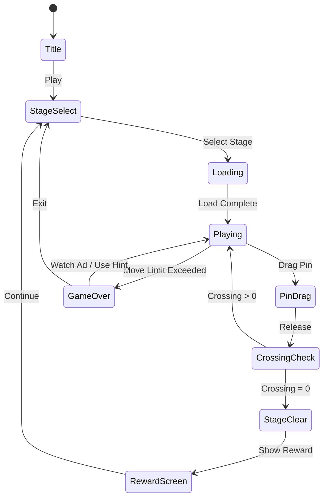

# Yarn Fever! Unravel Puzzle

> **Issue #78** | Genre: rope-knot | Rating: 4.7 | Developer: Brave HK Limited
>
> 꼬인 실을 풀어내는 매듭 퍼즐 — ASMR 힐링 & 두뇌 자극의 완벽한 조합

---

## 1. 레퍼런스 비교 분석

### 실/로프 퍼즐 4개 레퍼런스

| 항목 | #17 Tangle Master 3D | #32 Knot 3D | #53 String Art | #78 Yarn Fever (본 게임) |
|------|----------------------|-------------|----------------|--------------------------|
| 핵심 메카닉 | 3D 공간에서 로프 꼬임 해소 | 매듭 노드 탭으로 풀기 | 실을 못에 감아 패턴 완성 | 2D 실 경로 드래그로 교차 제거 |
| 인터랙션 | 로프 끝 드래그 | 노드 탭 순서 | 못 탭 → 자동 감기 | 실 경로 드래그 + 핀 이동 |
| 시각 스타일 | 3D 클레이/파스텔 | 미니멀 3D | 기하학적 패턴 | 울/털실 텍스처, 따뜻한 컬러 |
| ASMR 요소 | 로프 스트레치 사운드 | 약함 | 없음 | **실 꼬임 해소 + 울 ASMR** |
| 난이도 진행 | 로프 수 증가 | 노드 복잡도 | 못 수 증가 | 교차 수 + 핀 수 |
| 수익화 | 광고 위주 | IAP 힌트 | 테마 팩 | **테마 팩 + 힌트 + 광고** |
| 약점 | 3D 조작 불편 | 단조로움 | 창의성 부족 | — (이 게임으로 보완) |

### 장르 핵심 통찰

**4개 레퍼런스를 분석한 결론:**

1. **3D 조작은 모바일에서 불편하다** (#17의 최대 약점): 2D + 뛰어난 물리 피드백이 더 낫다
2. **탭 단독은 단조롭다** (#32): 드래그 + 탭 혼합 인터랙션이 몰입감을 높인다
3. **패턴 완성 보상이 강력하다** (#53): "완성된 모양" 비주얼 보상이 재플레이를 유도
4. **ASMR은 선택이 아닌 필수다**: 실/로프 장르에서 사운드+진동 피드백은 핵심 리텐션

---

## 2. ASMR / 힐링 시장 분석

### 타겟 유저

| 세그먼트 | 비율 | 특징 |
|----------|------|------|
| 25~40세 여성 | 55% | 퇴근 후 릴렉스, 짧은 세션 선호, IAP 의향 높음 |
| 10~24세 Z세대 | 25% | ASMR 콘텐츠 소비자, 소셜 공유 |
| 40~55세 여성 | 15% | 힐링/명상 앱 중복 사용자 |
| 기타 | 5% | — |

### 시장 규모 (2025 기준)

- **글로벌 퍼즐 게임 시장**: $5.8B (연 8.2% 성장)
- **ASMR 모바일 게임 서브마켓**: ~$420M (급성장 중)
- **Tangle Master 3D** 단일 앱: 월 $2~4M 매출 추정 (App Annie 기준)
- **상위 5개 로프 퍼즐 앱 합계**: 월 DAU 1,200만 이상

### 왜 지금인가?

- YouTube ASMR 채널 상위권에 "퍼즐 풀기" 카테고리 급상승 (2024~2025)
- TikTok #satisfying 태그 내 퍼즐 풀기 영상 조회수 120억+
- **핵심**: 영상으로 소비하던 유저들이 "직접 하고 싶다"는 수요로 전환 중

---

## 3. 게임 개요

꼬인 실타래를 드래그해서 교차점을 없애는 퍼즐 게임.
모든 실이 서로 겹치지 않게 풀면 클리어. ASMR 사운드와 햅틱 피드백으로 힐링 경험 제공.

### 핵심 재미 루프

```
실 꼬임 발견 → 드래그로 핀/실 이동 → 교차 제거 → ASMR 피드백 → 완전히 풀림 → 만족감 → 다음 레벨
```

---

## 4. 게임 규칙

### 기본 규칙

- 캔버스에 여러 색상의 **실(yarn)**이 **핀(pin)**에 연결되어 배치됨
- 실들이 교차(crossing)된 상태에서 시작
- 플레이어는 **핀을 드래그**해서 위치를 옮겨 교차를 없앰
- **모든 교차점 = 0**이 되면 스테이지 클리어
- 제한 이동 횟수 또는 제한 시간 내 클리어해야 함

### 실 교차 판정

- 두 실 선분이 교차하면 **교차점 표시** (빨간 점 또는 글로우 이펙트)
- 핀 이동 후 교차 수가 **줄어들면 → 초록 피드백 + ASMR 사운드**
- 교차 수가 **늘어나면 → 약한 진동 경고**
- 교차 수 0 달성 시 → **완성 애니메이션 + 힐링 사운드 + 햅틱**

### 핀(Pin) 규칙

- 각 실은 최소 2개 핀에 연결 (복잡한 레벨은 3~5개)
- 핀은 캔버스 내 자유롭게 이동 가능
- 일부 레벨에서는 **고정 핀(locked pin)** 존재 — 이동 불가

---

## 5. 게임 플로우



---

## 6. UI 레이아웃

```
┌─────────────────────────────┐
│  ← Back    Level 12    ⚙️   │  ← 상단 HUD
│  ✂️ Crossings: 3   🔄 Moves: 8│
├─────────────────────────────┤
│                             │
│    🔵━━━━●━━━━━━━━●         │
│         ╲         │         │
│    🔴━━━━╲━━●━━━━━│━━●      │  ← 게임 캔버스
│           ╲       │         │    (실 + 핀)
│    🟡━━━━━━●━━━━━━●         │
│                             │
│   [교차점: 빨간 글로우 표시]   │
├─────────────────────────────┤
│  💡 Hint    ↩ Undo    🎁 Boost│  ← 아이템 바
└─────────────────────────────┘
```

### 완성 화면 (클리어)

```
┌─────────────────────────────┐
│         ✨ PERFECT! ✨        │
│    🧶 All Untangled! 🧶      │
│                             │
│    [실들이 아름답게 펼쳐지는   │
│     완성 애니메이션]          │
│                             │
│  ⭐⭐⭐    Moves: 6/8        │
│  [Next Level]  [Share 📤]    │
└─────────────────────────────┘
```

---

## 7. Phaser.io 구현 가이드

### 핵심 기술 과제

#### 7.1 실(Yarn) 곡선 렌더링

```typescript
// Phaser.io Graphics를 사용한 실 렌더링
class YarnRenderer {
  // 핀 사이 베지어 곡선 (약간의 처짐 표현으로 실감 향상)
  drawYarn(graphics: Phaser.GameObjects.Graphics,
           from: Point, to: Point, color: number) {
    const midX = (from.x + to.x) / 2;
    const midY = (from.y + to.y) / 2 + 20; // 처짐 효과

    graphics.lineStyle(4, color, 1);
    graphics.beginPath();
    // quadraticCurveTo로 자연스러운 곡선
    graphics.moveTo(from.x, from.y);
    graphics.quadraticCurveTo(midX, midY, to.x, to.y);
    graphics.strokePath();
  }
}
```

#### 7.2 교차(Crossing) 판정

```typescript
// 두 선분의 교차 판정 (CCW 알고리즘)
function segmentsIntersect(
  p1: Point, p2: Point,  // 선분 1
  p3: Point, p4: Point   // 선분 2
): boolean {
  const d1 = direction(p3, p4, p1);
  const d2 = direction(p3, p4, p2);
  const d3 = direction(p1, p2, p3);
  const d4 = direction(p1, p2, p4);

  if (((d1 > 0 && d2 < 0) || (d1 < 0 && d2 > 0)) &&
      ((d3 > 0 && d4 < 0) || (d3 < 0 && d4 > 0))) {
    return true;
  }
  return false;
}

function direction(pi: Point, pj: Point, pk: Point): number {
  return (pk.x - pi.x) * (pj.y - pi.y) - (pk.y - pi.y) * (pj.x - pi.x);
}
```

#### 7.3 핀 드래그 인터랙션

```typescript
// Phaser 드래그 이벤트
pin.setInteractive({ draggable: true });
this.input.on('drag', (pointer, gameObject, dragX, dragY) => {
  gameObject.x = dragX;
  gameObject.y = dragY;
  this.updateYarns();       // 실 재렌더링
  this.checkCrossings();    // 교차 재계산
  this.updateCrossingUI();  // UI 업데이트
});
```

#### 7.4 ASMR 사운드 시스템

| 이벤트 | 사운드 | 햅틱 |
|--------|--------|------|
| 핀 드래그 시작 | 실 마찰 소리 (부드럽게) | 약한 진동 |
| 교차 감소 | 실 풀림 "쉬~익" | 중간 진동 |
| 교차 증가 | 부드러운 경고음 | 없음 |
| 전체 해소 | 릴랙싱 완성 멜로디 | 패턴 진동 |
| 핀 릴리즈 | 톡 소리 | 탭 햅틱 |

#### 7.5 성능 최적화

- 교차 판정: 매 프레임이 아닌 **드래그 종료 시** 전체 재계산
- 드래그 중: **현재 핀과 연결된 실만** 재계산 (incremental)
- 실 렌더링: Phaser `Graphics` 오브젝트 **풀링** 적용
- 핀 수 최대 20개 → O(n²) 교차 판정으로 충분

---

## 8. 스테이지 설계

### 난이도 커브

| 레벨 구간 | 실 색상 수 | 핀 수 | 교차 수 | 고정 핀 | 이동 제한 |
|-----------|-----------|-------|---------|---------|----------|
| 1~10 | 2 | 4~6 | 1~3 | 없음 | 없음 |
| 11~20 | 3 | 6~8 | 3~6 | 없음 | 15회 |
| 21~35 | 4 | 8~10 | 5~8 | 1개 | 12회 |
| 36~50 | 5 | 10~14 | 7~12 | 2개 | 10회 |
| 51+ | 6 | 14~20 | 10~20 | 3개 | 8회 |

### 튜토리얼 레벨 (1~3)

- **레벨 1**: 실 2개, 핀 4개, 교차 1개 → "드래그 방법 가르치기"
- **레벨 2**: 실 2개, 핀 4개, 교차 2개 → "순서가 중요함 학습"
- **레벨 3**: 실 3개, 핀 6개, 교차 3개 → "색상별 실 구분 학습"

---

## 9. 아이템 시스템

| 아이템 | 효과 | 획득 방법 |
|--------|------|----------|
| 💡 힌트 | 최적 다음 이동 1회 표시 | 광고 시청 / 구매 |
| ↩ Undo | 마지막 이동 1회 취소 | 레벨당 1회 무료 |
| 🔄 Auto-solve | 현재 교차 자동 1개 해소 | 프리미엄 / 광고 |
| ✨ 보너스 이동 | 이동 제한 +3 추가 | 광고 시청 |

---

## 10. 수익화 전략

### 모델: Hybrid (광고 + IAP)

#### 광고

| 타입 | 빈도 | 위치 |
|------|------|------|
| 인터스티셜 | 레벨 5개마다 | 스테이지 클리어 후 |
| 리워드 광고 | 선택적 | 힌트/추가 이동 교환 |
| 배너 | 항상 | 스테이지 셀렉트 화면 하단 |

#### IAP (인앱 결제)

| 상품 | 가격 | 내용 |
|------|------|------|
| 광고 제거 | $2.99 | 영구 광고 제거 |
| 힌트 팩 x10 | $0.99 | 힌트 10개 |
| 테마 팩 - 빈티지 | $1.99 | 빈티지 울 텍스처 + 사운드 |
| 테마 팩 - 네온 | $1.99 | 네온 실 + 다크모드 배경 |
| 테마 팩 - 자연 | $1.99 | 면/마 텍스처 + 자연 사운드 |
| 프리미엄 번들 | $4.99 | 광고 제거 + 모든 테마 |

### 테마 팩 상세 (핵심 수익원)

실 퍼즐 장르는 **시각/청각 커스터마이징**이 강력한 IAP 동인:

- **빈티지 울**: 두툼한 울 텍스처, 따뜻한 나무 배경, 크래클 ASMR
- **네온 글로우**: 발광 실, 다크 배경, 사이버펑크 사운드
- **자연/에코**: 면사/마 텍스처, 숲 배경, 빗소리 + 바람 ASMR
- **시즌 한정**: 크리스마스(반짝이 실), 봄(꽃 패턴) — FOMO 마케팅

---

## 11. UI/UX 컨셉

### 색상 팔레트 (기본 테마)

- 배경: 따뜻한 크림 (#FFF8F0) / 연한 베이지
- 실 색상: 파스텔 톤 (코랄, 라벤더, 민트, 레몬, 더스티 로즈)
- 핀: 나무 질감 원형 버튼
- 교차 표시: 소프트 레드 글로우 (#FF6B6B)

### 핵심 UX 원칙

1. **즉각적 피드백**: 핀 이동 → 0.1초 내 교차 수 업데이트
2. **진행감 시각화**: 교차 수 카운터 + 진행 바
3. **실수 허용**: Undo 버튼 항상 노출 (단, 무한 사용은 IAP)
4. **세션 단위 최적화**: 1레벨 = 30초~3분 (통근/짬 플레이)

---

## 12. 소셜 / 리텐션 전략

| 기능 | 목적 | 우선순위 |
|------|------|---------|
| 클리어 결과 공유 (GIF) | 바이럴 | MVP 이후 |
| 일일 챌린지 | 리텐션 | Phase 2 |
| 리더보드 (최소 이동) | 경쟁 | Phase 2 |
| 스트릭 보상 | 리텐션 | Phase 2 |

---

## 13. found3 대비 우선순위 분석

### 비교표

| 기준 | found3 | Yarn Fever |
|------|--------|------------|
| 개발 난이도 | 중 (슬롯 매칭 로직) | **중-하** (교차 판정은 수학적으로 명확) |
| 시장 크기 | 중 (캐주얼 퍼즐) | **대** (ASMR + 힐링 시장 급성장) |
| IAP 잠재력 | 중 (아이템) | **높음** (테마 팩 + 사운드 팩) |
| 경쟁 강도 | 높음 (Royal Match 등) | 중 (Tangle Master 독점, 2D 공백 있음) |
| 개발 기간 | 1~2주 | **1~2주** |
| 바이럴 가능성 | 낮음 | **높음** (GIF 공유, ASMR 콘텐츠) |

### 결론 및 권장 우선순위

```
우선순위: Yarn Fever ≥ found3 (동시 진행 권장)

이유:
1. 실 퍼즐은 2D Phaser.io로 구현이 found3보다 단순
2. ASMR 시장 성장세 → CPI 낮음 (유기적 유입 가능)
3. 테마 팩 IAP → found3 아이템보다 높은 ARPU 예상
4. 4개 레퍼런스 분석 완료 → 실패 리스크 최소화됨

권장: found3 Web 빌드 완료 후 Yarn Fever lib 개발 병행
```

---

## 14. MVP 범위

### Phase 1 — MVP (1주일)

- [x] 기획서 작성 (이 문서)
- [ ] `lib/yarn-fever`: 핀/실 데이터 구조, 교차 판정 로직
- [ ] `lib/yarn-fever`: 기본 레벨 데이터 20개
- [ ] `web/yarn-fever`: Phaser.io 캔버스 + 드래그 인터랙션
- [ ] `web/yarn-fever`: 교차 수 UI + 클리어 판정
- [ ] 기본 ASMR 사운드 2종 (드래그 / 완성)
- [ ] 광고 연동 (인터스티셜)

### Phase 2 — 성장 (2주차)

- [ ] 테마 팩 1종 (빈티지 울) IAP
- [ ] 힌트 시스템 + 리워드 광고
- [ ] 레벨 50개로 확장
- [ ] 고정 핀 메카닉
- [ ] 클리어 GIF 공유

### Phase 3 — 리텐션 (데이터 후)

- [ ] 일일 챌린지
- [ ] 추가 테마 팩 (네온, 자연)
- [ ] 리더보드

---

## 15. 기술 스택 (프로젝트 표준 따름)

| 레이어 | 기술 |
|--------|------|
| 게임 코어 | `lib/yarn-fever/` — Phaser.io 씬 + 교차 판정 유틸 |
| 웹 빌드 | `web/yarn-fever/` — React + Stitches + Vite |
| 모바일 | `yarn-fever/rn/` — React Native WebView |
| 에셋 | SVG 핀 + Canvas 실 렌더링 (외부 에셋 최소화) |
