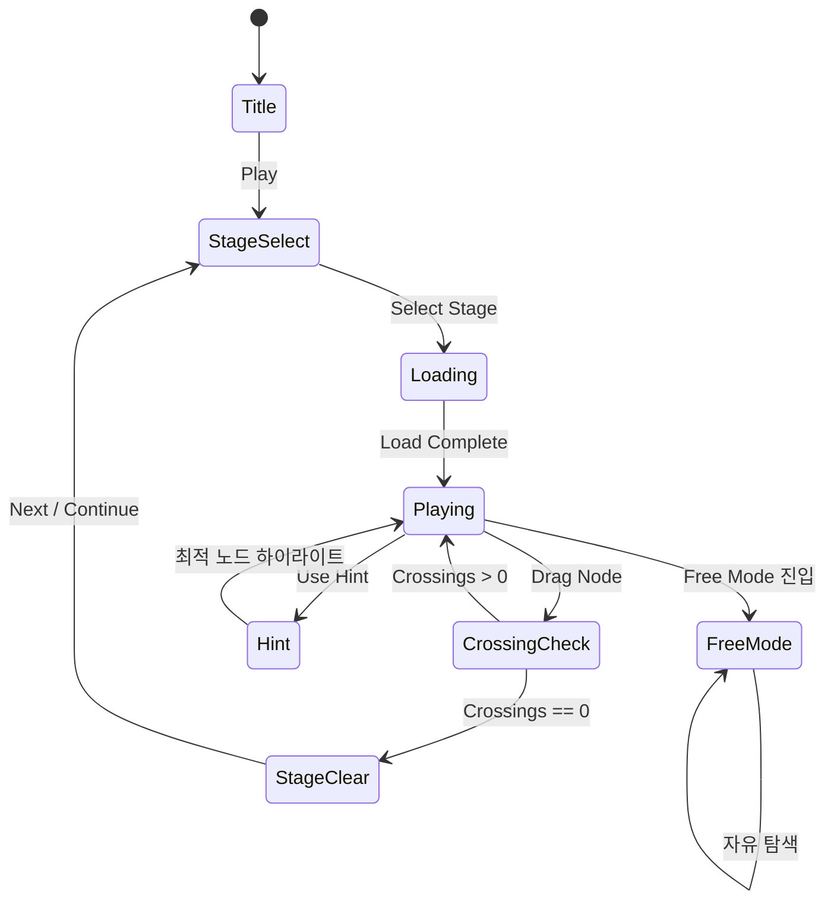

# 털실 마스터 (Yarn Master)

> 실타래를 드래그해 꼬임을 풀어내는 힐링 2D 퍼즐 게임

## 개요

보드 위에 여러 색깔의 실이 꼬여 있다. 플레이어는 실의 교차점(노드)을 드래그하여
교차점 수를 0으로 만들면 스테이지 클리어. ASMR 사운드와 부드러운 애니메이션으로
실을 풀어내는 힐링 경험을 제공한다.

**핵심 재미 루프**: 꼬인 실 → 드래그 → 풀림 → ASMR 만족감 → 다음 레벨

---

## 게임 규칙

### 기본 규칙

- 화면에 **실(rope)** 여러 가닥이 꼬여 배치됨
- 각 실은 **노드(앵커 포인트)** 여러 개로 구성, 노드 사이는 베지어 곡선으로 연결
- 플레이어는 **자유 노드(중간 노드)**를 드래그하여 실의 경로를 변경
  - **고정 노드(끝점)**: 드래그 불가, 실의 시작/끝을 고정
  - **자유 노드(중간점)**: 드래그 가능, 경로 조작
- **교차점(crossing)**: 두 실이 겹치는 지점. 빨간 점으로 표시
- 모든 교차점이 제거되면 → **스테이지 클리어**

### 교차 판정

- 실 세그먼트(노드-노드 구간)끼리의 교차를 실시간 감지
- 같은 실의 세그먼트끼리는 교차 판정 없음
- 교차점 수는 HUD 상단에 실시간 표시

### 조작

| 조작 | 효과 |
|------|------|
| 자유 노드 드래그 | 노드 위치 이동, 실 경로 변경 |
| 실 세그먼트 탭 | 세그먼트 중간에 새 노드 추가 (고급 레벨) |
| 핀치/줌 | 화면 확대/축소 (고급 레벨 다중 실) |

---

## 게임 플로우



---

## UI 레이아웃

```
┌─────────────────────────────┐
│  ← Back   Level 5   ⚙️     │  ← 상단 네비
├─────────────────────────────┤
│  교차점: 3    ⏱ 01:23      │  ← HUD (교차점 수 + 타이머)
├─────────────────────────────┤
│                             │
│   ●━━━━━━━●━━━━━━━●         │
│         ✕     ←교차점(빨간)  │
│   ●━━━━━━━●━━━━━━━●         │
│                             │  ← 게임 보드 (베지어 실)
│   ●: 고정 앵커              │
│   ●: 드래그 가능 노드        │
│   ━: 실 세그먼트 (곡선)      │
│                             │
├─────────────────────────────┤
│  💡 Hint   🔄 Reset  🎨 Theme│  ← 하단 툴바
└─────────────────────────────┘
```

**클리어 연출**:
```
┌─────────────────────────────┐
│                             │
│         ✨ CLEAR! ✨         │
│       교차점 0개 달성!       │
│                             │
│   ⭐⭐⭐  (시간 기반 별점)   │
│                             │
│  [ 다음 레벨 ]  [ 재도전 ]   │
└─────────────────────────────┘
```

---

## 기술 명세 (Phaser.io)

### 실(Rope) 렌더링

```
실 = 노드 배열 → 카디널 스플라인 / 베지어 곡선으로 연결
Phaser.GameObjects.Graphics → strokePoints() 또는 PathFollower
실 두께: 6~10px, 색상별 구분 (테마팩 적용 가능)
```

**구현 방식**:
1. 각 실은 `Node[]` 배열로 관리 (x, y, isFixed)
2. `Phaser.Curves.Spline` 또는 `CubicBezier`로 보간 후 `Graphics.strokePoints()`
3. 노드는 `Phaser.GameObjects.Circle` (드래그 영역)
4. `Phaser.Input.on('pointermove')` → 드래그 처리

### 교차점 감지 알고리즘

```
각 프레임(또는 드래그 종료 후):
1. 모든 실 세그먼트 쌍 순회
2. 선분 교차 판정: CCW(Counter-ClockWise) 알고리즘
3. 교차 좌표 계산 → 빨간 원 표시
4. 교차 수 = 0 → 클리어 판정
```

**선분 교차 공식** (O(n²), 레벨당 세그먼트 수 제한으로 충분):
```typescript
function segmentsIntersect(p1, p2, p3, p4): boolean {
  // CCW 기반 교차 판정
}
```

### 물리 시뮬레이션 (Lite)

> Phaser.io는 실 물리를 기본 제공하지 않으므로, **시각적 물리 효과**로 대체

- 드래그 종료 시 **스프링 이징** 애니메이션 (노드가 살짝 튕기는 효과)
- 실 세그먼트에 **웨이브 애니메이션** (미풍에 흔들리는 효과, idle 상태)
- `Phaser.Tweens` 활용, `ease: 'Elastic.Out'`

---

## ASMR / 힐링 요소

### 사운드 디자인

| 이벤트 | 사운드 |
|--------|--------|
| 노드 드래그 시작 | 부드러운 마찰음 (실이 움직이는 소리) |
| 교차점 제거 | 실 풀리는 "스윽" 소리 (낮은 주파수) |
| 교차점 1개 남음 | 긴장감 있는 조용한 톤 |
| 스테이지 클리어 | 실 완전히 풀리는 "스르르" + 밝은 차임 |
| 배경음 | 로파이 / 자연 소리 (빗소리, 바람) |

### 시각 효과

| 효과 | 구현 |
|------|------|
| 실 재질감 | 텍스처 매핑 또는 두꺼운 선 + 그림자 |
| 교차점 | 빨간 맥박 효과 (pulsing circle) |
| 교차 제거 시 | 파티클 스파클 이펙트 |
| 클리어 | 실이 화면 가득 펼쳐지는 트윈 연출 |
| 배경 | 따뜻한 파스텔 톤, 나무 질감 테이블 |

---

## 난이도 설계

| Level | 실 가닥 | 노드/실 | 초기 교차 | 시간(초) | 특이사항 |
|-------|---------|---------|-----------|----------|---------|
| 1~5 | 2 | 3 | 2~4 | 무제한 | 튜토리얼, 힌트 자동 |
| 6~10 | 2 | 4 | 5~8 | 120 | 시간 도입 |
| 11~15 | 3 | 4 | 8~12 | 120 | 실 3가닥 |
| 16~20 | 3 | 5 | 12~16 | 90 | 실 색상 유사 |
| 21~25 | 4 | 5 | 16~20 | 90 | 복잡한 초기 배치 |
| 26~30 | 4~5 | 6 | 20+ | 60 | MVP 최고 난이도 |

**난이도 요소**:
- 교차점 수 (주요 지표)
- 실 가닥 수
- 노드당 자유도
- 시간 제한
- 실 색상 유사도 (혼동 유발)

---

## 스코어링 시스템

| Action | Score |
|--------|-------|
| 교차점 1개 제거 | +50 |
| 연속 교차 제거 (1초 내) | +50 × 연속 수 |
| 스테이지 클리어 | +300 |
| 시간 보너스 | 남은초 × 5 |
| 힌트 미사용 | +100 |

**별점 기준** (스테이지 클리어 후):
- ⭐⭐⭐: 시간 70% 이상 남음 + 힌트 0회
- ⭐⭐: 시간 40% 이상 남음
- ⭐: 클리어만

---

## 스테이지 구조

### 레벨 모드 (메인)

- 30개 스테이지 (MVP)
- 스테이지 셀렉트 화면: 별점 표시, 잠금/해제
- 순차 해금 (이전 스테이지 클리어 필요)

### 자유 모드 (Free Mode)

- 랜덤 생성 퍼즐 (무한)
- 실 수 / 노드 수 / 교차점 수 슬라이더로 사용자 설정
- 시간 제한 없음, 힐링 목적
- 레벨 잠금 해제 불필요 (항상 개방)

---

## 수익화

### 힌트 시스템 (IAP)

| 힌트 종류 | 효과 | 비용 |
|----------|------|------|
| 노드 하이라이트 | 다음에 움직일 최적 노드 1개 강조 | 힌트 코인 1개 |
| 풀기 순서 보기 | 3스텝 애니메이션으로 풀림 과정 미리보기 | 힌트 코인 3개 |
| 자동 풀기 | 한 단계 자동 진행 | 힌트 코인 5개 |

- 힌트 코인: 광고 시청(+1), IAP($0.99 = 10개, $2.99 = 40개)
- 일일 무료 힌트: 3개 (광고 기반 보상)

### 테마 컬러팩 (IAP / Cosmetic)

| 팩 | 실 스타일 | 배경 | 가격 |
|----|----------|------|------|
| 기본 (무료) | 파스텔 6색 | 나무 테이블 | 무료 |
| 새벽 안개 | 회색/청보라 | 새벽 하늘 | $0.99 |
| 봄 정원 | 분홍/연두 | 꽃밭 | $0.99 |
| 바다 | 파랑/청록 | 모래사장 | $0.99 |
| 황금실 | 골드/실버 | 대리석 | $1.99 |
| 올팩 번들 | 전체 포함 | 전체 포함 | $4.99 |

### 광고

- 스테이지 클리어 후 인터스티셜 (3스테이지마다 1회)
- 힌트 코인 획득용 보상형 광고
- 프리미엄 업그레이드($2.99): 광고 제거 + 힌트 코인 20개

---

## 튜토리얼

**레벨 1~3**: 인터랙티브 튜토리얼
1. "이 노드를 드래그해보세요" → 손가락 아이콘 + 화살표
2. "교차점이 사라졌어요!" → ASMR 사운드 + 파티클
3. "모든 교차점을 없애세요" → 자유 진행

---

## MVP 범위

### Phase 1 — MVP (2주 목표)

- [x] 기획서 작성
- [ ] 실(Rope) 베지어 렌더링 (Phaser.io Graphics)
- [ ] 노드 드래그 인터랙션
- [ ] 선분 교차 감지 알고리즘
- [ ] 교차점 시각화 (빨간 원)
- [ ] 클리어 판정 + 연출
- [ ] 30개 레벨 데이터 (JSON)
- [ ] 스테이지 셀렉트 UI
- [ ] 기본 ASMR 사운드 3종
- [ ] 힌트 (노드 하이라이트) 1종

### Phase 2 — 수익화

- [ ] 힌트 코인 시스템 + IAP
- [ ] 테마 컬러팩 + IAP
- [ ] 광고 통합 (AdMob)
- [ ] 자유 모드 (랜덤 생성)
- [ ] 별점 시스템 + 클라우드 저장

### Phase 3 — 성장

- [ ] 일일 챌린지 (특별 레벨)
- [ ] 실 물리 개선 (웨이브 애니메이션)
- [ ] 추가 30 레벨 (60개 총)
- [ ] 소셜 공유 (클리어 스크린샷)

---

## 레벨 데이터 포맷 (JSON)

```json
{
  "level": 1,
  "ropes": [
    {
      "id": "rope_0",
      "color": "#FF6B9D",
      "nodes": [
        { "x": 100, "y": 200, "fixed": true },
        { "x": 300, "y": 150, "fixed": false },
        { "x": 500, "y": 200, "fixed": true }
      ]
    },
    {
      "id": "rope_1",
      "color": "#6B9DFF",
      "nodes": [
        { "x": 100, "y": 150, "fixed": true },
        { "x": 300, "y": 250, "fixed": false },
        { "x": 500, "y": 150, "fixed": true }
      ]
    }
  ],
  "timeLimit": 0,
  "targetCrossings": 0
}
```

---

## 레퍼런스

- **BitEpoch 원작**: 3D 실타래 퍼즐, Rating 4.7, Rank #17
- **장르**: rope-knot puzzle
- **차별화**: 2D로 구현하되 ASMR/힐링 무드로 접근, 보다 가벼운 UX
